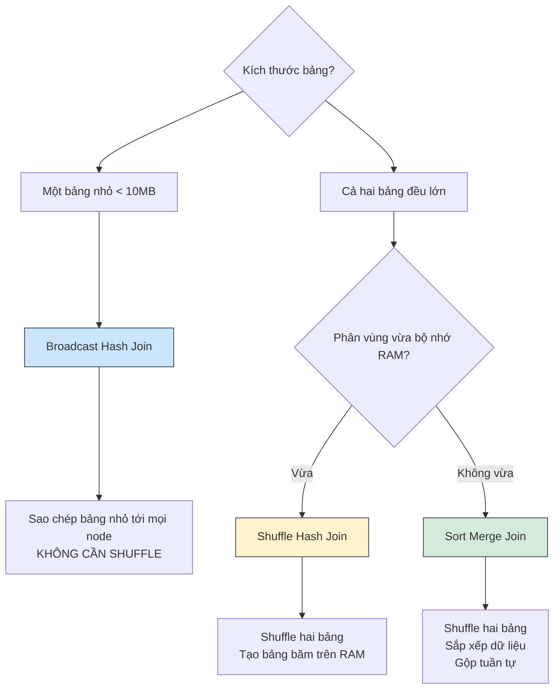

Trong lập trình cơ sở dữ liệu nói chung và xử lý dữ liệu lớn (Big Data) nói riêng, phép nối bảng (Join) luôn là một trong những hoạt động phổ biến nhưng lại ngốn nhiều tài nguyên CPU, RAM và băng thông mạng nhất. 

Khi bạn gõ câu lệnh đơn giản `df1.join(df2)`, ở hậu trường, bộ tối ưu hóa Catalyst Optimizer của Spark sẽ không thực thi một cách ngây thơ. Nó sẽ dựa trên kích thước dữ liệu và cấu hình hệ thống để lựa chọn một chiến lược (Physical Join Strategy) phù hợp nhất. 

Hãy cùng tìm hiểu ba chiến lược Join vật lý cốt lõi trong Spark: **Broadcast Hash Join (BHJ)**, **Shuffle Hash Join (SHJ)**, và **Sort Merge Join (SMJ)**.

## Ba chiến lược Join vật lý cốt lõi

Tùy thuộc vào kích thước của các bảng và khả năng chứa dữ liệu của RAM, Spark sẽ lựa chọn một trong ba con đường sau:


### 1. Broadcast Hash Join (BHJ)
* **Kịch bản**: Một bảng cực kỳ lớn và một bảng siêu nhỏ (mặc định nhỏ hơn 10MB - cấu hình qua biến `spark.sql.autoBroadcastJoinThreshold`).
* **Cơ chế hoạt động**: Thay vì xáo trộn cả hai bảng qua mạng, máy chủ điều phối (Driver) sẽ tải toàn bộ bảng nhỏ về, xây dựng một bảng băm (Hash Table) ngay trên RAM, sau đó "phát sóng" (Broadcast) bản sao này tới tất cả các Worker Nodes đang chứa phân mảnh của bảng lớn. Các Worker chỉ việc dò bảng lớn cục bộ với bảng băm trên RAM.
* **Đặc điểm**: Tốc độ cực nhanh vì loại bỏ hoàn toàn quá trình Shuffle (Narrow Dependency).
* **Hạn chế**: Bảng được broadcast bắt buộc phải đủ nhỏ để chứa vừa trong RAM của cả Driver và tất cả các Executor. Nếu cố ép broadcast bảng lớn, bạn sẽ làm sập RAM của hệ thống.

### 2. Shuffle Hash Join (SHJ)
* **Kịch bản**: Cả hai bảng đều có kích thước lớn (vượt ngưỡng broadcast) nhưng khi chia nhỏ thành các phân vùng (partitions) thì từng phân vùng vẫn có thể chứa vừa trong bộ nhớ RAM của một Executor.
* **Cơ chế hoạt động**: Spark thực hiện băm (hash) khóa Join của cả hai bảng và xáo trộn (shuffle) dữ liệu qua mạng để đưa các dòng có cùng khóa về chung một node. Tại mỗi node, Spark sẽ lấy bảng có kích thước nhỏ hơn để xây dựng bảng băm trên RAM, sau đó duyệt qua bảng lớn để tìm các dòng khớp khóa.
* **Đặc điểm**: Nhanh hơn Sort Merge Join vì không mất thời gian sắp xếp dữ liệu.
* **Hạn chế**: Dễ xảy ra lỗi tràn bộ nhớ (Out Of Memory - OOM) nếu dữ liệu bị lệch (Data Skew), khiến phân vùng của một node bự đột biến và vượt quá dung lượng RAM khả dụng.

### 3. Sort Merge Join (SMJ)
* **Kịch bản**: Đây là chiến lược mặc định và là "chiếc phao cứu sinh" của Spark khi tiến hành nối hai bảng dữ liệu khổng lồ (Big-on-Big Join).
* **Cơ chế hoạt động**: 
  1. **Shuffle**: Spark xáo trộn cả hai bảng qua mạng dựa trên mã băm của khóa Join để đưa dữ liệu cùng khóa về chung một node.
  2. **Sort**: Tại mỗi node, thay vì nhồi dữ liệu vào RAM làm bảng băm, Spark tiến hành sắp xếp (Sort) dữ liệu của cả hai bảng theo thứ tự tăng dần của khóa Join.
  3. **Merge**: Spark sử dụng hai con trỏ lướt song song từ trên xuống dưới trên hai bảng đã được sắp xếp để đối chiếu và ghép cặp.
* **Đặc điểm**: Do dữ liệu đã được sắp xếp, Spark chỉ cần giữ một vài dòng dữ liệu trong bộ nhớ tại một thời điểm để so khớp, giúp loại bỏ hoàn toàn nguy cơ sập RAM.
* **Hạn chế**: Tốc độ chậm hơn hai phương án trên do phải trả chi phí CPU và Disk I/O cho bước sắp xếp (Sort) dữ liệu.

## Ví dụ thực tế: Cách ép Spark sử dụng Broadcast Hash Join

Trong thực tế, nếu bạn biết chắc chắn một bảng là bảng danh mục rất nhỏ (ví dụ bảng thông tin chi nhánh cửa hàng chỉ nặng 5MB), bạn có thể chủ động sử dụng hàm `broadcast()` để hướng dẫn Spark sử dụng chiến lược Broadcast Hash Join, tránh việc hệ thống tự động chọn Sort Merge Join gây lãng phí tài nguyên:
```python
from pyspark.sql.functions import broadcast

# Đọc bảng doanh số khổng lồ (100GB) và bảng chi nhánh nhỏ (5MB)
fact_sales = spark.read.parquet("s3://data/sales/")    
dim_store = spark.read.parquet("s3://data/stores/")    

# Sử dụng hàm broadcast để tối ưu hóa phép nối
optimized_df = fact_sales.join(broadcast(dim_store), "store_id")

# Kiểm tra kế hoạch thực thi vật lý:
optimized_df.explain()
# Trong log hiển thị, bạn sẽ thấy từ khóa: BroadcastHashJoin
```

## Những kinh nghiệm vàng để tối ưu hóa phép Join trong Spark

* **Kích hoạt AQE (Adaptive Query Execution)**: Kể từ Spark 3.0, hãy luôn bật cấu hình `spark.sql.adaptive.enabled = true`. AQE cho phép Spark tự động tối ưu hóa trong thời gian chạy (run-time). Ví dụ, nếu ban đầu Spark dự kiến hai bảng rất lớn nên chọn Sort Merge Join, nhưng sau khi đi qua bước lọc (`filter`), một bảng co lại chỉ còn 5MB, AQE sẽ tự động "quay xe" chuyển sang Broadcast Hash Join để tăng tốc độ.
* **Điều chỉnh ngưỡng tự động Broadcast**: Nếu cụm máy chủ của bạn có bộ nhớ RAM dư dả, bạn có thể tăng giới hạn tự động broadcast từ 10MB lên 100MB bằng cách cấu hình:
  `spark.conf.set("spark.sql.autoBroadcastJoinThreshold", 100 * 1024 * 1024)`.
* **Áp dụng Bucketing cho các bảng khổng lồ**: Nếu bạn phải join hai bảng kích thước Petabytes lặp đi lặp lại hàng ngày, hãy lưu chúng dưới dạng Bucketing (chia sẵn các file theo khóa Join). Khi đọc lên, Spark sẽ bỏ qua bước Shuffle và bước Sort, trực tiếp thực hiện phép Merge (Sort-free SMJ), giúp tăng tốc độ join lên hàng chục lần.
* **Xử lý giá trị rỗng (NULL) trước khi Join**: Trong Sort Merge Join, tất cả các khóa mang giá trị `NULL` sẽ bị băm và đổ dồn về cùng một phân vùng duy nhất, gây ra hiện tượng lệch phân phối dữ liệu nghiêm trọng (Data Skew). Hãy lọc bỏ các dòng có khóa `NULL` hoặc thay thế chúng bằng các giá trị ngẫu nhiên trước khi thực hiện phép Join.

| Đặc điểm | Broadcast Hash Join | Shuffle Hash Join | Sort Merge Join |
| :--- | :--- | :--- | :--- |
| **Shuffle qua mạng** | Không | Có | Có |
| **Sắp xếp dữ liệu** | Không | Không | Có |
| **Yêu cầu bộ nhớ** | Cao (Bảng nhỏ phải chứa vừa RAM) | Trung bình (Bảng băm phân vùng phải vừa RAM) | Thấp (Chỉ cần giữ vài dòng tại một thời điểm) |
| **Độ ổn định** | Rất cao | Thấp (Dễ sập OOM khi Skew) | Cực kỳ cao (Khử hoàn toàn lỗi OOM) |
| **Phù hợp nhất** | Bảng lớn Join bảng nhỏ | Hai bảng kích thước vừa phải | Hai bảng siêu khổng lồ |

## Khái niệm liên quan

* [Shuffle](/concepts/batch-processing/shuffle/): Cơ chế xáo trộn dữ liệu vật lý qua mạng.
* [Data Skew](/concepts/batch-processing/data-skew/): Hiện tượng mất cân bằng phân phối dữ liệu.
* [Spark SQL](/concepts/batch-processing/spark-sql/): Bộ máy xử lý truy vấn cấu trúc của Spark.

## Trọng tâm ôn luyện phỏng vấn

### 1. Phân biệt cơ chế hoạt động và trường hợp ứng dụng của Broadcast Hash Join và Sort Merge Join?
* **Gợi ý trả lời**: 
  * **Broadcast Hash Join** hoạt động bằng cách sao chép và gửi toàn bộ bảng nhỏ tới tất cả các node chứa phân mảnh của bảng lớn. Chiến lược này loại bỏ hoàn toàn pha xáo trộn dữ liệu qua mạng (Shuffle) nên có tốc độ thực thi rất nhanh. Nó chỉ ứng dụng được khi một trong hai bảng có kích thước đủ nhỏ để chứa vừa bộ nhớ RAM.
  * **Sort Merge Join** là giải pháp dành cho hai bảng lớn. Nó xáo trộn cả hai bảng qua mạng dựa trên khóa Join, tiến hành sắp xếp dữ liệu theo thứ tự, rồi dùng con trỏ duyệt song song để so khớp. SMJ chậm hơn do tốn tài nguyên sắp xếp dữ liệu, nhưng có độ ổn định tuyệt đối và không sợ bị tràn bộ nhớ RAM (OOM) khi xử lý các bảng dữ liệu khổng lồ.

### 2. Tại sao Sort Merge Join lại là lựa chọn mặc định thay thế cho Shuffle Hash Join khi xử lý các bảng lớn trong Spark?
* **Gợi ý trả lời**: Shuffle Hash Join yêu cầu toàn bộ một phân vùng dữ liệu của bảng nhỏ hơn (tại mỗi node) phải được tải lên thành một bảng băm trong bộ nhớ RAM. Nếu dữ liệu bị lệch (Data Skew), một phân vùng bị phình to đột biến sẽ lập tức làm sập node đó vì lỗi tràn bộ nhớ (OOM). 
  Trong khi đó, Sort Merge Join sau khi sắp xếp dữ liệu chỉ cần duyệt qua từng dòng một cách tuần tự bằng con trỏ, không đòi hỏi phải giữ toàn bộ phân vùng trong RAM. Việc chọn SMJ làm mặc định là sự đánh đổi tốc độ để lấy **độ ổn định** – tiêu chí hàng đầu khi vận hành các đường ống dữ liệu lớn (Big Data pipelines) trên môi trường Production.

## Tài liệu tham khảo

1. [Apache Spark SQL Join Hints](https://spark.apache.org/docs/latest/sql-ref-syntax-qry-select-hints.html) - Official [Apache Spark](/concepts/batch-processing/apache-spark/) documentation on directing the optimizer to use specific join strategies (e.g. Broadcast, Merge, Shuffle Hash).
2. [Spark: The Definitive Guide](https://www.oreilly.com/library/view/spark-the-definitive/9781491912201/) - Reference book by Bill Chambers and Matei Zaharia featuring detailed explanations of Joins.
3. [Spark in Action, Second Edition](https://www.manning.com/books/spark-in-action-second-edition) - Practical guide to Spark architecture and cluster management by Jean-Georges Perrin.
4. [Adaptive Query Execution: Speeding Up Spark SQL at Runtime](https://www.databricks.com/blog/2020/05/29/adaptive-query-execution-speeding-up-spark-sql-at-runtime.html) - Databricks engineering blog post describing dynamic runtime join optimizations like converting Sort-Merge Join to Broadcast Hash Join.
5. Detecting and Solving Data Skew in Spark SQL - Practical guide on diagnosing and resolving data skew issues during join operations.

## English Summary

In Apache Spark, logical join operations are translated into distinct physical execution strategies by the Catalyst Optimizer based on dataset sizes. The **Broadcast Hash Join (BHJ)** bypasses the network shuffle entirely by replicating a small table to all nodes, making it phenomenally fast but bounded by memory. For massive datasets, Spark defaults to **Sort Merge Join (SMJ)**, which shuffles both tables by key, sorts them, and iterates sequentially. While SMJ is slower due to the expensive sorting phase, it provides exceptional robustness against Out-Of-Memory errors compared to the riskier **Shuffle Hash Join (SHJ)**.