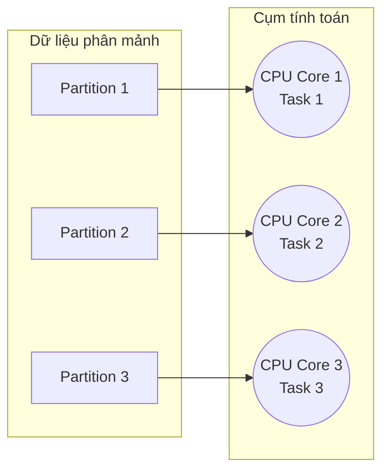

Khi làm việc với các hệ thống xử lý dữ liệu lớn (Big Data) như Apache Spark, tính toán song song chính là chìa khóa giúp chúng ta xử lý hàng Terabyte dữ liệu chỉ trong vài phút. Thế nhưng, làm thế nào Spark chia nhỏ một bảng dữ liệu khổng lồ thành nhiều phần để giao việc cho các máy tính con? 

Câu trả lời nằm ở khái niệm **Spark Partition (Phân vùng dữ liệu)**.

## Spark Partition là gì? Đơn vị tiền tệ của tính song song

Nói một cách đơn giản, **Partition** là một phân mảnh logic (logical chunk) của một tập dữ liệu lớn (DataFrame hoặc RDD) được lưu trữ phân tán trên các máy tính trong cụm (Cluster).

Trong mô hình thực thi của Spark, phân vùng là đơn vị cơ bản và quan trọng nhất quyết định tính song song (Parallelism). Hãy nhớ kỹ công thức cốt lõi sau:

$$\text{1 Partition} = \text{1 Task} = \text{1 CPU Core (tại cùng một thời điểm)}$$

Nếu cụm máy chủ của bạn sở hữu tổng cộng 100 CPU Cores, nhưng dữ liệu của bạn chỉ được chia thành 10 Partitions, hệ thống sẽ chỉ có 10 CPU hoạt động, còn 90 CPU còn lại sẽ ngồi chơi xơi nước. Ngược lại, nếu dữ liệu được phân chia hợp lý, tất cả các CPU sẽ hoạt động hết công suất để hoàn thành công việc nhanh nhất.



## Tại sao chúng ta cần phân chia dữ liệu thành các Partitions?

* **Xử lý song song (Concurrent Processing)**: Đây là cách duy nhất để giải quyết bài toán dữ liệu khổng lồ. Việc bẻ nhỏ bảng dữ liệu giúp các máy tính con xử lý đồng thời, tăng tốc độ xử lý theo cấp số nhân.
* **Bảo vệ bộ nhớ RAM**: Nếu cố nạp một bảng dữ liệu 100GB vào bộ nhớ của một máy duy nhất, hệ thống chắc chắn sẽ bị sập vì lỗi tràn bộ nhớ (Out of Memory - OOM). Bằng cách chia nhỏ dữ liệu thành các phân vùng có dung lượng khoảng 100MB, các máy con có thể nạp và xử lý dữ liệu cực kỳ an toàn.
* **Tối ưu hóa truyền tải mạng**: Khi dữ liệu đi qua các phép toán xáo trộn (Shuffle), việc chia nhỏ dữ liệu giúp các khối thông tin truyền đi qua mạng TCP/IP ở mức dung lượng vừa phải, hạn chế nghẽn băng thông.

## Phân vùng dữ liệu hình thành từ đâu?

Dữ liệu của bạn được phân vùng ở hai thời điểm chính:

1. **Khi đọc dữ liệu vào (Input Partitions)**:
   * Nếu đọc từ HDFS, số lượng partition mặc định sẽ bằng với số khối (Block) của HDFS (thường là 128MB mỗi block).
   * Nếu đọc từ các dịch vụ Cloud Object Storage (như Amazon S3, Google Cloud Storage) dưới định dạng Parquet hoặc CSV, Spark cũng tự động sử dụng cấu hình `spark.sql.files.maxPartitionBytes` (mặc định là 128MB) để bẻ nhỏ các file đầu vào thành các phân vùng tương ứng.
2. **Sau khi dữ liệu bị xáo trộn (Shuffle Partitions)**:
   * Mỗi khi bạn sử dụng các câu lệnh đòi hỏi dịch chuyển dữ liệu qua mạng như `join()`, `groupBy()`, hoặc `distinct()`, Spark sẽ gom dữ liệu lại và chia thành một số lượng phân vùng mới. 
   * Số lượng này được quy định bởi cấu hình tĩnh `spark.sql.shuffle.partitions`, và giá trị mặc định của Spark là **200**.

## Ví dụ thực tế: Vắt kiệt sức mạnh của cụm máy chủ với Repartition

Hãy xem kịch bản thực tế dưới đây:

```python
# 1. Đọc dữ liệu từ S3
df = spark.read.parquet("s3://sales_data/")

# Kiểm tra xem dataframe này đang được chia thành bao nhiêu phân vùng
print("Số lượng partition ban đầu: ", df.rdd.getNumPartitions())
# Giả sử kết quả trả về là: 10
```

Nếu cụm máy chủ của bạn có tới 50 CPU Cores, việc chỉ có 10 phân vùng đồng nghĩa với việc bạn đang lãng phí 80% tài nguyên tính toán của cụm. 

Để giải quyết, bạn có thể ép Spark phân chia lại dữ liệu thành 100 phân vùng để tận dụng tối đa sức mạnh của tất cả các CPU Cores:

```python
# Ép Spark phân chia lại dữ liệu thành 100 phân vùng
df_repartitioned = df.repartition(100)

print("Số partition mới: ", df_repartitioned.rdd.getNumPartitions()) 
# Kết quả hiển thị: 100
```

## `repartition()` vs `coalesce()`: Lựa chọn thông minh để tối ưu hiệu năng

Khi muốn thay đổi số lượng phân vùng của DataFrame, Spark cung cấp hai hàm chính: `repartition()` và `coalesce()`. Hiểu rõ sự khác biệt giữa chúng là kỹ năng bắt buộc để viết code tối ưu:

### `repartition(n)`
* **Cơ chế**: Thực hiện xáo trộn toàn bộ dữ liệu (Full Shuffle) qua mạng lưới để chia đều dữ liệu thành đúng `n` phân vùng mới.
* **Ứng dụng**: Có thể dùng để cả **Tăng** hoặc **Giảm** số lượng phân vùng. Rất hữu ích khi dữ liệu bị lệch (Data Skew) và bạn muốn dàn đều dữ liệu ra.
* **Chi phí**: Cực kỳ đắt đỏ vì phải truyền dữ liệu qua mạng (Network I/O).

### `coalesce(n)`
* **Cơ chế**: Chỉ gộp các phân vùng đang nằm chung trên một máy tính vật lý lại với nhau để giảm số phân vùng mà không gây ra hiện tượng Shuffle qua mạng.
* **Ứng dụng**: Chỉ dùng khi muốn **Giảm** số lượng phân vùng.
* **Chi phí**: Cực kỳ nhanh và tiết kiệm tài nguyên.
* **Điểm yếu**: Có thể dẫn đến tình trạng các phân vùng mới có kích thước không đồng đều (mất cân bằng tải).

*Lời khuyên*: Luôn sử dụng `coalesce` ngay trước câu lệnh `.write()` để gom nhỏ số lượng file ghi xuống đĩa, tránh lỗi tạo ra hàng ngàn file nhỏ rác (Small File Problem).

## Những kinh nghiệm xương máu khi quản lý phân vùng

* **Tránh xa con số mặc định 200**: Mặc định `spark.sql.shuffle.partitions` luôn là 200. 
  * Nếu dữ liệu của bạn siêu khủng (ví dụ: 5TB), chia thành 200 phần khiến mỗi phân vùng nặng tới 25GB, chắc chắn sẽ gây lỗi sập RAM (OOM). 
  * Ngược lại, nếu dữ liệu chỉ nặng 20MB, chia thành 200 phần sẽ sinh ra các file siêu nhỏ chỉ vài chục Kilobytes, khiến Spark mất thời gian quản lý task hơn là thực hiện tính toán.
* **Nguyên tắc kích thước lý tưởng**: Trong thực tế, kích thước phân vùng lý tưởng nhất cho dữ liệu chưa nén (uncompressed) là khoảng **100MB đến 200MB**.
* **Nguyên tắc số lượng phân vùng**: Nên cấu hình số lượng phân vùng gấp **2 đến 4 lần tổng số CPU cores** khả dụng của toàn cụm. Điều này giúp CPU vừa hoàn thành xong một task có thể lập tức nhận ngay task tiếp theo, không có thời gian chết.
* **Kích hoạt AQE (Adaptive Query Execution)**: Trên Spark 3.0+, hãy luôn bật cấu hình AQE. AQE sẽ tự động gộp các phân vùng nhỏ hoặc phân chia lại các phân vùng quá lớn trong thời gian chạy (run-time), giải phóng Data Engineer khỏi gánh nặng phải cấu hình thủ công các thông số partition.

## Khái niệm liên quan

* [Shuffle](/concepts/batch-processing/shuffle/): Cơ chế xáo trộn dữ liệu vật lý.
* [Data Skew](/concepts/batch-processing/data-skew/): Hiện tượng lệch phân bố dữ liệu giữa các phân vùng.
* [Spark Execution Model](/concepts/batch-processing/spark-execution-model/): Mô hình thực thi tính toán phân tán của Spark.

## Góc phỏng vấn: Làm chủ khái niệm Spark Partition

### 1. Sự khác biệt lớn nhất giữa `repartition()` và `coalesce()` trong Spark là gì? Khi nào nên dùng cái nào?
* **Gợi ý trả lời**: 
  * `repartition(n)` thực hiện một chu kỳ Full Shuffle trên toàn bộ mạng lưới để phân phối lại dữ liệu một cách đồng đều vào `n` phân vùng mới. Nó có thể tăng hoặc giảm số phân vùng và thường dùng khi dữ liệu bị lệch (Data Skew) hoặc khi muốn tăng tính song song của cụm.
  * `coalesce(n)` chỉ gom nhóm các phân vùng đang nằm chung trên cùng một máy để giảm số phân vùng xuống `n` mà không gây ra Shuffle dữ liệu qua mạng. Nó chạy cực nhanh và thường được dùng ngay trước khi ghi dữ liệu ra ngoài (như ghi xuống S3/HDFS) để giảm bớt số lượng file nhỏ sinh ra, tránh gây nghẽn cho hệ thống lưu trữ.

### 2. Mối quan hệ giữa Partition và Task trong Spark được thiết lập như thế nào?
* **Gợi ý trả lời**: Mối quan hệ giữa Partition và Task là mối quan hệ 1-1. Trong một Stage thực thi, số lượng Task được tạo ra sẽ bằng chính xác số lượng Partition dữ liệu tại thời điểm đó. Mỗi Task chịu trách nhiệm đọc, áp dụng các hàm biến đổi dữ liệu (như map, filter) và xử lý trên duy nhất một phân vùng cụ thể. Do đó, kiểm soát số lượng partition chính là kiểm soát số lượng task chạy song song trên cụm.

## Tài liệu tham khảo

1. [Apache Spark Programming Guide: Key-Value Pairs](https://spark.apache.org/docs/latest/rdd-programming-guide.html#working-with-key-value-pairs) - Official guide detailing data partitioning, custom partitioners, and key-value transformations.
2. [Spark: The Definitive Guide](https://www.oreilly.com/library/view/spark-the-definitive/9781491912201/) - Reference book by Bill Chambers and Matei Zaharia with chapters dedicated to partitioning and performance tuning.
3. [Learning Spark, 2nd Edition](https://www.oreilly.com/library/view/learning-spark-2nd/9781491933015/) - Resource detailing Spark's physical data distribution, repartition, and coalesce behaviors by Jules S. Damji, Brooke Wenig, and Tathagata Das.
4. [Spark in Action, Second Edition](https://www.manning.com/books/spark-in-action-second-edition) - Hands-on book on Spark internals and distributed file handling by Jean-Georges Perrin.
5. [Databricks Performance and Optimization Guide](https://docs.databricks.com/en/performance/index.html) - Databricks documentation explaining partition sizing, shuffling strategies, and adaptive query execution.

## English Summary

A Spark Partition is a logical chunk of data within an RDD or DataFrame, serving as the fundamental unit of parallelism. The equation `1 Partition = 1 Task = 1 CPU Core` dictates that processing speed is directly constrained by the number of partitions. Poor partitioning strategies lead to unused CPU cores or out-of-memory errors. Tuning the shuffle partitions (default 200) and utilizing memory-efficient redistribution commands like `coalesce()` versus full-shuffle `repartition()` are crucial skills for avoiding "small files" problems and maximizing cluster utilization.
