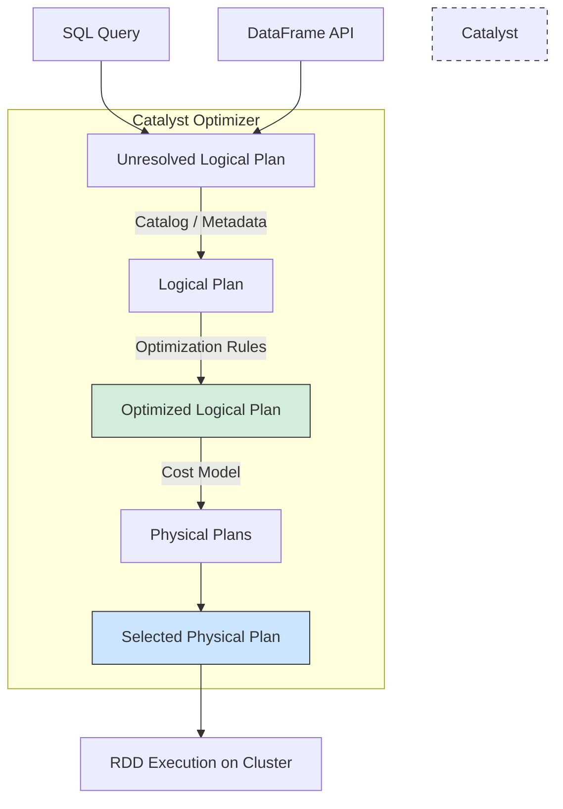

Khi làm việc với các hệ thống dữ liệu lớn, việc phải viết các đoạn mã lập trình phân tán phức tạp để biến đổi dữ liệu luôn là một trở ngại lớn đối với các nhà phân tích và kỹ sư dữ liệu. Để đơn giản hóa quá trình này và mang ngôn ngữ truy vấn phổ biến nhất thế giới vào hệ sinh thái Big Data, Apache Spark đã phát triển một phân hệ cốt lõi: **Spark SQL**.

## Spark SQL là gì? Cầu nối giữa thế giới SQL và Big Data

**Spark SQL** là một module quan trọng của Apache Spark được thiết kế chuyên biệt để xử lý dữ liệu có cấu trúc (structured data). 

Nó cung cấp cho người dùng khả năng truy vấn dữ liệu phân tán bằng ngôn ngữ SQL tiêu chuẩn, đồng thời kết hợp linh hoạt với các ngôn ngữ lập trình như Python, Scala, R thông qua **DataFrame API**. 

Mục tiêu lớn nhất của Spark SQL là trừu tượng hóa sự phức tạp của tính toán phân tán. Thay vì bắt bạn phải tự tay lập trình chi tiết các bước Map/Reduce thủ công, bạn chỉ cần khai báo *"Tôi muốn lấy dữ liệu gì"* (qua lệnh SQL hoặc DataFrame), còn việc *"Thực hiện thế nào cho nhanh nhất"* sẽ do Spark SQL tự động tính toán và tối ưu ở phía sau.

## Tại sao chúng ta cần Spark SQL? Sự ra đời để giải thoát lập trình viên

Trong những phiên bản đầu tiên của Spark, lập trình viên phải tương tác trực tiếp với dữ liệu thông qua **RDD API** (sử dụng các hàm lambda viết bằng Python hoặc Scala). 

Điểm yếu chí mạng của cách tiếp cận này là bộ máy thực thi của Spark hoàn toàn "mù" trước nội dung bên trong các hàm lambda tự viết. Hệ thống không thể hiểu được bạn đang muốn lọc trường nào hay join bảng ra sao để tự động tối ưu hóa câu lệnh.

Spark SQL ra đời để giải quyết triệt để vấn đề đó bằng cách áp đặt cấu trúc cột và kiểu dữ liệu (**Schema**) lên tập dữ liệu. Nhờ biết trước cấu trúc dữ liệu và giới hạn các bộ toán tử, Spark SQL có thể truyền toàn bộ sơ đồ truy vấn (query plan) qua một bộ máy tối ưu hóa cực kỳ thông minh mang tên **Catalyst Optimizer**. 

Catalyst sẽ tự động sắp xếp lại thứ tự các phép lọc, phép join và quét dữ liệu sao cho tiết kiệm CPU, RAM và băng thông mạng nhất.

## Trái tim Catalyst Optimizer: Bí quyết đằng sau hiệu năng vượt trội

Sức mạnh thực sự của Spark SQL nằm ở bộ tối ưu hóa Catalyst Optimizer. Quy trình xử lý của nó diễn ra qua các bước chặt chẽ sau:


1. **Unresolved Logical Plan**: Phân tích cú pháp của câu truy vấn (SQL hoặc DataFrame) để đảm bảo không có lỗi chính tả hoặc lỗi cú pháp cơ bản.
2. **Logical Plan**: Đối chiếu với thư viện siêu dữ liệu (Catalog) để xác thực xem các bảng, các cột có thực sự tồn tại và đúng kiểu dữ liệu hay không.
3. **Optimized Logical Plan**: Áp dụng các quy tắc tối ưu hóa logic (Rule-based optimization). 
   * *Ví dụ (Predicate Pushdown)*: Nếu bạn viết câu lệnh gom nhóm dữ liệu rồi mới lọc kết quả, Catalyst sẽ tự động đảo ngược thứ tự – đẩy phép lọc dữ liệu lên trước để loại bỏ các bản ghi không cần thiết ngay từ nguồn, giúp giảm thiểu tối đa lượng dữ liệu phải xử lý ở các bước sau.
4. **Physical Plan**: Dựa trên mô hình tính toán chi phí (Cost-based optimization), Catalyst sẽ sinh ra nhiều phương án thực thi vật lý khác nhau trên cụm máy chủ, đo lường phương án nào tốn ít RAM và băng thông mạng nhất để chọn làm kế hoạch chạy thực tế (Selected Physical Plan).

## Thực hành: Viết code DataFrame API song hành cùng SQL

Một điểm tuyệt vời của Spark SQL là bạn có thể tự do trộn lẫn giữa cách viết DataFrame API và câu lệnh SQL truyền thống tùy theo thói quen của mình.

### Cách 1: Sử dụng DataFrame API (Phong cách lập trình)```python
# Đọc dữ liệu từ S3 vào DataFrame
df_sales = spark.read.parquet("s3://data/sales/")

# Thao tác biến đổi dữ liệu bằng DataFrame API
df_filtered = df_sales.filter(df_sales["amount"] > 100) \
                      .groupBy("customer_id") \
                      .sum("amount")
```

### Cách 2: Sử dụng SQL thuần túy (Phong cách khai báo)```python
# Đăng ký DataFrame thành một View ảo tạm thời
df_sales.createOrReplaceTempView("sales_table")

# Viết câu lệnh SQL trực tiếp
query = """
    SELECT customer_id, SUM(amount) as total_amount
    FROM sales_table
    WHERE amount > 100
    GROUP BY customer_id
"""
df_filtered = spark.sql(query)
```

Cả hai cách viết trên, khi chạy thực tế, đều được Catalyst Optimizer dịch sang cùng một sơ đồ thực thi vật lý giống hệt nhau, mang lại hiệu năng hoàn toàn tương đương.

## Những lưu ý "xương máu" để viết code Spark SQL hiệu năng cao

* **Tuyệt đối tránh chuyển đổi DataFrame về RDD**: Nhiều người có thói quen chuyển DataFrame về RDD thô để xử lý bằng các hàm map/lambda của Python (`df.rdd.map(lambda x: ...)`). Khi bạn làm vậy, Catalyst sẽ hoàn toàn bị "mù" và mất khả năng tối ưu hóa. Đồng thời, Spark buộc phải thực hiện tuần tự hóa (Serialize) dữ liệu qua lại giữa môi trường JVM của Java và tiến trình Python, gây sụt giảm hiệu năng cực kỳ nghiêm trọng.
* **Hạn chế lạm dụng UDF (User Defined Functions) tự viết**: Các hàm tự định nghĩa UDF viết bằng Python thuần được coi là một "hộp đen" đối với Spark. Catalyst không thể phân tích và tối ưu hóa bên trong UDF. Thay vào đó, hãy luôn ưu tiên sử dụng các hàm built-in được tối ưu sẵn của Spark (`pyspark.sql.functions`). Nếu bắt buộc phải dùng UDF, hãy sử dụng **Pandas UDF (Vectorized UDF)** để tận dụng sức mạnh tính toán dạng mảng của Apache Arrow.
* **Tận dụng tối đa Predicate Pushdown**: Hãy lưu trữ dữ liệu dưới các định dạng cột hiện đại như Parquet hoặc ORC. Khi kết hợp với Spark SQL, Catalyst sẽ chỉ đọc chính xác các cột cần thiết từ ổ đĩa và bỏ qua các file không liên quan dựa trên điều kiện của mệnh đề `WHERE` ngay tại tầng lưu trữ, giúp tiết kiệm tối đa tài nguyên I/O.

| Tiêu chí | RDD API (Thế hệ cũ) | Spark SQL / DataFrame API (Hiện đại) |
| :--- | :--- | :--- |
| **Cơ chế tối ưu** | Thủ công bằng tay của lập trình viên | Tự động hóa hoàn toàn qua Catalyst Optimizer |
| **Độ dễ sử dụng** | Khó, yêu cầu tư duy Map/Reduce phức tạp | Rất dễ, sử dụng SQL tiêu chuẩn hoặc hàm xích |
| **Kiểu dữ liệu** | Không có schema cố định | Ép buộc Schema rõ ràng, quản lý chặt chẽ |
| **Hiệu năng** | Phụ thuộc vào trình độ code của dev | Luôn đạt mức tối ưu cao nhất một cách tự động |

## Khái niệm liên quan

* [Apache Spark](/concepts/batch-processing/apache-spark/): Bộ máy tính toán phân tán.
* [Spark Execution Model](/concepts/batch-processing/spark-execution-model/): Mô hình hoạt động Master-Slave của Spark.
* [Parquet Format](/concepts/database-storage/file-formats/): Định dạng file lưu trữ dạng cột tối ưu cho Spark.

## Trọng tâm ôn luyện phỏng vấn

### 1. Giữa việc sử dụng DataFrame API và viết mã SQL thuần (`spark.sql(...)`) trong Spark, phương pháp nào mang lại hiệu năng tối ưu hơn?
* **Gợi ý trả lời**: Về mặt hiệu suất tính toán vật lý, cả hai phương pháp **hoàn toàn tương đương nhau**. Cho dù viết bằng DataFrame API hay viết một chuỗi SQL String, tất cả đều được đưa vào bộ tối ưu hóa Catalyst Optimizer để phân tích. Catalyst sẽ xây dựng các Logical Plan và dịch chúng ra cùng một bộ Physical Plan để chạy trên cụm. 
  Sự khác biệt duy nhất ở đây là về mặt trải nghiệm lập trình: DataFrame API giúp code dễ đọc, dễ viết unit test và dễ tái cấu trúc hơn so với việc duy trì các chuỗi SQL String dài phức tạp.

### 2. Catalyst Optimizer tối ưu hóa câu truy vấn của người dùng như thế nào? Nêu ví dụ về một kỹ thuật tối ưu hóa phổ biến.
* **Gợi ý trả lời**: Catalyst Optimizer hoạt động bằng cách chuyển đổi câu truy vấn qua 4 bước: Phân tích cú pháp, Áp dụng Catalog để xác thực Schema, Tối ưu hóa logic (Rule-based) và Chọn lựa kế hoạch vật lý tối ưu nhất dựa trên chi phí tài nguyên (Cost-based).
  Một kỹ thuật tối ưu hóa rất phổ biến của Catalyst là **Predicate Pushdown** (Đẩy điều kiện lọc xuống sâu nhất có thể). Ví dụ, nếu ta viết câu lệnh JOIN hai bảng rồi mới lọc kết quả `WHERE age > 18`, Catalyst sẽ tự động đẩy phép lọc `age > 18` vào bảng dữ liệu trước khi thực hiện phép JOIN. Việc này giúp giảm thiểu đáng kể số lượng bản ghi cần xáo trộn qua mạng ([Shuffle](/concepts/batch-processing/shuffle/)) và nạp vào RAM, giúp tăng tốc độ xử lý rõ rệt.

## Tài liệu tham khảo

1. [Apache Spark SQL and DataFrames Guide](https://spark.apache.org/docs/latest/sql-programming-guide.html) - Official Apache Spark programming guide for SQL queries, schema definition, and structural APIs.
2. [Spark: The Definitive Guide](https://www.oreilly.com/library/view/spark-the-definitive/9781491912201/) - Essential book by Bill Chambers and Matei Zaharia introducing the structured API and Catalyst execution flow.
3. [High Performance Spark](https://www.oreilly.com/library/view/high-performance-spark/9781491943199/) - Practical reference guide on optimizing Spark SQL operations and execution internals by Holden Karau and Rachel Warren.
4. [Spark in Action, Second Edition](https://www.manning.com/books/spark-in-action-second-edition) - Practical book detailing Spark SQL application building and structured query pipelines by Jean-Georges Perrin.
5. [Deep Dive into Spark SQL's Catalyst Optimizer](https://www.databricks.com/blog/2015/04/13/deep-dive-into-spark-sqls-catalyst-optimizer.html) - Databricks engineering blog post describing the inner design of Spark's extensible optimization framework.

## English Summary

Spark SQL is an Apache Spark module for structured data processing that exposes SQL and the DataFrame API. Its core power lies in the Catalyst Optimizer, a highly extensible query optimization engine that transforms user queries into highly efficient physical execution plans on the cluster. By leveraging schema enforcement and rule-based/cost-based optimizations (like predicate pushdown), Spark SQL drastically improves performance over native RDD API operations while making Big Data processing accessible to SQL developers.