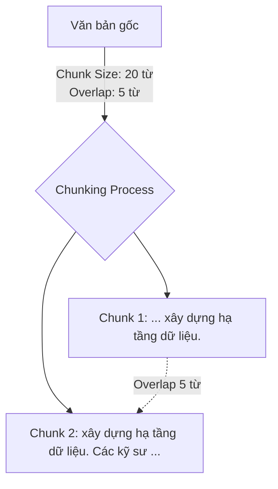

# Chiến lược phân tách văn bản - Chunking Strategy

## Summary

Chunking Strategy (Chiến lược phân tách văn bản) là quá trình chia nhỏ các tài liệu văn bản dài (sách, bài báo, báo cáo) thành các đoạn ngắn hơn, có kích thước tối ưu (gọi là các chunks). Trong kiến trúc RAG (Retrieval-Augmented Generation) và cơ sở dữ liệu Vector, Chunking là bước tiền xử lý dữ liệu quan trọng nhất. Một chiến lược Chunking tốt sẽ đảm bảo các mô hình Embedding nắm bắt được chính xác ngữ nghĩa của đoạn văn, giúp hệ thống tìm kiếm truy xuất đúng ngữ cảnh cho LLM sinh ra câu trả lời chính xác.

---

## Definition

**Chunking** đơn giản là hành động "cắt" dữ liệu. Nếu bạn có một cuốn sách 500 trang, bạn không thể đưa cả cuốn sách qua mô hình Embedding vì giới hạn số lượng token đầu vào (Token limit) của mô hình (thường là 512, 1024 hoặc 8192 tokens). 

**Chunking Strategy** là phương pháp bạn chọn để cắt cuốn sách đó. Bạn có thể cắt mỗi đoạn 500 từ, hoặc cắt theo từng đoạn văn (Paragraph), hoặc cắt theo từng trang. Mục tiêu của chiến lược này là bảo toàn vẹn nguyên ý nghĩa ngữ nghĩa (semantic context) của văn bản sau khi bị cắt nhỏ.

---

## Why it exists

Có 3 lý do bắt buộc phải sử dụng Chunking trong hệ thống GenAI:
1. **Giới hạn của Embedding Models**: Mô hình phổ biến như `text-embedding-ada-002` của OpenAI có giới hạn max tokens là 8192. Nếu bạn ném một tài liệu 20,000 từ vào, nó sẽ vứt bỏ phần đuôi đi.
2. **"Loãng" ngữ nghĩa (Semantic Dilution)**: Nếu bạn nhúng (embed) một tài liệu quá dài thành một vector duy nhất, vector đó sẽ chứa một mớ hỗn độn nhiều ý tưởng khác nhau. Khi truy vấn một chi tiết nhỏ, khoảng cách Cosine Similarity sẽ không đủ độ nhạy để bắt được tài liệu đó.
3. **Giới hạn Context Window của LLM**: Ở giai đoạn sinh văn bản (Generation), ném cả tài liệu 100 trang vào Prompt của LLM vừa tốn cực kỳ nhiều tiền API, vừa khiến LLM bị nhiễu thông tin (hiện tượng Lost in the middle).

---

## Core idea

Ý tưởng lõi của Chunking xoay quanh 2 tham số chính:
* **Chunk Size (Kích thước khối)**: Số lượng ký tự (Character) hoặc Token tối đa trong một khối. (Ví dụ: 1000 tokens).
* **Chunk Overlap (Độ chồng lấp)**: Số lượng phần đuôi của khối trước được giữ lại và lặp lại ở phần đầu của khối sau. (Ví dụ: 200 tokens). Overlap cực kỳ quan trọng để đảm bảo một câu văn dài mang ý nghĩa nối tiếp không bị chặt làm đôi gây mất ngữ cảnh.

---

## How it works (Các chiến lược phổ biến)

**1. Fixed-size Chunking (Cắt theo kích thước cố định)**
Cắt văn bản cứng nhắc theo đúng $N$ ký tự hoặc $N$ tokens.
* *Cách làm*: Cứ 500 ký tự cắt 1 nhát. Thêm 50 ký tự overlap.
* *Ưu điểm*: Rất dễ code, siêu nhanh.
* *Nhược điểm*: Có thể chặt một câu đứt làm đôi ("Apple là một công..." nằm ở chunk 1, "...ty công nghệ" nằm ở chunk 2). Làm hỏng hoàn toàn ngữ nghĩa.

**2. Recursive Character Text Splitting (Cắt đệ quy)**
Đây là tiêu chuẩn vàng hiện nay (có sẵn trong LangChain / LlamaIndex).
* *Cách làm*: Cố gắng cắt văn bản bằng các dấu phân cách lớn (như `\n\n` - kết thúc đoạn văn). Nếu đoạn văn đó vẫn lớn hơn Chunk Size, nó tiếp tục cắt bằng dấu phân cách nhỏ hơn (`\n` - xuống dòng), nếu vẫn quá dài thì cắt bằng dấu `.` (kết thúc câu), và cuối cùng là khoảng trắng (cắt từ).
* *Ưu điểm*: Cực kỳ tôn trọng cấu trúc ngữ pháp của con người, giữ cho các câu và đoạn văn được nguyên vẹn.

**3. Document-based / Structural Chunking (Cắt theo cấu trúc tài liệu)**
* *Cách làm*: Viết code parser đọc các file Markdown hoặc HTML để cắt dựa trên các thẻ Header (`#`, `##`, `<h1>`).
* *Ưu điểm*: Rất tốt cho tài liệu kỹ thuật, vì mỗi header thường gói gọn một chủ đề ngữ nghĩa độc lập.

**4. Semantic Chunking (Cắt theo ngữ nghĩa)**
* *Cách làm*: Dùng một mô hình AI nhỏ để nhúng (embed) từng câu một. Nếu hai câu liên tiếp có vector cách xa nhau (nghĩa là chúng đang nói về 2 chủ đề khác nhau), nhát cắt sẽ được thực hiện ở đó.
* *Ưu điểm*: Khối tài liệu thu được cực kỳ đồng nhất về ý tưởng.
* *Nhược điểm*: Rất tốn kém (phải gọi API embedding cho từng câu) và chậm.

---

## Architecture / Flow (Recursive Chunking với Overlap)

```text
Original Text: "Data Engineering là một ngành phát triển mạnh. Nó tập trung vào việc xây dựng hạ tầng dữ liệu. Các kỹ sư dữ liệu sử dụng Spark và Kafka."

[Chunk Size: 20 words, Overlap: 5 words]

Chunk 1: "Data Engineering là một ngành phát triển mạnh. Nó tập trung vào việc xây dựng hạ tầng dữ liệu."
Chunk 2 (có Overlap): "xây dựng hạ tầng dữ liệu. Các kỹ sư dữ liệu sử dụng Spark và Kafka."
```



---

## Practical example

Dưới đây là một ví dụ thực tế sử dụng Python và thư viện LangChain để áp dụng chiến lược Recursive Character Chunking cho một đoạn văn bản:

```python
from langchain.text_splitter import RecursiveCharacterTextSplitter

text = """Data Engineering là một ngành phát triển mạnh. Nó tập trung vào việc xây dựng hạ tầng dữ liệu. 
Các kỹ sư dữ liệu sử dụng Spark và Kafka. RAG kết hợp LLM với Vector Database để tạo ra hệ thống thông minh."""

# Khởi tạo text splitter với chunk_size và chunk_overlap
text_splitter = RecursiveCharacterTextSplitter(
    chunk_size=100,
    chunk_overlap=20,
    length_function=len,
    separators=["\n\n", "\n", " ", ""]
)

# Chia văn bản thành các khối (chunks)
chunks = text_splitter.split_text(text)

for i, chunk in enumerate(chunks):
    print(f"Chunk {i+1}: {chunk}")
```

---

## Best practices

* **Bắt đầu với Recursive Chunking**: Nếu không có yêu cầu đặc biệt, luôn sử dụng `RecursiveCharacterTextSplitter` của thư viện LangChain với `chunk_size = 1000` (tokens) và `chunk_overlap = 200`.
* **Hiểu mô hình Embedding của bạn**: Nếu dùng mô hình hỗ trợ 8192 tokens (như OpenAI), bạn có thể để chunk size lớn (1000-2000). Nhưng nếu dùng các mô hình mã nguồn mở cổ điển (dựa trên BERT giới hạn 512 tokens), bạn PHẢI để chunk size nhỏ hơn 500, nếu không phần đuôi tài liệu sẽ bị cắt bỏ một cách thầm lặng.
* **Tối ưu theo câu hỏi của người dùng**: 
  * Nếu người dùng thường hỏi những câu chi tiết, cụ thể (Factoid questions): Hãy dùng Chunk size nhỏ (250-500) để độ chính xác của Vector DB tăng lên cao nhất.
  * Nếu người dùng hỏi các câu tổng hợp tóm tắt (Ví dụ: "Tóm tắt chương 3"): Phải dùng Chunk size lớn (1000-2000) để lấy được ngữ cảnh bao quát.

---

## Trade-offs

### Chunk Size Lớn (Vd: 2000 tokens)
* Ưu điểm: Cung cấp đầy đủ bối cảnh (context) cho LLM đọc và hiểu để trả lời các câu hỏi rộng.
* Nhược điểm: Tốn tiền token khi nhồi vào LLM. Làm giảm độ nhạy (Recall) của mô hình Embedding khi tìm kiếm chi tiết cụ thể vì bị loãng thông tin.

### Chunk Size Nhỏ (Vd: 250 tokens)
* Ưu điểm: Lọc siêu chính xác, tìm kiếm rất nhanh. Vector DB bắt từ khóa rất nhạy. Ít tốn tiền token.
* Nhược điểm: LLM nhận được một đoạn cắt quá cụt lủn, không hiểu được toàn cảnh sự việc dẫn đến trả lời ảo giác.

---

## When to use

Luôn luôn sử dụng Chunking khi bạn xây dựng hệ thống RAG và phải nạp dữ liệu phi cấu trúc (PDF, Word, Websites) vào Vector Database.

## When not to use

Không áp dụng Chunking cho dữ liệu có cấu trúc (Structured Data) lấy từ Database SQL/CSV. Trong trường hợp này, hãy Serialize từng dòng (Row) thành chuỗi văn bản (hoặc JSON) và đem đi Embed luôn, đừng chia cắt chúng.

---

## Related concepts

* [Vector Database](/concepts/vector-store)
* [Embeddings](/concepts/embeddings)
* [RAG (Retrieval-Augmented Generation)](/concepts/rag)

---

## Interview questions

### 1. Tại sao Chunk Overlap (Độ chồng lấp) lại quan trọng trong Chunking Strategy?
* **Người phỏng vấn muốn kiểm tra**: Kiến thức sâu về tiền xử lý ngôn ngữ tự nhiên.
* **Gợi ý trả lời (Strong Answer)**:
  * Trong các phương pháp cắt cứng nhắc (như Fixed-size), nhát cắt có thể rơi vào ngay giữa một câu chứa thông tin quan trọng. Việc tách ngữ chủ và vị ngữ ra 2 chunks khác nhau sẽ làm cả 2 chunks đó mất đi ý nghĩa ngữ nghĩa (Semantic loss).
  * Overlap đảm bảo phần đuôi của chunk trước được lặp lại ở phần đầu của chunk sau. Việc duy trì một phần ngữ cảnh liên kết (sliding window context) giúp mô hình embedding hiểu được câu chuyện liền mạch, đảm bảo Vector sinh ra đại diện đúng cho ý nghĩa của tác giả.

### 2. Sự khác biệt giữa việc đếm Chunk size bằng "Character" (Ký tự) và "Token" là gì? Cái nào tốt hơn?
* **Người phỏng vấn muốn kiểm tra**: Sự am hiểu về cách hoạt động của LLM.
* **Gợi ý trả lời (Strong Answer)**:
  * Ký tự là đếm từng chữ cái (A, B, C). Token là đơn vị mà LLM thực sự "đọc" (có thể là một từ, một gốc từ). Một token tiếng Anh thường bằng 4 ký tự, nhưng một token tiếng Việt (ngôn ngữ có dấu) thường bị chẻ rất nhỏ, có thể 1 từ tiếng Việt tốn 2-3 tokens.
  * Đếm theo "Token" LUÔN LUÔN tốt hơn. Vì giới hạn đầu vào của cả mô hình Embedding và LLM đều được tính bằng Token. Nếu bạn cắt văn bản 1000 ký tự (Characters), tùy thuộc vào ngôn ngữ, nó có thể tạo ra 500 tokens hoặc 1500 tokens (vượt quá giới hạn của mô hình BERT 512). Sử dụng công cụ đếm token (như `tiktoken` của OpenAI) giúp cắt chính xác tuyệt đối không bị tràn giới hạn.

### 3. Parent-Child Chunking (hay Auto-merging Retriever) là kỹ thuật gì và nó giải quyết trade-off nào?
* **Người phỏng vấn muốn kiểm tra**: Hiểu biết về các kỹ thuật RAG nâng cao (Advanced RAG).
* **Gợi ý trả lời (Strong Answer)**:
  * Nó giải quyết nghịch lý: "Chunk NHỎ thì tìm kiếm chính xác (Vector Search thích), nhưng Chunk LỚN thì mới đủ ngữ cảnh cho LLM đọc (LLM thích)".
  * Kỹ thuật này cắt văn bản ra làm 2 cấp độ: Cắt tài liệu thành các khối lớn (Parent Chunks - không bị embed), sau đó cắt tiếp các Parent này thành nhiều khối nhỏ (Child Chunks).
  * Ta chỉ mang các Child Chunks đi Embed và lưu vào Vector DB. Khi tìm kiếm, Vector DB tìm ra Child Chunk rất chính xác. Nhưng thay vì đưa Child Chunk cho LLM, hệ thống tra ngược ID để lấy TOÀN BỘ Parent Chunk chứa Child Chunk đó và đưa Parent Chunk cho LLM. Nhờ vậy ta có được cả "Độ chính xác của khối nhỏ" lẫn "Ngữ cảnh đầy đủ của khối lớn".

---

## English summary

Chunking Strategy is the fundamental text preprocessing step in Retrieval-Augmented Generation (RAG) pipelines. It involves breaking down lengthy unstructured documents into smaller, manageable segments (chunks) prior to vector embedding. This is necessary because embedding models and LLMs have strict token limits and suffer from semantic dilution if applied to overly long texts. While fixed-size chunking is simple, Recursive Character Splitting combined with an optimal "Chunk Overlap" is the industry standard, ensuring sentences remain intact and semantic continuity is preserved across chunks. Balancing chunk size is crucial: smaller chunks yield higher retrieval precision, whereas larger chunks provide richer context for the LLM to generate comprehensive answers.
