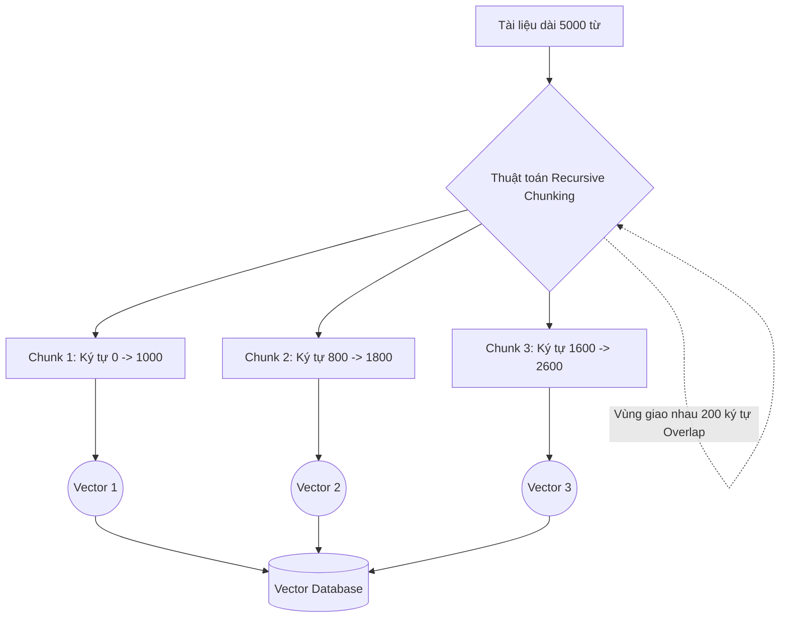

# Phân tách văn bản - Chunking

## Summary

Phân tách văn bản (Chunking) là quá trình tiền xử lý chia nhỏ một tài liệu lớn (như một cuốn sách, báo cáo PDF, hay bài báo) thành các phần nhỏ hơn, có kích thước vừa phải (gọi là chunks) trước khi đưa chúng qua mô hình nhúng (Embedding Model) để lưu vào Vector Database. Kỹ thuật này đóng vai trò sống còn trong việc cải thiện độ chính xác của hệ thống Tìm kiếm ngữ nghĩa (Semantic Search) và RAG (Retrieval-Augmented Generation).

---

## Definition

Trong bối cảnh Hệ thống Thông tin và LLM, **Chunking** là thuật toán phân nhỏ dữ liệu phi cấu trúc dựa trên các quy tắc định sẵn (đếm số ký tự, đếm số token) hoặc dựa trên cấu trúc ngữ nghĩa (dấu câu, phân đoạn, thẻ HTML). 
Mỗi "Chunk" sau khi cắt ra sẽ đại diện cho một ý tưởng cục bộ và được gán một Vectơ nhúng riêng rẽ. Khi hệ thống tìm kiếm, nó sẽ truy xuất các chunk nhỏ lẻ thay vì toàn bộ tài liệu khổng lồ.

---

## Why it exists

Có 2 lý do kỹ thuật và vật lý bắt buộc chúng ta phải thực hiện Chunking:
1. **Giới hạn kỹ thuật của Embedding Models**: Hầu hết các mô hình nhúng (ví dụ: BERT, Sentence-Transformers) có độ dài đầu vào tối đa cố định (Max Sequence Length), thường là 512 hoặc 8192 tokens. Nếu đưa một tài liệu dài 10,000 tokens vào, mô hình sẽ tự động cắt cụt (truncate) phần đuôi, làm mất hoàn toàn dữ liệu.
2. **Sự pha loãng ngữ nghĩa (Semantic Dilution)**: Một Vectơ nhúng (ví dụ 768 chiều) chỉ chứa được một lượng thông tin hữu hạn. Nếu bạn nhúng một câu duy nhất: "Cách reset mật khẩu", vectơ sẽ biểu diễn ý nghĩa này rất sắc nét. Nhưng nếu bạn ép mô hình nhúng toàn bộ Sách hướng dẫn IT dài 50 trang vào một vectơ duy nhất, ý nghĩa của việc "reset mật khẩu" sẽ bị loãng ra và chìm lấp giữa hàng ngàn chủ đề khác. Câu hỏi truy vấn của người dùng sẽ không bao giờ tìm khớp được với vectơ khổng lồ này.

---

## Core idea

* **Sự cân bằng (Goldilocks Rule)**: Chunk quá lớn -> Ý nghĩa bị loãng, Vector mất độ tập trung. Chunk quá nhỏ (ví dụ 1 câu) -> Thiếu bối cảnh ngữ cảnh (Context) để LLM đọc hiểu khi được truy xuất.
* **Vùng gối đầu (Overlap/Stride)**: Khi cắt tài liệu thành các khúc, ta luôn giữ lại một phần đuôi của chunk trước nối vào phần đầu của chunk sau. Điều này đảm bảo rằng các ý tưởng bị cắt ngay giữa câu/đoạn không bị đứt gãy ngữ cảnh.
* **Tôn trọng cấu trúc (Structural awareness)**: Thuật toán chunking tốt sẽ cố gắng cắt ở dấu chấm câu, dấu xuống dòng hoặc thẻ tiêu đề thay vì cắt ngang giữa một từ.

---

## How it works

Dưới đây là một số chiến lược Chunking phổ biến:

1. **Fixed-size Chunking (Cắt theo kích thước cố định)**:
   * Thuật toán đơn giản nhất. Đếm đủ N tokens (ví dụ: 500) hoặc N ký tự (ví dụ: 1000) thì cắt.
   * *Ưu điểm*: Nhanh, dễ cài đặt.
   * *Nhược điểm*: Dễ cắt ngang giữa câu hoặc giữa một từ (nếu cắt theo ký tự).

2. **Recursive Character Chunking (Cắt đệ quy)**:
   * Thử cắt theo phân đoạn (đoạn văn `\n\n`). Nếu đoạn văn vẫn dài hơn giới hạn, tiếp tục cắt theo câu (dấu chấm `. `). Nếu câu vẫn quá dài, mới cắt theo từ (dấu cách ` `).
   * Đây là chiến lược mặc định và hiệu quả nhất trong thư viện LangChain.

3. **Document/Semantic Chunking (Cắt theo cấu trúc/ngữ nghĩa)**:
   * Dành cho Markdown, HTML hoặc PDF. Cắt khi gặp các Header (H1, H2, H3), đảm bảo mỗi chunk chứa trọn vẹn một mục nội dung (Section).

---

## Architecture / Flow



---

## Practical example

Sử dụng thư viện `langchain` bằng Python để thực hiện Recursive Character Text Splitter với kích thước chunk 1000 và overlap là 200:

```python
from langchain.text_splitter import RecursiveCharacterTextSplitter

text = """... (Một bài viết siêu dài) ..."""

text_splitter = RecursiveCharacterTextSplitter(
    chunk_size=1000,     # Số lượng ký tự tối đa trong một chunk
    chunk_overlap=200,   # Giữ lại 200 ký tự từ chunk trước đó để duy trì ngữ cảnh
    length_function=len, # Hàm tính độ dài (có thể đổi thành bộ đếm token)
    separators=["\n\n", "\n", ".", " ", ""] # Thứ tự ưu tiên cắt (Đoạn -> Câu -> Từ)
)

chunks = text_splitter.split_text(text)

print(f"Tổng số chunks tạo ra: {len(chunks)}")
print(f"Kích thước chunk đầu tiên: {len(chunks[0])} ký tự")
```

---

## Best practices

* **Điều chỉnh theo LLM Context Window**: Độ dài tối ưu của Chunk phụ thuộc vào bài toán. Nếu RAG của bạn cần đọc lướt qua nhiều tài liệu để tổng hợp, hãy để Chunk nhỏ (256-512 tokens) để chứa được nhiều Chunk Top-K vào prompt. Nếu cần LLM hiểu sâu một bối cảnh rộng, dùng Chunk lớn hơn (1000-2000 tokens).
* **Luôn sử dụng Overlap**: Tỉ lệ overlap an toàn thường nằm ở mức **10% - 20%** kích thước chunk. (Ví dụ: Size 500 thì Overlap 50-100). Đừng bỏ qua overlap vì nó cứu vớt những thông tin bị cắt phạm.
* **Giữ lại Metadata**: Khi cắt một tài liệu thành 100 chunk, hãy nhúng thêm siêu dữ liệu (metadata) vào từng chunk như `{"source": "book.pdf", "page": 4, "chapter": 2}` để hỗ trợ việc lọc kết quả trước khi đưa vào LLM.

---

## Common mistakes

* **Cắt theo số ký tự mà không dùng token**: Các mô hình nhúng nhận giới hạn đầu vào bằng token, không phải ký tự. Nếu cấu hình `chunk_size = 2000` (ký tự) đối với tiếng Việt, đôi khi nó quy đổi thành hơn 1000 tokens và vượt giới hạn của một số Embedding models (như giới hạn 512 tokens của các mô hình BERT cũ), gây ra lỗi. Hãy ưu tiên đếm bằng `tiktoken`.
* **Mất Context toàn cục**: Chunking làm tách rời đại từ nhân xưng. Ví dụ, chunk 1 ghi "Công ty Google ra mắt sản phẩm mới", chunk 2 bị cắt ra chỉ còn ghi "Họ hi vọng nó sẽ thành công". Khi truy xuất trúng chunk 2, LLM không biết "Họ" là ai. Giải pháp nâng cao là thêm kỹ thuật Parent Document Retrieval.

---

## Trade-offs

### Ưu điểm
* Giữ được sự tập trung ngữ nghĩa tối đa (Semantic clarity), giúp Vector DB tìm kiếm cực kỳ chính xác các đoạn văn trả lời trực tiếp cho câu hỏi.
* Tối ưu hóa chi phí API: Chỉ nhét phần nội dung (chunk) liên quan nhất vào Prompt của LLM thay vì cả quyển sách.

### Nhược điểm
* Phá vỡ cấu trúc toàn cục của tài liệu. Các mối quan hệ bắc cầu (nằm ở đầu sách và cuối sách) bị cắt đứt.
* Tăng số lượng bản ghi trong CSDL: Một tài liệu có thể nở ra thành hàng ngàn bản ghi vectơ, yêu cầu dung lượng RAM và đĩa lớn hơn cho Vector DB.

---

## When to use

* Bước bắt buộc phải có trong mọi quy trình xây dựng Data Ingestion Pipeline cho các ứng dụng RAG (Retrieval-Augmented Generation).
* Tiền xử lý dữ liệu để lập chỉ mục (Indexing) cho Vector Databases.

---

## Related concepts

* [Token (Đơn vị từ vựng)](/concepts/token)
* [Tìm kiếm ngữ nghĩa (Semantic Search)](/concepts/semantic-search)
* [Mô hình ngôn ngữ lớn (LLMs)](/concepts/llm)

---

## Interview questions

### 1. Tại sao chúng ta cần tham số "Chunk Overlap" khi phân tách văn bản? Điều gì xảy ra nếu Overlap = 0?
* **Người phỏng vấn muốn kiểm tra**: Hiểu biết thực tiễn về kỹ thuật xử lý dữ liệu RAG.
* **Gợi ý trả lời (Strong Answer)**: Tham số Chunk Overlap tạo ra một vùng đệm giao nhau giữa chunk trước và chunk sau. Tài liệu của con người mang tính liền mạch, một ý tưởng (context) thường bắc cầu qua nhiều câu. Nếu đặt Overlap = 0, bộ chia cắt bằng máy móc có thể chặt đứt đôi một câu quan trọng hoặc phân tách phần mở bài của một khái niệm với phần giải thích của nó sang 2 chunk khác nhau. Khi đó, nếu Vector DB truy xuất độc lập từng chunk lên cho LLM đọc, LLM sẽ nhận được một văn bản thiếu đầu thiếu đuôi. Overlap giúp đoạn cuối của chunk này trùng lặp với đoạn đầu của chunk kia, đảm bảo mạch ngữ cảnh được bảo toàn nguyên vẹn tại điểm cắt.

### 2. Kỹ thuật "Parent Document Retrieval" khắc phục nhược điểm gì của Fixed-size Chunking?
* **Người phỏng vấn muốn kiểm tra**: Kiến thức kiến trúc RAG nâng cao (Advanced RAG).
* **Gợi ý trả lời (Strong Answer)**: Fixed-size Chunking gặp nghịch lý: Chunk nhỏ thì tìm kiếm vector rất chính xác (vì ngữ nghĩa cô đặc), nhưng khi đẩy cho LLM đọc thì lại thiếu bối cảnh (context). Chunk lớn thì LLM đọc hiểu tốt bối cảnh, nhưng Vector DB tìm kiếm kém (ngữ nghĩa bị loãng). Kỹ thuật Parent Document Retrieval khắc phục bằng cách tách biệt bộ nhớ: Ta cắt tài liệu thành các Child Chunks rất nhỏ để sinh Vectơ và tìm kiếm. Nhưng thay vì trả Child Chunk cho LLM, ta ánh xạ (map) nó ngược về lại Parent Document (đoạn văn lớn gốc chứa child chunk đó). Hệ quả là hệ thống vừa tìm kiếm chính xác cao, vừa cung cấp bối cảnh đầy đủ cho LLM tạo ra câu trả lời xuất sắc.

---

## References

1. **LangChain Documentation** - Text Splitters module.
2. **Pinecone Learn** - Chunking Strategies for Vector Databases.

---

## English summary

Chunking is a critical data preprocessing step in NLP and RAG pipelines where large documents are split into smaller, manageable segments (chunks) prior to being passed into an Embedding Model. This is mandatory because embedding models have strict maximum sequence lengths (token limits) and embedding a massive document into a single vector leads to "semantic dilution," severely harming search accuracy. Modern chunking strategies (like Recursive Character Splitting) rely on natural separators (paragraphs, sentences) and employ a "chunk overlap" to preserve local context at the boundaries. Advanced architectures decouple the retrieval chunk size from the generation context size via techniques like Parent Document Retrieval.
