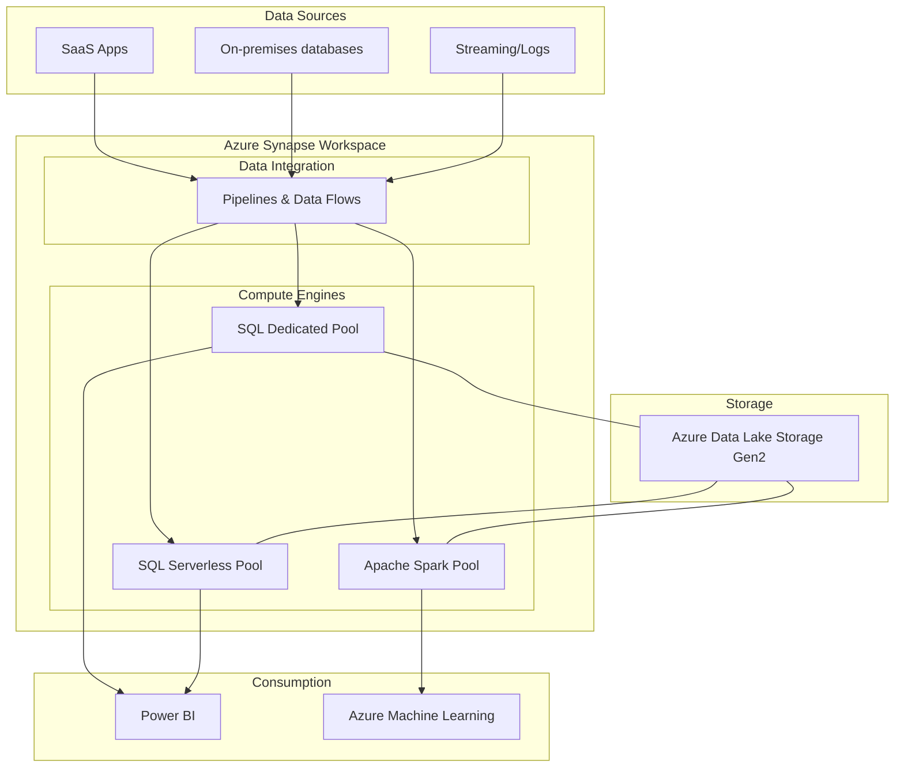

# Azure Synapse Analytics: Giải pháp phân tích dữ liệu hợp nhất trên hệ sinh thái Microsoft Azure

Trong các doanh nghiệp lớn, dữ liệu thường bị phân mảnh ở nhiều nơi: dữ liệu có cấu trúc ổn định được lưu trữ trong kho dữ liệu (Data Warehouse) phục vụ báo cáo BI, còn dữ liệu phi cấu trúc hoặc bán cấu trúc khổng lồ lại nằm rải rác trên hồ dữ liệu (Data Lake) phục vụ cho khoa học dữ liệu (Data Science).

Việc phải quản lý và vận hành nhiều công cụ riêng biệt cho hai thế giới này luôn là một bài toán đau đầu đối với các kỹ sư hệ thống.

Để giải quyết bài toán phân mảnh này, Microsoft đã giới thiệu **Azure Synapse Analytics**. Đây là sự tiến hóa vượt bậc của dịch vụ Azure SQL Data Warehouse trước đây, mang lại một nền tảng phân tích hợp nhất kết hợp cả lưu trữ dữ liệu doanh nghiệp (Enterprise Data Warehousing), xử lý dữ liệu lớn (Big Data Analytics) và tích hợp dữ liệu (Data Integration) trong một môi trường làm việc duy nhất.

## Xóa nhòa ranh giới giữa Data Lake và Data Warehouse

Trước khi Azure Synapse ra đời, các doanh nghiệp thường phải chấp nhận sống chung với ba vấn đề lớn:

1. **Dữ liệu bị cô lập (Data Silos):** Sự ngăn cách giữa Data Lake và Data Warehouse khiến việc kết hợp dữ liệu để phân tích toàn diện trở nên vô cùng phức tạp.
2. **Chi phí vận hành và quản trị cao:** Việc phải duy trì, cấu hình bảo mật và giám sát nhiều công cụ từ các nhà cung cấp khác nhau làm tiêu tốn rất nhiều nguồn lực của đội ngũ CNTT.
3. **Độ trễ thông tin lớn (Time-to-insight):** Các đường ống dẫn dữ liệu (ETL/ELT) cần rất nhiều thời gian để chuyển đổi và luân chuyển dữ liệu thô từ hồ dữ liệu vào kho phân tích trước khi người dùng cuối có thể xem báo cáo.

Azure Synapse xuất hiện để phá bỏ các ranh giới này bằng cách cung cấp một giao diện làm việc chung duy nhất – **Synapse Studio**, cho phép cả kỹ sư dữ liệu, nhà khoa học dữ liệu và chuyên viên phân tích BI cùng cộng tác làm việc một cách mượt mà.

## Ba cột trụ tạo nên sức mạnh của Azure Synapse

Kiến trúc hợp nhất của Azure Synapse Analytics được xây dựng trên ba cột trụ cốt lõi:

* **Năng lực tính toán đa dạng:** Cung cấp cả hai công cụ truy vấn SQL quen thuộc (bao gồm Dedicated SQL Pool cho hiệu năng cao và Serverless SQL Pool cho sự linh hoạt) kết hợp với cụm máy chủ Apache Spark Pool để xử lý dữ liệu lớn bằng Python, Scala, hay Spark SQL.
* **Giao diện làm việc hợp nhất (Synapse Studio):** Một không gian làm việc trực quan giúp bạn thực hiện mọi tác vụ từ viết code, thiết kế pipeline kéo thả, khám phá dữ liệu cho đến giám sát tài nguyên hệ thống.
* **Tích hợp sâu sắc với hệ sinh thái Azure:** Khả năng kết nối trực tiếp không cần cấu hình phức tạp với Azure Data Lake Storage (ADLS) Gen2, Power BI để dựng báo cáo, Azure Machine Learning để huấn luyện mô hình và Microsoft Purview để quản trị dữ liệu.

## Cơ chế hoạt động và phân tách tài nguyên linh hoạt

Azure Synapse hoạt động dựa trên nguyên tắc phân tách hoàn toàn giữa năng lực tính toán (Compute) và lưu trữ dữ liệu (Storage):

1. **Dedicated SQL Pool (Kho dữ liệu chuyên dụng):** Đây là phiên bản nâng cấp của Azure SQL Data Warehouse. Dữ liệu được tổ chức và lưu trữ trong các bảng phân tán tối ưu, chạy trên các cụm máy chủ tính toán chuyên dụng với cấu hình định trước để phục vụ các tác vụ phân tích hiệu năng cao, tải nặng (OLAP).
2. **Serverless SQL Pool (Truy vấn không máy chủ):** Một tính năng cực kỳ linh hoạt cho phép bạn sử dụng câu lệnh T-SQL để truy vấn trực tiếp các tệp tin Parquet, CSV, Delta đang nằm trên Azure Data Lake Storage mà không cần nạp dữ liệu vào kho hay cấu hình bất kỳ máy chủ nào. Bạn chỉ phải trả tiền dựa trên dung lượng dữ liệu bị quét qua (tính theo mỗi TB xử lý).
3. **Apache Spark Pool (Cụm Spark tự động co giãn):** Phục vụ các tác vụ xử lý Big Data, làm sạch dữ liệu thô và chạy các mô hình học máy trên dữ liệu phi cấu trúc hoặc bán cấu trúc.
4. **Data Integration (Tích hợp dữ liệu):** Tích hợp toàn bộ sức mạnh của công cụ Azure Data Factory vào Synapse Studio, giúp bạn xây dựng các đường ống dẫn dữ liệu (Pipelines) kéo thả trực quan để điều phối toàn bộ hệ thống.

## Sơ đồ kiến trúc tổng quan của Azure Synapse Analytics

Sơ đồ dưới đây minh họa cách dữ liệu được thu thập từ các nguồn khác nhau, điều phối qua pipeline, xử lý bằng các công cụ tính toán và cuối cùng được tiêu thụ bởi Power BI hay Azure Machine Learning:



## Thực hành nhanh: Truy vấn file Parquet trên Data Lake bằng Serverless SQL Pool

Giả sử doanh nghiệp của bạn có các tệp tin Parquet lưu trữ lịch sử giao dịch mua sắm trên Azure Data Lake Storage (ADLS) Gen2. Thay vì phải tốn công xây dựng pipeline nạp dữ liệu vào database, bạn có thể mở Synapse Studio lên và chạy ngay câu lệnh T-SQL sau để tính tổng doanh thu theo ngày:

```sql
SELECT
    CAST(transaction_date AS DATE) AS date,
    SUM(amount) AS total_revenue
FROM
    OPENROWSET(
        BULK 'https://mystorage.dfs.core.windows.net/data/transactions/**/*.parquet',
        FORMAT = 'PARQUET'
    ) AS [rows]
GROUP BY
    CAST(transaction_date AS DATE)
ORDER BY
    date DESC;
```

Hệ thống sẽ tự động quét các file Parquet trực tiếp trên Data Lake, tính toán và trả về kết quả hiển thị tức thì.

## Những nguyên tắc giúp tối ưu hóa hiệu năng và chi phí

* **Thiết kế phân vùng dữ liệu (Partitioning) thông minh:** Khi lưu trữ dữ liệu trên ADLS Gen2 hoặc trong Dedicated SQL Pool, hãy luôn phân chia thư mục/bảng theo các cột thường xuyên được dùng để lọc dữ liệu (ví dụ: ngày tháng). Việc này giúp công cụ truy vấn dễ dàng loại bỏ các vùng dữ liệu không liên quan (Partition Elimination), tăng tốc độ xử lý và tiết kiệm chi phí quét dữ liệu đối với bản Serverless.
* **Chọn đúng chiến lược phân phối dữ liệu (Distribution Styles):** Trong Dedicated SQL Pool, dữ liệu của các bảng lớn cần được tổ chức phân phối vật lý hợp lý:
  * **Hash Distribution:** Áp dụng cho các bảng Fact lớn dựa trên một khóa băm (như `customer_id` hoặc `product_id`) để tối ưu hóa hiệu năng các phép JOIN.
  * **Replicated Distribution:** Nhân bản toàn bộ bảng sang tất cả các node tính toán, rất thích hợp cho các bảng Dimension có kích thước nhỏ (dưới 2GB) giúp việc JOIN diễn ra cục bộ tại node mà không cần truyền dữ liệu qua mạng.
* **Tận dụng tối đa Serverless SQL cho giai đoạn khám phá:** Trước khi quyết định thiết kế bảng và nạp dữ liệu vào Dedicated SQL Pool (tốn tài nguyên lưu trữ và tính toán cố định), hãy sử dụng Serverless SQL Pool để khám phá cấu trúc dữ liệu thô, làm sạch sơ bộ và tạo các Data Mart logic trên Data Lake để thử nghiệm.

## Những sai lầm kinh điển dễ gây lãng phí tài nguyên

* **Không thiết lập chế độ tự động tạm dừng Dedicated SQL Pool:** Đây là sai lầm phổ biến nhất gây lãng phí ngân sách lớn. Khác với các hệ thống tự động tắt khi không sử dụng, Dedicated SQL Pool bản truyền thống sẽ tính phí liên tục chừng nào nó còn ở trạng thái chạy (Active). Bạn cần cấu hình kịch bản tự động tạm dừng (Pause) cụm máy vào ban đêm hoặc những ngày nghỉ cuối tuần khi không có nhu cầu chạy báo cáo.
* **Sử dụng sai cơ chế phân phối dữ liệu:** Thiết lập mặc định phân phối Round-robin cho tất cả các bảng dữ liệu trong Dedicated SQL Pool. Việc này sẽ khiến các phép tính JOIN giữa các bảng Fact lớn bị chậm trễ nghiêm trọng do hệ thống phải liên tục xáo trộn và luân chuyển dữ liệu (Data Movement) giữa các node xử lý.

## Đánh đổi: Được và mất khi lựa chọn Azure Synapse

### Điểm cộng (Pros):
* Khả năng hợp nhất tuyệt vời giữa Data Warehouse, Data Lake, Spark và các đường ống ETL kéo thả trên cùng một giao diện quản trị.
* Cho phép lựa chọn linh hoạt giữa mô hình tính phí theo năng lượng thực tế sử dụng (Serverless) và mô hình cấu hình phần cứng chuyên dụng cố định (Dedicated).
* Khả năng bảo mật chuẩn doanh nghiệp nhờ sự tích hợp chặt chẽ với Azure Active Directory (Entra ID), Microsoft Purview và Azure Monitor.

### Điểm trừ (Cons):
* **Ràng buộc nhà cung cấp (Vendor Lock-in):** Hệ thống được thiết kế tối ưu hóa riêng cho hạ tầng Azure. Nếu doanh nghiệp của bạn định hướng xây dựng kiến trúc đa đám mây (Multi-cloud) sử dụng kết hợp cả AWS và Google Cloud, việc dịch chuyển Azure Synapse sẽ gặp rất nhiều khó khăn.
* **Độ phức tạp ban đầu cao:** Do tích hợp quá nhiều tính năng trong một, giao diện Synapse Workspace có thể gây bối rối cho người dùng mới so với các giải pháp đơn giản chuyên biệt như Snowflake.

## Khi nào Azure Synapse là sự lựa chọn hoàn hảo?

* Doanh nghiệp của bạn đã lựa chọn Microsoft Azure làm nền tảng đám mây chính cho toàn bộ hạ tầng công nghệ.
* Bạn muốn xây dựng một hệ thống dữ liệu doanh nghiệp toàn diện xử lý tốt cả dữ liệu có cấu trúc lẫn phi cấu trúc, kết hợp cả báo cáo BI truyền thống và các dự án khoa học dữ liệu (Data Science).
* Bạn muốn tối giản hóa quy trình vận hành bằng cách sử dụng một giải pháp trọn gói (all-in-one) từ một nhà cung cấp duy nhất thay vì lắp ghép nhiều mảnh công nghệ rời rạc.

## Các khái niệm liên quan

* [Databricks Platform](/concepts/cloud-data-platform/databricks-platform/)
* [Data Lake](/concepts/data-lake-lakehouse/data-lake/)
* [Data Warehouse](/concepts/data-warehouse/data-warehouse/)

## Góc phỏng vấn: Vượt qua các câu hỏi kỹ thuật về Azure Synapse

### 1. Sự khác biệt cốt lõi giữa Serverless SQL Pool và Dedicated SQL Pool trong Azure Synapse là gì? Khi nào chúng ta nên ưu tiên chọn loại nào?
* **Gợi ý trả lời:** Dedicated SQL Pool hoạt động theo mô hình cấp phát trước tài nguyên (Provisioned): bạn thiết lập trước cấu hình phần cứng và trả tiền cố định theo giờ, dữ liệu được lưu trữ phân tán tối ưu trong SQL Pool, phù hợp cho các hệ thống kho dữ liệu báo cáo BI cố định, chạy tải nặng và cần hiệu năng cao ổn định. Serverless SQL Pool hoạt động theo mô hình pay-as-you-go: bạn không cần khởi tạo hay duy trì máy chủ, hệ thống tự động co giãn tài nguyên và tính phí trực tiếp dựa trên số lượng Byte dữ liệu bị quét qua mỗi truy vấn. Serverless SQL Pool phù hợp cho mục đích khám phá dữ liệu thô, chạy truy vấn đột xuất (ad-hoc) trực tiếp trên Data Lake, hoặc xây dựng các Logical Data Warehouse ảo.

### 2. Hãy phân biệt cơ chế hoạt động của Hash Distribution và Replicated Distribution trong Dedicated SQL Pool.
* **Gợi ý trả lời:** 
  * **Hash Distribution:** Sử dụng thuật toán băm trên một cột khóa được chọn để phân chia các dòng dữ liệu của bảng xuống các node tính toán khác nhau. Chiến lược này tối ưu cho các bảng Fact khổng lồ để tăng tốc độ truy vấn phép JOIN nếu bảng đối tác cũng sử dụng chung khóa băm phân phối.
  * **Replicated Distribution:** Sao chép nguyên vẹn toàn bộ dữ liệu của bảng sang tất cả các node tính toán của cụm máy. Cơ chế này tối ưu cho các bảng Dimension có kích thước nhỏ (dưới 2GB) vì khi JOIN với bảng Fact, dữ liệu Dimension đã có sẵn cục bộ tại mỗi node con, loại bỏ hoàn toàn việc truyền tải dữ liệu qua mạng (Data Movement) giữa các node.

## Tài liệu tham khảo

1. **Microsoft Learn** - Azure Synapse Analytics Documentation.
2. **DP-203 Data Engineering on Microsoft Azure** - Certification Guide.

## English Summary

Azure Synapse Analytics is an integrated analytics service that brings together data integration, enterprise data warehousing, and big data analytics. It offers both dedicated and serverless SQL endpoints, as well as Apache Spark pools, unified within Synapse Studio. By unifying analytical processing capabilities, it breaks down data silos, enabling seamless end-to-end analytics and machine learning workflows deeply integrated with the Microsoft Azure ecosystem.
