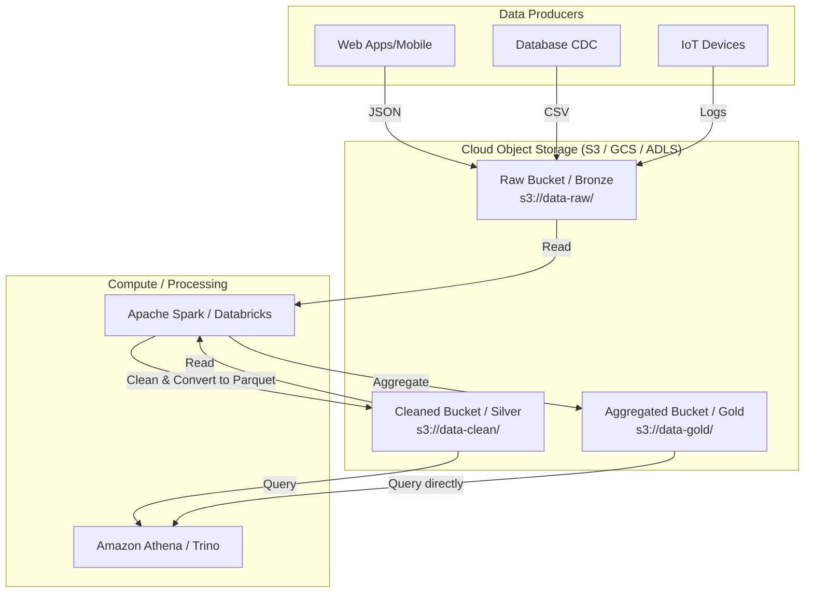

Trong kỷ nguyên của Big Data và Điện toán đám mây, việc tìm kiếm một nơi lưu trữ dữ liệu vừa rẻ, vừa an toàn, lại có khả năng mở rộng vô hạn là mong muốn của mọi doanh nghiệp. **Cloud Object Storage (Lưu trữ đối tượng trên đám mây)** chính là lời giải hoàn hảo cho bài toán đó. Từ những cái tên quen thuộc như Amazon S3, Google Cloud Storage (GCS) cho đến Azure Blob Storage, công nghệ này đã trở thành xương sống vững chắc cho các kiến trúc Data Lake và Data [Lakehouse](/concepts/data-lake-lakehouse/lakehouse/) hiện đại ngày nay.

## Cloud Object Storage: Xương sống thầm lặng của Data Lake hiện đại

Khác với các hệ thống lưu trữ file truyền thống mà bạn thường thấy trên máy tính cá nhân (nơi các thư mục lồng vào nhau theo dạng hình cây), **Object Storage** quản lý dữ liệu dưới dạng các "đối tượng" `(objects)` riêng biệt trong một không gian phẳng. 

Khi sử dụng dịch vụ Cloud Object Storage, hạ tầng phần cứng vật lý phức tạp bên dưới sẽ được các nhà cung cấp đám mây (như AWS, Google Cloud hay Microsoft Azure) quản lý toàn bộ. Bạn sẽ không cần bận tâm đến việc ổ cứng bị đầy hay hỏng hóc, chỉ cần đẩy dữ liệu lên đám mây và thanh toán chi phí theo số lượng Gigabytes thực tế sử dụng mỗi tháng.

## Đối tượng (Object) thực chất chứa những gì?

Mỗi tệp tin bạn tải lên (dù là một bức ảnh, video, file CSV hay Parquet) đều được đóng gói thành một đối tượng độc lập gồm ba thành phần cốt lõi:

1. **Dữ liệu thực tế (Data)**: Nội dung thô của tệp tin.
2. **Siêu dữ liệu (Metadata)**: Các thông tin mô tả đi kèm do bạn tự định nghĩa (ví dụ: tác giả, phòng ban sở hữu, mức độ bảo mật, định dạng dữ liệu).
3. **Định danh duy nhất (Key)**: Một chuỗi ký tự duy nhất đóng vai trò như địa chỉ URL để tìm kiếm đối tượng đó trong vùng lưu trữ mà không phụ thuộc vào vị trí vật lý của máy chủ chứa nó.

## Tại sao các hệ thống file truyền thống lại phải nhường chỗ?

Trước khi điện toán đám mây bùng nổ, dữ liệu thường được lưu trữ dưới dạng File Storage (như ổ đĩa mạng NAS) hoặc Block Storage (các khối ổ cứng vật lý gắn trực tiếp vào máy chủ). Tuy nhiên, khi khối lượng dữ liệu phình to lên mức hàng Petabytes, các hệ thống này bắt đầu bộc lộ những hạn chế lớn:

* **Nghẽn cổ chai hệ thống**: Việc phải tìm kiếm một tệp tin thông qua việc duyệt qua hàng chục tầng thư mục lồng nhau sẽ làm tốc độ truy vấn suy giảm nghiêm trọng.
* **Khó khăn trong việc mở rộng**: Khi một ổ cứng vật lý bị đầy, việc nâng cấp đòi hỏi quy trình di chuyển dữ liệu phức tạp, tốn kém và gây gián đoạn hệ thống.
* **Chi phí đắt đỏ**: Việc lưu trữ hàng Terabytes dữ liệu thô ít khi dùng tới trên các hệ thống lưu trữ chuyên dụng cao cấp là một sự lãng phí ngân sách cực lớn.

Object Storage ra đời để giải quyết triệt để những vấn đề này bằng cách đưa tất cả vào một **không gian phẳng (flat namespace)**. Mọi đối tượng được ném chung vào một cái "thùng" `(bucket)` lớn và được tìm kiếm trực tiếp bằng mã định danh, mang lại khả năng mở rộng vô hạn với mức chi phí cực rẻ (chỉ khoảng `$0.02 / GB / tháng`).

## Những triết lý cốt lõi của Object Storage

* **Không gian phẳng (Flat Namespace)**: Trong Object Storage, không hề tồn tại khái niệm thư mục vật lý. Một đường dẫn như `s3://my-bucket/logs/2026/file.txt` thực tế chỉ là một chuỗi định danh duy nhất (Key), trong đó dấu gạch chéo `/` được hệ thống giao diện giả lập thành cấu trúc thư mục để con người dễ đọc vị.
* **RESTful API**: Mọi thao tác ghi, đọc, xóa dữ liệu đều được thực hiện qua giao thức web tiêu chuẩn (HTTP GET, PUT, DELETE). Điều này giúp mọi ứng dụng có kết nối internet đều dễ dàng tương tác với kho lưu trữ.
* **Độ bền dữ liệu huyền thoại (Durability)**: Các nhà cung cấp đám mây tự động nhân bản dữ liệu của bạn ra ít nhất 3 trung tâm dữ liệu độc lập khác nhau. Ví dụ, Amazon S3 cam kết độ bền dữ liệu lên tới `99.999999999%` (11 số 9), nghĩa là nếu bạn lưu 10 triệu file, phải mất tới 10.000 năm mới có khả năng mất mát ngẫu nhiên 1 file.

## Quy trình vận chuyển dữ liệu trên Cloud Storage

Để đưa một file dữ liệu vào hệ thống, quy trình diễn ra như sau:
1. **Khởi tạo Bucket**: Bạn tạo một chiếc thùng chứa `(Bucket)` tại một khu vực địa lý cụ thể (ví dụ: khu vực Singapore). Tên của Bucket này phải là duy nhất trên toàn cầu.
2. **Tải lên (Upload)**: Ứng dụng gửi lệnh HTTP `PUT` để đẩy file lên. Với các file có dung lượng khổng lồ (hàng chục GB), hệ thống sẽ tự động chia nhỏ file để tải lên song song `(Multipart Upload)` rồi ghép lại sau.
3. **Tính bất biến (Immutability)**: Khi đã ghi lên Object Storage, file đó không thể sửa đổi một phần. Nếu bạn muốn thay đổi dù chỉ một ký tự trong file 1GB, bạn bắt buộc phải tải lên đè một file mới hoàn toàn hoặc tạo ra một phiên bản mới.
4. **Truy xuất (Retrieval)**: Các công cụ tính toán như Spark hay Trino sẽ gửi lệnh HTTP `GET` đi kèm Key để tải dữ liệu lên bộ nhớ và tiến hành phân tích.

## Bức tranh kiến trúc Data Lake dựa trên Object Storage

Dưới đây là sơ đồ minh họa cách Cloud Object Storage đóng vai trò làm trung tâm lưu trữ cho toàn bộ hệ thống Data Lake:


## Thực hành quản trị dữ liệu thông qua AWS CLI và SQL

Dưới đây là một số câu lệnh thực tế mà các Data Engineer thường dùng để tương tác với Amazon S3:

**1. Sao chép tệp tin dữ liệu thô lên Raw Zone của Data Lake**

```bash
aws s3 cp sales_2026_05.csv s3://my-company-datalake/raw/sales/year=2026/month=05/
```

**2. Gán nhãn Metadata bảo mật để phân quyền truy cập tự động**

```bash
aws s3api put-object-tagging \
    --bucket my-company-datalake \
    --key raw/sales/year=2026/month=05/sales_2026_05.csv \
    --tagging '{"TagSet": [{"Key": "security", "Value": "confidential"}]}'
```

**3. Truy vấn SQL trực tiếp trên file lưu trữ S3 bằng Amazon Athena**

```sql
SELECT sum(revenue) 
FROM s3_sales_table 
WHERE year = 2026 AND month = 05;
```

## Thiết kế và tối ưu hóa Object Storage (Best Practices)

* **Thiết kế phân vùng logic ([Partitioning](/concepts/database-storage/partitioning/))**: Hãy đặt tên Key chứa các tiền tố thời gian một cách khoa học, ví dụ: `s3://bucket/data/year=2026/month=05/day=08/`. Khi bạn truy vấn, các công cụ như Spark hay Athena sẽ tự động bỏ qua các phân vùng không liên quan `(Partition Pruning)`, giúp tiết kiệm tới 99% chi phí đọc dữ liệu.
* **Tối ưu hóa kích thước tệp tin (File Sizing)**: Object Storage cực kỳ không thích việc lưu trữ hàng triệu file nhỏ (vài KB). Việc truy xuất hàng triệu file nhỏ sẽ làm phát sinh hàng triệu lệnh gọi API HTTP, gây trễ mạng và tốn tiền. Hãy gộp chúng lại thành các file Parquet có kích thước tối ưu từ `128MB đến 1GB`.
* **Thiết lập quy tắc vòng đời (Lifecycle Policies)**: Đặt cấu hình tự động để tối ưu hóa chi phí. Ví dụ: Dữ liệu thô sau 30 ngày sẽ tự động được chuyển xuống lớp lưu trữ siêu rẻ `(S3 Glacier Cold Storage)` và tự động xóa bỏ hoàn toàn sau 3 năm.

## Những sai lầm tai hại cần tránh

* **Cố gắng chạy hệ điều hành hoặc Database trực tiếp trên Object Storage**: Bạn không thể cài Linux hoặc chạy trực tiếp bộ máy MySQL trên S3. Databases đòi hỏi tốc độ đọc ghi ở cấp độ block `(block-level I/O)` với độ trễ cực thấp (microseconds), điều mà Object Storage hoạt động qua môi trường mạng không thể đáp ứng.
* **Quên bật cơ chế lưu phiên bản (Versioning)**: Xóa nhầm file trên S3 không có tính năng thùng rác để khôi phục. Hãy luôn bật Versioning cho các bucket quan trọng để bảo vệ dữ liệu trước các thao tác xóa nhầm.
* **Cấu hình Bucket công khai (Public Read)**: Đây là nguyên nhân hàng đầu dẫn đến các vụ rò rỉ dữ liệu nghiêm trọng trên thế giới. Hãy luôn khóa quyền truy cập công khai và chỉ phân quyền thông qua IAM Role.

## Sự cân bằng giữa ưu và nhược điểm

### Ưu điểm
* **Mở rộng vô hạn với chi phí cực thấp**: Không bao giờ lo hết ổ cứng.
* **Tách độc lập Lưu trữ và Tính toán (Decoupled Compute & Storage)**: Khi không cần tính toán, bạn có thể tắt cụm máy chủ Spark đắt tiền đi để tiết kiệm ngân sách, trong khi dữ liệu vẫn nằm an toàn trên S3 với chi phí cực nhỏ.

### Nhược điểm
* **Độ trễ truy cập (Latency)**: Vì mọi giao dịch diễn ra qua môi trường mạng (HTTP API), độ trễ truy xuất sẽ mất vài chục mili-giây, chậm hơn nhiều so với đọc trực tiếp từ ổ cứng SSD gắn trong máy.
* **Hạn chế về tính nhất quán tức thời**: Trước đây, Object Storage sử dụng cơ chế nhất quán sau cùng `(Eventual Consistency)`. Nếu bạn cập nhật đè một file, truy vấn ngay lập tức sau đó có thể vẫn trả về nội dung cũ (mặc dù hiện tại AWS S3 đã nâng cấp lên nhất quán tức thời).

## Khi nào là lúc nên (và không nên) sử dụng?

**Nên sử dụng khi:**
* Bạn cần xây dựng tầng lưu trữ cơ bản cho hệ thống Data Lake / Data Lakehouse.
* Cần lưu trữ dữ liệu lịch sử lâu dài để sao lưu dự phòng (Backup/Archive).
* Lưu trữ tài nguyên tĩnh (hình ảnh, video, file tải về) cho các ứng dụng web.

**Không nên sử dụng khi:**
* Cần lưu trữ cho các ứng dụng giao dịch yêu cầu cập nhật từng mili-giây (như cơ sở dữ liệu giỏ hàng, hệ thống [OLTP](/concepts/database-storage/oltp/)).
* Lưu trữ làm ổ cứng chạy hệ điều hành cho máy ảo.

## Góc phỏng vấn: Những câu hỏi thực chiến

### 1. Phân biệt Object Storage, File Storage và Block Storage?
* **Mục đích câu hỏi**: Đánh giá kiến thức nền tảng của ứng viên về hạ tầng lưu trữ trên đám mây.
* **Gợi ý trả lời**:
  * *Block Storage* (như AWS EBS, ổ cứng SSD): Dữ liệu được chia thành các khối thô và gắn trực tiếp vào máy chủ. Tốc độ cực nhanh, phù hợp cho hệ điều hành và chạy công cụ Database.
  * *File Storage* (như AWS EFS, NAS): Dữ liệu quản lý dưới dạng cây thư mục truyền thống, hỗ trợ nhiều máy chủ cùng kết nối và ghi dữ liệu đồng thời.
  * *Object Storage* (như AWS S3): Quản lý dữ liệu dưới dạng các đối tượng độc lập trong một không gian phẳng, truy xuất qua HTTP API. Không thể chỉnh sửa một phần file, siêu rẻ và mở rộng vô hạn, lý tưởng cho Data Lake.

### 2. Tại sao "Bài toán triệu file nhỏ" (Small Files Problem) lại là ác mộng đối với Cloud Object Storage?
* **Mục đích câu hỏi**: Kiểm tra kinh nghiệm thực chiến trong việc tối ưu hóa hiệu năng Big Data.
* **Gợi ý trả lời**:
  * Vì Cloud Object Storage được truy xuất thông qua giao thức mạng HTTP. Mỗi lần đọc một file, hệ thống phải chịu một độ trễ kết nối (overhead) để thiết lập kết nối và tải siêu dữ liệu.
  * Nếu Spark phải đọc 1 triệu file kích thước 10KB, nó sẽ mất 99% thời gian để mở/đóng kết nối HTTP thay vì thực sự xử lý dữ liệu. Đồng thời, bạn sẽ phải trả hóa đơn API rất lớn cho nhà cung cấp đám mây. Giải pháp là chạy các batch job để gộp các file nhỏ thành các file lớn từ 128MB đến 1GB.

### 3. Việc tách rời Lưu trữ và Tính toán (Decoupling Storage and Compute) mang lại lợi ích gì?
* **Mục đích câu hỏi**: Đánh giá tư duy thiết kế kiến trúc hệ thống hiện đại của ứng viên.
* **Gợi ý trả lời**:
  * Trong kiến trúc cũ (như Hadoop HDFS cục bộ), máy chủ đảm nhận cả nhiệm vụ lưu trữ và tính toán. Nếu dữ liệu tăng lên nhưng nhu cầu tính toán không đổi, bạn vẫn buộc phải mua thêm máy chủ mới (gồm cả CPU và RAM đắt đỏ) gây lãng phí.
  * Tách rời lưu trữ (trên S3 giá rẻ) và tính toán (bằng Spark/Trino chạy theo giờ) giúp doanh nghiệp tối ưu hóa chi phí cực tốt. Bạn có thể tắt cụm tính toán khi không dùng đến mà không sợ mất mát dữ liệu, đem lại tính linh hoạt tối đa cho hệ thống.

## Các khái niệm liên quan

* [Data Lake](/concepts/data-lake-lakehouse/data-lake/)
* Định dạng dữ liệu cột Parquet ([Columnar Storage](/concepts/database-storage/columnar-storage/))
* [Kiến trúc Serverless Data](/concepts/cloud-data-platform/serverless-data/)

## Tài liệu tham khảo

1. [Amazon S3 User Guide](https://docs.aws.amazon.com/AmazonS3/latest/userguide/Welcome.html) - Official documentation detailing object storage concepts, bucket policies, lifecycle management, and security best practices.
2. [Designing Data-Intensive Applications](https://www.oreilly.com/library/view/designing-data-intensive-applications/9781491903063/) - Book by Martin Kleppmann explaining storage engines, distributed systems, and retrieval layouts.
3. [Designing Cloud Data Platforms](https://www.manning.com/books/designing-cloud-data-platforms) - Authoritative book by Danil Zburivsky and Lynda Partner covering cloud data architecture and object storage integration.
4. [Databricks Unity Catalog Guide](https://docs.databricks.com/en/connect/unity-catalog/index.html) - Documentation on securely connecting and governing cloud object storage across cloud providers.
5. [AWS Big Data Blog: Amazon S3](https://aws.amazon.com/blogs/big-data/tag/amazon-s3/) - Official AWS blog containing case studies and reference architectures for building S3-based data lakes.

## English Summary

Cloud Object Storage (e.g., AWS S3, Google Cloud Storage, Azure Blob Storage) is a distributed architecture that manages data as discrete "objects" (containing data, rich metadata, and a unique global identifier/URI) within a flat namespace, abandoning the hierarchical directory tree of traditional file systems. It offers practically infinite scalability, supreme durability (11 nines), and low cost via RESTful APIs. It is fundamentally immutable—objects must be fully overwritten rather than partially modified. By allowing the complete decoupling of storage capacity from compute power, Cloud Object Storage serves as the foundational, highly cost-effective storage layer for modern Data Lakes and Data Lakehouses, though it requires specific best practices like partitioning and file [compaction](/concepts/data-lake-lakehouse/compaction/) to overcome latency and API call overheads.