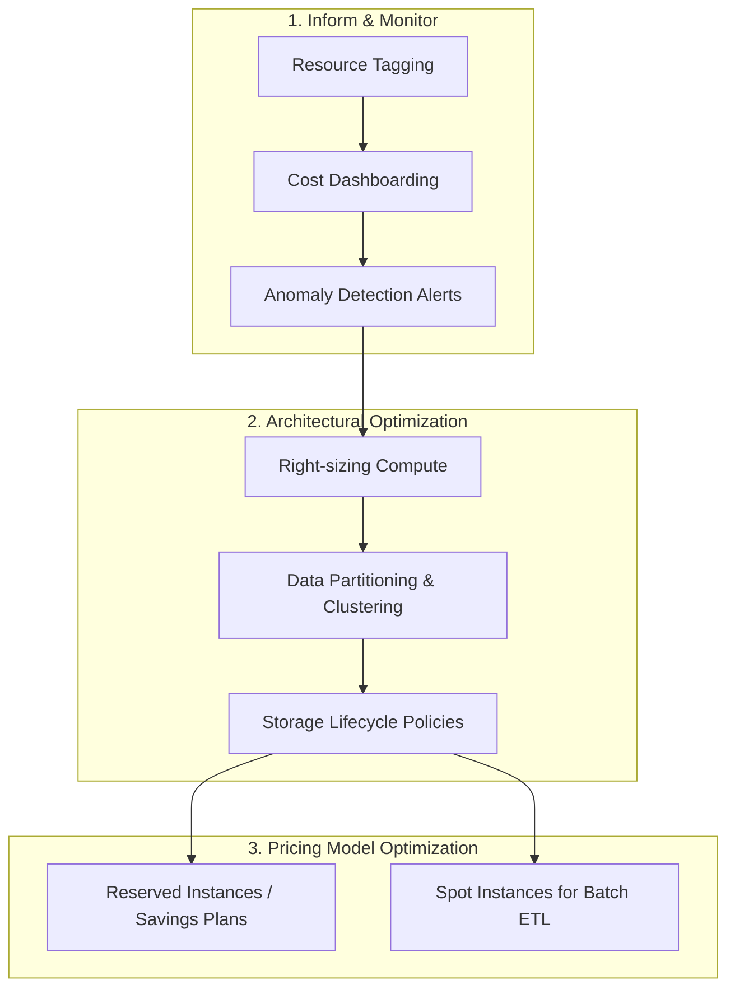

Mô hình Điện toán đám mây với cơ chế thanh toán theo mức độ sử dụng `(pay-as-you-go)` mang lại cho các doanh nghiệp sự linh hoạt tuyệt vời trong việc mở rộng tài nguyên. Thế nhưng, đây cũng là một con dao hai lưỡi. Nếu không có một chiến lược quản lý tốt, bạn sẽ rất dễ đối mặt với những "hóa đơn sốc" cuối tháng. **Tối ưu hóa chi phí (Cost Optimization)** hay kỷ luật **FinOps** trong kỹ thuật dữ liệu chính là chiếc la bàn giúp doanh nghiệp vận hành hệ thống dữ liệu lớn một cách hiệu quả và tiết kiệm nhất.

## Tối ưu hóa chi phí (FinOps): Nghệ thuật cân bằng giữa hiệu năng và túi tiền

Về bản chất, **Tối ưu hóa chi phí** trong kỹ thuật dữ liệu không đơn thuần là việc tìm mọi cách cắt giảm ngân sách một cách mù quáng. Đó là nghệ thuật thiết lập sự cân bằng tối ưu giữa hiệu năng hệ thống, tốc độ xử lý dữ liệu và số tiền bỏ ra, đảm bảo mọi tài nguyên lưu trữ `(Storage)` và tính toán `(Compute)` đều được sử dụng một cách xứng đáng nhất.

Quy trình này đòi hỏi sự phối hợp liên tục giữa việc giám sát, đánh giá và điều chỉnh việc phân bổ tài nguyên trên các nền tảng đám mây lớn (như AWS, Google Cloud, Azure, [Snowflake](/concepts/cloud-data-platform/snowflake/), Databricks) để đáp ứng các cam kết mức dịch vụ `(SLA)` với mức chi phí tiết kiệm nhất.

## Tại sao chi phí trên Cloud lại dễ vượt tầm kiểm soát?

Có ba nguyên nhân chính khiến các dự án Big Data trên đám mây dễ rơi vào tình trạng lãng phí ngân sách:

1. **Thiếu khả năng giám sát trực quan (Cost Visibility)**: Các kỹ sư dữ liệu có thể dễ dàng khởi tạo các cụm máy chủ xử lý dữ liệu cực mạnh để chạy thử nghiệm, nhưng sau đó lại quên tắt chúng đi, khiến hệ thống chạy rỗng và tính tiền vô ích.
2. **Mã nguồn và truy vấn chưa được tối ưu**: Trên các hệ thống như BigQuery hay Snowflake, một câu lệnh SQL viết ẩu thực hiện quét toàn bộ bảng dữ liệu lớn `(Full Table Scan)` thay vì chỉ quét cột cần thiết có thể tiêu tốn hàng ngàn đô-la chỉ trong vài phút.
3. **Phân bổ tài nguyên quá mức (Over-provisioning)**: Thiết lập cấu hình phần cứng quá lớn so với nhu cầu thực tế chỉ vì muốn có cảm giác "an toàn" khi hệ thống vận hành.

## Ba trụ cột của văn hóa FinOps hiện đại

Theo mô hình FinOps chuẩn ngành, tối ưu hóa chi phí được triển khai qua ba giai đoạn liên tục:

* **Nhận thức (Inform)**: Giúp mọi người trong đội ngũ hiểu rõ tiền đang được chi tiêu cho việc gì thông qua các dashboard trực quan hóa chi phí và quy định gắn nhãn `(Tagging)` tài nguyên nghiêm ngặt.
* **Tối ưu (Optimize)**: Chủ động phát hiện các tài nguyên thừa thãi, chuyển đổi sang các mô hình định giá ưu đãi (như Spot Instances, Reserved Instances) và tối ưu hóa cấu trúc lưu trữ.
* **Vận hành (Operate)**: Thiết lập các hạn mức ngân sách `(Budgets)`, hệ thống cảnh báo tự động `(Alerts)` và tích hợp ý thức tiết kiệm chi phí vào quy trình CI/CD của dự án.

## Các khu vực tối ưu hóa chi phí trọng điểm

Quy trình FinOps tập trung cải thiện hiệu quả trên ba khía cạnh vật lý của hệ thống dữ liệu:

1. **Compute (Tính toán)**: Điều chỉnh cấu hình máy chủ vừa vặn với tác vụ `(Right-sizing)`, thiết lập tự động tạm dừng khi không có truy vấn `(Auto-suspend)`, và tận dụng máy chủ giá rẻ `(Spot/Preemptible VMs)` cho các job [ETL](/concepts/etl-elt/etl/) chạy theo lô không quá khắt khe về thời gian.
2. **Storage (Lưu trữ)**: Áp dụng chính sách vòng đời dữ liệu `(Data Lifecycle)`. Chuyển các dữ liệu lịch sử ít dùng xuống các lớp lưu trữ lạnh giá rẻ (như Glacier). Định dạng lại dữ liệu sang dạng cột có nén (Parquet, ORC).
3. **Data Processing (Xử lý dữ liệu)**: Thiết kế phân vùng `(Partitioning)` và gom cụm `(Clustering)` trên bảng dữ liệu để giới hạn tối đa lượng dữ liệu đĩa cần quét.

Sơ đồ hóa luồng vận hành tối ưu hóa chi phí:


## Ví dụ thực chiến: Cắt giảm 97% chi phí trên Google BigQuery

Hãy tưởng tượng một bảng dữ liệu chứa lịch sử sự kiện `user_events` có dung lượng lên tới 50TB dữ liệu thô. Các nhà phân tích thường xuyên thực hiện truy vấn để tính toán lượng người dùng hoạt động hàng tháng (MAU).

* **Cách làm không tối ưu**: Mỗi lần chạy SQL, BigQuery quét qua toàn bộ 50TB dữ liệu (với giá trung bình \$5/TB), tiêu tốn **\$250 cho mỗi lượt truy vấn**.
* **Giải pháp tối ưu**: Người kỹ sư dữ liệu chuyển đổi bảng này thành bảng phân vùng theo ngày `(Partition by Date)`. Khi truy vấn lọc theo tháng cụ thể, BigQuery chỉ quét các phân vùng tương ứng (khoảng 1.5TB), giảm chi phí xuống chỉ còn **\$7.5 cho mỗi lượt truy vấn** (tiết kiệm 97%).

Dưới đây là câu lệnh SQL minh họa cách tạo bảng phân vùng và gom cụm trên [Google BigQuery](/concepts/cloud-data-platform/google-bigquery/):
```sql
-- Tạo bảng phân vùng theo ngày và gom cụm theo loại sự kiện
CREATE TABLE `my_project.my_dataset.user_events_partitioned`
PARTITION BY DATE(event_date)
CLUSTER BY event_type
AS
SELECT * FROM `my_project.my_dataset.user_events_raw`;

-- Truy vấn MAU cực kỳ tiết kiệm vì chỉ quét qua các partitions của tháng 6
SELECT 
    COUNT(DISTINCT user_id) as mau
FROM `my_project.my_dataset.user_events_partitioned`
WHERE event_date BETWEEN '2026-06-01' AND '2026-06-30'
  AND event_type = 'login';
```

## Cẩm nang quản lý chi phí hiệu quả (Best Practices)

* **Thiết lập quy định gắn nhãn (Tagging) bắt buộc**: Hãy yêu cầu mọi tài nguyên khởi tạo trên Cloud phải được gắn tag (ví dụ: `env: production`, `team: marketing`, `project: analysis`). Việc này giúp bạn dễ dàng bóc tách chi phí và quy trách nhiệm sử dụng ngân sách cho từng bộ phận.
* **Cấu hình Auto-Suspend & Auto-Resume**: Đối với các [Data Warehouse](/concepts/data-warehouse/data-warehouse/) hiện đại như Snowflake hay Databricks SQL, hãy thiết lập thời gian tự động dừng cụm tính toán sau 5-10 phút không phát sinh truy vấn để tránh lãng phí tiền chạy rỗng.
* **Gộp các tệp nhỏ**: Đừng để Data Lake của bạn chứa hàng triệu file CSV nhỏ lẻ vài KB. Hãy nén và gộp chúng thành các file Parquet có kích thước tối ưu `(128MB - 1GB)` để giảm phí gọi API đọc dữ liệu và tăng tốc độ xử lý.
* **Đặt ngưỡng cảnh báo ngân sách**: Thiết lập hệ thống gửi thông báo tự động qua Slack hoặc Email khi chi phí sử dụng chạm ngưỡng 50%, 80% và 100% ngân sách dự kiến của tháng.

## Những sai lầm phổ biến dễ dẫn đến hóa đơn sốc

* **Bỏ quên tài nguyên rác (Orphaned Resources)**: Khởi tạo các cụm máy tính ảo, ổ đĩa lưu trữ bổ sung để thử nghiệm dự án, nhưng sau khi hoàn thành lại quên không xóa chúng đi.
* **Lưu trữ dữ liệu rác vô thời hạn**: Không thiết lập thời hạn lưu trữ và chính sách vòng đời dữ liệu cho các file log hệ thống, khiến đĩa lưu trữ phình to liên tục theo thời gian.
* **Lạm dụng xử lý thời gian thực (Real-time)**: Thiết lập hệ thống streaming chạy 24/7 chỉ để phục vụ cho các báo cáo mà phòng nghiệp vụ chỉ mở ra xem đúng một lần vào cuối ngày. Trong trường hợp này, chạy theo lô ([Batch Processing](/concepts/batch-processing/batch-processing/)) vào ban đêm sẽ tiết kiệm hơn rất nhiều.

## Sự đánh đổi thực tế: Được và mất

### Được gì?
* Cắt giảm đáng kể chi phí vận hành hạ tầng đám mây cho doanh nghiệp.
* Mang lại bức tranh tài chính công nghệ minh bạch, dễ dàng chứng minh hiệu quả đầu tư.
* Hầu hết các kỹ thuật tối ưu chi phí (như Partition) đồng thời cũng giúp truy vấn chạy nhanh hơn.

### Mất gì?
* Đòi hỏi chi phí nhân sự lớn: Việc tái cấu trúc lại hệ thống cơ sở dữ liệu và tối ưu hóa code đòi hỏi nhiều tuần, thậm chí nhiều tháng làm việc của các kỹ sư dữ liệu trình độ cao.
* Đánh đổi trải nghiệm người dùng: Việc tự động tắt máy chủ tính toán sẽ gây ra hiện tượng khởi động nguội `(cold start)`, khiến người dùng báo cáo phải đợi khoảng vài giây cho câu truy vấn đầu tiên trong ngày.

## Khi nào nên bắt tay vào tối ưu chi phí?

* Đây là yêu cầu bắt buộc khi bạn đưa bất kỳ hệ thống dữ liệu nào lên môi trường Production thực tế.
* Khi hóa đơn sử dụng dịch vụ đám mây của dự án tăng vọt bất thường mà không rõ nguyên nhân.

**Lưu ý**: Trong giai đoạn đầu thiết kế sản phẩm thử nghiệm (MVP), hãy ưu tiên tốc độ đưa sản phẩm ra thị trường `(Time-to-market)` thay vì dành quá nhiều thời gian để tối ưu từng đồng lẻ. Tối ưu chi phí quá sớm `(Premature Optimization)` là nguồn cơn của sự phức tạp không cần thiết.

## Góc phỏng vấn: Những câu hỏi thực chiến về FinOps

### 1. Bạn đã sử dụng những chiến lược nào để giảm chi phí lưu trữ trên Data Lake (như Amazon S3)?
* **Mục đích câu hỏi**: Đánh giá kiến thức thực tế của ứng viên về tối ưu hóa chi phí lưu trữ.
* **Gợi ý trả lời**:
  * Tôi thường áp dụng chính sách vòng đời dữ liệu `(S3 Lifecycle Policies)` để tự động di chuyển các dữ liệu lịch sử ít khi truy cập xuống các lớp lưu trữ giá rẻ hơn như S3 Glacier.
  * Chuyển đổi toàn bộ các file text thô (CSV/JSON) sang các định dạng cột có nén như Parquet hoặc ORC để tiết kiệm tới 70-80% dung lượng lưu trữ trên đĩa.
  * Triển khai các batch job gom các file nhỏ lại để tránh lãng phí chi phí gọi API.

### 2. Spot Instances (hay Preemptible VMs) là gì? Những loại công việc nào trong Data Engineering phù hợp để chạy trên đó?
* **Mục đích câu hỏi**: Kiểm tra hiểu biết của ứng viên về các mô hình giá của nhà cung cấp dịch vụ đám mây.
* **Gợi ý trả lời**:
  * Spot Instances là lượng tài nguyên máy chủ dư thừa được các nhà cung cấp đám mây bán thanh lý với mức chiết khấu cực sâu (lên đến 80-90%). Điểm trừ là các máy chủ này có thể bị nhà cung cấp thu hồi bất cứ lúc nào sau một cảnh báo ngắn (khoảng 2 phút).
  * Trong [Data Engineering](/concepts/foundation/data-engineering/), Spot Instances cực kỳ phù hợp cho các tác vụ xử lý theo lô (Batch ETL) hoặc huấn luyện mô hình Machine Learning ban đêm – nơi không đòi hỏi SLA khắt khe về thời gian hoàn thành. Do Spark hay các hệ thống phân tán có cơ chế tự phục hồi lỗi `(fault tolerance)`, nếu một node chạy Spot bị thu hồi, hệ thống vẫn có thể tự động chạy lại tác vụ đó trên node khác một cách an toàn.

### 3. Bạn sẽ xử lý thế nào nếu một Data Analyst thường xuyên viết các câu lệnh SQL quét toàn bộ kho dữ liệu và gây tốn rất nhiều chi phí?
* **Mục đích câu hỏi**: Đánh giá khả năng kết hợp giữa giải pháp kỹ thuật và quy trình quản trị dữ liệu (Governance).
* **Gợi ý trả lời**:
  * *Về mặt kỹ thuật*: Cấu hình đặt hạn mức quét dữ liệu tối đa `(Quotas)` cho từng người dùng hoặc từng dự án (ví dụ: giới hạn tối đa quét 1TB dữ liệu/ngày/nhân viên). Thiết lập bắt buộc phải sử dụng bộ lọc `WHERE` trên các cột phân vùng khi truy vấn các bảng lớn.
  * *Về quy trình*: Xây dựng sẵn các bảng dữ liệu tổng hợp `(Data Marts / Aggregated Tables)` và hướng dẫn các nhà phân tích truy vấn trên đó thay vì chọc trực tiếp vào kho dữ liệu thô. Đồng thời, tổ chức các buổi chia sẻ nội bộ hướng dẫn cách đọc sơ đồ thực thi truy vấn để ước tính chi phí trước khi bấm nút chạy.

## Khái niệm liên quan

* [Databricks Platform](/concepts/cloud-data-platform/databricks-platform/)
* [Data Lake](/concepts/data-lake-lakehouse/data-lake/)
* [Modern Data Stack](/concepts/system-architecture/modern-data-stack/)

## Tài liệu tham khảo

1. [FinOps Foundation Framework](https://www.finops.org/) - The official framework and standard definitions for cloud financial operations and cost management.
2. [AWS Well-Architected Framework - Cost Optimization](https://aws.amazon.com/architecture/well-architected/) - Key concepts, design principles, and architectural best practices for cost optimization on AWS.
3. [Google Cloud Architecture Framework: Cost Optimization](https://cloud.google.com/architecture/framework/cost-optimization) - Strategies and best practices for monitoring, control, and optimization of cloud costs on Google Cloud Platform.
4. Snowflake: Understanding and Optimizing Cost - Best practices and tools for managing and optimizing virtual warehouse compute and storage consumption.
5. [Databricks Lakehouse Cost Optimization](https://docs.databricks.com/en/lakehouse-architecture/cost-optimization/) - Best practices for optimizing workload compute, using serverless options, and governing DBUs.

## English Summary

Cost Optimization in cloud data engineering (often under the umbrella of FinOps) is the continuous practice of managing, monitoring, and adjusting cloud spending to maximize business value. It involves strategic decisions around right-sizing compute resources, leveraging cost-effective pricing models (like Spot instances), implementing storage lifecycle policies, and enforcing efficient data processing patterns (such as [partitioning](/concepts/database-storage/partitioning/) and query optimization). The goal is to prevent runaway costs associated with the pay-as-you-go model while maintaining system performance and reliability.