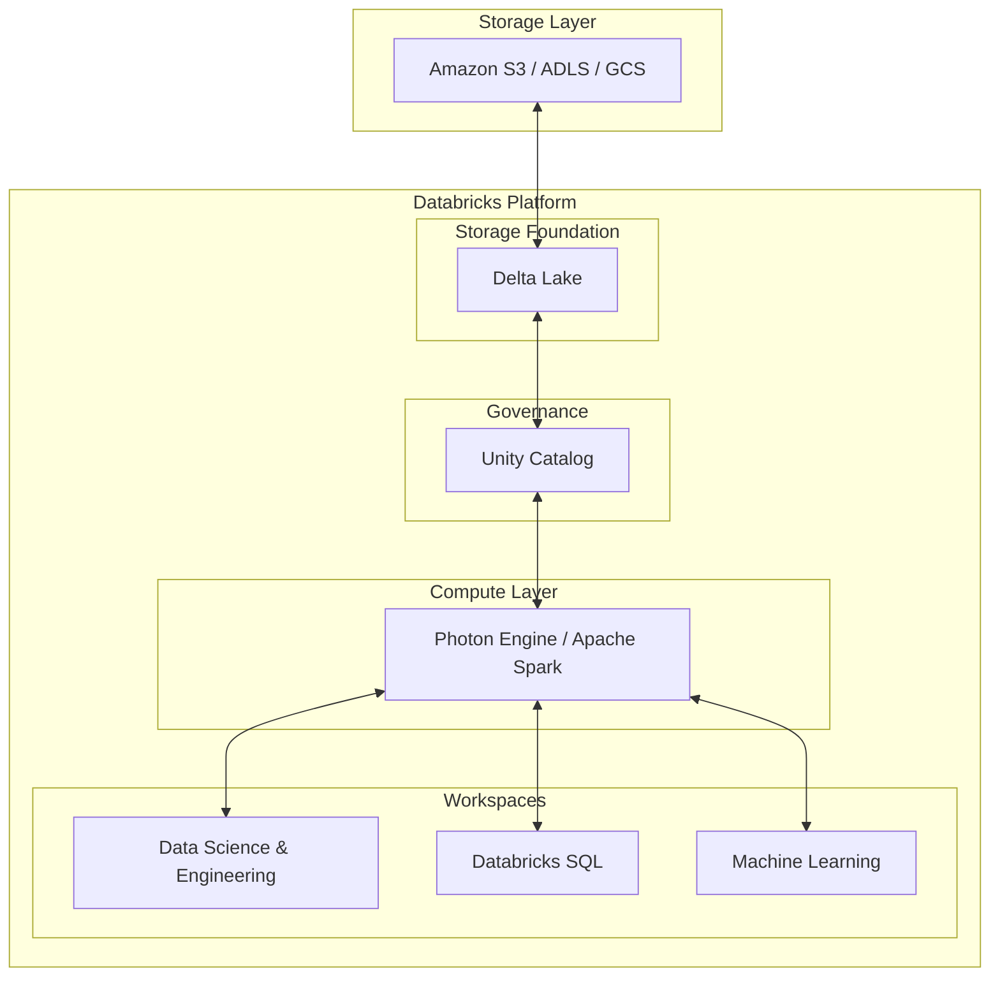

Nếu bạn từng làm việc trong một dự án dữ liệu lớn (Big Data), chắc hẳn bạn đã quen với cảnh tượng: Đội ngũ Data Engineer loay hoay viết Spark code trên các cụm máy chủ phức tạp; đội ngũ Data Scientist dùng các file Jupyter Notebook rời rạc trên máy cá nhân để train model; còn các Data Analyst lại mệt mỏi chờ đợi dữ liệu được chuyển đổi từ Data Lake sang Data Warehouse để chạy SQL báo cáo. Sự phân mảnh này không chỉ làm chậm tiến độ mà còn tạo ra những bức tường vô hình ngăn cách các phòng ban.

Đó là lý do **Databricks** ra đời — nền tảng đám mây thống nhất tiên phong đưa ra khái niệm **Lakehouse**, giúp kết hợp hoàn hảo những gì tốt nhất của Data Lake và Data Warehouse vào chung một mái nhà.

## Databricks thực chất là gì?

**Databricks** là một nền tảng dữ liệu, phân tích và trí tuệ nhân tạo (AI) chạy trên các dịch vụ đám mây lớn (AWS, Azure, GCP). Nền tảng này được sáng lập bởi chính những người cha đẻ của Apache Spark. 

Bằng cách sử dụng công nghệ lưu trữ Delta Lake cùng động cơ tính toán Apache Spark đã được tối ưu hóa vượt bậc, Databricks cho phép doanh nghiệp quản lý toàn bộ vòng đời của dữ liệu trên một hệ thống duy nhất: từ thu nạp dữ liệu thô, xử lý ETL/ELT, phân tích BI, cho đến huấn luyện các mô hình học máy (Machine Learning) và AI.

## Giải mã sự trỗi dậy của mô hình Lakehouse

Trước khi Databricks phổ biến kiến trúc Lakehouse, các doanh nghiệp thường phải duy trì song song hai hệ thống: **Data Lake** (để lưu trữ dữ liệu thô khổng lồ với chi phí rẻ, phục vụ Data Science) và **Data Warehouse** (để lưu trữ dữ liệu có cấu trúc sạch sẽ, phục vụ báo cáo BI).

Kiến trúc cũ này bộc lộ nhiều điểm yếu:
1. **Dữ liệu dư thừa**: Dữ liệu phải được sao chép và di chuyển qua lại liên tục giữa hai hệ thống bằng các pipeline ETL phức tạp.
2. **Thiếu độ tin cậy**: Data Lake truyền thống thiếu tính toàn vẹn giao dịch (ACID transactions). Nếu một tiến trình ghi dữ liệu bị lỗi giữa chừng, dữ liệu sẽ bị hỏng và không có cách nào tự động khôi phục.
3. **Môi trường làm việc phân mảnh**: Kỹ sư dữ liệu (dùng Scala/Spark), nhà khoa học dữ liệu (dùng Python) và nhà phân tích (dùng SQL) làm việc trên các công cụ độc lập, rất khó cộng tác với nhau.

Databricks giải quyết triệt các vấn đề này bằng cách đặt một lớp quản trị và giao dịch đáng tin cậy (Delta Lake) ngay trên vùng lưu trữ Data Lake giá rẻ, biến nó thành một **Lakehouse** mạnh mẽ.

## Bộ ba công nghệ cốt lõi làm nên sức mạnh Databricks

Sức mạnh của Databricks được xây dựng dựa trên ba trụ cột công nghệ chính:

* **Apache Spark**: Động cơ tính toán phân tán bộ nhớ trong (in-memory) cực mạnh. Trên Databricks, Spark được tinh chỉnh sâu sắc (dưới tên gọi Photon Engine) để đạt tốc độ xử lý nhanh hơn gấp nhiều lần bản nguồn mở.
* **Delta Lake**: Lớp định dạng lưu trữ mang lại khả năng giao dịch ACID, quản lý phiên bản dữ liệu (Time Travel) và hỗ trợ xử lý cả dạng lô (Batch) lẫn dạng luồng (Streaming) đồng thời.
* **MLflow**: Công cụ tiêu chuẩn để quản lý vòng đời phát triển Machine Learning, giúp theo dõi các thí nghiệm, lưu vết tham số và đóng gói mô hình để triển khai dễ dàng.

## Databricks vận hành như thế nào trong thực tế?

Databricks hoạt động như một tầng tính toán linh hoạt (Compute Layer) nằm trên các dịch vụ lưu trữ đám mây của bạn (như Amazon S3, Azure Data Lake Storage, hay Google Cloud Storage):



* **Không gian làm việc chung (Workspace)**: Mọi người cộng tác qua giao diện Notebooks hỗ trợ đa ngôn ngữ (Python, SQL, Scala, R). Bạn có thể viết code Python ở ô này và viết SQL ở ô ngay dưới để truy vấn cùng một bảng dữ liệu.
* **Quản lý cụm tính toán (Clusters)**: Databricks tự động cấp phát, mở rộng hoặc tắt các cụm máy chủ (Clusters) tùy theo tải thực tế. Có hai loại cụm: *Interactive Clusters* (phục vụ lập trình, thử nghiệm) và *Job Clusters* (tự động bật lên để chạy pipeline định kỳ rồi tự tắt đi để tiết kiệm chi phí).
* **Quản trị tập trung với Unity Catalog**: Tầng quản trị giúp phân quyền bảo mật chi tiết đến từng dòng, từng cột dữ liệu và tự động vẽ lại phả hệ dữ liệu (Data Lineage) giúp bạn biết bảng này được sinh ra từ những nguồn nào.

---

## Ví dụ thực tế: Xây dựng pipeline xử lý clickstream thời gian thực

Dưới đây là một đoạn code Python (PySpark) chạy trên Databricks Notebook để đọc luồng dữ liệu clickstream từ Kafka, làm sạch và ghi thẳng vào bảng Delta Lake:

```python
from pyspark.sql.functions import col

# Đọc luồng dữ liệu trực tiếp từ Kafka
df = spark.readStream \
    .format("kafka") \
    .option("kafka.bootstrap.servers", "host1:port1") \
    .option("subscribe", "clickstream") \
    .load()

# Xử lý làm sạch và chuyển đổi cơ bản
processed_df = df.selectExpr("CAST(value AS STRING) as json_payload") \
    .filter(col("json_payload").isNotNull())

# Ghi trực tiếp xuống Delta Table (sử dụng Delta Lake để bảo đảm ACID)
query = processed_df.writeStream \
    .format("delta") \
    .outputMode("append") \
    .option("checkpointLocation", "/data/checkpoints/clickstream") \
    .start("/data/lakehouse/clickstream_gold")
```

Sau khi ghi, bảng `clickstream_gold` này lập tức hiển thị trong hệ thống và sẵn sàng để các Analyst dùng Databricks SQL truy vấn làm báo cáo mà không cần đợi chạy job ETL qua đêm.

---

## "Bí kíp" tối ưu hiệu năng và quản trị chi phí

### Kinh nghiệm thực chiến (Best Practices)
* **Tối ưu hóa bảng định kỳ**: Hãy lên lịch chạy các lệnh `OPTIMIZE` và `ZORDER` trên các bảng Delta. Việc này giúp gom các tệp tin nhỏ thành các tệp lớn hơn và sắp xếp dữ liệu tối ưu cho việc tìm kiếm, giúp tăng tốc độ đọc dữ liệu lên gấp hàng chục lần.
* **Sử dụng Job Clusters cho môi trường Production**: Tuyệt đối không dùng cụm tương tác (Interactive Clusters) để chạy các tác vụ ETL tự động hàng ngày. Hãy dùng Job Clusters vì chi phí tính toán của nó rẻ hơn rất nhiều và tự động giải phóng tài nguyên ngay khi chạy xong.
* **Kích hoạt động cơ Photon**: Hãy bật tính năng Photon khi chạy các tác vụ nặng về JOIN, gom nhóm trên các bảng dữ liệu lớn để tận dụng tối đa sức mạnh phần cứng.

### Các cạm bẫy dễ mất tiền và giảm hiệu năng
* **Vấn nạn tệp tin nhỏ (Small Files Problem)**: Việc ghi dữ liệu liên tục (Streaming) hoặc chia nhỏ lô dữ liệu sẽ sinh ra hàng triệu file Parquet tí hon trên cloud storage. Nếu không chạy `OPTIMIZE` thường xuyên, Spark sẽ tốn rất nhiều thời gian chỉ để đọc metadata của các file này, gây chậm hệ thống nghiêm trọng.
* **Sử dụng lệnh `.collect()` vô tội vạ**: Lệnh này sẽ kéo toàn bộ dữ liệu phân tán từ các máy trạm (Workers) về máy chủ điều khiển (Driver). Nếu tập dữ liệu quá lớn, Driver sẽ bị quá tải bộ nhớ và sập (OOM) lập tức.
* **Quên chạy lệnh `VACUUM`**: Delta Lake lưu lại các phiên bản cũ của dữ liệu để phục vụ tính năng quay ngược thời gian (Time Travel). Nếu bạn cập nhật dữ liệu liên tục mà không chạy `VACUUM` để dọn dẹp các phiên bản quá cũ, hóa đơn lưu trữ đám mây của bạn sẽ tăng vọt một cách chóng mặt.

### Điểm đánh đổi (Trade-offs)
* **Chi phí vs. Tiện ích**: Databricks cực kỳ mạnh mẽ nhưng đi kèm mức giá không hề rẻ. Nếu không cấu hình tự động tắt cụm (Auto-termination) hợp lý, bạn có thể phải trả những hóa đơn cloud khổng lồ cho những cụm máy chủ bị bỏ quên qua đêm.
* **Độ phức tạp kỹ thuật**: Databricks không phải là một công cụ "ăn liền" kiểu kéo thả. Để làm chủ nền tảng này, đội ngũ của bạn cần có kiến thức tốt về lập trình phân tán (Spark) và ngôn ngữ Python/Scala/SQL.

---

## Góc phỏng vấn

### 1. Giải thích sự khác biệt giữa Databricks All-Purpose Clusters và Job Clusters. Khi nào nên dùng loại nào?
* **Gợi ý trả lời**: 
  * **All-Purpose Clusters (Cụm đa mục đích)** được thiết kế cho quá trình làm việc tương tác hàng ngày. Nhiều người dùng có thể kết nối chung vào cụm này để viết code, chạy thử Notebooks và phân tích ad-hoc. Chi phí sử dụng (tính theo DBU) của loại cụm này cao hơn.
  * **Job Clusters (Cụm tác vụ)** được tạo ra một cách tự động bởi Databricks Scheduler khi có một Job (tác vụ định kỳ) được kích hoạt. Ngay sau khi Job chạy xong, cụm này sẽ tự động bị tiêu hủy để giải phóng tài nguyên. Chi phí DBU của Job Clusters rẻ hơn nhiều so với cụm tương tác. Do đó, trong thực tế, ta dùng All-Purpose cho giai đoạn phát triển (Dev) và dùng Job Clusters cho môi trường chạy tự động (Production).

### 2. Lệnh `OPTIMIZE` và `ZORDER` trong Delta Lake (Databricks) có vai trò gì?
* **Gợi ý trả lời**: 
  * Lệnh **`OPTIMIZE`** giải quyết vấn đề "tệp tin nhỏ" (small file problem) bằng cách gom nhiều tệp tin Parquet nhỏ lại thành các tệp lớn hơn (thường có kích thước chuẩn khoảng 1GB). Điều này giúp giảm số lượng file cần đọc và tăng tốc độ quét dữ liệu.
  * Lệnh **`ZORDER`** là kỹ thuật sắp xếp dữ liệu đa chiều. Nó tổ chức lại các dòng dữ liệu vật lý sao cho các giá trị của các cột thường xuyên được dùng để lọc (như `date`, `city`) nằm cạnh nhau. Khi chạy truy vấn có điều kiện lọc trên các cột này, Spark có thể bỏ qua (data skipping) các file không chứa dữ liệu cần tìm, giúp tăng tốc độ truy vấn đáng kể.

### 3. Bạn đã bao giờ gặp lỗi "Out of Memory" (OOM) trong Spark Databricks chưa? Bạn xử lý nó như thế nào?
* **Gợi ý trả lời**: Tôi đã từng gặp lỗi OOM và thường chia làm hai trường hợp:
  * **OOM ở Driver Node**: Thường do lập trình viên gọi lệnh `.collect()` hoặc `.toPandas()` trên một DataFrame quá lớn, ép Driver phải chứa toàn bộ dữ liệu. Khắc phục bằng cách hạn chế dùng các hàm này, thay bằng `.take()` hoặc ghi trực tiếp kết quả xuống bộ nhớ rồi mới đọc mẫu nhỏ.
  * **OOM ở Worker Nodes**: Thường do hiện tượng lệch dữ liệu (Data Skew) khi thực hiện các phép JOIN hoặc GROUP BY nặng, khiến một worker phải nhận lượng dữ liệu vượt quá dung lượng RAM của nó. Khắc phục bằng cách lọc bớt khóa NULL trước khi JOIN, sử dụng Broadcast Join nếu có bảng nhỏ, áp dụng kỹ thuật Key Salting hoặc kích hoạt tính năng tự động tối ưu hóa Skew Join của AQE (Adaptive Query Execution).

---

## Khái niệm liên quan

* [Delta Lake](/concepts/data-lake-lakehouse/delta-lake/) - Tìm hiểu chi tiết về công nghệ lưu trữ cốt lõi Delta Lake.
* [Lệch dữ liệu - Data Skew](/concepts/batch-processing/data-skew/) - Cách nhận diện và khắc phục lỗi lệch dữ liệu trong Spark.

## Tài liệu tham khảo

1. [Databricks Documentation](https://docs.databricks.com/) - The official Databricks documentation containing guides, tutorials, and developer resources.
2. [Databricks Well-Architected Lakehouse Framework](https://docs.databricks.com/en/lakehouse-architecture/index.html) - Architectural principles and best practices for building a production-ready lakehouse on Databricks.
3. [Unity Catalog Guide](https://docs.databricks.com/en/data-governance/unity-catalog/index.html) - Official documentation for governing data, files, and AI models securely using Databricks Unity Catalog.
4. [Delta Lake Home](https://delta.io/) - Official website of Delta Lake, the open-source storage framework underpinning the Lakehouse architecture.
5. [Spark: The Definitive Guide](https://www.oreilly.com/library/view/spark-the-definitive/9781491912201/) - Comprehensive guide to Apache Spark, its core architecture, and APIs, authored by Bill Chambers and Matei Zaharia.

## English Summary

The Databricks Platform is a unified cloud-native analytics environment that pioneers the Lakehouse architecture, combining the scalability and low cost of a Data Lake with the ACID transactions and performance of a Data Warehouse. Built on an optimized Apache Spark engine and Delta Lake, it provides an integrated ecosystem for data engineering, real-time analytics, data science, and machine learning, fostering seamless collaboration across technical teams while managing massive datasets efficiently.
