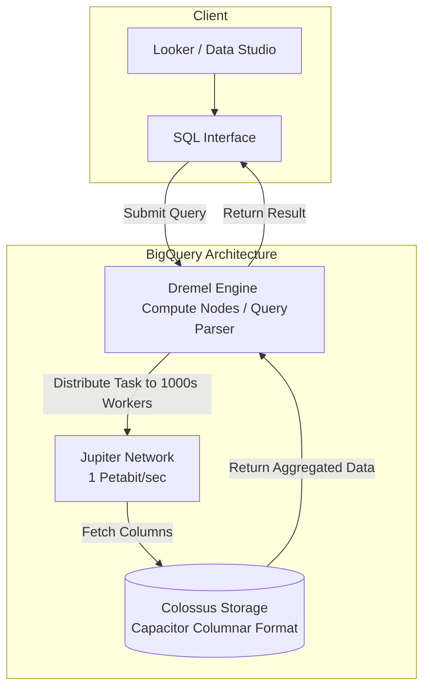

Trong thế giới phân tích dữ liệu, việc phải quản lý hạ tầng máy chủ, cấu hình bộ nhớ đệm hay thiết lập các chỉ mục (index) cho database luôn là nỗi ám ảnh với các kỹ sư và chuyên viên phân tích. Nhưng hãy tưởng tượng một hệ thống nơi bạn chỉ việc mang dữ liệu đến thả vào, viết một câu lệnh SQL và quét qua hàng ngàn tỷ dòng (Petabytes) dữ liệu chỉ trong vài giây mà không cần bận tâm đến bất kỳ máy chủ vật lý nào dưới nền. Đó chính là trải nghiệm đột phá mà **Google BigQuery** mang lại.

## Khi dữ liệu phình to đến mức không tưởng

Google BigQuery (BQ) là hệ thống kho dữ liệu doanh nghiệp (Enterprise Data Warehouse) được xây dựng hoàn toàn trên nền tảng điện toán đám mây Google Cloud Platform (GCP). Điểm tạo nên sự khác biệt tuyệt đối của BigQuery so với các cơ sở dữ liệu truyền thống chính là mô hình **Serverless hoàn toàn (Fully-managed Serverless)**.

BigQuery không phải là cơ sở dữ liệu quan hệ tối ưu cho việc ghi/sửa từng dòng (như PostgreSQL hay MySQL). Nó được thiết kế như một **Cơ sở dữ liệu phân tích dạng cột (Columnar OLAP Database)**. Mục tiêu duy nhất của nó là giải quyết bài toán: *Làm thế nào để một nhà phân tích viết một câu truy vấn SQL tiêu chuẩn và nhận về kết quả tổng hợp dữ liệu khổng lồ chỉ trong tích tắc mà không cần thiết lập hạ tầng?*

## Google BigQuery ra đời như thế nào?

Vào những năm 2000, khi Google bùng nổ với các dịch vụ toàn cầu như Tìm kiếm, Gmail và YouTube, lượng dữ liệu log sinh ra là vô cùng khổng lồ. Thời điểm đó, không một hệ thống kho dữ liệu thương mại nào trên thị trường (kể cả những ông lớn như Oracle hay Teradata) có khả năng lưu trữ và truy vấn nổi khối lượng dữ liệu này.

Để tự cứu mình, Google đã nghiên cứu và phát triển các siêu công nghệ nội bộ mang tên **Colossus** (hệ thống lưu trữ phân tán) và **Dremel** (cỗ máy truy vấn phân tán). Nhận thấy đây là giải pháp mà mọi doanh nghiệp lớn trên thế giới đều sẽ cần đến khi bước vào kỷ nguyên số, năm 2011, Google chính thức thương mại hóa các công nghệ này dưới tên gọi **Google BigQuery**, mở ra một chương mới cho các giải pháp Cloud Data Warehouse.

## Giải phẫu kiến trúc: Điều gì tạo nên sức mạnh vô song của BigQuery?

Sức mạnh vượt trội của BigQuery nằm ở triết lý **tách rời tính toán và lưu trữ (Decoupled Compute & Storage)**. Thay vì đặt ổ cứng và vi xử lý chung một chỗ, BigQuery tách chúng ra hai lớp riêng biệt và kết nối bằng mạng cáp quang siêu tốc.



Kiến trúc này được xây dựng vững chắc trên 3 trụ cột công nghệ độc quyền của Google:

1. **Lớp lưu trữ (Storage) - Colossus**: Dữ liệu khi nạp vào BigQuery sẽ được chuyển đổi sang định dạng nén cột độc quyền gọi là **Capacitor**, sau đó phân mảnh và lưu trữ trên hệ thống Colossus của Google. Cơ chế sao lưu tự động (replication) đảm bảo dữ liệu của bạn luôn an toàn trước mọi sự cố vật lý.
2. **Lớp tính toán (Compute) - Dremel**: Dremel đóng vai trò là bộ não thực thi truy vấn. Khi bạn bấm nút chạy một câu SQL, Dremel sẽ phân tích câu lệnh thành một cây thực thi (Execution Tree), chia nhỏ công việc và phân phát cho hàng ngàn máy chủ ảo (workers - hay còn gọi là *Slots*) để cùng quét dữ liệu song song rồi tổng hợp kết quả gửi lại cho bạn.
3. **Mạng kết nối siêu tốc (Network) - Jupiter**: Để truyền tải lượng dữ liệu khổng lồ giữa lớp lưu trữ Colossus và lớp tính toán Dremel, Google sử dụng mạng cáp quang Jupiter với băng thông lên tới 1 Petabit/giây. Điều này giúp tốc độ đọc ghi giữa hai lớp phân tách nhanh như thể ổ cứng đang cắm trực tiếp trên bo mạch chủ của máy tính.

## Nghệ thuật quản lý chi phí: Mô hình giá của BigQuery

Để không bị sốc khi nhận hóa đơn GCP cuối tháng, bạn cần hiểu rõ cách BigQuery tính tiền. Về cơ bản, Google tách biệt chi phí thành hai phần:

1. **Chi phí lưu trữ (Storage Pricing)**: Rất rẻ, chỉ khoảng $0.02 cho mỗi GB dữ liệu lưu trữ một tháng (tương đương với việc lưu file thô trên Amazon S3 hay Google Cloud Storage). Đặc biệt, nếu một phân vùng dữ liệu không bị chỉnh sửa trong vòng 90 ngày liên tiếp, Google sẽ tự động giảm 50% chi phí lưu trữ cho phân vùng đó (Long-term storage).
2. **Chi phí truy vấn (Compute/Query Pricing)**: Có hai tùy chọn chính tùy thuộc vào quy mô doanh nghiệp:
   * **On-demand (Trả theo dung lượng quét - Phổ biến nhất)**: Google tính phí khoảng **$6.25 cho mỗi Terabyte (TB)** dữ liệu mà câu lệnh SQL của bạn thực tế quét qua. Nếu bạn không chạy câu lệnh nào, bạn hoàn toàn không mất phí tính toán.
   * **Capacity Pricing (Mua khoán slots)**: Phù hợp cho các doanh nghiệp lớn muốn kiểm soát chi phí cố định. Bạn sẽ thuê một lượng tài nguyên tính toán cố định (tính bằng Slots, tối thiểu là 100 slots) với mức giá cố định hàng tháng để thỏa sức chạy các câu lệnh SQL mà không lo chi phí phát sinh.

## Minh họa thực tế: Kẻ phá hoại ví tiền vs Người tối ưu hóa

Giả sử bạn đang có một bảng dữ liệu lịch sử Wikipedia (`wikipedia_views`) với dung lượng 10TB. Bạn cần thống kê số lượt xem các bài viết liên quan đến chủ đề "Vietnam" trong năm 2026.

### Cách viết tồi (Làm bay đứt $62.5 của công ty):
```sql
-- Dùng SELECT * bắt BigQuery quét toàn bộ các cột của bảng 10TB
SELECT * FROM `bigquery-public-data.wikipedia.views`
WHERE title = 'Vietnam' AND date LIKE '2026-%';
```
*Vì BigQuery tính tiền dựa trên lượng dữ liệu quét qua chứ không tính trên số dòng kết quả trả về. Việc bạn lạm dụng `SELECT *` sẽ bắt hệ thống quét qua toàn bộ 10TB dữ liệu trên đĩa, ngay cả khi kết quả trả về chỉ có vài dòng.*

### Cách viết tối ưu (Có thể chỉ tốn $0.01):
```sql
-- Chỉ bóc tách duy nhất 2 cột cần thiết là (views) và (date)
SELECT sum(views) 
FROM `bigquery-public-data.wikipedia.views`
WHERE date BETWEEN '2026-01-01' AND '2026-12-31'
  AND title = 'Vietnam';
```
*Nhờ cấu trúc lưu trữ dạng cột (Capacitor), BigQuery sẽ bỏ qua hoàn toàn các cột không liên quan (như author, description, id) đang chiếm phần lớn dung lượng. Hơn thế nữa, nếu bảng được thiết lập phân vùng (Partition) theo cột `date`, BigQuery sẽ bỏ qua tất cả các phân vùng của các năm khác, giúp giảm dung lượng quét từ 10TB xuống còn vài Megabytes.*

## Những chỉ dẫn "vàng" và sai lầm "đốt tiền" kinh điển

### Chỉ dẫn "vàng" cho kỹ sư dữ liệu
* **Thiết lập Phân vùng (Partitioning)**: Luôn chia nhỏ các bảng lớn theo thời gian (ví dụ: chia theo cột ngày `DATE`). Đây là tấm khiên bảo vệ túi tiền của doanh nghiệp, giúp giới hạn phạm vi quét dữ liệu của các câu truy vấn.
* **Cấu hình Phân cụm (Clustering)**: Sau khi phân vùng, hãy tiến hành phân cụm dữ liệu theo các cột thường dùng để lọc (`WHERE`) hoặc gom nhóm (`GROUP BY`), ví dụ như `customer_id` hoặc `product_category`. BigQuery sẽ sắp xếp vật lý các dòng dữ liệu có cùng thuộc tính nằm gần nhau để tìm kiếm nhanh hơn.
* **Nói KHÔNG với `SELECT *`**: Luôn chỉ định rõ tên các cột cần lấy. Đây là luật bất thành văn đối với bất kỳ cơ sở dữ liệu dạng cột nào.
* **Tránh các câu lệnh ghi/sửa vụn vặt**: BigQuery không được tối ưu cho các tác vụ OLTP. Thay vì chạy hàng ngàn câu lệnh `UPDATE` hay `DELETE` riêng lẻ, hãy gom dữ liệu thành các lô (batch) lớn rồi sử dụng câu lệnh `MERGE` để xử lý định kỳ.

### Sai lầm "đốt tiền" kinh điển
* **Tìm kiếm nút tạo Index**: Các lập trình viên chuyển từ thế giới quan hệ (MySQL/PostgreSQL) sang thường mất nhiều thời gian đi tìm cách tạo chỉ mục (index). Hãy nhớ rằng BigQuery không dùng Index. Nó sử dụng sức mạnh tính toán song song phân tán cực lớn để quét nhanh toàn bộ dữ liệu. Kỹ thuật thay thế cho Index ở đây chính là Partitioning và Clustering.
* **Dùng `LIMIT` để tiết kiệm tiền**: Nhiều người nghĩ rằng viết `SELECT * FROM table LIMIT 10` sẽ chỉ tốn tiền cho 10 dòng dữ liệu. Đây là quan niệm sai lầm tai hại. `LIMIT` chỉ giới hạn số dòng hiển thị trên màn hình của bạn, còn dưới nền, BigQuery vẫn phải thực hiện quét toàn bộ bảng và tính tiền đầy đủ.
* **Không thiết lập hạn mức cảnh báo chi phí (Billing Alerts)**: Đã có rất nhiều trường hợp dở khóc dở cười khi các kỹ sư vô tình đưa câu lệnh SQL chưa tối ưu vào một vòng lặp tự động (loop) và nhận về hóa đơn hàng chục ngàn USD sau một đêm. Hãy luôn cài đặt hạn mức quét dữ liệu (Quota Controls) cho từng người dùng hoặc dự án.

## Cân nhắc được và mất (Trade-offs)

### Điểm cộng
* **Trải nghiệm Zero-Ops thực sự**: Bạn hoàn toàn không cần quan tâm đến việc nâng cấp phần mềm, cấu hình RAM, CPU hay dọn dẹp bộ nhớ. Tất cả những gì bạn cần làm là nạp dữ liệu và viết SQL.
* Hiệu suất truy vấn vượt trội trên các tập dữ liệu khổng lồ cấp độ Petabyte.
* Hỗ trợ học máy trực tiếp (BigQuery ML): Bạn có thể xây dựng và huấn luyện các mô hình dự đoán ngay bằng các câu lệnh SQL quen thuộc (`CREATE MODEL`).

### Điểm trừ
* **Vendor Lock-in (Ràng buộc nhà cung cấp)**: Mã nguồn của BigQuery là độc quyền của Google. Bạn không thể mang hệ thống này về chạy trên máy chủ nội bộ hoặc các đám mây khác.
* Không phù hợp cho các ứng dụng yêu cầu độ trễ cực thấp (<100ms) để truy xuất ngẫu nhiên từng dòng dữ liệu (Point lookups).
* Dễ gây sốc chi phí nếu đội ngũ phân tích dữ liệu không được đào tạo bài bản về cách tối ưu hóa câu lệnh SQL.

## Khi nào nên dùng và khi nào không?

**Nên dùng khi:**
* Bạn muốn xây dựng một kho dữ liệu trung tâm (Data Warehouse) trên đám mây Google Cloud (GCP).
* Doanh nghiệp sở hữu khối lượng dữ liệu phân tích lớn (từ vài trăm GB đến hàng Petabytes) nhưng không muốn đầu tư nhân sự vận hành hệ thống phần cứng phức tạp.
* Cần tích hợp luồng dữ liệu thời gian thực (Streaming) trực tiếp từ Google Pub/Sub thông qua Dataflow để phân tích tức thì.

**Không nên dùng khi:**
* Bạn cần một cơ sở dữ liệu làm backend cho một website hoặc ứng dụng di động để xử lý các giao dịch đăng nhập, thanh toán (OLTP). Hãy chọn Google Cloud SQL hoặc Cloud Spanner.
* Tổng dung lượng dữ liệu của bạn quá nhỏ (dưới vài chục Gigabytes). Lúc này, độ trễ mạng của hệ thống phân tán trong BigQuery thậm chí sẽ khiến câu lệnh chạy chậm hơn một database PostgreSQL thông thường.

## Các khái niệm liên quan

* [Snowflake](/concepts/cloud-data-platform/snowflake/)
* [Amazon Redshift](/concepts/cloud-data-platform/amazon-redshift/)
* [Serverless Data Processing (Xử lý dữ liệu không máy chủ)](/concepts/cloud-data-platform/serverless-data/)

## Góc phỏng vấn: Đối đáp tự tin cùng nhà tuyển dụng

### 1. Phân vùng (Partitioning) và Phân cụm (Clustering) trong BigQuery khác nhau như thế nào và khi nào nên kết hợp cả hai?
* **Mục đích câu hỏi**: Kiểm tra khả năng thiết kế vật lý bảng dữ liệu để tối ưu hóa hiệu năng truy vấn và tiết kiệm chi phí cho doanh nghiệp.
* **Gợi ý trả lời**:
  * *Partitioning* là việc chia nhỏ bảng dữ liệu một cách vật lý thành các phân vùng độc lập (thường dựa trên cột thời gian như ngày, tháng hoặc một cột số nguyên). Khi viết truy vấn lọc theo phân vùng này, BigQuery sẽ định vị chính xác phân vùng cần đọc và bỏ qua hoàn toàn các phần còn lại, giúp giảm trực tiếp lượng dữ liệu quét qua (giảm chi phí hiển thị rõ ràng trước khi chạy).
  * *Clustering* là việc sắp xếp thứ tự sắp đặt dữ liệu vật lý dựa trên giá trị của các cột được chọn (tối đa 4 cột) *bên trong* từng phân vùng. BigQuery sẽ dùng metadata để bỏ qua các khối dữ liệu không khớp điều kiện lọc. Clustering giúp tăng tốc độ lọc dữ liệu chi tiết hơn nhưng không ước lượng trước được dung lượng tiết kiệm trên giao diện trước khi thực thi.
  * *Kết hợp*: Chúng ta nên dùng Partitioning cho cột thời gian (như ngày giao dịch `order_date`) để khoanh vùng dữ liệu theo thời gian, sau đó dùng Clustering cho các cột định danh (như `customer_id` hoặc `product_id`) để tối ưu hóa các câu lệnh tìm kiếm chi tiết theo khách hàng hoặc sản phẩm cụ thể.

### 2. BigQuery tính phí truy vấn như thế nào? Tại sao việc chèn thêm `LIMIT 10` vào cuối câu query `SELECT *` không giúp tiết kiệm chi phí?
* **Mục đích câu hỏi**: Đảm bảo ứng viên hiểu rõ bản chất hoạt động của cơ sở dữ liệu dạng cột (Columnar Database) và cơ chế tính phí On-demand của GCP.
* **Gợi ý trả lời**: Trong mô hình On-demand, BigQuery tính tiền dựa trên tổng số byte của các cột được gọi trong câu lệnh `SELECT`, nhân với toàn bộ số dòng của bảng đó. Lệnh `LIMIT 10` chỉ là một bộ lọc hiển thị được thực thi ở giai đoạn cuối cùng (sau khi Dremel đã quét toàn bộ dữ liệu trên các cột được yêu cầu để tổng hợp kết quả). Do lớp lưu trữ Colossus đã phải thực hiện đọc toàn bộ dữ liệu trên đĩa cho các cột đó, hệ thống tính phí vẫn ghi nhận toàn bộ dung lượng quét của bảng và tính tiền như bình thường.

## Tài liệu tham khảo

1. [Google BigQuery Documentation](https://cloud.google.com/bigquery/docs) - The official technical documentation, guides, and API references for Google BigQuery.
2. [Dremel: Interactive Analysis of Web-Scale Datasets](https://research.google/pubs/dremel-interactive-analysis-of-web-scale-datasets/) - The seminal Google research paper detailing Dremel, the query execution engine behind BigQuery.
3. [BigQuery Under the Hood](https://cloud.google.com/blog/products/gcp/bigquery-under-the-hood-google-serverless-cloud-data-warehouse) - An in-depth engineering blog from Google explaining the separation of compute and storage.
4. [Google BigQuery: The Definitive Guide](https://www.oreilly.com/library/view/google-bigquery-the/9781492044451/) - Comprehensive O'Reilly book on warehousing, analytics, and machine learning using BigQuery.
5. BigQuery Cost Optimization Techniques - Google Cloud Architecture Center guide for monitoring and minimizing BigQuery query and storage costs.

## English Summary

Google BigQuery is an enterprise-grade, fully managed serverless data warehouse built on Google's highly distributed architecture (Dremel for compute, Colossus for storage). As a columnar OLAP database, it separates compute from storage, allowing users to query petabyte-scale datasets in seconds using standard SQL without provisioning infrastructure. Its default "On-demand" pricing model charges based on the volume of data scanned, making table Partitioning, Clustering, and avoiding `SELECT *` essential best practices. While exceptional for massive-scale analytics and eliminating operational overhead (Zero-Ops), it is not suited for low-latency OLTP transactional workloads or teams lacking strict cost-control measures.
