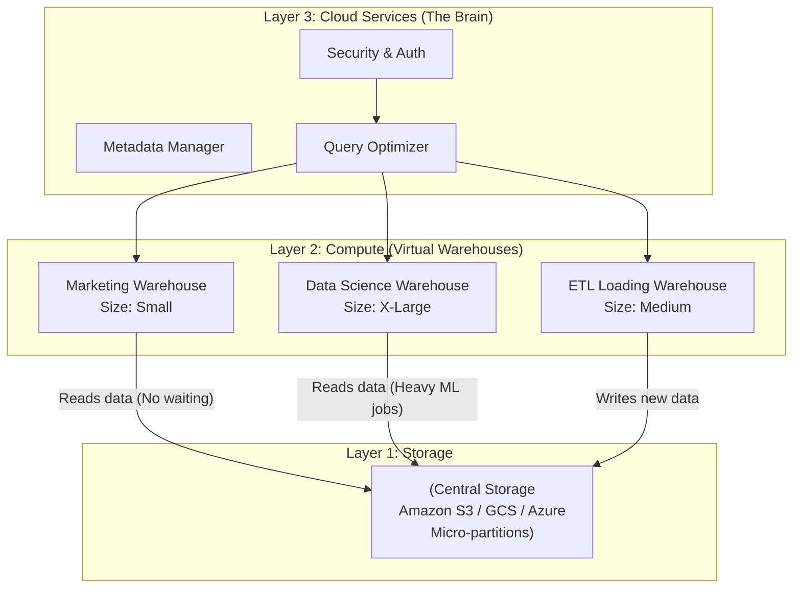

Nếu đã từng làm việc trong các dự án di chuyển dữ liệu lên đám mây (Cloud Migration), chắc chắn bạn không lạ lẫm gì với cái tên **Snowflake**. Từ một tân binh trong thị trường kho dữ liệu đám mây, Snowflake đã nhanh chóng bứt phá để trở thành một trong những nền tảng dữ liệu (Cloud Data Platform) phổ biến và được săn đón nhất toàn cầu. 

Điều gì đã tạo nên sức hút kỳ diệu này cho Snowflake? Hãy cùng tìm hiểu sâu vào kiến trúc và những tính năng độc bản của nền tảng này.

## Snowflake là gì? Nền tảng dữ liệu sinh ra từ đám mây

Không giống như các giải pháp kho dữ liệu truyền thống được bê nguyên bản từ hệ thống máy chủ vật lý cục bộ (On-premises) lên chạy trên máy ảo đám mây, **Snowflake** được thiết kế và xây dựng hoàn toàn mới từ đầu để tận dụng tối đa sức mạnh của điện toán đám mây (Cloud-native). 

Snowflake cung cấp giải pháp Kho dữ liệu ([Data Warehouse](/concepts/data-warehouse/data-warehouse/)), Hồ dữ liệu ([Data Lake](/concepts/data-lake-lakehouse/data-lake/)) và Chia sẻ dữ liệu (Data Exchange) dưới dạng một Dịch vụ phần mềm hoàn chỉnh (SaaS - Software as a Service).

* **Không cần quản trị hạ tầng (Zero-management)**: Người dùng Snowflake không cần bận tâm đến việc cài đặt phần mềm, cấu hình máy chủ, phân bổ dung lượng đĩa hay vá lỗi bảo mật hệ điều hành. Mọi thứ đều được Snowflake tự động xử lý trơn tru ở phía sau.
* **Hoạt động đa đám mây (Cloud Agnostic)**: Đây là một điểm cộng cực lớn giúp Snowflake vượt trội so với các đối thủ. Nó có thể chạy mượt mà trên cả ba ông lớn đám mây: AWS, Google Cloud (GCP) và Microsoft Azure, giúp doanh nghiệp tránh được nguy cơ bị khóa chặt vào một nhà cung cấp dịch vụ duy nhất (Vendor Lock-in).

## Tại sao chúng ta cần Snowflake? Đập tan giới hạn của kiến trúc truyền thống

Để thấy được giá trị của Snowflake, hãy nhìn lại các kho dữ liệu đám mây thế hệ đầu (ví dụ như [Amazon Redshift](/concepts/cloud-data-platform/amazon-redshift/) đời đầu). Các hệ thống này thường gắn chặt năng lực xử lý (Compute - CPU/RAM) và dung lượng lưu trữ (Storage - Ổ cứng) vào một cụm máy chủ cố định (Node).

Kiến trúc cũ này gây ra hai điểm đau rất lớn:
1. **Lãng phí tiền bạc**: Khi bạn hết dung lượng lưu trữ nhưng CPU vẫn đang rảnh rỗi, bạn buộc phải mua thêm Node mới. Điều này vô tình ép bạn phải trả tiền cho năng lực CPU thừa thãi mà không bao giờ dùng tới.
2. **Tranh chấp tài nguyên (Resource Contention)**: Nếu team Data Science đang chạy các thuật toán học máy phức tạp chiếm hết CPU, hệ thống báo cáo (BI Dashboard) của ban giám đốc sẽ lập tức bị đơ và phản hồi chậm chạp.

Snowflake ra đời để giải quyết triệt để hai bài toán này bằng cách tách rời hoàn toàn phần Lưu trữ và Tính toán, cho phép các đội nhóm sử dụng tài nguyên độc lập mà không hề ảnh hưởng đến nhau.

## Kiến trúc 3 lớp: Bí mật đằng sau sự thành công của Snowflake

Trọng tâm thiết kế của Snowflake nằm ở kiến trúc ba lớp tách biệt và được kết nối thông qua mạng lưới hiệu năng cao:


1. **Lớp Lưu trữ Tập trung (Centralized Storage Layer)**: Dữ liệu nạp vào Snowflake sẽ được tự động chia nhỏ thành các tệp tin nén định dạng cột gọi là **Micro-partitions** và lưu trữ trên Cloud Object Storage (như AWS S3, Google [Cloud Storage](/concepts/cloud-data-platform/cloud-storage/), Azure Blob). Lớp này có giá thành lưu trữ cực rẻ và khả năng mở rộng vô hạn.
2. **Lớp Tính toán Đa cụm (Multi-cluster Compute Layer)**: Snowflake sử dụng các cụm máy chủ ảo gọi là **Virtual Warehouses** để xử lý các câu lệnh SQL. Bạn có thể tạo riêng một Virtual Warehouse cho team Marketing (size Small) và một Virtual Warehouse cho team Data Science (size X-Large). Hai cụm máy này cùng nhìn vào một kho dữ liệu lưu trữ trung tâm nhưng chạy trên tài nguyên CPU độc lập, không lo tranh chấp.
3. **Lớp Dịch vụ Đám mây (Cloud Services Layer)**: Được ví như "bộ não" điều khiển toàn bộ hệ thống. Lớp này quản lý các tác vụ như xác thực bảo mật, phân tích tối ưu hóa truy vấn SQL, quản lý siêu dữ liệu (metadata), kiểm soát quyền truy cập và quản lý giao dịch.

## Những tính năng độc bản làm nên tên tuổi Snowflake

* **Tự động Bật/Tắt (Auto-Suspend & Auto-Resume)**: Máy chủ tính toán của Snowflake tính tiền theo giây thực tế sử dụng. Bạn có thể cấu hình: *"Nếu không có truy vấn nào trong vòng 1 phút, hãy tắt máy chủ"*. Khi có người dùng gửi câu lệnh SQL mới, máy chủ sẽ tự khởi động lại trong tích tắc (vài phần trăm giây), giúp tiết kiệm chi phí tối đa.
* **Nhân bản không tốn đĩa (Zero-Copy Cloning)**: Khi bạn muốn sao chép một bảng dữ liệu Production có dung lượng 10TB sang môi trường Dev để chạy thử nghiệm. Thay vì mất nhiều giờ sao chép dữ liệu vật lý và trả gấp đôi tiền lưu trữ, lệnh `CLONE` của Snowflake hoàn thành chỉ trong 1 giây. Nó chỉ tạo ra một con trỏ metadata trỏ vào cùng file vật lý gốc. Mọi thay đổi của bạn trên bản Clone hoàn toàn cô lập và không ảnh hưởng đến dữ liệu thật trên Production.
* **Du hành thời gian ([Time Travel](/concepts/data-lake-lakehouse/time-travel/))**: Nếu ai đó lỡ tay chạy lệnh `DROP TABLE` xóa nhầm dữ liệu quan trọng, bạn không cần phải liên hệ DevOps khôi phục bản backup ngày hôm trước. Snowflake cho phép bạn "quay ngược thời gian" bằng các câu lệnh SQL đơn giản để lấy lại dữ liệu tại một mốc thời gian cụ thể trong vòng tối đa 90 ngày.
* **Chia sẻ dữ liệu an toàn (Secure Data Sharing)**: Bạn có thể chia sẻ trực tiếp các bảng dữ liệu cho đối tác hoặc nhà cung cấp bên ngoài (miễn là họ cũng dùng Snowflake) mà không cần xuất file CSV hay xây dựng API phức tạp. Dữ liệu được chia sẻ trực tiếp theo thời gian thực (real-time) và không bị sao chép ra bản thứ hai.

## Ví dụ thực tế: Cứu nguy dữ liệu bị xóa nhầm bằng Time Travel

Lúc 10:00 sáng, một nhà phân tích chạy nhầm lệnh xóa sạch dữ liệu khách hàng:```sql
DELETE FROM production.customers WHERE status = 'active'; 
```

Thay vì phải hoảng loạn tìm các bản backup từ đêm qua và chấp nhận mất mát dữ liệu phát sinh trong buổi sáng, Data Engineer có thể khôi phục lại bảng dữ liệu về trạng thái trước đó đúng 1 phút (lúc 09:59) cực kỳ nhanh chóng:
```sql
-- Bước 1: Tạo bảng phụ chứa dữ liệu lúc 09:59 sáng
CREATE TABLE customers_restored AS
SELECT * FROM production.customers AT(TIMESTAMP => '2026-06-07 09:59:00 -0700'::timestamp_tz);

-- Bước 2: Đổi vị trí bảng bị lỗi và bảng đã khôi phục
ALTER TABLE production.customers SWAP WITH customers_restored;
```

## Kinh nghiệm xương máu khi vận hành Snowflake

* **FinOps - Kiểm soát chi phí chặt chẽ**: Snowflake tính tiền dựa trên đơn vị nội bộ gọi là **Credit**. Một Virtual Warehouse kích cỡ `X-Large` tiêu thụ credit gấp 16 lần cỡ `X-Small`. Luôn luôn cấu hình công cụ **Resource Monitors** để tự động cảnh báo hoặc ngắt hệ thống khi mức tiêu thụ credit đạt tới ngưỡng giới hạn ngân sách đã thiết lập.
* **Đừng quên bật Auto-Suspend**: Hãy chắc chắn rằng bạn đã cấu hình tính năng tự động tắt máy chủ sau một khoảng thời gian rảnh rỗi (thường nên đặt là 1-2 phút). Nếu quên cấu hình, máy chủ sẽ chạy thông suốt ngày nghỉ cuối tuần và gửi cho bạn một hóa đơn khổng lồ dù không thực hiện tác vụ nào.
* **Không dùng Snowflake cho các tác vụ [OLTP](/concepts/database-storage/oltp/)**: Snowflake được tối ưu hóa cho các truy vấn phân tích (OLAP) theo lô lớn. Nếu bạn cố kết nối backend ứng dụng web vào Snowflake để chạy các lệnh insert/update từng dòng nhỏ lẻ liên tục (single-row inserts), hệ thống sẽ bị chậm và sinh ra hàng triệu tệp tin micro-partition rác làm nghẽn lớp siêu dữ liệu (Metadata).
* **Tin tưởng vào cơ chế tự động của hệ thống**: Đừng tốn thời gian tạo index hay chia phân vùng thủ công (Snowflake không hỗ trợ index truyền thống). Hệ thống tự cắt nhỏ dữ liệu thành các file micro-partition và tự lưu giá trị Min/Max của các cột để tối ưu hóa truy vấn (Partition Pruning).

| Tiêu chí | Kho dữ liệu truyền thống (Redshift cũ / On-block) | Snowflake Data Cloud |
| :--- | :--- | :--- |
| **Kiến trúc** | Tích hợp Compute và Storage trên cùng cụm server | Tách biệt hoàn toàn Compute và Storage |
| **Co giãn (Scaling)** | Khó co giãn, mất thời gian cấu hình node | Tự động co giãn tức thì, bật/tắt tự động |
| **Tranh chấp tài nguyên** | Thường xuyên bị chậm khi nhiều team cùng chạy | Tuyệt đối không, nhờ Virtual Warehouses độc lập |
| **Quản trị** | Yêu cầu đội ngũ DBA vá lỗi, dọn dẹp, cấu hình index | Dịch vụ SaaS hoàn chỉnh, không cần bảo trì hạ tầng |

## Khái niệm liên quan

* [Google BigQuery](/concepts/cloud-data-platform/google-bigquery/): Đối thủ cạnh tranh trực tiếp của Snowflake ở phân khúc Serverless DWH.
* [OLAP vs OLTP](/concepts/database-storage/olap/): Phân biệt hệ thống phân tích và hệ thống giao dịch.
* **Data [Lakehouse](/concepts/data-lake-lakehouse/lakehouse/)**: Kiến trúc kết hợp linh hoạt giữa Data Lake và Data Warehouse.

## Trọng tâm ôn luyện phỏng vấn

### 1. Kiến trúc tách rời (Decoupled Compute and Storage) của Snowflake mang lại lợi ích gì so với kiến trúc Share-Nothing truyền thống?
* **Gợi ý trả lời**: Sự khác biệt lớn nhất là khả năng co giãn linh hoạt và kiểm soát chi phí. Trong kiến trúc Share-Nothing truyền thống, CPU và ổ đĩa được gắn chặt với nhau. Khi cần tăng lưu trữ, ta phải trả thêm tiền cho cả năng lực tính toán không dùng tới và ngược lại. 
  Snowflake giải quyết bài toán này bằng cách lưu trữ dữ liệu tập trung ở một lớp đĩa đám mây giá rẻ, đồng thời cho phép tạo ra nhiều cụm máy tính ảo (Virtual Warehouses) độc lập để truy vấn. Điều này giúp loại bỏ hoàn toàn sự tranh chấp tài nguyên giữa các bộ phận (ví dụ team Marketing chạy báo cáo không làm chậm team Data Science chạy học máy) và tối ưu hóa chi phí nhờ khả năng tự động tắt khi rảnh rỗi.

### 2. Micro-partition trong Snowflake là gì? Tại sao Snowflake không cần sử dụng Index?
* **Gợi ý trả lời**: Khi dữ liệu được nạp vào Snowflake, hệ thống sẽ tự động phân tách dữ liệu thành các tệp tin nén định dạng cột siêu nhỏ gọi là Micro-partition (kích thước từ 50MB đến 500MB). 
  Tại lớp Cloud Services, Snowflake tự động lưu trữ và quản lý metadata của tất cả các file này (như giá trị tối thiểu, tối đa - Min/Max của từng cột). Khi người dùng thực hiện một câu lệnh truy vấn có bộ lọc (ví dụ `WHERE age > 30`), lớp Services sẽ quét nhanh metadata và định vị chính xác những file nào chứa giá trị cần tìm, đồng thời bỏ qua (pruning) các file còn lại mà không cần quét toàn bộ. Cơ chế này hoạt động cực kỳ nhanh và hiệu quả, giúp Snowflake không cần đến hệ thống index thủ công rườm rà như cơ sở dữ liệu truyền thống.

## Tài liệu tham khảo

1. [Snowflake Architecture & Key Concepts](https://docs.snowflake.com/en/user-guide/intro-key-concepts) - Official overview of Snowflake's unique three-layer architecture and cloud ecosystem.
2. [The Snowflake Elastic Data Warehouse](https://doi.org/10.1145/2882903.2903741) - Seminal research paper published at ACM SIGMOD 2016 detailing the design and internals of Snowflake.
3. [Snowflake Micro-partitions & Data Clustering](https://docs.snowflake.com/en/user-guide/tables-micro-partitions) - Technical documentation explaining how Snowflake automatically partitions and clusters data.
4. [Snowflake Zero-Copy Cloning Guide](https://docs.snowflake.com/en/user-guide/object-clone) - Official guide on cloning databases, schemas, and tables without duplicating storage.
5. [The Data Warehouse Toolkit](https://www.oreilly.com/library/view/the-data-warehouse/9781118530801/) - Ralph Kimball's classic book on [dimensional modeling](/concepts/data-warehouse/dimensional-modeling/) techniques and best practices.

## English Summary

Snowflake Data Cloud is a globally prominent, cloud-native Enterprise Data Warehouse (EDW) delivered as a SaaS platform across AWS, Azure, and Google Cloud. Its revolutionary three-layer architecture permanently separates centralized storage (relying on proprietary micro-partitions) from scalable compute (Virtual Warehouses), and is managed by a central Cloud Services layer. This design eradicates resource contention, enabling different teams to run heavy queries simultaneously without affecting each other. With zero management overhead and powerful features like Time Travel, Zero-copy Cloning, and Secure Data Sharing, Snowflake dramatically simplifies [data engineering](/concepts/foundation/data-engineering/), though its dynamic, credit-based pricing model requires rigorous FinOps monitoring (like auto-suspend and resource limits) to prevent runaway costs.