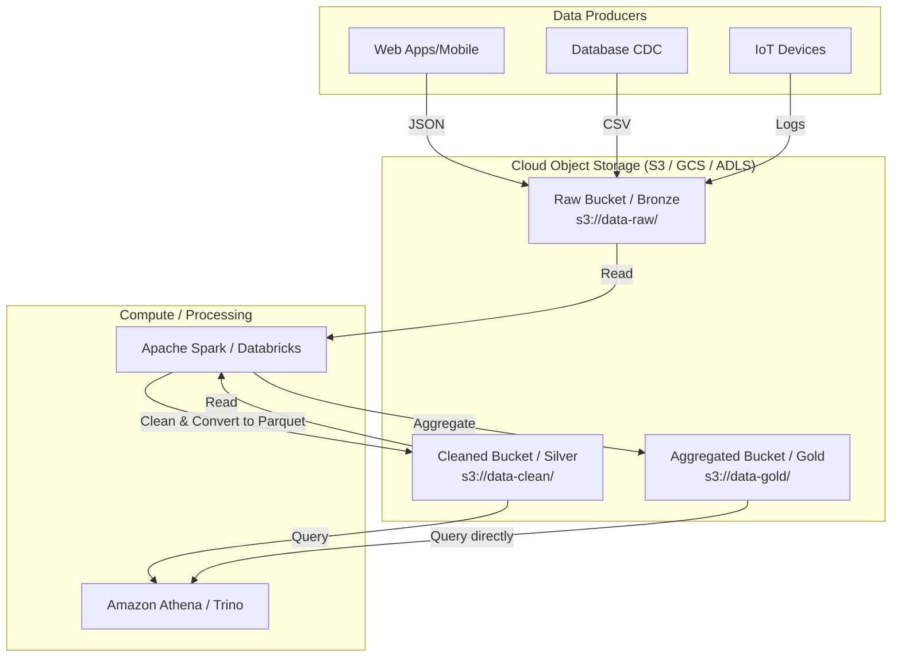

# Lưu trữ đối tượng trên đám mây - Cloud Object Storage

## Summary

Lưu trữ đối tượng trên đám mây (Cloud Object Storage) là một kiến trúc lưu trữ dữ liệu phân tán, trong đó dữ liệu được quản lý dưới dạng các "đối tượng" (objects) riêng biệt thay vì quản lý theo phân cấp thư mục (File storage) hay dạng khối (Block storage). Được cung cấp rộng rãi qua các dịch vụ như Amazon S3, Google Cloud Storage (GCS) hay Azure Blob Storage, đây là xương sống lưu trữ vô hạn, siêu rẻ và là nền tảng hình thành nên các kiến trúc Data Lake và Data Lakehouse hiện đại.

---

## Definition

Trong **Object Storage**, mỗi phần dữ liệu (bức ảnh, video, file CSV, file Parquet) được đóng gói thành một đối tượng độc lập. Một Object hoàn chỉnh bao gồm 3 thành phần không thể tách rời:
1. **Bản thân Dữ liệu (Data)**: Nội dung thực sự của tệp.
2. **Metadata (Siêu dữ liệu)**: Thông tin mô tả rất phong phú có thể tùy chỉnh (ví dụ: người tạo, quyền truy cập, loại dữ liệu, nhãn dự án).
3. **Định danh duy nhất toàn cầu (Unique Identifier / Key)**: Một chuỗi ID hoặc đường dẫn duy nhất (như URL) để tìm kiếm đối tượng đó trong vùng không gian lưu trữ (bucket), không phụ thuộc vào vị trí vật lý của máy chủ.

*Cloud* Object Storage nghĩa là hạ tầng phân tán này được quản lý hoàn toàn bởi các nhà cung cấp đám mây (AWS, GCP, Azure). Bạn chỉ cần trả tiền theo số lượng Gigabytes lưu trữ mà không cần mua hay cắm ổ cứng vật lý.

---

## Why it exists

Trước kỷ nguyên Cloud, hệ thống File Storage truyền thống (như NTFS trên Windows, NAS) tổ chức dữ liệu theo cây thư mục cấp bậc. Khi lượng dữ liệu phình to lên hàng Petabytes (Big Data):
1. **Nút thắt cổ chai (Bottleneck)**: Hệ thống cây thư mục phải quét qua hàng triệu nhánh để tìm file, làm tốc độ suy giảm nghiêm trọng.
2. **Khó mở rộng (Scalability limits)**: Khi một ổ cứng vật lý (Block storage) đầy, bạn phải sao chép toàn bộ sang ổ cứng to hơn, rất tốn kém và gián đoạn.
3. **Chi phí quá đắt đỏ**: Lưu trữ một lượng khổng lồ dữ liệu "rác" (logs, raw data) trên các hệ thống SAN (Storage Area Network) truyền thống là bài toán phá sản.

Object Storage ra đời để giải quyết những vấn đề này bằng một **không gian phẳng (flat namespace)**. Mọi thứ vứt vào một cái xô (bucket) và được định vị nhanh chóng bằng ID duy nhất, mang lại khả năng mở rộng vô tận với giá chỉ khoảng `$0.02 / GB / tháng`.

---

## Core idea

* **Không gian lưu trữ phẳng (Flat Address Space)**: Không có khái niệm thư mục (folder) vật lý thực sự. Khái niệm thư mục (như `s3://my-bucket/logs/2026/file.txt`) thực chất chỉ là tên ID (`Key`) được gắn thêm dấu gạch chéo `/` để hệ thống giao diện UI (Console) hiển thị cho con người dễ hiểu.
* **RESTful API**: Mọi thao tác đọc, ghi, xóa đối tượng đều được thực hiện thông qua các giao thức web tiêu chuẩn (HTTP GET, PUT, DELETE). Điều này giúp bất kỳ ứng dụng nào kết nối internet đều tương tác được.
* **Độ bền dữ liệu cực cao (Durability)**: Các Cloud Provider mặc định nhân bản (replicate) đối tượng của bạn ra ít nhất 3 trung tâm dữ liệu vật lý khác nhau (Availability Zones). Ví dụ AWS S3 cam kết độ bền `99.999999999%` (11 số 9) - nghĩa là bạn lưu 10 triệu file, thì 10.000 năm mới có thể mất ngẫu nhiên 1 file.

---

## How it works

Hành trình của một tệp (Object) đi vào hệ thống:
1. **Creation (Tạo Bucket)**: Bạn tạo một "Bucket" (Thùng chứa) ở một khu vực địa lý cụ thể (Region, ví dụ: `ap-southeast-1`). Tên bucket phải là duy nhất trên toàn thế giới.
2. **Upload (Đẩy dữ liệu)**: Ứng dụng gọi API `PUT` đẩy file lên Bucket. Nếu file quá lớn (như file video 50GB), Cloud Storage dùng cơ chế *Multipart Upload* để chia nhỏ file ra đẩy song song, sau đó ghép lại ở máy chủ.
3. **Immutability (Bất biến)**: Sau khi tạo xong, Object không thể bị "sửa chữa" (append) một phần. Nếu bạn muốn thay đổi một chữ trong file 1GB, bạn phải upload đè (overwrite) một file mới hoàn toàn 1GB (hoặc tạo version mới).
4. **Retrieval (Truy xuất)**: Hệ thống phân tích Spark / Trino gọi API `GET` với đúng Key ID để tải dữ liệu xuống bộ nhớ và xử lý.

---

## Architecture / Flow (Data Lake context)



---

## Practical example

Mô phỏng thao tác với Amazon S3 qua giao diện dòng lệnh (AWS CLI) trong Data Engineering:

**1. Đẩy file thô lên Data Lake (Raw Zone)**
```bash
aws s3 cp sales_2026_05.csv s3://my-company-datalake/raw/sales/year=2026/month=05/
```
*(Lưu ý: `/raw/sales/year=2026/` không phải là thư mục vật lý, nó là một phần của chuỗi định danh Key)*

**2. Gắn Metadata bảo mật (Tagging)**
Bạn có thể gắn thẻ (Tag) để hệ thống Access Control (ABAC) phân quyền tự động.
```bash
aws s3api put-object-tagging \
    --bucket my-company-datalake \
    --key raw/sales/year=2026/month=05/sales_2026_05.csv \
    --tagging '{"TagSet": [{"Key": "security", "Value": "confidential"}]}'
```

**3. Phân tích trực tiếp trên Object Storage bằng SQL (như Amazon Athena)**
Bạn không cần nạp file CSV này vào Database. Athena sẽ quét trực tiếp file trên S3:
```sql
SELECT sum(revenue) 
FROM s3_sales_table 
WHERE year = 2026 AND month = 05;
```

---

## Best practices

* **Phân vùng dữ liệu logic (Partitioning)**: Hãy thiết kế cấu trúc tiền tố (prefix/key) một cách thông minh như `s3://bucket/data/year=YYYY/month=MM/day=DD/`. Khi truy vấn, Engine (như Spark/Athena) sẽ cắt tỉa (Partition Pruning), chỉ đọc những object ở folder thỏa mãn điều kiện thời gian, tiết kiệm tới 99% chi phí đọc.
* **Tối ưu kích thước file (File Sizing)**: Object Storage ghét "hàng triệu file nhỏ" (Kb scale), vì mỗi lệnh gọi API `GET` đều tốn thời gian và tiền bạc (overhead). Hãy gộp (compact) chúng thành các file có kích thước khoảng `128MB - 1GB` bằng định dạng Parquet/ORC để tối ưu I/O.
* **Quản lý vòng đời lưu trữ (Lifecycle Policies)**: Thiết lập quy tắc tự động chuyển dữ liệu. Ví dụ: Dữ liệu Raw sau 30 ngày tự động chuyển xuống lớp lưu trữ lạnh (Cold Storage như S3 Glacier) để giảm 80% chi phí lưu trữ, và xóa hẳn sau 3 năm.

---

## Common mistakes

* **Cố gắng dùng Object Storage như một ổ đĩa truyền thống**: Bạn không thể cài hệ điều hành (Windows/Linux) hay chạy một Database trực tiếp (như MySQL engine) trên S3. S3 không hỗ trợ tốc độ thao tác đọc/ghi theo từng byte (block-level I/O) cực nhanh mà Databases cần. (Với việc đó, phải dùng Block Storage như AWS EBS).
* **Quên bật Versioning (Lưu phiên bản)**: Xóa nhầm file trên S3 là mất vĩnh viễn (nó không có thùng rác Recycle Bin). Bật Versioning giúp file bị ghi đè hay xóa vẫn giữ lại bản sao cũ có thể phục hồi.
* **Lộ lọt dữ liệu Public**: Cấu hình Bucket nhầm thành "Public Read". Đây là nguyên nhân của hàng ngàn vụ lộ dữ liệu lớn (Data Leak) trên thế giới khi bất kỳ ai có đường link cũng tải được file về.

---

## Trade-offs

### Ưu điểm
* **Rẻ và Vô hạn**: Lưu trữ Petabytes dữ liệu với chi phí cực thấp, không cần quan tâm dung lượng ổ đĩa.
* **Kiến trúc Tách rời (Decoupled Compute & Storage)**: Lưu trữ và Tính toán độc lập. Bạn tắt cụm máy tính Spark (tiết kiệm tiền compute), dữ liệu vẫn an toàn nằm trên S3. Khi nào cần thì bật máy tính lên nối vào S3 để phân tích.

### Nhược điểm
* **Độ trễ cao (Latency)**: Mỗi lần truy xuất (GET) thường mất vài chục phần nghìn giây (milliseconds) vì phải đi qua mạng internet/HTTP. Chậm hơn nhiều so với việc đọc trực tiếp từ ổ cứng SSD cục bộ (microseconds).
* **Tính Nhất quán (Consistency limitations)**: Trước đây (dù hiện tại AWS S3 đã khắc phục), Object Storage theo mô hình "Eventual Consistency". Nếu bạn ghi đè 1 file và đọc nó ngay lập tức một giây sau, bạn có thể vẫn nhận được phiên bản cũ của file đó.

---

## When to use

* Nền tảng (Storage Layer) cho mọi hệ thống Data Lake / Data Lakehouse hiện đại.
* Nơi hạ cánh lưu trữ dữ liệu thô (Landing Zone) từ các nguồn Ingestion.
* Lưu trữ Backup, Archive lịch sử lâu dài.
* Lưu trữ hình ảnh, video, tài liệu tĩnh phục vụ ứng dụng Web/Mobile.

## When not to use

* Lưu trữ cho các ứng dụng giao dịch yêu cầu tốc độ cập nhật mili-giây (OLTP Databases, ERP, Hệ thống giỏ hàng).
* Lưu trữ cho máy ảo (Virtual Machines OS disks).

---

## Related concepts

* [Data Lake](/concepts/data-lake)
* Định dạng dữ liệu cột - Columnar Data Formats (Parquet)
* [Kiến trúc Serverless Data](/concepts/serverless-data)

---

## Interview questions

### 1. Phân biệt Object Storage, File Storage và Block Storage?
* **Người phỏng vấn muốn kiểm tra**: Kiến thức nền tảng về cơ sở hạ tầng đám mây.
* **Gợi ý trả lời**:
  * *Block Storage* (như AWS EBS, ổ cứng SSD): Chia dữ liệu thành các khối cấp thấp, gắn trực tiếp vào máy chủ. Tốc độ nhanh nhất, phù hợp chạy Database engine hoặc OS.
  * *File Storage* (như AWS EFS, NAS): Quản lý theo cấu trúc cây thư mục, hỗ trợ file locks, nhiều máy chủ có thể mount và đọc/ghi đồng thời như mạng nội bộ.
  * *Object Storage* (như AWS S3): Quản lý dữ liệu bằng ID duy nhất trong không gian phẳng. Không thể ghi đè một phần file (phải upload lại toàn bộ). Phù hợp nhất cho Big Data, Data Lake vì siêu rẻ và mở rộng vô hạn.

### 2. Tại sao "Triệu file nhỏ" (Small Files Problem) lại là một thảm họa đối với Cloud Object Storage khi phân tích bằng Spark/Hadoop?
* **Người phỏng vấn muốn kiểm tra**: Kinh nghiệm tối ưu hóa hiệu năng xử lý Big Data.
* **Gợi ý trả lời**: Object Storage truy xuất qua giao thức HTTP (REST API). Mỗi lệnh gọi API đều mang một độ trễ kết nối mạng (Overhead). Nếu Spark phải đọc 1 triệu file 10KB, hệ thống dành 99% thời gian để mở/đóng kết nối HTTP và lấy metadata thay vì thực sự đọc dữ liệu, làm hiệu năng chậm kinh khủng và tốn chi phí API call (AWS tính phí theo số lượng yêu cầu GET). Giải pháp là dùng một tác vụ gộp (Compaction) chúng thành các file Parquet kích thước 128MB.

### 3. "Decoupling Storage and Compute" (Tách rời Lưu trữ và Tính toán) mang lại lợi ích gì cho Data Engineering hiện đại?
* **Người phỏng vấn muốn kiểm tra**: Tư duy kiến trúc hệ thống (Architecture mindset).
* **Gợi ý trả lời**: Trong các hệ thống cũ (như Hadoop HDFS cục bộ), máy chủ vừa lưu dữ liệu vừa xử lý dữ liệu. Nếu bạn cần thêm dung lượng lưu trữ, bạn phải mua nguyên một máy chủ đắt tiền (gồm cả CPU và RAM) gây lãng phí. Kiến trúc Object Storage cho phép tách rời hoàn toàn: Lưu trữ trên S3 rẻ tiền và vô hạn; Tính toán (Compute) dùng Spark/Trino theo giờ, bật lên khi chạy, chạy xong thì tắt để không mất tiền. Điều này tối ưu hóa chi phí và tài nguyên linh hoạt nhất (Elasticity).

---

## References

1. **Amazon S3 Documentation** - Kiến trúc và khái niệm cơ bản về Object Storage.
2. **Designing Data-Intensive Applications** - Martin Kleppmann. (Lý thuyết về hệ thống phân tán).
3. **The Data Lakehouse Architecture** - Bài báo của Databricks giải thích vai trò của Object Storage làm nền tảng.

---

## English summary

Cloud Object Storage (e.g., AWS S3, Google Cloud Storage, Azure Blob Storage) is a distributed architecture that manages data as discrete "objects" (containing data, rich metadata, and a unique global identifier/URI) within a flat namespace, abandoning the hierarchical directory tree of traditional file systems. It offers practically infinite scalability, supreme durability (11 nines), and low cost via RESTful APIs. It is fundamentally immutable—objects must be fully overwritten rather than partially modified. By allowing the complete decoupling of storage capacity from compute power, Cloud Object Storage serves as the foundational, highly cost-effective storage layer for modern Data Lakes and Data Lakehouses, though it requires specific best practices like partitioning and file compaction to overcome latency and API call overheads.
