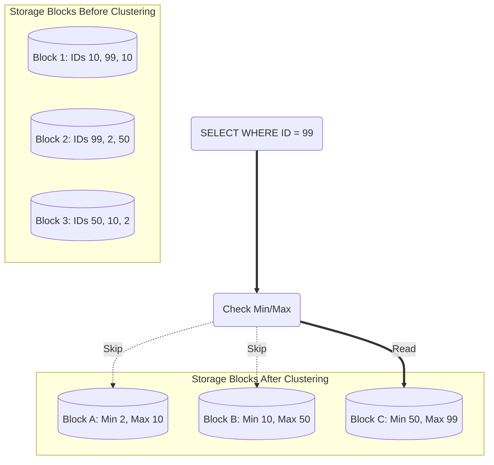

# Phân cụm Dữ liệu - Clustering

## Summary

Phân cụm dữ liệu (Clustering) là kỹ thuật tổ chức lại dữ liệu một cách vật lý trên ổ đĩa sao cho các bản ghi có giá trị tương đồng (theo một hoặc nhiều cột được chỉ định) sẽ nằm sát cạnh nhau trong cùng một khối dữ liệu (block/file). Kỹ thuật này đặc biệt hữu ích trên các nền tảng Data Warehouse hiện đại (như BigQuery, Snowflake) để tăng tốc độ cho các câu lệnh có mệnh đề `WHERE` lọc nhiều cột cùng lúc, thường được sử dụng như một biện pháp bổ trợ hoàn hảo cho Partitioning.

---

## Definition

**Clustering** (hay Clustered Index, Data Sorting) là quá trình sắp xếp dữ liệu gốc ở mức độ vi mô (micro-level) bên trong các tệp tin lưu trữ. 
Khi bạn cấu hình một bảng được "Cluster theo cột `customer_id`", hệ thống sẽ đảm bảo rằng toàn bộ các giao dịch của người dùng có ID là 100 sẽ được ghi vào cùng một block (hoặc các block liền kề) trên đĩa cứng, thay vì nằm rải rác ngẫu nhiên ở hàng chục file khác nhau.

---

## Why it exists

Mặc dù Partitioning (Phân vùng) rất tốt để lọc dữ liệu theo một chiều (như Thời gian), nhưng nó có điểm yếu:
Nếu bạn phân vùng dữ liệu theo Ngày, nhưng câu truy vấn lại yêu cầu: *"Tìm tất cả giao dịch của khách hàng VIP `customer_id = 999` trong năm nay"*.
Hệ thống sẽ dùng Partition Pruning để giới hạn số file của năm nay. Nhưng bên trong các file đó, giao dịch của người số `999` nằm rải rác ở khắp mọi nơi. Ổ đĩa sẽ phải đọc (scan) toàn bộ khối dữ liệu khổng lồ của năm nay chỉ để nhặt ra vài dòng của khách hàng `999`.

Clustering sinh ra để giải quyết vấn đề đó: Bằng cách gom cụm dữ liệu của `customer_id = 999` nằm chung một chỗ, hệ thống chỉ cần đọc đúng một đoạn ngắn trên ổ đĩa.

---

## Core idea

**Sự khác biệt giữa Partitioning và Clustering**:
* **Partitioning** là chặt dữ liệu thành các tệp tin/thư mục hoàn toàn tách biệt (Macro-level). Dùng cho cột có số lượng giá trị (cardinality) thấp như Năm, Tháng.
* **Clustering** là sắp xếp trật tự các dòng dữ liệu BÊN TRONG các tệp tin đó (Micro-level). Dùng cho cột có số lượng giá trị (cardinality) cao như `user_id`, `product_id`.

Hệ thống ghi nhận lại giá trị Nhỏ nhất (Min) và Lớn nhất (Max) của cột Clustering trong từng block dữ liệu. Khi truy vấn tìm `customer_id = 999`, hệ thống kiểm tra Metadata, nếu block A có dải khách hàng từ `100 - 500` -> Nó bỏ qua block A ngay lập tức mà không cần đọc nội dung. Cơ chế này gọi là **Block Pruning** hay **Zone Map filtering**.

---

## How it works

Dữ liệu thô trước khi Clustering (Sắp xếp theo thời gian đến):
* Block 1: `(User 10), (User 99), (User 10)`
* Block 2: `(User 99), (User 2), (User 50)`
* Block 3: `(User 50), (User 10), (User 2)`
Để tìm `User 10`, đĩa phải đọc cả 3 Blocks.

Dữ liệu sau khi Clustering (Sắp xếp theo User ID):
* Block 1: `(User 2), (User 2), (User 10)` -> Chứa ID từ 2 đến 10
* Block 2: `(User 10), (User 10), (User 50)` -> Chứa ID từ 10 đến 50
* Block 3: `(User 50), (User 99), (User 99)` -> Chứa ID từ 50 đến 99
Để tìm `User 99`, hệ thống chỉ cần đọc Block 3.

---

## Architecture / Flow



---

## Practical example

Trên Google BigQuery, bạn thường kết hợp cả hai kỹ thuật trong một câu lệnh tạo bảng:

```sql
CREATE TABLE sales_data.transactions
(
  transaction_id STRING,
  customer_id STRING,
  product_category STRING,
  amount FLOAT64,
  transaction_date DATE
)
-- 1. Chặt dữ liệu theo Tháng (Macro)
PARTITION BY DATE_TRUNC(transaction_date, MONTH)
-- 2. Gom nhóm các giao dịch của cùng khách hàng & sản phẩm sát nhau (Micro)
CLUSTER BY customer_id, product_category;
```

Khi Data Analyst chạy:
`SELECT SUM(amount) FROM sales_data.transactions WHERE transaction_date = '2026-06-07' AND customer_id = 'CUST-123';`
BigQuery sẽ:
1. Nhảy vào thư mục của Tháng 6/2026 (Nhờ Partitioning).
2. Quét Metadata để tìm đúng Block chứa khách hàng `CUST-123` (Nhờ Clustering).
Truy vấn thay vì tốn vài chục GB, nay chỉ quét vài Megabytes.

---

## Best practices

* **Thứ tự của các cột Clustering rất quan trọng**: Nếu bạn Cluster theo `(A, B, C)`, nó sẽ ưu tiên gom nhóm theo A trước, rồi B, rồi C. Nếu câu query chỉ lọc theo C (không có A và B), Clustering gần như vô tác dụng. Hãy đặt cột thường bị `WHERE` nhất ở vị trí đầu tiên.
* **Đừng Cluster trên bảng quá nhỏ**: Nếu bảng dưới 1 GB, hệ thống có thể đọc toàn bảng trên RAM trong nháy mắt. Chi phí duy trì Clustering còn lớn hơn lợi ích đem lại.
* **Bảo trì thường xuyên**: Khi dữ liệu mới liên tục được chèn vào (INSERT), cấu trúc Cluster bị phân mảnh (Fragmented). Các Cloud DWH hiện đại thường tự động chạy quy trình "Auto-reclustering" ngầm để sắp xếp lại, nhưng tốn chi phí tính toán (Compute cost).

---

## Common mistakes

* **Chọn cột có Cardinality thấp (như Giới tính) để Cluster**: Gom nam ra nam, nữ ra nữ. Sau đó query lọc theo Nữ. Hệ thống vẫn phải đọc 50% khối lượng bảng. Clustering trong trường hợp này không mang lại lợi ích giảm khối lượng quét.
* **Hiểu lầm với Partitioning**: Dùng cột `user_id` (có hàng triệu ID khác nhau) để làm Partition Key. Kết quả: Tạo ra hàng triệu thư mục con trên S3, làm hệ thống sụp đổ vì Metadata quá tải (Overhead). `user_id` chỉ được dùng cho Clustering!

---

## Trade-offs

### Ưu điểm
* Giúp tối ưu hóa (Pruning) trên nhiều cột cùng lúc (Partitioning thường chỉ cho phép 1 cột).
* Khắc phục điểm yếu giới hạn số lượng phân vùng. Clustering có thể chạy trơn tru trên cột có hàng tỷ giá trị duy nhất.
* Cải thiện tỷ lệ nén dữ liệu rất mạnh trong Columnar Storage vì các giá trị giống nhau nằm cạnh nhau (Tối ưu Run-Length Encoding).

### Nhược điểm
* **Chi phí Ghi (Write Cost)**: Hệ thống phải liên tục tiêu tốn CPU/RAM ở chế độ nền (background) để xào nấu, sắp xếp lại dữ liệu mỗi khi có dữ liệu mới đổ vào (Re-clustering).

---

## When to use

* Sử dụng trên các bảng Fact khổng lồ trong Data Warehouse có nhiều cột thường xuyên được dùng để lọc (`WHERE`, `JOIN`).
* Khi một cột lọc (như ID thiết bị) có quá nhiều giá trị khác biệt, không thể dùng làm Partition Key.

## When not to use

* Với những bảng mà ứng dụng chỉ luôn quét tuần tự toàn bảng không có mệnh đề lọc (Full scan aggregations).
* Bảng thường xuyên bị UPDATE (Sửa đổi giá trị của chính cột đang dùng để Cluster).

---

## Related concepts

* [Partitioning](/concepts/partitioning)
* [Columnar Storage](/concepts/columnar-storage)

---

## Interview questions

### 1. Phân biệt rõ ràng giữa Partitioning và Clustering trong Data Warehouse?
* **Gợi ý trả lời**: 
  * **Cấp độ**: Partitioning chia cắt dữ liệu ở mức vật lý (tạo ra các thư mục riêng biệt). Clustering sắp xếp dữ liệu ở mức block bên trong một file/partition.
  * **Lựa chọn cột**: Partitioning dùng cho cột có Cardinality thấp/trung bình (như Ngày, Tháng, Khu vực) để tránh tạo quá nhiều tệp. Clustering dùng cho cột có Cardinality cao (như Customer ID, Email).
  * **Chức năng**: Cả hai đều dùng để Pruning (tỉa bớt việc quét đĩa cứng). Thường được kết hợp: Cắt bảng theo Ngày (Partition), bên trong Ngày thì sắp xếp theo ID (Cluster).

### 2. Tại sao Clustering lại giúp nén dữ liệu Columnar tốt hơn?
* **Gợi ý trả lời**: Lưu trữ dạng cột (Columnar storage) sử dụng thuật toán Run-Length Encoding (RLE) để nén các giá trị giống nhau nằm cạnh nhau (Ví dụ: `A, A, A, B, B` nén thành `3A, 2B`). Khi dữ liệu được Clustering, các bản ghi có chung thuộc tính sẽ bị ép nằm sát vào nhau. Điều này tạo ra chuỗi giá trị lặp lại dài nhất có thể trong cột đó, giúp tỷ lệ nén (Compression ratio) tăng vọt, giảm mạnh dung lượng ổ đĩa.

---

## References

1. **Google Cloud BigQuery Documentation** - Clustered tables.
2. **Snowflake Documentation** - Micro-partitions and Data Clustering.

---

## English summary

Clustering (or Data Sorting) is the technique of physically organizing data within storage blocks so that records with similar values (based on defined cluster keys) are stored adjacently. While Partitioning separates data into distinct folders (macro-level, ideal for dates), Clustering orders data within those partitions (micro-level, ideal for high-cardinality keys like `user_id`). By keeping metadata (Min/Max values) of each block, the engine can perform Block Pruning to skip irrelevant blocks during query execution, significantly speeding up complex filtering and enhancing columnar data compression.
