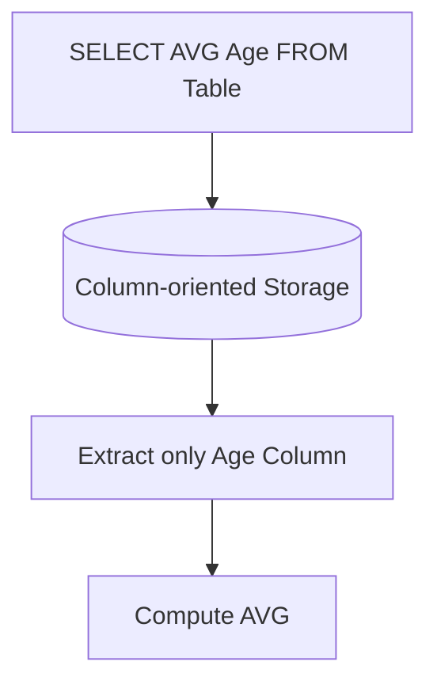

# Lưu trữ dạng Cột - Columnar Storage

Nếu bạn từng trầm trồ khi thấy một truy vấn SQL quét qua hàng tỷ dòng dữ liệu trên Google BigQuery hay Snowflake trả về kết quả chỉ trong vài giây, bạn đang chứng kiến sức mạnh của **Columnar Storage (Lưu trữ dạng cột)**. Đây chính là "vũ khí bí mật" định hình nên tốc độ kinh ngạc của các hệ thống phân tích dữ liệu lớn (OLAP) và các định dạng tệp tin tối ưu như Apache Parquet.

## Columnar Storage: Khởi nguồn của tốc độ truy vấn phân tích kinh ngạc

Trong các cơ sở dữ liệu truyền thống (Row-oriented Database như MySQL hay PostgreSQL), dữ liệu được lưu trữ vật lý trên đĩa theo từng hàng (dòng) liên tiếp. Điều này có nghĩa là nếu một bảng có 100 cột, toàn bộ 100 cột của hàng thứ nhất sẽ được ghi trước, rồi mới đến hàng thứ hai, thứ ba. 

Ngược lại, **Columnar Storage** đảo ngược cách tiếp cận này hoàn toàn. Nó gom tất cả các giá trị của một cột và lưu trữ chúng sát cạnh nhau trên đĩa cứng. Nhờ cách sắp đặt này, nếu câu truy vấn của bạn chỉ cần tính tổng doanh thu từ cột `Doanh_thu`, ổ đĩa chỉ cần đọc chính xác phân đoạn chứa cột `Doanh_thu` và bỏ qua hoàn toàn các phân đoạn chứa các cột thông tin không liên quan khác như `Ten_khach_hang` hay `Dia_chi`.

## Sự lãng phí âm thầm của lưu trữ dạng dòng truyền thống

Trong thế giới phân tích (Analytics), các bảng dữ liệu `(Fact tables)` thường được thiết kế rất rộng, chứa hàng trăm cột để lưu lại mọi góc độ thông tin. Tuy nhiên, các báo cáo kinh doanh thông thường chỉ quan tâm đến một vài chỉ số cụ thể (ví dụ: ngày bán, nhóm sản phẩm, doanh số) để tính toán các phép toán gộp như `SUM`, `AVG` hay `COUNT`.

Nếu chúng ta tiếp tục sử dụng hệ thống lưu trữ dạng dòng, ổ đĩa sẽ phải đọc lên toàn bộ bảng dữ liệu lớn, sau đó hệ thống mới lọc lấy các cột cần thiết trong bộ nhớ. Điều này đồng nghĩa với việc bạn đang lãng phí đến 90-95% tài nguyên đọc ghi ổ đĩa `(I/O)` cho những dữ liệu thừa thãi. Columnar Storage sinh ra để giải quyết triệt để nút thắt cổ chai lãng phí này.

## Khám phá cơ chế hoạt động bên dưới lớp đĩa

Hãy cùng so sánh cách lưu trữ vật lý của hai phương pháp trên đĩa cứng thông qua một ví dụ trực quan.

**Bảng dữ liệu logic của chúng ta:**

| ID | Name  | Age | City  |
|----|-------|-----|-------|
| 1  | Alice | 25  | Hanoi |
| 2  | Bob   | 25  | HCM   |
| 3  | Carol | 30  | Hanoi |

**Cách lưu trữ dạng Dòng (Row-based):**
Dữ liệu trên đĩa sẽ được ghi tuần tự từng bản ghi:
`1,Alice,25,Hanoi; 2,Bob,25,HCM; 3,Carol,30,Hanoi;`

**Cách lưu trữ dạng Cột (Column-based):**
Dữ liệu trên đĩa được chia tách thành các khối/tệp riêng biệt cho từng cột:
* Khối ID: `1,2,3`
* Khối Name: `Alice,Bob,Carol`
* Khối Age: `25,25,30` (có thể nén gọn thành: `(25, 2 lần), (30, 1 lần)`)
* Khối City: `Hanoi,HCM,Hanoi`

Khi bạn chạy câu lệnh `SELECT SUM(Age) FROM table`, hệ thống sẽ bỏ qua hoàn toàn các khối ID, Name và City. Nó chỉ chạm đúng vào "Khối Age" để đọc dữ liệu và tính toán.

## Sơ đồ hóa luồng truy xuất dữ liệu

Mô hình đơn giản dưới đây mô tả cách hệ thống tối ưu hóa đường đi của dữ liệu khi chỉ lọc lấy cột cần thiết:



## Sức mạnh của nén dữ liệu và ví dụ thực tế

Vì tất cả dữ liệu trong một cột đều có chung một kiểu dữ liệu (như toàn bộ là số, toàn bộ là chuỗi văn bản) và thường có nhiều giá trị lặp đi lặp lại, hệ thống có thể áp dụng các kỹ thuật nén cực kỳ hiệu quả như **Dictionary Encoding (Nén từ điển)** hay **Run-Length Encoding (RLE)**.

Hãy tưởng tượng một cột chứa thông tin Thành phố của 1 triệu khách hàng ở Việt Nam, nhưng thực tế chỉ xoay quanh 3 giá trị: `"Hanoi"`, `"Ho Chi Minh"`, `"Da Nang"`. 

Thay vì lưu trữ các chuỗi chữ dài lặp đi lặp lại 1 triệu lần, Columnar engine sẽ tạo ra một bảng từ điển nhỏ:
* `0` = Hanoi
* `1` = Ho Chi Minh
* `2` = Da Nang

Và dữ liệu thực tế ghi trên đĩa chỉ là một mảng số nguyên siêu nhỏ: `0, 0, 1, 2, 0, 1, 1...` giúp tiết kiệm dung lượng đĩa lên tới 5 - 10 lần. Khi thực hiện các phép toán gộp, CPU có thể đếm trực tiếp các con số này trong RAM cực nhanh mà không cần tốn công giải nén văn bản.

Dưới đây là một đoạn code Python thực tế minh họa cách ghi một bảng dữ liệu xuống định dạng Parquet (đại diện tiêu biểu của Columnar Storage) sử dụng thư viện Pandas và PyArrow:

```python
import pandas as pd
import pyarrow as pa
import pyarrow.parquet as pq

# Tạo DataFrame mẫu
df = pd.DataFrame({
    'ID': [1, 2, 3],
    'Name': ['Alice', 'Bob', 'Carol'],
    'Age': [25, 25, 30],
    'City': ['Hanoi', 'HCM', 'Hanoi']
})

# Chuyển đổi Pandas DataFrame thành PyArrow Table
table = pa.Table.from_pandas(df)

# Ghi dữ liệu xuống đĩa dưới dạng Columnar Parquet kèm chuẩn nén Snappy
pq.write_table(table, 'users.parquet', compression='snappy')
```

## Thiết kế và sử dụng Columnar Storage hiệu quả (Best Practices)

* **Sắp xếp dữ liệu thông minh trước khi lưu**: Để tối đa hóa tỷ lệ nén của thuật toán RLE, hãy sắp xếp bảng theo các cột có nhiều giá trị trùng lặp cao trước khi ghi xuống đĩa (ví dụ: `ORDER BY date, category`).
* **Sử dụng định dạng tệp tin tối ưu**: Khi làm việc trên Data Lake, hãy chuyển dữ liệu từ các định dạng thô (như JSON, CSV) sang các định dạng cột mở như **Apache Parquet** để tận dụng tối đa tốc độ truy vấn.
* **Chỉ SELECT những cột thực sự cần thiết**: Việc viết lệnh `SELECT *` một cách vô tội vạ trên các hệ thống Columnar Storage sẽ bắt hệ thống phải thực hiện quy trình ghép các cột lại thành từng hàng trong bộ nhớ `(Row reconstruction)`. Điều này hoàn toàn phá vỡ ưu thế thiết kế của kiến trúc cột.

## Những điểm yếu chí mạng và sai lầm thường gặp

* **Cố gắng thực hiện cập nhật từng dòng (Row-level UPDATE)**: Đây là điểm yếu lớn nhất của Columnar storage. Để cập nhật một thông tin nhỏ của một người, hệ thống bắt buộc phải giải nén toàn bộ tệp cột đó, thực hiện sửa đổi rồi nén lại từ đầu. Do đó, các hệ thống Data Warehouse hiện đại thường được thiết kế theo mô hình ghi chèn thêm dữ liệu mới `(APPEND)` thay vì cập nhật trực tiếp.
* **Sử dụng Columnar Storage cho hệ thống giao dịch (OLTP)**: Đưa các định dạng Parquet hoặc Data Warehouse làm cơ sở dữ liệu backend cho một website thương mại điện tử là một sai lầm nghiêm trọng. Việc tạo mới một đơn hàng (chèn 1 dòng mới chứa nhiều cột thông tin) sẽ buộc hệ thống phải xé lẻ dòng đó ra thành hàng chục mảnh để chèn vào các file cột độc lập, làm hệ thống bị nghẽn nghiêm trọng.

## Bức tranh hai mặt: Ưu và nhược điểm

### Ưu điểm
* Giảm thiểu tối đa chi phí đọc ghi ổ đĩa cho các tác vụ phân tích dữ liệu lớn.
* Tỷ lệ nén dữ liệu cực kỳ cao, giúp doanh nghiệp tiết kiệm đáng kể chi phí lưu trữ trên Cloud.
* Hỗ trợ đắc lực cho các kỹ thuật xử lý dữ liệu song song của CPU (Vectorized Processing).

### Nhược điểm
* Hiệu năng cực kỳ kém khi phải thực hiện các thao tác ghi dữ liệu lẻ tẻ theo từng dòng.
* Tiêu tốn thêm tài nguyên CPU để ghép nối các cột riêng rẽ thành cấu trúc dòng khi người dùng truy xuất toàn bộ cột.

## Khi nào là sự lựa chọn đúng đắn?

**Nên chọn khi:**
* Bạn xây dựng kiến trúc Data Warehouse, Data Lakehouse hoặc các hệ thống OLAP phục vụ báo cáo phân tích.
* Lưu trữ các dữ liệu lịch sử dài hạn (như logs, sự kiện hành vi người dùng) cần lưu trữ tối ưu và truy vấn nhanh.

**Không nên chọn khi:**
* Hệ thống của bạn phục vụ các tác vụ giao dịch trực tuyến (OLTP) cần đọc/ghi nhanh toàn bộ thuộc tính của một bản ghi đơn lẻ (ví dụ: hiển thị trang cá nhân của người dùng, hệ thống ngân hàng).

## Góc phỏng vấn: Thử thách tư duy thực tế

### 1. Giải thích sự khác biệt cơ bản giữa Row-based và Columnar Storage về mặt I/O ổ đĩa?
* **Gợi ý trả lời**:
  * *Row-based Storage* lưu tất cả các thuộc tính của một hàng sát nhau trên đĩa. Điều này rất tốt khi ta muốn đọc toàn bộ thông tin của một bản ghi cụ thể (như thông tin 1 đơn hàng). Tuy nhiên, nếu ta chỉ cần tính tổng doanh thu của cột Doanh số, ổ đĩa vẫn phải đọc lên toàn bộ dữ liệu của các cột khác, gây lãng phí băng thông I/O lớn.
  * *Columnar Storage* chia nhỏ bảng và lưu mỗi cột thành các file độc lập. Khi truy vấn chỉ gọi 2 cột trong số 100 cột của bảng, hệ thống chỉ cần đọc đúng 2 file cột tương ứng, giúp giảm thiểu tới 98% lượng dữ liệu cần quét từ đĩa cứng.

### 2. Tại sao Columnar Storage lại có khả năng nén dữ liệu vượt trội hơn Row-based?
* **Gợi ý trả lời**:
  * Vì Columnar Storage gom nhóm các dữ liệu có cùng kiểu dữ liệu (Data Type) và cùng miền giá trị (Domain) lại với nhau. Sự đồng nhất dữ liệu này (ví dụ một cột chỉ chứa toàn số thực đại diện cho số tiền) giúp các thuật toán nén như Run-Length Encoding (RLE) hay Dictionary Encoding hoạt động hiệu quả tối đa do tìm thấy nhiều mẫu dữ liệu lặp lại.
  * Ngược lại, Row-based Storage lưu trữ dữ liệu hỗn hợp (chữ, số, ngày tháng đan xen liên tục trên một dòng), làm tăng độ hỗn loạn của dữ liệu (entropy cao) và rất khó để đạt được tỷ lệ nén tốt.

## Khái niệm liên quan & Tài liệu tham khảo

**Khái niệm liên quan:**
* [Row-based Storage](/concepts/row-based-storage)
* [OLAP (Xử lý phân tích trực tuyến)](/concepts/olap)
* [File Formats (Định dạng tệp dữ liệu)](/concepts/file-formats)

**Tài liệu tham khảo:**
1. **Designing Data-Intensive Applications** - Martin Kleppmann (Chương 3 - Phân tích chi tiết về Column-oriented Storage).
2. **The Vertica Analytic Database Architecture** - Andrew Lamb et al.
3. **Apache Parquet Documentation** - Trang tài liệu chính thức về chuẩn lưu trữ Parquet.

## English Summary

Columnar Storage organizes data physically on disk by column rather than by row. This architecture is the cornerstone of modern OLAP systems and Data Warehouses (like BigQuery or Snowflake) and open file formats like Apache Parquet. By storing each column independently, analytical queries that only select a few columns avoid scanning the entire dataset (Projection Pushdown), massively reducing disk I/O. Furthermore, storing homogeneous data together enables extraordinary compression ratios (using techniques like Run-Length and Dictionary Encoding), though it makes row-level updates and inserts heavily inefficient.
