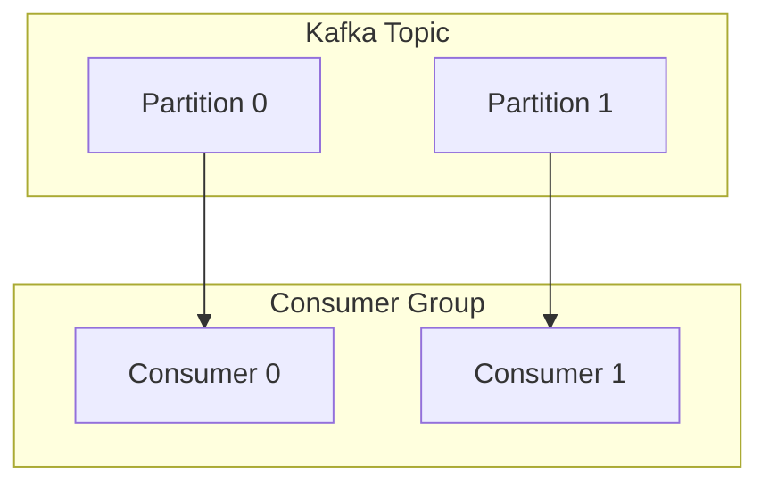

# Consumer Groups trong Kafka

## Summary

Trong hệ sinh thái Apache Kafka, **Consumer Group (Nhóm người tiêu dùng)** là một tập hợp các tiến trình/ứng dụng (Consumers) cùng hợp sức để đọc và tiêu thụ dữ liệu từ một hoặc nhiều Topic. Cơ chế này là giải pháp thanh lịch giúp Kafka linh hoạt chuyển đổi giữa hai mô hình nhắn tin cốt lõi: Hàng đợi công việc (Message Queuing - chia sẻ tải) và Phát thanh (Pub/Sub - mỗi bộ phận nhận một bản sao độc lập).

---

## Definition

Khi ứng dụng của bạn (Consumer) đăng ký (Subscribe) đọc tin nhắn từ Topic của Kafka, nó phải khai báo một ID nhóm (Ví dụ: `group.id = "fraud-detection-service"`). 

**Quy tắc tối thượng của Kafka:** Một tin nhắn (message) gửi vào Topic sẽ chỉ được gửi đến duy nhất **MỘT** thành viên Consumer nằm trong CÙNG một Consumer Group.

* Nhờ điều này, nếu nhóm `fraud-detection-service` có 4 máy chủ (Consumers), chúng sẽ tự động chia nhau tải lượng công việc để xử lý song song, không bao giờ đọc đè lên phần việc của nhau.

---

## Why it exists

Giả sử Topic `web_logs` nhận 100,000 tin nhắn mỗi giây.
Một ứng dụng Python (Consumer) của bạn chỉ có tốc độ xử lý 10,000 tin nhắn mỗi giây. 
Nếu bạn chỉ chạy 1 ứng dụng, hệ thống sẽ bị Lag (độ trễ), lượng tin nhắn ùn ứ càng ngày càng nhiều.
Làm sao để tăng tốc? Bạn không thể nâng cấp máy chủ mãi. Cách duy nhất là Scale Out: Bật 10 ứng dụng Python lên ở 10 máy chủ khác nhau.

Nhưng nếu 10 máy này cùng vào đọc Kafka, làm sao để máy 1 không đọc nhầm tin nhắn mà máy 2 đã lấy? 
**Consumer Group tồn tại để giải quyết bài toán chia việc tự động này.** Bằng cách khai báo cả 10 máy có chung `group.id`, Kafka sẽ đóng vai trò trọng tài, phân công rõ ràng: "Máy 1 đọc phần đầu, máy 2 đọc phần giữa...", đảm bảo khả năng tính toán song song hoàn hảo.

---

## How it works

Sự phân công công việc của Consumer Group gắn bó cực kỳ mật thiết với khái niệm **[Partitions](/concepts/kafka-topics-partitions)**. 

Kafka cấp phát công việc dựa trên cấp độ (Granularity) là Partition.
* **Trường hợp 1 (Lý tưởng)**: Topic có 4 Partitions (P0, P1, P2, P3). Nhóm Consumer Group có 4 máy. Kafka sẽ gán `Máy 1 -> P0`, `Máy 2 -> P1`, `Máy 3 -> P2`, `Máy 4 -> P3`. Phân phối việc tuyệt đối đều 1-1.
* **Trường hợp 2 (Thừa Partitions)**: Topic 4 Partitions, nhưng bạn chỉ bật 2 máy (Consumer A và B). Kafka sẽ chia `Máy A -> P0, P1` và `Máy B -> P2, P3`. Một máy làm gánh đôi công việc.
* **Trường hợp 3 (Thừa Máy - SAI LẦM)**: Topic có 4 Partitions, bạn bật 5 Máy lên. Kafka sẽ chia việc 1-1 cho 4 máy đầu tiên. **Máy thứ 5 sẽ HOÀN TOÀN NHÀN RỖI (Idle)**, không có việc gì làm. Do nguyên tắc 1 Partition không bao giờ được chia cho 2 Consumers trong cùng một group.

---

## Architecture / Flow


*Nhận xét:* 
- Group A phân chia công việc để xử lý gửi email nhanh (Message Queuing Mode).
- Cùng lúc đó, Group B có 1 máy duy nhất hứng toàn bộ dữ liệu cả 3 Partitions để chép vào HDFS dự phòng (Pub/Sub Mode). Hai hệ thống không can thiệp lên Offset của nhau.

---

## Rebalancing (Tái cân bằng nhóm)

Cơ chế sức mạnh lớn nhất của Consumer Group là tính chịu lỗi (Fault tolerance).
Nếu một máy trong Group bị cháy nổ (Crash), kết nối bị ngắt, Kafka (thông qua Group Coordinator) nhận thấy điều này, nó sẽ lập tức kích hoạt tiến trình **Rebalance**.
* Nó giật lại các Partition mà máy chết đang ôm.
* Chuyển giao các Partition đó sang cho các máy còn đang sống sót trong Group đọc tiếp.
* Quá trình này gây đứng hệ thống (Stop-the-world) trong tích tắc (vài giây) nhưng đảm bảo dịch vụ thông suốt không mất mát.

---

## Practical example

Dưới đây là ví dụ mã Python sử dụng thư viện `confluent_kafka` để thiết lập một Consumer thuộc về một nhóm tên là `fraud-detection-service`:

```python
from confluent_kafka import Consumer

# Cấu hình Consumer
conf = {
    'bootstrap.servers': 'localhost:9092',
    'group.id': 'fraud-detection-service', # Định nghĩa Consumer Group
    'auto.offset.reset': 'earliest'        # Đọc từ đầu nếu chưa có offset
}

# Khởi tạo Consumer
consumer = Consumer(conf)

# Đăng ký lắng nghe Topic
consumer.subscribe(['transactions'])

# Vòng lặp nhận dữ liệu (Polling)
try:
    while True:
        msg = consumer.poll(timeout=1.0)
        if msg is None:
            continue
        if msg.error():
            print(f"Lỗi: {msg.error()}")
            continue
            
        print(f"Nhận được message: {msg.value().decode('utf-8')} từ partition {msg.partition()}")
except KeyboardInterrupt:
    pass
finally:
    # Đóng consumer sẽ kích hoạt Rebalance để nhường partition cho máy khác
    consumer.close()
```

---

## Best practices

* **Số lượng Partition phải lớn hơn Consumer**: Luôn thiết kế Topic với số lượng Partition nhiều dư dả (ví dụ 30-50). Đây là giới hạn "trần" cho việc bạn mở rộng số máy chủ Consumer sau này nếu Traffic bùng nổ.
* **Theo dõi Consumer Lag**: Đây là Metric sinh tử của hệ thống Streaming. Lag là độ chênh lệch giữa vị trí tin nhắn mới nhất đổ vào Kafka và vị trí mà Group của bạn vừa xử lý xong. Nếu Lag liên tục tăng theo hình chóp qua các ngày, ứng dụng của bạn quá yếu, hãy xem xét thêm máy chủ (thêm Consumer).

---

## Common mistakes

* **Thay đổi Group ID ngớ ngẩn**: Khi debug ở máy Local, lập trình viên hay để `group.id="test-1"`, lần sau sửa code lại tạo `group.id="test-2"`. Do đổi nhóm mới tinh, Kafka tưởng đây là ứng dụng mới, nó sẽ lại đẩy toàn bộ dữ liệu từ ngày xửa ngày xưa của Topic về cho máy bạn đọc lại (nếu cấu hình `auto.offset.reset = earliest`).
* **Code xử lý quá lâu**: Kafka đếm nhịp tim (heartbeat) và bắt Consumer phải gọi lệnh lấy dữ liệu (poll) theo chu kỳ (mặc định 5 phút `max.poll.interval.ms`). Nếu code bạn xử lý batch dữ liệu mất 6 phút, Kafka lầm tưởng máy này đã treo, nó kích hoạt Rebalance đẩy việc sang máy khác. Máy kia dính đợt dữ liệu khó này cũng kẹt 6 phút lại Rebalance. Toàn bộ Cluster vướng vào vòng lặp chết (Endless Rebalance).

---

## Trade-offs

### Ưu điểm
* Giải quyết triệt để tính co giãn tải hệ thống phân tán không cần điều phối phức tạp. Thêm máy -> nhanh hơn. Bớt máy -> tự động gánh.
* Đảm bảo tính nhất quán cao.

### Nhược điểm
* Tiến trình Rebalance khá cồng kềnh. Khi có máy mới vào ra, toàn bộ Group phải tạm dừng đọc dữ liệu một chút để chia lại bài. Ở Kafka hiện đại, cơ chế *Incremental Cooperative Rebalance* đã làm dịu đi rất nhiều tác động này.

---

## When to use

Luôn luôn sử dụng và cấu hình chuẩn Consumer Group (`group.id`) mỗi khi bạn viết code Spark Streaming, Flink, Kafka Streams, hay các ứng dụng Backend đọc dữ liệu từ Kafka.

---

## Related concepts

* [Apache Kafka](/concepts/apache-kafka)
* [Kafka Topics & Partitions](/concepts/kafka-topics-partitions)

---

## Interview questions

### 1. Nếu tôi có 1 Topic với 4 Partitions, nhưng tôi khởi động 5 tiến trình Consumer trong cùng một Consumer Group. Điều gì sẽ xảy ra?
* **Người phỏng vấn muốn kiểm tra**: Hiểu biết định luật 1-1 của Kafka Consumer.
* **Gợi ý trả lời**: Kafka luôn đảm bảo tính an toàn dữ liệu, nó quy định 1 partition chỉ cho phép 1 consumer đọc (trong cùng 1 nhóm). Do đó, 4 máy tính đầu sẽ được gán mỗi máy 1 partition. Máy tính thứ 5 sẽ ở trạng thái Idle (Nhàn rỗi) hoàn toàn và không nhận được bất kì message nào. (Trừ khi 1 trong 4 máy kia rớt, nó sẽ thay thế).

### 2. Sự khác biệt khi ứng dụng A và ứng dụng B khai báo chung Group ID, so với việc khai báo hai Group ID khác nhau?
* **Gợi ý trả lời**: 
  - Khai báo chung Group ID: Chúng trở thành một đội. Kafka sẽ san sẻ tải, chia đôi số message ra, A nhận 1 nửa, B nhận nửa còn lại (Mô hình Queue).
  - Khai báo khác Group ID: Chúng hoàn toàn độc lập với các con trỏ (Offset) ghi nhớ riêng biệt. Cả A và B đều sẽ nhận được một bản sao nguyên vẹn 100% của toàn bộ dữ liệu trong Topic (Mô hình Publish/Subscribe).

---

## References

* **Kafka: The Definitive Guide** - Neha Narkhede (Chương Kafka Consumers).
* **Designing Data-Intensive Applications** - Martin Kleppmann.

---

## English summary

Consumer Groups in Apache Kafka provide the essential mechanism for massively parallelizing data consumption. By assigning multiple consumer instances the same `group.id`, Kafka transparently divides the Topic's Partitions among them, preventing duplicate processing and effectively implementing a load-balancing message queue. Conversely, assigning unique group IDs enables the classic Publish-Subscribe pattern, allowing independent downstream systems (e.g., a real-time alerting engine and a Data Lake backup pipeline) to read the same stream of events at their own pace. Careful tuning of partitions is required, as the number of partitions acts as the hard ceiling on how many consumers can concurrently process data.
