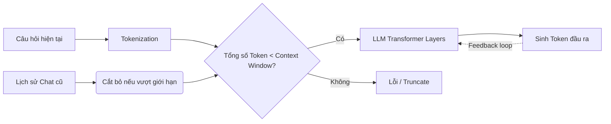

# Cửa sổ ngữ cảnh - Context Window

## Summary

Cửa sổ ngữ cảnh (Context Window) là số lượng tối đa các đơn vị từ vựng (tokens) mà một Mô hình Ngôn ngữ Lớn (LLM) có thể ghi nhớ, xử lý và xem xét cùng một lúc trong một lượt tương tác (bao gồm cả đầu vào - prompt và đầu ra - generated text). Nó đóng vai trò như "bộ nhớ làm việc" (working memory) của mô hình.

---

## Definition

**Cửa sổ ngữ cảnh (Context Window)** được định nghĩa là giới hạn kỹ thuật về độ dài của chuỗi token đầu vào và đầu ra mà cấu trúc mạng nơ-ron (chủ yếu là kiến trúc Transformer) có thể tính toán trong một lần suy luận (inference). 
Kích thước của context window thường được đo bằng "tokens" (ví dụ: 4K, 8K, 128K, hoặc 1M tokens). Mọi thông tin nằm ngoài cửa sổ này sẽ không được mô hình nhìn thấy hoặc nhớ tới.

---

## Why it exists

Các mô hình ngôn ngữ dựa trên kiến trúc Transformer hoạt động nhờ cơ chế Tự chú ý (Self-Attention). Trong cơ chế này, mỗi token trong chuỗi đầu vào phải so sánh (tính độ chú ý) với mọi token khác trong chuỗi.
Điều này dẫn đến **độ phức tạp thời gian và không gian tính toán là $O(N^2)$**, với N là số lượng tokens (độ dài ngữ cảnh). 

Nếu muốn tăng cửa sổ ngữ cảnh lên gấp đôi, yêu cầu về bộ nhớ (VRAM của GPU) và sức mạnh tính toán sẽ tăng lên gấp bốn lần. Do giới hạn về phần cứng và chi phí huấn luyện, các kỹ sư phải đặt ra một giới hạn (Context Window) cố định cho mỗi mô hình trong quá trình huấn luyện và phục vụ.

---

## Core idea

* **Bộ nhớ ngắn hạn**: Context Window là bộ nhớ duy nhất mà mô hình có lúc sinh văn bản. LLM không có trí nhớ dài hạn vĩnh viễn (ngoại trừ các trọng số weights được cố định trong quá trình huấn luyện).
* **Đầu vào + Đầu ra = Tổng Context**: Kích thước context window bao gồm cả prompt của người dùng, context được cung cấp thêm (qua RAG) và câu trả lời mà mô hình sẽ sinh ra. Nếu prompt đã chiếm hết giới hạn, mô hình sẽ không còn không gian để trả lời.
* **Tính trôi dạt (Sliding Window)**: Trong các ứng dụng chat, khi cuộc hội thoại quá dài, các tin nhắn cũ nhất sẽ bị loại bỏ dần để tin nhắn mới vừa vặn trong cửa sổ ngữ cảnh.

---

## How it works

Khi bạn gửi một câu hỏi cho LLM:
1. Giao diện (ví dụ: ChatGPT) sẽ gom câu hỏi mới của bạn cộng với lịch sử chat gần đây.
2. Toàn bộ văn bản này được chia thành các Token.
3. Số lượng token được đếm. Nếu tổng số token vượt quá Context Window, hệ thống sẽ tự động cắt bớt phần đầu (cũ nhất) của lịch sử chat.
4. Chuỗi token được đẩy vào LLM để dự đoán token tiếp theo.
5. Mỗi token sinh ra lại được cộng dồn vào Context Window cho lần dự đoán token ngay sau đó (Autoregressive generation). Quá trình dừng lại khi sinh ra token kết thúc hoặc khi chạm ngưỡng tối đa của Context Window.

---

## Architecture / Flow

---

## Practical example

Giả sử bạn đang dùng mô hình có Context Window là **4096 tokens**:

* **System prompt**: 100 tokens
* **Lịch sử chat**: 1500 tokens
* **Câu hỏi mới của bạn**: 500 tokens
* **Tổng cộng đầu vào**: 2100 tokens.
* **Không gian còn lại để trả lời**: $4096 - 2100 = 1996$ tokens.

Nếu câu trả lời mô hình muốn viết dài tới 2500 tokens, nó sẽ đột ngột dừng lại (cut off) ở token thứ 1996 vì đã chạm đỉnh Context Window.

---

## Best practices

* **Tiết kiệm Token**: Tối ưu hóa prompt của bạn bằng cách loại bỏ các từ ngữ thừa thãi.
* **Áp dụng RAG (Retrieval-Augmented Generation)**: Thay vì nhồi nhét toàn bộ tài liệu hàng ngàn trang vào prompt (có thể vượt Context Window hoặc rất tốn tiền API), hãy dùng mô hình tìm kiếm để trích xuất ra 3-5 đoạn văn bản liên quan nhất rồi đưa chúng vào Context Window.
* **Hiểu hiện tượng Lost in the Middle**: Nghiên cứu cho thấy LLM nhớ rất tốt thông tin ở phần đầu (đầu prompt) và phần cuối (cuối prompt), nhưng thường bỏ qua hoặc "quên" thông tin nằm ở phần giữa của một context window khổng lồ. Hãy đặt thông tin quan trọng nhất ở đầu hoặc cuối.

---

## Common mistakes

* **Quên tính toán độ dài đầu ra**: Người dùng thường nhồi nhét tài liệu vào prompt sao cho vừa khít Context Window (ví dụ 8000/8192 tokens) và không hiểu tại sao mô hình chỉ trả lời được 1-2 câu rồi dừng.
* **Tin tưởng Context Window lớn là vạn năng**: Sử dụng các mô hình có Context Window 1 triệu hoặc 2 triệu tokens để đọc toàn bộ codebase mà không dùng RAG. Hậu quả là tốn chi phí cực lớn cho mỗi truy vấn, tốc độ sinh chậm (High Time To First Token) và mô hình bị nhiễu do "Lost in the Middle".

---

## Trade-offs

### Ưu điểm của Context Window lớn
* Khả năng đưa toàn bộ tài liệu dài (sách, báo cáo tài chính, codebase) vào trong một lần prompt duy nhất (In-context learning mạnh mẽ).
* Mô hình có thể theo dõi cuộc hội thoại phức tạp, kéo dài mà không quên yêu cầu ban đầu.

### Nhược điểm của Context Window lớn
* **Chi phí**: API thường tính tiền theo số lượng token đầu vào/đầu ra. Context Window càng dài, hóa đơn càng cao.
* **Thời gian tính toán (Latency)**: Xử lý ngữ cảnh khổng lồ đòi hỏi thời gian khởi tạo (Prefill) lâu.
* **Độ chính xác suy giảm**: Càng nhiều thông tin, mô hình càng dễ bị nhiễu và gặp hiện tượng ảo giác (Hallucination) cục bộ.

---

## When to use (Large Context Window)

* Cần tóm tắt văn bản nguyên vẹn (sách, bản ghi âm cuộc họp dài).
* Dịch thuật văn bản có tính liên tục cao.
* Few-shot prompting cần đưa vào hàng chục ví dụ mẫu để mô hình bắt chước.

## When not to use

* Tra cứu thông tin cụ thể trong cơ sở dữ liệu khổng lồ (Nên sử dụng RAG kết hợp Vector DB thay vì đưa tất cả vào context window).
* Ứng dụng chat cần phản hồi thời gian thực (real-time).

---

## Related concepts

* [Token (Đơn vị từ vựng)](/concepts/token)
* [Tìm kiếm ngữ nghĩa (Semantic Search)](/concepts/semantic-search)
* [Phân tách văn bản (Chunking)](/concepts/chunking)

---

## Interview questions

### 1. Tại sao độ phức tạp tính toán của cơ chế Self-Attention trong Transformer lại là $O(N^2)$ đối với kích thước cửa sổ ngữ cảnh N?
* **Người phỏng vấn muốn kiểm tra**: Hiểu biết nền tảng về kiến trúc mạng nơ-ron Transformer.
* **Gợi ý trả lời (Strong Answer)**: Trong cơ chế Self-Attention, để tạo ra biểu diễn mới cho một token, mô hình phải tính toán điểm số chú ý (Attention Score) của token đó với **tất cả** các token khác trong chuỗi (thông qua phép nhân ma trận Query và Key). Do đó, nếu chuỗi có độ dài N, sẽ có $N \times N$ phép tính tương quan, dẫn tới độ phức tạp $O(N^2)$ cả về tính toán lẫn bộ nhớ (VRAM).
* **Lỗi cần tránh**: Không giải thích được bản chất phép nhân ma trận Q (Query) và K (Key).

### 2. Hiện tượng "Lost in the Middle" là gì và làm cách nào để giảm thiểu ảnh hưởng của nó khi làm việc với ngữ cảnh dài?
* **Người phỏng vấn muốn kiểm tra**: Kinh nghiệm thực tiễn khi làm việc với LLM trong các ứng dụng RAG.
* **Gợi ý trả lời (Strong Answer)**: Lost in the Middle là hiện tượng hiệu suất truy xuất thông tin của LLM có hình chữ U. Mô hình nhớ tốt dữ liệu ở đầu và cuối ngữ cảnh nhưng dễ bỏ qua dữ liệu ở giữa. Để giảm thiểu, ta nên: (1) Đặt thông tin quan trọng nhất/Câu hỏi (Instruction) ở cuối prompt; (2) Dùng RAG để lọc chỉ giữ lại những đoạn văn (chunks) thật sự quan trọng, làm giảm tổng độ dài; (3) Sử dụng kỹ thuật Re-ranking trước khi đưa ngữ cảnh vào LLM để đẩy những tài liệu quan trọng nhất lên đầu và xuống cuối.

---

## References

1. **Attention Is All You Need** - Vaswani et al. (2017) - Bài báo gốc về Transformer.
2. **Lost in the Middle: How Language Models Use Long Contexts** - Nelson F. Liu et al. (2023).

---

## English summary

The Context Window is the maximum sequence length (measured in tokens) that a Large Language Model can process in a single invocation, encompassing both the input prompt and the generated output. It acts as the model's short-term working memory. Because the core Self-Attention mechanism of Transformers scales quadratically $O(N^2)$ with sequence length, context windows are strictly constrained by hardware limitations (GPU VRAM). Expanding context allows for rich in-context learning and analyzing long documents without fine-tuning, but comes at the cost of higher latency, increased API expenses, and susceptibility to the "Lost in the Middle" phenomenon, where information in the center of the prompt is easily ignored.
