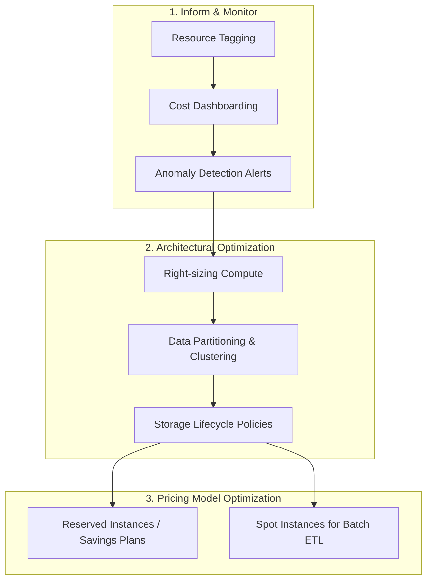

# Tối ưu hóa chi phí (Cost Optimization)

## Summary

Tối ưu hóa chi phí (Cost Optimization) hay còn được biết đến với kỷ luật FinOps trong lĩnh vực dữ liệu đám mây (Cloud Data Platforms), là tập hợp các phương pháp, kỹ thuật và văn hóa giúp doanh nghiệp nhận được giá trị tối đa từ khoản chi tiêu cho đám mây. Nó không chỉ đơn thuần là cắt giảm chi phí, mà là tối ưu hóa hiệu quả (efficiency) giữa khối lượng công việc, hiệu năng hệ thống và số tiền bỏ ra, đảm bảo các tài nguyên lưu trữ và tính toán không bị lãng phí.

---

## Definition

**Tối ưu hóa chi phí trên nền tảng dữ liệu** là quy trình liên tục giám sát, đánh giá và điều chỉnh việc phân bổ tài nguyên lưu trữ (Storage), xử lý tính toán (Compute), và lưu lượng truyền tải (Network egress) trong các kiến trúc dữ liệu trên đám mây (như AWS, GCP, Azure, Snowflake, Databricks). Mục tiêu là đạt được các thỏa thuận mức dịch vụ (SLA) mong muốn với một mức chi phí khả thi và tiết kiệm nhất.

---

## Why it exists

Mô hình đám mây mang đến khả năng mở rộng (scalability) vô tận với phương thức tính tiền theo mức sử dụng (pay-as-you-go). Điều này mang lại sự linh hoạt nhưng cũng là con dao hai lưỡi:
1. **Thiếu khả năng hiển thị chi phí (Cost visibility)**: Kỹ sư dữ liệu dễ dàng khởi tạo hàng trăm cụm máy chủ xử lý dữ liệu và bỏ quên không tắt chúng.
2. **Mã nguồn không tối ưu (Inefficient code)**: Một câu truy vấn SQL viết kém (Full table scan) trong một cơ sở dữ liệu truyền thống chỉ làm chậm ứng dụng, nhưng trên đám mây (như BigQuery hoặc Snowflake), nó có thể tiêu tốn hàng ngàn đô la chỉ trong vài phút.
3. **Over-provisioning**: Thiết lập cấu hình phần cứng quá mức cần thiết để "an toàn" thay vì đo đạc thực tế khối lượng công việc.

Tối ưu hóa chi phí xuất hiện và trở thành kỹ năng bắt buộc của Data Engineers để ngăn chặn những "hóa đơn sốc" (bill shocks) và giữ cho các dự án dữ liệu có lãi.

---

## Core idea

Tối ưu hóa chi phí được thực thi dựa trên ba nguyên lý chính (theo mô hình FinOps):
* **Nhận thức (Inform)**: Hiểu rõ tiền đang được tiêu vào đâu thông qua các báo cáo, dashboard chi phí và gán nhãn (tagging/labeling) các tài nguyên đám mây.
* **Tối ưu (Optimize)**: Tìm kiếm các tài nguyên dư thừa, chuyển đổi mô hình định giá (dùng Spot Instances, Reserved Instances) và cấu hình lại mức sử dụng lưu trữ.
* **Vận hành (Operate)**: Thiết lập ngân sách (budgets), cảnh báo (alerts), và các quy trình tự động (automations) để quản trị chi phí liên tục. Tích hợp ý thức về chi phí vào quy trình CI/CD.

---

## How it works

Quá trình tối ưu hóa chi phí trong hệ thống dữ liệu áp dụng trên các thành phần vật lý của hệ thống:
1. **Compute (Tính toán)**: Thành phần tiêu tốn nhiều tiền nhất. Điều chỉnh quy mô (right-sizing), tự động tắt máy khi không có công việc (auto-suspend), sử dụng máy chủ giao ngay (Spot/Preemptible VMs) cho các ETL batch không cần SLA quá nghiêm ngặt.
2. **Storage (Lưu trữ)**: Áp dụng vòng đời dữ liệu (Data Lifecycle). Chuyển dữ liệu cũ ít truy cập sang các lớp lưu trữ giá rẻ (ví dụ: Amazon S3 Standard-IA, Glacier). Nén dữ liệu và chọn định dạng lưu trữ dạng cột (Parquet, ORC).
3. **Data Processing (Xử lý dữ liệu)**: Viết lại các truy vấn SQL để tối ưu số bytes quét. Sử dụng phân vùng (Partitioning) và gom nhóm (Clustering/Z-ordering) để giới hạn lượng dữ liệu cần xử lý.

---

## Architecture / Flow

---

## Practical example

Một Data Engineer sử dụng Google BigQuery. Dữ liệu bảng `user_events` chứa 50TB dữ liệu chưa được phân vùng. Nhà phân tích thường xuyên viết câu truy vấn để tính toán MAU (Monthly Active Users) của tháng hiện tại.

**Không tối ưu**: 
Mỗi lần truy vấn, BigQuery sẽ quét toàn bộ 50TB (với giá khoảng $5/TB), tiêu tốn $250 cho *mỗi lần* chạy SQL.

**Tối ưu hóa (Partitioning)**:
Data Engineer chuyển đổi bảng `user_events` thành bảng phân vùng theo ngày (Partition by Date). 
Khi nhà phân tích chạy SQL với điều kiện `WHERE event_date BETWEEN '2026-06-01' AND '2026-06-30'`, hệ thống sẽ chỉ quét các phân vùng của tháng 6 (khoảng 1.5TB), tiêu tốn chỉ $7.5. Tiết kiệm 97% chi phí.

---

## Best practices

* **Gắn nhãn (Tagging)**: Áp dụng các nhãn (tags) bắt buộc (ví dụ: `team: marketing`, `env: production`, `project: data-lake`) cho tất cả các tài nguyên. Nếu không gán nhãn, bạn không thể biết chi phí sinh ra từ ai để quy trách nhiệm.
* **Auto-Suspend & Auto-Resume**: Đối với các Data Warehouse hiện đại (như Snowflake, Databricks SQL), hãy thiết lập thời gian tự động dừng (auto-suspend) sau 5-10 phút không có truy vấn để tránh tính tiền thời gian rỗi (idle time).
* **Kiểm soát định dạng và kích thước tệp**: Data Lake không nên chứa hàng triệu file CSV nhỏ. Hãy nén và chuyển chúng sang định dạng Parquet với kích thước tệp lý tưởng (~128MB - 1GB) để giảm thời gian đọc metadata và giảm phí gọi API đọc (GET requests).
* **Thiết lập cảnh báo Ngân sách (Budget Alerts)**: Tự động gửi cảnh báo qua Slack/Email khi chi phí trong tháng đạt 50%, 80%, và 100% ngân sách dự kiến.

---

## Common mistakes

* **Quên dọn dẹp môi trường (Orphaned Resources)**: Tạo ra các cụm máy chủ, ổ đĩa lưu trữ dự phòng hoặc môi trường staging để test, nhưng sau khi hoàn thành dự án lại quên không xóa chúng.
* **Lưu trữ dữ liệu rác dài hạn**: Ghi log hệ thống vô thời hạn mà không có chính sách vòng đời dữ liệu (Retention policy). Điều này dần làm phình to hóa đơn Storage.
* **Lạm dụng tính toán Real-time**: Sử dụng kiến trúc luồng dữ liệu liên tục (streaming) với cụm máy chủ chạy 24/7 cho những báo cáo mà nghiệp vụ chỉ yêu cầu xem 1 lần vào cuối ngày (có thể dùng Batch rẻ hơn rất nhiều).

---

## Trade-offs

### Ưu điểm
* Giảm đáng kể chi phí vận hành (OpEx) đám mây.
* Tăng tính minh bạch trong đầu tư công nghệ, dễ dàng giải trình ngân sách.
* Cải thiện hiệu suất song song (những cách tối ưu chi phí như Partition thường làm tốc độ xử lý nhanh hơn).

### Nhược điểm
* Tốn kém chi phí nhân sự: Việc tái cấu trúc (refactoring) mã nguồn hoặc cấu trúc lại dữ liệu có thể mất nhiều tháng làm việc của Data Engineers.
* Đánh đổi tính tiện lợi: Tự động tắt máy chủ có thể gây ra hiện tượng trễ khởi động lại (cold start), làm người dùng BI dashboard phải đợi vài giây cho câu truy vấn đầu tiên trong ngày.

---

## When to use

* Là bắt buộc (mandatory) đối với mọi hệ thống dữ liệu triển khai trên môi trường Cloud thực tế.
* Khi hóa đơn đám mây của dự án tăng đột biến không giải thích được.
* Khi bắt đầu chuyển giao hệ thống từ pha phát triển (Development) sang pha ổn định (Production).

## When not to use

* Trong giai đoạn đầu MVP (Minimum Viable Product), nên ưu tiên tốc độ ra mắt sản phẩm (Time-to-market) thay vì dành quá nhiều thời gian để tối ưu từng đồng lẻ. Tối ưu chi phí sớm (Premature optimization) là cội rễ của sự phức tạp.

---

## Related concepts

* [Databricks Platform](/concepts/databricks-platform)
* [Data Lake](/concepts/data-lake)
* [Modern Data Stack](/concepts/modern-data-stack)

---

## Interview questions

### 1. Kể tên một vài chiến lược bạn đã dùng để giảm chi phí lưu trữ trên Data Lake (như Amazon S3)?
* **Người phỏng vấn muốn kiểm tra**: Kiến thức thực hành tối ưu hóa storage tiering.
* **Gợi ý trả lời (Strong Answer)**: Xóa các file rác không dùng đến, định cấu hình chính sách vòng đời (Lifecycle Policies) để tự động di chuyển dữ liệu cũ (ví dụ: qua 90 ngày không được truy cập) xuống Storage class rẻ hơn như S3 Glacier. Sử dụng định dạng cột có nén như Parquet/ORC thay vì CSV thô để giảm kích thước lưu trữ từ 70-80%.
* **Lỗi cần tránh (Weak Answer)**: Chỉ nói về việc xóa dữ liệu bằng tay.

### 2. Spot Instances (hay Preemptible VMs) là gì? Trong Data Engineering, loại tác vụ nào phù hợp để chạy trên đó?
* **Người phỏng vấn muốn kiểm tra**: Kiến thức về các mô hình giá (Pricing models) của máy tính đám mây.
* **Gợi ý trả lời (Strong Answer)**: Spot Instances là các máy chủ dư thừa của nhà cung cấp Cloud được bán với giá chiết khấu cực sâu (lên đến 80-90%), nhưng có thể bị thu hồi bất cứ lúc nào (sau một cảnh báo ngắn 1-2 phút). Trong Data Engineering, nó rất phù hợp cho các Batch Processing jobs không yêu cầu khắt khe về thời gian hoàn thành (ví dụ: training ML model, ETL batch đêm khuya). Nếu node bị thu hồi, hệ thống phân tán như Spark có tính năng tự phục hồi (fault tolerance) nên có thể tính toán lại phần bị mất một cách an toàn. 

### 3. Bạn sẽ xử lý thế nào nếu một Data Analyst viết câu SQL quét toàn bộ Data Warehouse và gây tốn rất nhiều tiền?
* **Người phỏng vấn muốn kiểm tra**: Giải pháp kết hợp giữa kỹ thuật và quy trình phân quyền/vận hành (Governance).
* **Gợi ý trả lời (Strong Answer)**: Về kỹ thuật: Áp dụng giới hạn hạn mức (Quotas/Custom Limits) ở mức người dùng hoặc project (ví dụ trong BigQuery cho phép quét tối đa 1TB/ngày/user). Yêu cầu bắt buộc phải có mệnh đề `WHERE` trên khóa phân vùng khi truy vấn bảng lớn. Về vận hành: Xây dựng các Data Marts tổng hợp sẵn (Aggregated tables) và hướng Analysts truy vấn vào đó thay vì chọc thẳng vào dữ liệu nguyên bản (Raw). Đào tạo nội bộ về cách giải thích execution plan để ước tính chi phí trước khi chạy.

---

## References

1. **Cloud FinOps** - J.R. Storment, Mike Fuller (Sách nền tảng về văn hóa và phương pháp FinOps).
2. **Google Cloud / AWS / Azure Documentation** - Các hướng dẫn Best Practices về Cost Optimization trên nền tảng của họ.
3. **BigQuery Cost Optimization** - Tài liệu tối ưu hóa truy vấn chuyên biệt của Google Cloud.

---

## English summary

Cost Optimization in cloud data engineering (often under the umbrella of FinOps) is the continuous practice of managing, monitoring, and adjusting cloud spending to maximize business value. It involves strategic decisions around right-sizing compute resources, leveraging cost-effective pricing models (like Spot instances), implementing storage lifecycle policies, and enforcing efficient data processing patterns (such as partitioning and query optimization). The goal is to prevent runaway costs associated with the pay-as-you-go model while maintaining system performance and reliability.
