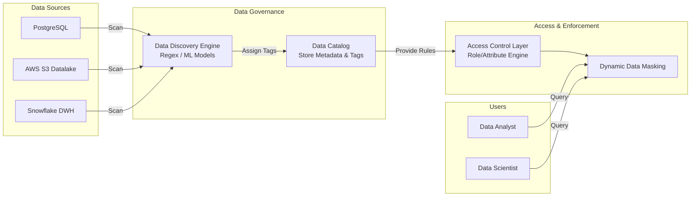

# Phân loại dữ liệu - Data Classification

## Summary

Phân loại dữ liệu (Data Classification) là quá trình nhận diện, gán nhãn và phân nhóm dữ liệu dựa trên mức độ nhạy cảm, giá trị nghiệp vụ và yêu cầu tuân thủ pháp lý. Việc phân loại giúp doanh nghiệp áp dụng các chính sách bảo mật, lưu trữ và quyền truy cập phù hợp, đặc biệt là trong việc bảo vệ dữ liệu nhận dạng cá nhân (PII - Personally Identifiable Information).

---

## Definition

**Data Classification (Phân loại dữ liệu)** là hệ thống các quy trình và công cụ để đánh giá, gắn siêu dữ liệu (metadata/tags) cho các tập dữ liệu trong hệ thống nhằm xác định:
1. Dữ liệu này chứa thông tin gì?
2. Mức độ nhạy cảm của dữ liệu (Public, Internal, Confidential, Restricted).
3. Các quy định pháp lý nào đang điều chỉnh dữ liệu này (GDPR, HIPAA, PCI-DSS).

Việc phân loại được thực hiện ở nhiều cấp độ, từ cấp độ cơ sở dữ liệu (database), bảng (table), cột (column) cho đến từng tệp tin. Quá trình này có thể thực hiện thủ công hoặc tự động hóa bằng Machine Learning / Regex.

---

## Why it exists

Khi khối lượng dữ liệu trong doanh nghiệp tăng theo cấp số nhân (Big Data), việc bảo vệ toàn bộ dữ liệu với cùng một tiêu chuẩn an ninh là điều **bất khả thi và cực kỳ tốn kém**. Data Classification ra đời để giải quyết các vấn đề:
1. **Tuân thủ pháp lý (Compliance)**: Các quy định như GDPR yêu cầu doanh nghiệp phải biết chính xác dữ liệu người dùng (PII) đang nằm ở đâu để có thể xóa (Right to be Forgotten) hoặc mã hóa đúng chuẩn.
2. **Tối ưu chi phí bảo mật**: Không phải dữ liệu nào cũng cần mã hóa nhiều lớp (encryption at rest/in transit) và sao lưu liên tục. Phân loại giúp dồn ngân sách bảo mật vào những dữ liệu thực sự quan trọng.
3. **Giảm thiểu rủi ro rò rỉ (Data Breach)**: Khi xảy ra sự cố bảo mật, việc biết được loại dữ liệu nào bị lộ giúp doanh nghiệp đánh giá được mức độ thiệt hại và có biện pháp ứng phó kịp thời.

---

## Core idea

Nguyên lý cốt lõi của Data Classification bao gồm 3 khía cạnh:
* **Khám phá (Data Discovery)**: Quét toàn bộ kho dữ liệu (Data Warehouse, Data Lake, RDBMS) để tự động nhận diện các mẫu dữ liệu nhạy cảm (như email, số thẻ tín dụng, SSN).
* **Phân cấp bảo mật (Security Tiering)**: Định nghĩa rõ ràng các cấp độ bảo mật. Phổ biến nhất là 4 cấp độ: Public (Công khai), Internal (Nội bộ), Confidential (Bảo mật) và Restricted (Tuyệt mật/PII).
* **Gắn thẻ và Quản lý siêu dữ liệu (Tagging & Metadata Management)**: Lưu trữ các nhãn phân loại trong các Data Catalog (ví dụ: Amundsen, DataHub) để làm cơ sở cho các hệ thống kiểm soát truy cập (Access Control) và ẩn danh dữ liệu (Data Masking).

---

## How it works

Quy trình phân loại dữ liệu thường trải qua các bước sau:
1. **Định nghĩa chính sách (Policy Definition)**: Xác định các loại dữ liệu cần bảo vệ (PII, PHI, Financial Data) và các regex/rules để nhận diện.
2. **Quét dữ liệu tự động (Automated Scanning)**: Các công cụ Data Catalog hoặc Security Tool sẽ định kỳ quét schema, tên cột, và lấy mẫu (sample) nội dung dữ liệu để phân tích.
3. **Gán nhãn (Tagging/Labeling)**: Nếu cột dữ liệu khớp với mẫu (ví dụ: cột `email_address` hoặc chứa chuỗi dạng `*@*.*`), hệ thống sẽ gán tag `PII` và `Confidential`.
4. **Thực thi chính sách (Enforcement)**: Dựa trên tag, hệ thống phân quyền sẽ tự động từ chối truy cập từ các user không đủ thẩm quyền, hoặc thực hiện che giấu dữ liệu (Dynamic Data Masking) trước khi trả kết quả truy vấn.

---

## Architecture / Flow

Dưới đây là sơ đồ luồng hoạt động của một hệ thống Data Classification kết hợp Dynamic Masking:



---

## Practical example

Xét trường hợp bảng dữ liệu `customers` trong Data Warehouse:

```sql
CREATE TABLE customers (
    id UUID PRIMARY KEY,
    full_name VARCHAR(100), -- PII (Tên)
    email VARCHAR(100),     -- PII (Email)
    phone VARCHAR(20),      -- PII (Số điện thoại)
    segment VARCHAR(50),    -- Non-PII (Nhóm khách hàng)
    lifetime_value FLOAT    -- Non-PII (Giá trị vòng đời)
);
```

**Bước 1: Gán nhãn (Tagging)**
Hệ thống Data Catalog quét và gán tag:
- Cột `full_name`, `email`, `phone`: Gán tag `classification: PII` và `security_level: Restricted`.
- Cột `segment`, `lifetime_value`: Gán tag `classification: Business_Metric` và `security_level: Internal`.

**Bước 2: Thực thi chính sách (Masking Policy trong Snowflake)**
```sql
-- Tạo chính sách ẩn danh
CREATE OR REPLACE MASKING POLICY email_mask AS (val VARCHAR) RETURNS VARCHAR ->
  CASE
    WHEN CURRENT_ROLE() IN ('DATA_ENGINEER', 'COMPLIANCE_OFFICER') THEN val
    ELSE REGEXP_REPLACE(val, '(.).*@(.*)', '\\1***@\\2') -- Ẩn 1 phần email
  END;

-- Áp dụng chính sách dựa trên tag PII
ALTER TABLE customers MODIFY COLUMN email SET MASKING POLICY email_mask;
```

Kết quả khi Data Analyst truy vấn: `email` sẽ trả về `j***@gmail.com` thay vì email gốc, đảm bảo quyền riêng tư.

---

## Best practices

* **Tự động hóa tối đa**: Dữ liệu thay đổi từng ngày, việc phân loại thủ công không thể theo kịp. Sử dụng các công cụ như AWS Macie, Google Cloud DLP, hoặc Monte Carlo để quét và gán nhãn liên tục.
* **Tích hợp chặt chẽ với Data Catalog**: Tag phân loại phải có thể tìm kiếm được trong Data Catalog để người dùng biết được cột nào nhạy cảm trước khi xin quyền.
* **Nguyên tắc ít đặc quyền nhất (Least Privilege)**: Mặc định từ chối truy cập vào các dữ liệu được phân loại là Restricted/PII đối với mọi vai trò, trừ khi có lý do nghiệp vụ chính đáng được phê duyệt.
* **Xử lý False Positives (Dương tính giả)**: Các thuật toán regex có thể nhận diện nhầm ID hệ thống thành Số thẻ tín dụng. Cần có quy trình để Data Steward (Người quản lý dữ liệu) ghi đè và sửa nhãn thủ công.

---

## Common mistakes

* **Quá tải hệ thống nguồn do quét toàn bộ dữ liệu**: Quét (scan) trực tiếp toàn bộ dữ liệu OLTP để phân loại sẽ làm sập hệ thống. Chỉ nên quét schema, metadata hoặc chạy lấy mẫu (sampling 1000 dòng).
* **Phân loại quá nhiều cấp độ**: Tạo ra hàng chục cấp độ bảo mật (như PII-1, PII-2, Secret-A, Secret-B) gây bối rối cho người dùng và làm phức tạp hóa hệ thống phân quyền (Access Control). Nên giữ tối đa 3-4 cấp độ.
* **"Phân loại xong để đấy"**: Chỉ gắn tag trong Data Catalog nhưng không cấu hình chính sách chặn/masking ở tầng database, dẫn đến phân loại chỉ mang tính chất minh họa, không có giá trị bảo mật.

---

## Trade-offs

### Ưu điểm
* Tuân thủ các quy định khắt khe về bảo mật dữ liệu (GDPR, CCPA).
* Giảm thiểu thiệt hại khi xảy ra rò rỉ dữ liệu (vì hacker lấy được dữ liệu đã bị masking hoặc mã hóa).
* Tối ưu hóa chi phí lưu trữ và bảo mật.

### Nhược điểm
* **Trì hoãn quá trình phân tích**: Data Analysts phải vượt qua nhiều rào cản phê duyệt để truy cập dữ liệu thô.
* **Chi phí xử lý (Compute Cost)**: Việc quét liên tục và áp dụng Dynamic Data Masking tiêu tốn tài nguyên tính toán của Data Warehouse.
* **Độ phức tạp quản trị**: Đòi hỏi sự phối hợp chặt chẽ giữa Security Team, Data Engineering và Business.

---

## When to use

* Các tổ chức xử lý dữ liệu người dùng cuối, tài chính, y tế (B2C, Fintech, Healthcare).
* Khi triển khai Data Catalog và muốn tự động hóa việc cấp quyền truy cập.
* Khi tổ chức cần vượt qua các đợt kiểm toán chứng chỉ bảo mật (ISO 27001, SOC 2).

## When not to use

* Các hệ thống nội bộ chỉ lưu trữ log máy chủ, dữ liệu chuỗi thời gian của thiết bị IoT (không có dữ liệu con người).
* Startup ở giai đoạn MVP (Minimum Viable Product) cần tốc độ phân tích và phát triển tính năng hơn là tuân thủ bảo mật khắt khe.

---

## Related concepts

* [Kiểm soát truy cập - Access Control](/concepts/access-control)
* [Nhật ký kiểm toán - Audit Logging](/concepts/audit-logging)
* [Data Catalog](/concepts/data-catalog)

---

## Interview questions

### 1. Sự khác biệt giữa Data Classification và Data Cataloging là gì?
* **Người phỏng vấn muốn kiểm tra**: Hiểu biết về hệ sinh thái Data Governance.
* **Gợi ý trả lời**: Data Cataloging là quá trình tổng hợp metadata để giúp người dùng tìm kiếm và hiểu ngữ cảnh kinh doanh của dữ liệu (ví dụ: bảng này dùng để làm gì, ai sở hữu). Data Classification là một tập con trong Data Cataloging, tập trung vào việc đánh giá mức độ nhạy cảm và gán nhãn bảo mật (PII, Confidential) để phục vụ tuân thủ và phân quyền.

### 2. Làm thế nào để tự động hóa quá trình nhận diện PII trong một Data Lake có hàng Petabytes dữ liệu?
* **Người phỏng vấn muốn kiểm tra**: Kỹ năng thiết kế hệ thống quy mô lớn (System Design) và tối ưu chi phí.
* **Gợi ý trả lời**: Không thể quét toàn bộ khối lượng Petabytes vì chi phí rất cao. Giải pháp là quét theo cơ chế lấy mẫu (Sampling) kết hợp Event-driven. 
  1. Chỉ quét metadata (tên cột có chứa "email", "ssn", "phone").
  2. Áp dụng lấy mẫu ngẫu nhiên 1% dữ liệu mới được đưa vào (qua Kafka/EventBridge) và dùng regex hoặc ML/NLP Cloud services (như AWS Macie, GCP DLP) để quét mẫu. 
  3. Áp dụng kế thừa (Lineage inheritance): Nếu một bảng upstream đã được đánh dấu PII, các bảng downstream được tạo ra từ nó tự động kế thừa nhãn PII.

### 3. Giải thích khái niệm Dynamic Data Masking và sự khác biệt với Static Data Masking.
* **Người phỏng vấn muốn kiểm tra**: Kiến thức về bảo mật cơ sở dữ liệu thực hành.
* **Gợi ý trả lời**: 
  * Static Data Masking (SDM) là việc thay đổi vĩnh viễn dữ liệu gốc trên ổ đĩa. Dữ liệu thực sự bị xóa và thay thế bằng chuỗi giả. Phù hợp khi clone dữ liệu từ Production sang môi trường Dev/Test.
  * Dynamic Data Masking (DDM) là việc biến đổi dữ liệu *on-the-fly* trong quá trình trả về kết quả truy vấn. Dữ liệu gốc trên ổ đĩa vẫn nguyên vẹn. Mức độ che dấu phụ thuộc vào vai trò (Role) của người chạy truy vấn. Phù hợp cho môi trường Production khi nhiều phòng ban khác nhau cần truy cập cùng một bảng.

---

## References

1. **DAMA-DMBOK: Data Management Body of Knowledge** - Chapter on Data Security and Data Governance.
2. **AWS Macie Documentation** - Hướng dẫn tự động hóa khám phá dữ liệu nhạy cảm trên S3.
3. **Snowflake Documentation** - Dynamic Data Masking Policies.

---

## English summary

Data Classification is the process of discovering, categorizing, and tagging data based on its sensitivity, business value, and compliance requirements (e.g., GDPR, HIPAA). Its primary goal is to protect Personally Identifiable Information (PII) and optimize security costs by applying appropriate access controls and masking policies (Dynamic Data Masking). The workflow involves automated discovery using regex or ML models, tagging metadata in a Data Catalog, and enforcing security policies down to the column level. While it ensures regulatory compliance and minimizes data breach risks, it adds computational overhead and administrative complexity.
