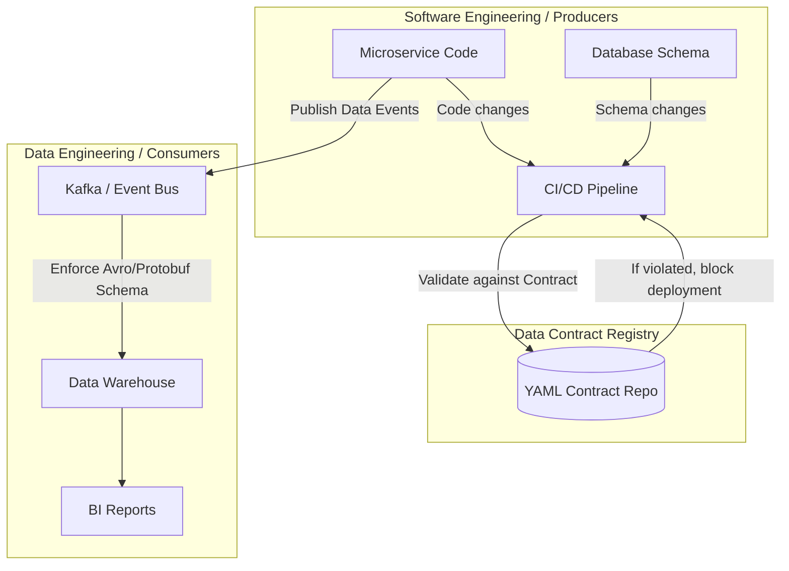

# Hợp đồng dữ liệu - Data Contract

## Summary

Data Contract (Hợp đồng dữ liệu) là một thỏa thuận chính thức, rõ ràng và có thể kiểm chứng (enforceable) giữa hệ thống cung cấp dữ liệu (Data Producers - thường là đội Kỹ sư Phần mềm/Backend) và hệ thống tiêu thụ dữ liệu (Data Consumers - Đội Phân tích/Kỹ sư dữ liệu). Nó định nghĩa cấu trúc (schema), ngữ nghĩa (semantics), chất lượng (quality) và các SLA của luồng dữ liệu, đảm bảo rằng mọi thay đổi từ phía nguồn không làm gãy vỡ (break) các pipeline dữ liệu ở hạ nguồn.

---

## Definition

**Data Contract** là một cơ chế quản trị kết nối thế giới vận hành (Operational / Microservices) và thế giới phân tích (Analytical / Data Warehouse). Nó tồn tại dưới dạng một tệp cấu hình (thường là JSON hoặc YAML) định nghĩa rõ rệt:
1. Schema của dữ liệu (kiểu dữ liệu, các trường bắt buộc).
2. Ngữ nghĩa (định nghĩa kinh doanh của trường dữ liệu).
3. Các quy tắc chất lượng (ví dụ: tuổi phải lớn hơn 0, trạng thái chỉ được thuộc danh sách định trước).
4. Các quy ước bảo mật (PII data masking).
5. SLA về độ trễ, tần suất cập nhật.

Khi một Data Contract được áp dụng, bất kỳ đoạn code Backend nào phá vỡ hợp đồng này (ví dụ: xóa cột `user_id`, đổi tên cột thành `userId`) sẽ bị chặn lại ngay từ giai đoạn CI/CD, không được phép đưa lên Production.

---

## Why it exists

Trong mô hình truyền thống, đội Kỹ sư Dữ liệu thường đóng vai trò là "người dọn dẹp hệ quả".
* **Sự cố thường gặp**: Đội Backend (Software Engineers) sửa một tính năng nhỏ, xóa một cột `customer_type` trong CSDL PostgreSQL mà không báo cho ai. Hậu quả là đêm đó, dbt pipeline của đội Data bị sập do không tìm thấy cột, báo cáo tài chính buổi sáng hôm sau bị sai lệch hoặc không có dữ liệu. Data Engineers phải chạy đôn chạy đáo tìm nguyên nhân và "vá" lỗi.
* **Giao tiếp rời rạc**: Giao tiếp giữa người sản xuất và tiêu thụ dữ liệu dựa trên niềm tin hoặc chat trên Slack, không có sự bảo vệ ở mức hệ thống (system-level constraints).

Data Contract ra đời để giải quyết tận gốc nguyên nhân này, dịch chuyển trách nhiệm đảm bảo cấu trúc dữ liệu về phía hệ thống sản xuất (Shift-Left), buộc các nhà phát triển phần mềm coi dữ liệu như một sản phẩm (Data as a Product).

---

## Core idea

Ý tưởng cốt lõi của Data Contract dựa trên kiến trúc API.
Giống như các REST API luôn có hợp đồng API (như OpenAPI / Swagger) để đảm bảo Backend trả về đúng cấu trúc cho Frontend, dữ liệu sự kiện hoặc luồng ETL/ELT cũng cần một "Hợp đồng API" tương tự giữa CSDL Backend và Data Warehouse.
Data Contract phải được kiểm tra (validate) tự động ở hai nơi:
1. **CI/CD Pipeline**: Khi Software Engineer tạo Pull Request.
2. **Runtime Execution**: Khi dữ liệu phát ra từ nguồn (ví dụ Kafka Producer). Nếu vi phạm, sự kiện bị đẩy vào Dead Letter Queue thay vì chảy vào Data Warehouse.

---

## How it works

Quy trình thực thi một Data Contract thường gồm các bước:
1. **Thiết kế & Đồng thuận**: Data Producer và Data Consumer cùng ngồi lại và viết ra một tệp YAML định nghĩa cấu trúc dữ liệu.
2. **Lưu trữ**: File YAML này được lưu trên một Data Contract Registry tập trung (như một Github Repo).
3. **Mã hóa (Generation)**: Từ file YAML, hệ thống tự sinh ra các schema registry (Protobuf, Avro, JSON Schema) để kiểm chứng.
4. **Kiểm chứng tại nguồn (Validation)**:
   * Khi Backend Dev commit code thay đổi cấu trúc bảng, CI/CD chạy lệnh kiểm tra xem sự thay đổi đó có tương thích ngược (backward compatible) với Data Contract đang hoạt động hay không. Nếu không, CI bị `FAILED`.
   * Khi ứng dụng gửi dữ kiện, một validation library sẽ chặn hoặc cảnh báo nếu dữ liệu sai hợp đồng.

---

## Architecture / Flow



---

## Practical example

Một ví dụ tệp YAML khai báo Data Contract sử dụng chuẩn Data Contract (như tiêu chuẩn mở `datacontract.com`):

```yaml
dataContractSpecification: 0.9.2
id: urn:datacontract:checkout:orders
info:
  title: Orders Checkout Data Contract
  version: 1.0.0
  owner: checkout-squad@company.com

models:
  orders:
    description: Data stream for completed customer orders.
    type: table
    fields:
      order_id:
        type: string
        required: true
        primary: true
        description: Unique identifier of the order.
      customer_id:
        type: integer
        required: true
      total_amount:
        type: decimal
        required: true
      status:
        type: string
        enum: [PENDING, COMPLETED, CANCELLED] # Quality constraint
        required: true
        
quality:
  type: SodaCL
  rules:
    - row_count > 0
    - duplicate_count(order_id) = 0
```

---

## Best practices

* **Áp dụng Backward Compatibility**: Mọi cập nhật trong Data Contract phải tương thích ngược (được thêm cột mới nhưng không được xóa cột cũ hoặc đổi kiểu dữ liệu) để không phá vỡ pipeline đang chạy.
* **Xác định Ownership rõ ràng**: Hợp đồng phải ghi rõ tên đội (Squad) hoặc Email người sở hữu (Producer). Khi có lỗi, cảnh báo sẽ bắn thẳng cho họ.
* **Tránh Big Bang approach**: Đừng áp dụng Data Contract cho toàn bộ hệ thống cùng lúc. Bắt đầu với các luồng dữ liệu quan trọng nhất (Tier 1 data) như Billing, Users.
* **Tích hợp sâu vào CI/CD của Backend**: Nếu chỉ đội Data tự kiểm tra trên DWH, đó chỉ là Data Testing, không phải Data Contract. Sức mạnh của hợp đồng nằm ở việc chặn đứng sai sót ngay từ source code của Backend.

---

## Common mistakes

* **Nhầm lẫn Data Contract với Data Testing**: Data Testing (như dbt tests) chạy *sau khi* dữ liệu đã vào kho (Post-ingestion), xử lý hậu quả. Data Contract ngăn chặn lỗi *trước khi* dữ liệu phát sinh (Pre-ingestion).
* **Đội Data tự viết và duy trì hợp đồng**: Nếu đội Data tự làm mọi thứ mà không có sự đồng ý ký kết và tích hợp từ đội Backend, hợp đồng đó chỉ là một tờ giấy vô giá trị.
* **Quá cứng nhắc**: Thiết kế hợp đồng quá chi tiết, chặn mọi sự thay đổi khiến đội phát triển phần mềm cảm thấy bị cản trở (bottle-neck) dẫn đến việc họ tìm cách "lách luật" hoặc tẩy chay công cụ.

---

## Trade-offs

### Ưu điểm
* Giải quyết triệt để vấn đề "Garbage In, Garbage Out" và hiện tượng pipeline đứt gãy im lặng.
* Gắn chặt trách nhiệm của những người tạo ra dữ liệu với chất lượng dữ liệu của toàn tổ chức (Shift-Left Data Quality).
* Tự động hóa quá trình sinh tài liệu cấu trúc dữ liệu.

### Nhược điểm
* Rất khó triển khai về mặt văn hóa và quản trị (Cultural Shift). Thường cần sự chỉ đạo từ cấp C-level (CTO, CDO) để đội SWE chịu làm thêm công việc này.
* Gây ra ma sát (friction) ban đầu trong tốc độ phát triển phần mềm.
* Đòi hỏi hệ thống hạ tầng (infrastructure) trưởng thành: Schema Registry, CI/CD phức tạp.

---

## When to use

* Tổ chức đang chuyển dịch sang mô hình **Data Mesh**, nơi các domain team phải tự sở hữu và cung cấp Data Products ra bên ngoài.
* Tổ chức áp dụng kiến trúc Microservices phức tạp, sự thay đổi nguồn dữ liệu xảy ra hàng ngày bởi nhiều đội ngũ khác nhau.
* Dữ liệu đóng vai trò sống còn trong vận hành (ví dụ ML models tự động ra quyết định tài chính).

## When not to use

* Công ty ở giai đoạn Start-up, chỉ có một cơ sở dữ liệu duy nhất (Monolith) và một đội ngũ Data/Backend nhỏ ngồi chung.
* Không có sự bảo trợ từ Ban Giám đốc để yêu cầu đội Software Engineering thay đổi luồng làm việc của họ.
* Các luồng dữ liệu thô (raw) từ đối tác thứ 3 mà bạn không có khả năng yêu cầu họ ký hợp đồng (ví dụ: lấy dữ liệu từ Google Ads API - bạn phải tự quản lý thay đổi).

---

## Related concepts

* [Data Mesh](/concepts/data-mesh)
* [Data Quality](/concepts/data-quality)
* Schema Registry
* Data as a Product

---

## Interview questions

### 1. Phân biệt Data Contract và dbt tests (hoặc Great Expectations)?
* **Người phỏng vấn muốn kiểm tra**: Hiểu biết về khái niệm "Shift-Left Data Quality" và kiến trúc quản trị dữ liệu.
* **Gợi ý trả lời (Strong Answer)**: dbt tests hay Great Expectations thường chạy ở lớp Transformation, tức là sau khi dữ liệu đã rơi vào DWH (Post-ingestion). Nó mang tính chất phát hiện và cảnh báo (Detecting). Data Contract là một cơ chế phòng vệ chặn sự kiện sai lệch ngay từ nguồn (Microservices/CI-CD), mang tính chất ngăn ngừa (Preventing). Data Contract đảm bảo "rác không vào nhà", còn dbt tests là "dọn rác đã trong nhà".
* **Lỗi cần tránh**: Cho rằng dbt tests có thể thay thế Data Contract.

### 2. Ai nên là người sở hữu (Owner) của một Data Contract?
* **Người phỏng vấn muốn kiểm tra**: Tư duy quản trị dữ liệu theo hướng Domain-driven.
* **Gợi ý trả lời (Strong Answer)**: Data Producer (đội Software Engineering/Product của miền dữ liệu đó) phải là chủ sở hữu chính của Data Contract, vì họ là người duy nhất nắm bắt và kiểm soát hệ thống sinh ra dữ liệu. Tuy nhiên, nội dung hợp đồng phải được thỏa thuận, đàm phán cùng với Data Consumer (những người hiểu nhu cầu phân tích).
* **Lỗi cần tránh**: Trả lời là Data Engineer (người tiêu thụ không thể chịu trách nhiệm cho dữ liệu họ không sinh ra).

---

## References

1. **"Data Contracts" by Chad Sanderson** - Các bài viết trên blog và bản tin chuyên ngành định hình khái niệm Data Contracts.
2. **Data Mesh** - Zhamak Dehghani (Chương về Data as a Product và Interoperability).

---

## English summary

A Data Contract is an explicit, enforceable agreement between software engineers (Data Producers) and data engineers/analysts (Data Consumers) that defines the schema, semantics, and quality standards of a data stream or dataset. Unlike traditional data quality checks that happen post-ingestion within the data warehouse, Data Contracts "shift-left" data quality by integrating validations directly into the producer's CI/CD pipeline and runtime environment. This prevents schema changes in upstream microservices from silently breaking downstream data pipelines, making it a foundational pillar for successful Data Mesh implementations.
