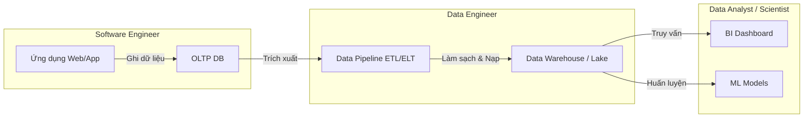

# Vai trò Kỹ sư Dữ liệu - Data Engineer Role

## Summary

Data Engineer (Kỹ sư Dữ liệu) là người chịu trách nhiệm xây dựng và duy trì cơ sở hạ tầng dữ liệu của một tổ chức. Họ thiết kế các luồng xử lý (data pipelines) để thu thập, làm sạch và lưu trữ dữ liệu, tạo ra một nguồn dữ liệu đáng tin cậy phục vụ cho quá trình phân tích và máy học. Đây là vai trò nền tảng không thể thiếu trước khi bất kỳ hoạt động Data Science hay Data Analytics nào có thể diễn ra.

---

## Definition

**Data Engineer** là chuyên gia phần mềm tập trung vào lĩnh vực dữ liệu. Trách nhiệm cốt lõi của họ là vận chuyển dữ liệu từ hệ thống nguồn (nguyên bản, thô, chưa cấu trúc) đến các kho lưu trữ dữ liệu (Data Warehouse, Data Lake) dưới dạng đã được làm sạch, tối ưu hóa để sẵn sàng cho việc truy vấn.

Họ làm việc chủ yếu với các hệ thống phân tán, cơ sở dữ liệu (SQL, NoSQL), công cụ tích hợp dữ liệu (ETL/ELT tools) và nền tảng đám mây (Cloud platforms).

---

## Why it exists

Thuật ngữ Data Engineer nổi lên từ khoảng những năm 2010 khi các công ty nhận ra rằng các Data Scientist đang phải dành đến 80% thời gian để thu thập và làm sạch dữ liệu, thay vì xây dựng mô hình thuật toán.
1. **Nhu cầu chuyên môn hóa**: Việc quản lý hạ tầng Hadoop, Spark hoặc thiết kế Data Warehouse đòi hỏi kỹ năng của Software Engineer chuyên biệt, không phải là thế mạnh của các nhà toán học hay thống kê học (Data Scientist).
2. **Đảm bảo chất lượng dữ liệu**: Một mô hình AI xuất sắc sẽ vô dụng nếu dữ liệu đầu vào sai lệch ("Garbage in, Garbage out"). Data Engineer tồn tại để ngăn chặn rác dữ liệu xâm nhập vào hệ thống phân tích.

---

## Core idea

Sự khác biệt cốt lõi giữa các vai trò trong Data Team:

* **Software Engineer (SWE)**: Tập trung xây dựng ứng dụng, API và hệ thống hướng người dùng. Dữ liệu với họ thường là trạng thái giao dịch (OLTP).
* **Data Engineer (DE)**: Tập trung vào luồng chuyển động của dữ liệu. Họ lấy dữ liệu do SWE tạo ra, tổng hợp và tối ưu hóa nó cho việc đọc (OLAP).
* **Data Analyst (DA)**: Sử dụng dữ liệu đã được DE chuẩn bị để trả lời các câu hỏi kinh doanh hiện tại và quá khứ thông qua Dashboard và SQL.
* **Data Scientist (DS)**: Sử dụng dữ liệu để dự đoán tương lai (Predictive Modeling) hoặc phân tích nâng cao bằng Machine Learning.

---

## How it works

Một ngày làm việc điển hình của Data Engineer bao gồm:
1. **Thiết kế kiến trúc (Architecture Design)**: Lựa chọn giữa Batch hay Streaming, định nghĩa mô hình dữ liệu (Dimensional Modeling).
2. **Lập trình Pipeline (Coding)**: Viết script Python/Scala để trích xuất dữ liệu từ REST API, Kafka hoặc cơ sở dữ liệu quan hệ.
3. **Chuyển đổi dữ liệu (Transformation)**: Viết các model dbt (Data Build Tool) bằng SQL để làm sạch, join các bảng và tạo các metric kinh doanh.
4. **Điều phối (Orchestration)**: Lên lịch các pipeline trên Apache Airflow để chạy hàng ngày vào lúc nửa đêm.
5. **Bảo trì và Tối ưu (Maintenance & Optimization)**: Tối ưu hóa các câu lệnh SQL chạy chậm, xử lý lỗi khi schema của nguồn thay đổi, giám sát tài nguyên tính toán.

---

## Architecture / Flow

Dưới đây là vị trí của Data Engineer trong chuỗi giá trị dữ liệu:



---

## Practical example

Sự phối hợp giữa các vai trò trong một dự án "Gợi ý sản phẩm":
1. **Software Engineer**: Viết mã để lưu hành vi click của người dùng vào bảng `user_clicks` trong MySQL.
2. **Data Engineer**: Viết pipeline bằng Apache Spark kéo dữ liệu `user_clicks` hàng ngày, lọc bỏ các click từ bot, ghép nối với bảng thông tin sản phẩm và lưu vào BigQuery.
3. **Data Scientist**: Đọc bảng dữ liệu sạch từ BigQuery để huấn luyện mô hình Recommendation System.
4. **Data Engineer**: Đưa mô hình của DS vào môi trường sản xuất (MLOps), phơi bày API.
5. **Software Engineer**: Gọi API gợi ý để hiển thị lên giao diện web.

Để minh họa công việc lập trình của Data Engineer, dưới đây là một đoạn code Python sử dụng Apache Airflow để điều phối một luồng ETL cơ bản (Extract - Transform - Load):

```python
from airflow import DAG
from airflow.operators.python_operator import PythonOperator
from airflow.providers.google.cloud.operators.bigquery import BigQueryInsertJobOperator
from datetime import datetime

# 1. Định nghĩa cấu trúc luồng công việc (DAG) chạy hàng ngày
dag = DAG('user_clicks_etl', start_date=datetime(2026, 6, 1), schedule_interval='@daily')

# 2. Extract: Python script kéo dữ liệu từ API
def extract_data_from_api():
    # Logic kéo dữ liệu từ REST API và lưu thành CSV
    pass

extract_task = PythonOperator(
    task_id='extract_clicks_from_api',
    python_callable=extract_data_from_api,
    dag=dag
)

# 3. Transform & Load: Chạy lệnh SQL làm sạch và nạp vào BigQuery
transform_and_load_task = BigQueryInsertJobOperator(
    task_id='clean_and_load_data',
    configuration={
        "query": {
            "query": """
                INSERT INTO `project.dataset.clean_user_clicks`
                SELECT user_id, click_time, product_id 
                FROM `project.dataset.raw_user_clicks`
                WHERE is_bot = False
            """,
            "useLegacySql": False,
        }
    },
    dag=dag
)

# 4. Định nghĩa thứ tự thực thi
extract_task >> transform_and_load_task
```

---

## Best practices

* **Kỹ năng cốt lõi**: Nắm vững SQL (rất sâu), Python, Bash shell và tư duy phân tán (Distributed Computing).
* **Hiểu biết về kinh doanh (Business Acumen)**: Data Engineer không chỉ viết code mà phải hiểu ý nghĩa của dữ liệu đối với doanh nghiệp để thiết kế model chính xác.
* **Áp dụng Software Engineering Best Practices**: Sử dụng Git để quản lý phiên bản, viết Unit Test cho dữ liệu (Data Testing), và CI/CD.

---

## Common mistakes

* **Quá tập trung vào công cụ (Tool-driven)**: Chạy theo các công nghệ mới nhất (Spark, Flink, Kafka) thay vì giải quyết bài toán cốt lõi là đảm bảo chất lượng và độ tin cấu của dữ liệu.
* **Trở thành "người chạy SQL hộ"**: Chấp nhận viết các câu lệnh SQL tạo báo cáo thay vì xây dựng kiến trúc self-service để các Analyst tự làm việc đó.

---

## Trade-offs

### Ưu điểm của nghề nghiệp
* Nhu cầu tuyển dụng cực kỳ cao, mức lương hấp dẫn do nguồn cung khan hiếm.
* Công việc mang tính kỹ thuật sâu, ít phải làm việc trực tiếp với khách hàng cuối.

### Nhược điểm
* Thường xuyên phải trực hệ thống (on-call) xử lý sự cố khi pipeline fail giữa đêm.
* "Người hùng thầm lặng": Khi dữ liệu tốt, không ai để ý; khi dữ liệu sai, Data Engineer là người bị gọi tên đầu tiên.

---

## When to use

* (Vai trò này) Khi doanh nghiệp có nhiều dữ liệu phân tán, Data Analyst mất quá nhiều thời gian làm sạch thủ công bằng Excel.
* Khi chuẩn bị xây dựng team Data Science, cần một nền tảng dữ liệu sạch trước.

## When not to use

* Doanh nghiệp quá nhỏ, mọi dữ liệu nằm gọn trong một database và có thể truy vấn báo cáo trực tiếp mà không ảnh hưởng hiệu năng. Khi đó, một Data Analyst biết chút SQL là đủ.

---

## Related concepts

* [Data Engineering](/concepts/data-engineering)
* [Data Lifecycle](/concepts/data-lifecycle)

---

## Interview questions

### 1. Sự khác biệt chính giữa Data Engineer và Data Scientist là gì?
* **Gợi ý trả lời**: Data Engineer xây dựng "đường ống" (pipelines) để thu thập và chuẩn bị dữ liệu, đảm bảo dữ liệu luôn sẵn sàng, sạch và có tính mở rộng cao. Data Scientist sử dụng chính nguồn dữ liệu đó để khám phá, áp dụng toán học, thống kê và Machine Learning nhằm tìm ra insight hoặc xây dựng mô hình dự báo. DE là kỹ sư hệ thống, DS là nhà khoa học nghiên cứu.

### 2. Theo bạn, kỹ năng nào là quan trọng nhất đối với một Data Engineer?
* **Gợi ý trả lời**: Mặc dù các công cụ Big Data rất quan trọng, nhưng **SQL** và **Data Modeling** (Mô hình hóa dữ liệu) là hai kỹ năng cốt lõi và bất biến nhất. Công cụ có thể thay đổi (từ Hadoop sang Spark, sang Snowflake/dbt), nhưng tư duy về cấu trúc dữ liệu quan hệ, khả năng viết truy vấn hiệu suất cao và chuẩn hóa dữ liệu sẽ đi cùng bạn suốt sự nghiệp. Kèm theo đó là kỹ năng lập trình phần mềm (thường là Python).

---

## References

1. **The Rise of the Data Engineer** - Maxime Beauchemin (Creator of Apache Airflow & Superset).
2. **Fundamentals of Data Engineering** - Joe Reis.

---

## English summary

A Data Engineer is a specialized software engineer responsible for designing, building, and maintaining the infrastructure and pipelines that process and store large volumes of data. Unlike Data Scientists who focus on modeling and analysis, or Software Engineers who focus on application development, Data Engineers ensure that data flows reliably from source systems to analytical destinations (like Data Warehouses) in a clean, query-optimized format. They rely heavily on SQL, Python, distributed systems, and ETL/ELT methodologies.
