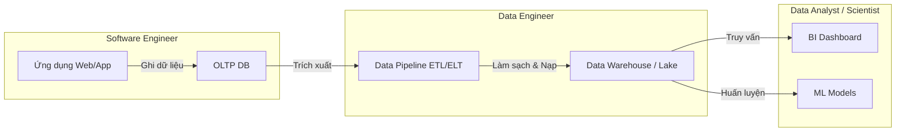

# Vai trò Kỹ sư Dữ liệu - Data Engineer Role

Trong kỷ nguyên số, chúng ta thường nghe rất nhiều về Trí tuệ nhân tạo (AI), Học máy (Machine Learning) hay các nhà Khoa học dữ liệu (Data Scientist) - những người tìm ra những thông tin đắt giá từ dữ liệu. Thế nhưng, có một sự thật ít ai biết: đằng sau mọi dashboard lung linh của doanh nghiệp hay các mô hình AI xuất sắc là sự đóng góp thầm lặng của các **Kỹ sư Dữ liệu (Data Engineer)**. Họ chính là những người "lát đường", chịu trách nhiệm thiết kế, xây dựng và duy trì cơ sở hạ tầng dữ liệu để dòng chảy thông tin trong tổ chức luôn thông suốt và đáng tin cậy.

Về bản chất, **Data Engineer** là một kỹ sư phần mềm chuyên biệt hóa trong lĩnh vực dữ liệu. Nhiệm vụ cốt lõi của họ là vận chuyển dữ liệu từ các hệ thống nguồn (thường ở dạng thô, phân tán và chưa có cấu trúc) đến các kho lưu trữ dữ liệu tập trung (như Data Warehouse hoặc Data Lake) dưới dạng đã được làm sạch, biến đổi và tối ưu hóa để sẵn sàng cho việc truy vấn. Để làm được điều này, họ phải làm việc thường xuyên với các hệ thống tính toán phân tán, các hệ cơ sở dữ liệu (SQL, NoSQL), công cụ tích hợp dữ liệu (ETL/ELT tools) và các nền tảng điện toán đám mây (Cloud platforms).

## Sự trỗi dậy của vai trò Kỹ sư Dữ liệu

Thuật ngữ Data Engineer bắt đầu nổi lên mạnh mẽ từ khoảng những năm 2010. Khi các doanh nghiệp ồ ạt tuyển dụng Data Scientist với kỳ vọng tối ưu hóa kinh doanh bằng AI, họ nhanh chóng nhận ra một thực tế phũ phàng: các Data Scientist phải dành tới 80% thời gian chỉ để làm một việc cực kỳ thủ công và tẻ nhạt — đó là thu thập, dọn dẹp và định dạng lại dữ liệu thô, thay vì tập trung vào xây dựng các mô hình thuật toán.

Sự bất cập này đã thúc đẩy sự ra đời và chuyên môn hóa của vai trò Data Engineer nhờ hai yếu tố cốt lõi:

* **Nhu cầu về kỹ thuật chuyên sâu**: Việc quản trị các hệ thống phân tán lớn như Hadoop, Spark hoặc thiết kế cấu trúc Kho dữ liệu (Data Warehouse) tối ưu đòi hỏi tư duy hệ thống và kỹ năng lập trình mạnh mẽ của Software Engineer, vốn không phải thế mạnh của các nhà toán học hay thống kê học (Data Scientist).
* **Đảm bảo chất lượng dữ liệu đầu vào**: Một mô hình AI xuất sắc sẽ hoàn toàn vô dụng nếu dữ liệu đầu vào bị sai lệch — nguyên lý kinh điển "Garbage in, Garbage out" (Rác vào, Rác ra). Data Engineer chính là những người gác cổng, ngăn chặn rác dữ liệu xâm nhập vào hệ thống phân tích.

## Kiến trúc công việc và Phân biệt vai trò

Để hiểu rõ hơn về vai trò này, hãy đặt Data Engineer cạnh các thành viên khác trong Data Team nhằm thấy rõ sự phân công lao động:

* **Software Engineer (SWE)**: Tập trung xây dựng ứng dụng, API và hệ thống hướng tới người dùng cuối. Dữ liệu đối với họ thường là trạng thái giao dịch tức thời (OLTP).
* **Data Engineer (DE)**: Tập trung vào luồng chuyển động của dữ liệu. Họ tiếp nhận dữ liệu thô do SWE tạo ra, tổng hợp, biến đổi và tối ưu hóa nó cho mục đích đọc và phân tích quy mô lớn (OLAP).
* **Data Analyst (DA)**: Khai thác nguồn dữ liệu sạch đã được DE chuẩn bị để trả lời các câu hỏi kinh doanh hiện tại và quá khứ thông qua các bảng biểu (Dashboard) và câu lệnh SQL.
* **Data Scientist (DS)**: Sử dụng nguồn dữ liệu chất lượng này để dự đoán tương lai thông qua các mô hình dự báo nâng cao (Predictive Modeling) hoặc Machine Learning.

Dưới đây là sơ đồ minh họa vị trí và vai trò của Data Engineer trong chuỗi giá trị dữ liệu:



## Phối hợp tác chiến và một ngày làm việc thực tế

Hãy cùng nhìn vào một dự án thực tế về việc xây dựng hệ thống **Gợi ý sản phẩm (Recommendation System)** cho trang thương mại điện tử để thấy sự phối hợp nhịp nhàng giữa các vai trò:

1. **Software Engineer**: Viết mã để lưu lại hành vi click của người dùng vào bảng `user_clicks` trong cơ sở dữ liệu MySQL (OLTP).
2. **Data Engineer**: Xây dựng một đường ống dẫn dữ liệu (data pipeline) bằng Apache Spark để kéo dữ liệu `user_clicks` hàng ngày, lọc bỏ click ảo từ bot, ghép nối với thông tin sản phẩm và lưu vào BigQuery.
3. **Data Scientist**: Đọc dữ liệu đã được làm sạch từ BigQuery để huấn luyện mô hình gợi ý sản phẩm.
4. **Data Engineer**: Đóng gói và đưa mô hình của DS vào môi trường sản xuất (MLOps), thiết lập API.
5. **Software Engineer**: Gọi API gợi ý để hiển thị các sản phẩm đề xuất trực tiếp lên giao diện Web/App cho người dùng.

### Công việc hàng ngày của một Data Engineer

Để hiện thực hóa quy trình trên, một ngày làm việc của Data Engineer thường xoay quanh các công việc chuyên môn sau:

* **Thiết kế kiến trúc (Architecture Design)**: Lựa chọn mô hình xử lý dữ liệu phù hợp (Batch hay Streaming), định nghĩa cấu trúc dữ liệu bảng (Dimensional Modeling).
* **Lập trình Pipeline (Coding)**: Viết script Python hoặc Scala để trích xuất dữ liệu từ REST API, Kafka hoặc các cơ sở dữ liệu quan hệ.
* **Chuyển đổi dữ liệu (Transformation)**: Viết các model dbt (Data Build Tool) bằng SQL để làm sạch, liên kết các bảng và tạo ra các chỉ số (metrics) kinh doanh.
* **Điều phối (Orchestration)**: Thiết lập lịch trình tự động chạy các pipeline thông qua Apache Airflow (ví dụ: chạy định kỳ vào nửa đêm).
* **Bảo trì và Tối ưu (Maintenance & Optimization)**: Tinh chỉnh các câu lệnh SQL chạy chậm, xử lý lỗi phát sinh khi cấu trúc dữ liệu nguồn thay đổi và tối ưu hóa tài nguyên tính toán đám mây để tiết kiệm chi phí.

Dưới đây là một ví dụ minh họa về đoạn mã Python sử dụng Apache Airflow để điều phối một luồng ETL (Extract - Transform - Load) cơ bản:

```python
from airflow import DAG
from airflow.operators.python_operator import PythonOperator
from airflow.providers.google.cloud.operators.bigquery import BigQueryInsertJobOperator
from datetime import datetime

# 1. Định nghĩa cấu trúc luồng công việc (DAG) chạy hàng ngày
dag = DAG('user_clicks_etl', start_date=datetime(2026, 6, 1), schedule_interval='@daily')

# 2. Extract: Python script kéo dữ liệu từ API
def extract_data_from_api():
    # Logic kéo dữ liệu từ REST API và lưu thành CSV
    pass

extract_task = PythonOperator(
    task_id='extract_clicks_from_api',
    python_callable=extract_data_from_api,
    dag=dag
)

# 3. Transform & Load: Chạy lệnh SQL làm sạch và nạp vào BigQuery
transform_and_load_task = BigQueryInsertJobOperator(
    task_id='clean_and_load_data',
    configuration={
        "query": {
            "query": """
                INSERT INTO `project.dataset.clean_user_clicks`
                SELECT user_id, click_time, product_id 
                FROM `project.dataset.raw_user_clicks`
                WHERE is_bot = False
            """,
            "useLegacySql": False,
        }
    },
    dag=dag
)

# 4. Định nghĩa thứ tự thực thi
extract_task >> transform_and_load_task
```

## Sai lầm thường gặp và Best Practices

Để trở thành một Data Engineer xuất sắc, bạn cần nắm vững cả kỹ năng cứng lẫn tư duy làm việc chuyên nghiệp.

### Những kim chỉ nam cốt lõi (Best Practices)
* **Làm chủ nền tảng kỹ thuật**: Hãy tập trung sâu vào SQL, Python, Bash shell và tư duy tính toán phân tán (Distributed Computing). Công cụ có thể đổi mới liên tục, nhưng tư duy nền tảng này sẽ đi cùng bạn mãi mãi.
* **Thấu hiểu bài toán kinh doanh (Business Acumen)**: Đừng chỉ làm việc độc lập với các dòng code. Bạn cần hiểu ý nghĩa thực sự của dữ liệu đối với doanh nghiệp để thiết kế mô hình dữ liệu chính xác và trực quan nhất.
* **Áp dụng tư duy Kỹ thuật phần mềm**: Sử dụng Git để quản lý phiên bản, viết các bài kiểm thử tự động cho dữ liệu (Data Testing), và triển khai CI/CD cho toàn bộ hệ thống pipeline.

### Những sai lầm phổ biến cần tránh (Common Mistakes)
* **Bị cuốn theo trào lưu công nghệ (Tool-driven)**: Mải mê chạy theo các công nghệ mới nhất (như Spark, Flink, Kafka) mà bỏ quên mục tiêu cốt lõi: giải quyết bài toán chất lượng và độ tin cậy của dữ liệu cho doanh nghiệp.
* **Biến mình thành "người viết SQL hộ"**: Chấp nhận viết các câu lệnh SQL trích xuất báo cáo vụn vặt cho các phòng ban khác thay vì đầu tư xây dựng một kiến trúc dữ liệu tự phục vụ (Self-service) để các Analyst có thể chủ động khai thác.

## Ưu nhược điểm và Đánh đổi (Pros & Cons)

Công việc Data Engineering mang lại nhiều cơ hội nhưng cũng đòi hỏi sự hy sinh thầm lặng.

**Những điểm cộng lớn:**
* Cơ hội nghề nghiệp vô cùng rộng mở và mức đãi ngộ hấp dẫn do thị trường luôn trong tình trạng khát nhân sự chất lượng.
* Làm việc chuyên sâu về mặt kỹ thuật, giải quyết các bài toán hệ thống quy mô lớn và ít phải giao tiếp trực tiếp với khách hàng cuối hoặc chịu áp lực thay đổi yêu cầu liên tục từ nghiệp vụ.

**Những thử thách phải đối mặt:**
* **Áp lực trực hệ thống (On-call)**: Hệ thống dữ liệu chạy liên tục 24/7, bạn sẽ phải sẵn sàng ứng cứu bất kể đêm muộn khi pipeline gặp sự cố để đảm bảo dữ liệu sẵn sàng cho ngày làm việc mới.
* **Người hùng thầm lặng**: Khi hệ thống hoạt động trơn tru, không ai để ý đến bạn. Nhưng khi dữ liệu bị trễ hay sai sót, Data Engineer sẽ là người đầu tiên bị gọi tên chịu trách nhiệm.

## Khi nào doanh nghiệp cần đến Data Engineer?

Không phải doanh nghiệp nào cũng cần đầu tư xây dựng đội ngũ Data Engineering ngay từ ngày đầu.

**Bạn thực sự cần Data Engineer khi:**
* Doanh nghiệp sở hữu lượng dữ liệu lớn và phân tán ở nhiều nơi, khiến các Data Analyst mất quá nhiều thời gian dọn dẹp dữ liệu thủ công bằng Excel.
* Doanh nghiệp có kế hoạch xây dựng đội ngũ Data Science để khai phá dữ liệu và huấn luyện mô hình Machine Learning, cần một nền tảng dữ liệu sạch và tự động hóa cao.

**Ngược lại, bạn chưa cần đến vai trò này khi:**
* Quy mô doanh nghiệp còn nhỏ, dữ liệu tập trung hoàn toàn trong một cơ sở dữ liệu duy nhất và có thể truy vấn báo cáo trực tiếp mà không ảnh hưởng đến hiệu năng hệ thống. Khi đó, một Data Analyst có kỹ năng SQL tốt là đủ để vận hành.

## Đọc thêm và Tài liệu tham khảo

Để mở rộng kiến thức, bạn có thể tham khảo các tài liệu và bài viết sau:

* Khái niệm liên quan:
  * [Data Engineering](/concepts/data-engineering)
  * [Data Lifecycle](/concepts/data-lifecycle)
* Tài liệu tham khảo:
  1. **The Rise of the Data Engineer** - Maxime Beauchemin (tác giả của Apache Airflow & Superset).
  2. **Fundamentals of Data Engineering** - Joe Reis.

## Góc phỏng vấn: Các câu hỏi thường gặp

Dưới đây là một số câu hỏi phỏng vấn thực tế giúp bạn ôn luyện hoặc đánh giá ứng viên cho vai trò Data Engineer:

### 1. Sự khác biệt bản chất giữa Data Engineer và Data Scientist là gì?
* **Gợi ý trả lời**: Hãy tưởng tượng Data Engineer là người xây dựng hệ thống đường ống dẫn và nhà máy lọc dầu, đảm bảo dòng dầu (dữ liệu) chảy liên tục, sạch sẽ và an toàn. Còn Data Scientist là nhà hóa học sử dụng nguồn dầu sạch đó để chế tạo ra các loại nhiên liệu đặc biệt hoặc dự báo xu hướng tiêu thụ. DE tập trung vào tính ổn định, hiệu suất và quy mô hệ thống (Scale), trong khi DS tập trung vào toán học, mô hình hóa và phân tích thông tin chi tiết.

### 2. Theo bạn, kỹ năng nào là quan trọng và trường tồn nhất đối với một Data Engineer?
* **Gợi ý trả lời**: Mặc dù các công cụ Big Data thay đổi liên tục, nhưng **SQL** và **Data Modeling** (Mô hình hóa dữ liệu) vẫn là hai kỹ năng cốt lõi và bất biến nhất. Các công nghệ lưu trữ hay tính toán (từ Hadoop sang Spark, hay Snowflake/dbt) có thể thay đổi theo thời gian, nhưng tư duy cấu trúc dữ liệu, tối ưu hóa truy vấn hiệu năng cao và thiết kế lược đồ bảng hiệu quả sẽ luôn là bệ phóng vững chắc nhất cho sự nghiệp của bạn. Kèm theo đó là kỹ năng lập trình tốt bằng một ngôn ngữ như Python để tự động hóa mọi quy trình.

### 3. Bạn sẽ tiếp cận như thế nào khi một Data Pipeline bị lỗi (fail) đột ngột giữa đêm?
* **Gợi ý trả lời**:
  * **Bước 1 (Cô lập & Giảm thiểu ảnh hưởng)**: Kiểm tra log của hệ thống điều phối (ví dụ Airflow) để xác định xem lỗi xảy ra ở bước nào (Extract, Transform hay Load). Xác định xem lỗi này có ảnh hưởng đến các báo cáo quan trọng vào buổi sáng hay không để đưa ra cảnh báo cho các bên liên quan.
  * **Bước 2 (Tìm nguyên nhân gốc rễ)**: Kiểm tra xem nguyên nhân là do hạ tầng (mạng chập chờn, hết bộ nhớ OOM, lỗi quyền truy cập) hay do dữ liệu (Schema thay đổi, dữ liệu nguồn bị NULL ở các cột bắt buộc, lỗi logic code).
  * **Bước 3 (Khắc phục & Cải tiến)**: Sửa lỗi nhanh (hotfix) để pipeline tiếp tục chạy và dữ liệu kịp thời cập nhật. Sau đó, viết thêm bài kiểm tra dữ liệu (data quality tests) và thiết lập cơ chế tự động thử lại (retry logic) trong DAG để giảm thiểu các lỗi tương tự trong tương lai.

## English Summary

A Data Engineer is a specialized software engineer responsible for designing, building, and maintaining the infrastructure and pipelines that process and store large volumes of data. Unlike Data Scientists who focus on modeling and analysis, or Software Engineers who focus on application development, Data Engineers ensure that data flows reliably from source systems to analytical destinations (like Data Warehouses) in a clean, query-optimized format. They rely heavily on SQL, Python, distributed systems, and ETL/ELT methodologies.
