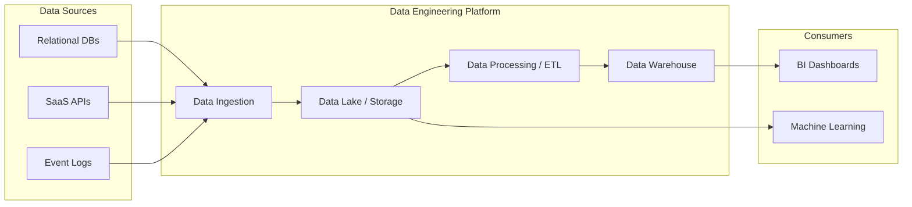

# Kỹ thuật Dữ liệu - Data Engineering

## Summary

Kỹ thuật Dữ liệu (Data Engineering) là bộ môn chuyên về thiết kế, xây dựng, vận hành và duy trì các hệ thống kiến trúc dữ liệu quy mô lớn. Nó đóng vai trò nền tảng trong mọi tổ chức hướng dữ liệu (data-driven), biến dữ liệu thô (raw data) hỗn độn từ nhiều nguồn thành một dạng có cấu trúc, đáng tin cậy để phục vụ cho các nhà phân tích dữ liệu (Data Analysts) và nhà khoa học dữ liệu (Data Scientists).

---

## Definition

**Data Engineering (Kỹ thuật Dữ liệu)** bao gồm các hoạt động liên quan đến việc thu thập, lưu trữ, xử lý và phân phối dữ liệu. Đây là kỹ năng kết hợp giữa kỹ thuật phần mềm (Software Engineering) và quản trị dữ liệu (Data Management). Một hệ thống Data Engineering chuẩn mực phải đảm bảo khả năng mở rộng (scalability), độ tin cậy (reliability) và tính bảo mật (security) cho luồng dữ liệu (data pipeline).

---

## Why it exists

Trong thời đại số, dữ liệu được sinh ra với tốc độ (Velocity), khối lượng (Volume) và mức độ đa dạng (Variety) cực kỳ lớn (khái niệm 3V của Big Data). Việc phân tích trực tiếp trên dữ liệu thô gặp phải các thách thức:
1. **Dữ liệu phân mảnh**: Dữ liệu nằm rải rác ở các hệ thống OLTP, third-party APIs, logs.
2. **Dữ liệu không đồng nhất và nhiễu**: Thiếu chuẩn hóa, nhiều dữ liệu rác, lỗi (missing values, duplicates).
3. **Hiệu suất kém**: Trích xuất lượng dữ liệu lớn từ hệ thống vận hành có thể gây tắc nghẽn (bottleneck).

Data Engineering tồn tại để tạo ra một "đường cao tốc" chuẩn hóa, làm sạch và tích hợp dữ liệu từ các "ngõ hẻm" (hệ thống nguồn) đưa về "nhà kho" trung tâm (Data Warehouse / Data Lake), cho phép phân tích một cách hiệu quả và an toàn.

---

## Core idea

Cốt lõi của Data Engineering xoay quanh các khái niệm:
* **Ingestion (Thu nạp)**: Kéo dữ liệu từ các nguồn khác nhau. Có thể thực hiện theo lô (Batch) hoặc luồng thời gian thực (Streaming).
* **Storage (Lưu trữ)**: Lựa chọn nền tảng lưu trữ tối ưu như Data Warehouse, Data Lake hoặc Data Lakehouse.
* **Processing & Transformation (Xử lý và Biến đổi)**: Quá trình ETL (Extract, Transform, Load) hoặc ELT, làm sạch (cleansing), tổng hợp (aggregating) và định dạng dữ liệu.
* **Orchestration (Điều phối)**: Quản lý lịch trình và sự phụ thuộc giữa các tác vụ xử lý dữ liệu (ví dụ: dùng Apache Airflow).

---

## How it works

Quá trình Kỹ thuật dữ liệu thường đi qua các giai đoạn sau:
1. Xác định yêu cầu dữ liệu từ các bên liên quan (Business/Analytics).
2. Xây dựng các Data Connector (Konektor dữ liệu) để kết nối vào hệ thống nguồn.
3. Thiết kế Data Pipeline để vận chuyển dữ liệu thô vào vùng đệm (Landing/Staging zone).
4. Áp dụng các quy tắc biến đổi dữ liệu (Business rules) thông qua SQL, Python hoặc Scala (dùng Spark).
5. Load dữ liệu đã xử lý vào các Data Marts hoặc bảng phục vụ (Serving tables).
6. Giám sát (Monitoring) luồng dữ liệu để phát hiện và xử lý lỗi kịp thời (Data Observability).

---

## Architecture / Flow



---

## Practical example

Giả sử bạn cần tính tổng doanh thu mỗi ngày từ một hệ thống bán hàng.

**1. Data Ingestion (Python/Pandas):** Lấy dữ liệu từ API.
```python
import requests
import pandas as pd

response = requests.get("https://api.store.com/v1/sales?date=2026-06-07")
data = response.json()
df_raw = pd.DataFrame(data)
# Lưu raw data vào Data Lake (S3) dưới dạng Parquet
df_raw.to_parquet("s3://data-lake/raw/sales/2026-06-07.parquet")
```

**2. Data Transformation (SQL / dbt):** Làm sạch và tính tổng.
```sql
-- Chạy trên Data Warehouse (ví dụ: BigQuery / Snowflake)
CREATE TABLE data_mart.daily_revenue AS
SELECT 
    DATE(transaction_timestamp) as sales_date,
    store_id,
    SUM(amount) as total_revenue
FROM staging.raw_sales
WHERE status = 'COMPLETED'
GROUP BY 1, 2;
```

---

## Best practices

* **Idempotency (Tính lũy đẳng)**: Đảm bảo pipeline có thể chạy lại nhiều lần mà vẫn cho ra cùng một kết quả, không làm nhân đôi dữ liệu.
* **Infrastructure as Code (IaC)**: Quản lý hạ tầng dữ liệu bằng mã nguồn (Terraform) để dễ dàng triển khai và kiểm soát phiên bản.
* **Data Quality Testing**: Luôn kiểm thử chất lượng dữ liệu (Null check, Uniqueness check) trong pipeline trước khi load vào bảng đích (sử dụng Great Expectations hoặc dbt tests).
* **Decoupling Storage and Compute**: Tách biệt lưu trữ và tính toán để dễ dàng mở rộng và tối ưu chi phí.

---

## Common mistakes

* **Quên thiết lập Alerting**: Pipeline bị lỗi nhưng không có thông báo, dẫn đến dashboard báo cáo dữ liệu sai lệch trong nhiều ngày.
* **Over-engineering**: Sử dụng các công cụ quá phức tạp (như Kafka, Spark) cho bài toán dữ liệu nhỏ chỉ cần SQL cơ bản và Cron job.
* **Bỏ qua Data Governance**: Không tạo metadata, data dictionary hoặc phân quyền dữ liệu ngay từ đầu, dẫn đến một "đầm lầy dữ liệu" (Data Swamp).

---

## Trade-offs

### Ưu điểm
* Tạo nền tảng vững chắc, đáng tin cậy cho mọi hoạt động phân tích và AI/ML của doanh nghiệp.
* Tự động hóa các tác vụ trích xuất và báo cáo thủ công, tiết kiệm hàng ngàn giờ làm việc.
* Đảm bảo tính nhất quán (Consistency) của dữ liệu toàn tổ chức.

### Nhược điểm
* Đòi hỏi chi phí nhân sự chất lượng cao và chi phí hạ tầng lớn.
* Quá trình xây dựng pipeline ban đầu tốn nhiều thời gian, ROI (Return on Investment) không thấy rõ ngay lập tức.
* Khó khăn trong việc duy trì khi hệ thống nguồn thay đổi cấu trúc liên tục (Schema evolution).

---

## When to use

* Khi tổ chức có nhiều nguồn dữ liệu cần kết hợp.
* Khi khối lượng dữ liệu vượt quá khả năng xử lý của các công cụ bảng tính (Excel/Google Sheets).
* Khi cần chạy các mô hình Machine Learning hoặc báo cáo BI tự động định kỳ.

## When not to use

* Khi doanh nghiệp chỉ có dữ liệu cực kỳ nhỏ và quy trình vận hành đơn giản.
* Khi phân tích trực tiếp trên hệ thống nguồn (OLTP) không gây ra bất kỳ vấn đề nào về hiệu năng.

---

## Related concepts

* [Data Engineer Role](/concepts/data-engineer-role)
* [Data Pipeline](/concepts/data-pipeline)
* [Data Platform Architecture](/concepts/data-platform-architecture)

---

## Interview questions

### 1. Phân biệt ETL và ELT. Khi nào dùng cái nào?
* **Người phỏng vấn muốn kiểm tra**: Hiểu biết về sự tiến hóa của kiến trúc dữ liệu và sự cân nhắc thiết kế.
* **Gợi ý trả lời**: 
  * **ETL (Extract, Transform, Load)**: Biến đổi dữ liệu trên một máy chủ trung gian (Processing Engine) trước khi nạp vào đích. Dùng khi đích lưu trữ không có khả năng tính toán mạnh hoặc cần che giấu dữ liệu nhạy cảm trước khi nạp.
  * **ELT (Extract, Load, Transform)**: Nạp toàn bộ dữ liệu thô vào Data Warehouse, sau đó dùng sức mạnh xử lý của DWH để biến đổi. Đây là xu hướng hiện tại nhờ Cloud DWH cực mạnh (BigQuery, Snowflake).
* **Lỗi cần tránh**: Trả lời rằng ETL lỗi thời và ELT luôn tốt hơn. Mỗi kiến trúc có use-case riêng biệt dựa trên chi phí và bảo mật.

### 2. Idempotency trong Data Pipeline là gì? Tại sao nó quan trọng?
* **Người phỏng vấn muốn kiểm tra**: Kinh nghiệm thực chiến với Data Pipeline và xử lý lỗi.
* **Gợi ý trả lời**: Idempotency là đặc tính đảm bảo một tác vụ dù được chạy 1 lần hay nhiều lần thì kết quả cuối cùng đối với hệ thống vẫn như nhau. Nếu pipeline bị fail giữa chừng, ta có thể an tâm bấm nút "Retry" mà không sợ bị lặp dữ liệu (duplicate records). Điều này thường đạt được bằng cách dùng thao tác `UPSERT` (MERGE) hoặc xóa dữ liệu của ngày hôm đó trước khi chạy lại (Delete-Write).

---

## References

1. **Fundamentals of Data Engineering** - Joe Reis, Matt Housley.
2. **Designing Data-Intensive Applications** - Martin Kleppmann.

---

## English summary

Data Engineering focuses on the practical application of data collection and analysis. It involves designing, building, and maintaining the infrastructure and data pipelines (ETL/ELT) that transform raw data into a clean, reliable, and accessible format. This foundational practice enables Data Analysts and Data Scientists to derive insights, build reports, and train machine learning models efficiently, ensuring data scalability, reliability, and security across the organization.
