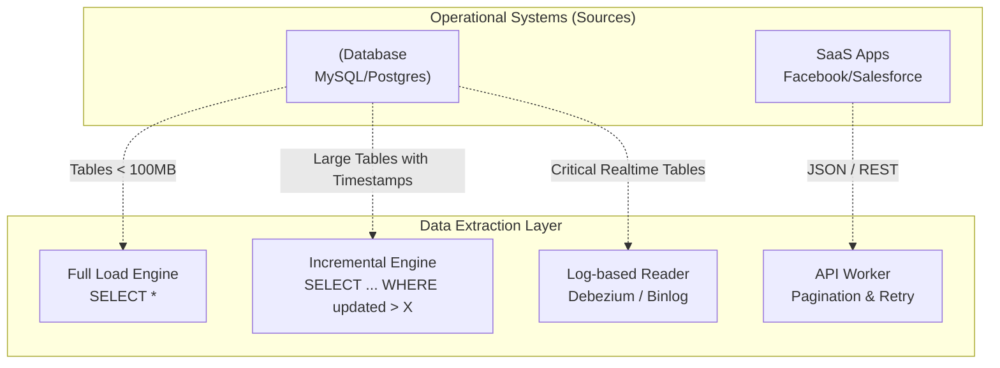

# Data Extraction

## Summary

Data Extraction (Trích xuất dữ liệu) là chữ "E" trong quy trình ETL/ELT. Đây là bước đầu tiên để thu thập, đọc và lấy dữ liệu thô ra khỏi các hệ thống lưu trữ gốc (như Cơ sở dữ liệu vận hành, hệ thống SaaS, tệp tin nhật ký). Do dữ liệu nguồn rất đa dạng và thường xuyên thay đổi, kỹ sư dữ liệu phải lựa chọn phương pháp trích xuất phù hợp (như Full Extraction, Incremental Extraction, hoặc CDC) để cân bằng giữa độ tươi mới của dữ liệu và áp lực hiệu năng đặt lên hệ thống vận hành.

---

## Definition

**Data Extraction** là quá trình kết nối tới một hệ thống nguồn, xác định phần dữ liệu cần thiết và kéo (pull/read) dữ liệu đó ra để đưa vào một hệ thống trung gian (như vùng Staging, luồng Kafka, hoặc trực tiếp vào Data Warehouse). 

Nhiệm vụ khó nhất của Extraction không phải là viết code kết nối, mà là trả lời câu hỏi: *"Làm thế nào để lấy được đúng dữ liệu cần thiết mà không làm gián đoạn hay làm chậm hệ thống phần mềm đang phục vụ khách hàng?"*

---

## Why it exists

Dữ liệu không bao giờ nằm sẵn ở nơi bạn muốn phân tích. Nó nằm rải rác ở:
* Postgres / MySQL (Nơi lưu đơn hàng, thông tin người dùng).
* API của Salesforce, Hubspot, Zendesk (Nơi lưu CRM khách hàng).
* Tệp tin CSV, Excel do đối tác gửi qua SFTP.
* Logs (Nơi lưu vết click chuột của người dùng trên web).

Mỗi hệ thống này có một ngôn ngữ truy vấn, giao thức (HTTP, TCP, FTP) và giới hạn bảo mật riêng. Data Extraction tồn tại để "nói" cùng ngôn ngữ với các hệ thống này, tuân thủ các quy tắc của chúng (như giới hạn Rate Limit của API) để rút dữ liệu ra một cách an toàn.

---

## Core idea

Việc trích xuất dữ liệu xoay quanh việc lựa chọn giữa hai thái cực (Phương pháp): **Lấy toàn bộ** hay **Chỉ lấy những gì thay đổi**.

Các mô hình trích xuất cơ bản:
1. **Full Extraction (Trích xuất toàn bộ)**: Kéo toàn bộ bảng dữ liệu từ nguồn mỗi khi chạy job.
2. **Incremental Extraction (Trích xuất gia tăng)**: Dựa vào một cột mốc (như cột `updated_at`) để chỉ lấy những dòng dữ liệu mới thêm hoặc mới sửa kể từ lần trích xuất trước đó.
3. **Log-based Extraction (Trích xuất dựa trên Nhật ký)**: Đọc thẳng từ các file nhật ký giao dịch (như Binlog của MySQL) để nhận biết mọi sự kiện thay đổi (Insert/Update/Delete) theo thời gian thực.

---

## How it works

Dưới đây là cách hoạt động chi tiết của từng phương pháp:

### 1. Full Extraction (Trích xuất toàn bộ)
* Cơ chế: `SELECT * FROM table`.
* Cách thức: Mỗi đêm, hệ thống ETL kết nối tới DB và tải về tất cả 10 triệu dòng của bảng `products`. Ở đích (Warehouse), bảng cũ bị xóa toàn bộ (`TRUNCATE`) và nạp lại bằng 10 triệu dòng mới này.
* Đặc điểm: Rất đơn giản để code, không cần logic theo dõi phức tạp. Nó luôn đảm bảo dữ liệu ở đích giống hệt với nguồn. Tuy nhiên, nó lãng phí băng thông mạng cực kỳ nghiêm trọng và làm chậm DB nguồn. Chỉ dùng cho các bảng danh mục nhỏ (vd: Bảng `country`, `status_code`).

### 2. Incremental Extraction (Trích xuất gia tăng)
* Cơ chế: `SELECT * FROM table WHERE updated_at > {last_run_time}`.
* Cách thức: Lần chạy đầu tiên lấy tất cả. Lần chạy thứ 2 (ví dụ ngày hôm sau), hệ thống ETL ghi nhớ con trỏ thời gian (High Watermark). Nó chỉ gửi truy vấn xin những dòng nào có cột `updated_at` lớn hơn thời điểm lưu trữ. 
* Đặc điểm: Tiết kiệm băng thông, nhanh chóng. Nhưng nó bị mù tịt đối với **Dữ liệu bị xóa (Hard deletes)**. Nếu một nhân viên xóa một dòng trong bảng gốc, bản ghi đó biến mất, cột `updated_at` không còn tồn tại để báo cho hệ thống ETL biết. Data Warehouse sẽ vẫn giữ bản ghi đó mãi mãi (Ghost data).

### 3. Log-based Extraction (Hay Change Data Capture - CDC)
* Cơ chế: Hệ thống ETL giả làm một bản sao cơ sở dữ liệu dự phòng (replica) và đọc trực tiếp file nhật ký giao dịch (Write-Ahead Log / Binlog).
* Cách thức: Mọi thao tác trên DB (INSERT, UPDATE, DELETE) đều được ghi vào Log trước. Hệ thống trích xuất đọc log này và truyền đi thành luồng sự kiện (stream).
* Đặc điểm: Khắc phục hoàn toàn nhược điểm của Incremental (bắt được cả sự kiện Delete). Tốc độ cực nhanh (real-time). Tuy nhiên, thiết lập hệ thống CDC (như Debezium + Kafka) rất phức tạp và đòi hỏi quyền truy cập quản trị (Admin) vào DB nguồn.

### 4. API Extraction (Trích xuất qua API)
* Cơ chế: Gửi các HTTP GET requests (`curl https://api.stripe.com/v1/charges`).
* Cách thức: Các hệ thống SaaS (Software as a Service) không cho phép bạn truy cập thẳng vào Database của họ. Bạn phải dùng API.
* Đặc điểm: Cực kỳ phức tạp vì phải xử lý:
  - **Pagination (Phân trang)**: Dữ liệu trả về hàng chục nghìn kết quả phải được bóc tách từng trang (Limit, Offset, Next Token).
  - **Rate Limiting**: Nếu gọi API quá 50 lần/giây, bên nguồn sẽ chặn kết nối (Error 429 Too Many Requests). Bạn phải code logic Retry và Backoff (chờ đợi rồi gọi lại).

---

## Architecture / Flow



---

## Practical example

Ví dụ một hàm trích xuất dữ liệu phân trang từ API sử dụng Python:

```python
import requests
import time

def extract_users_from_api(api_key):
    url = "https://api.example.com/v1/users"
    headers = {"Authorization": f"Bearer {api_key}"}
    users_data = []
    
    # Tham số phân trang
    params = {"limit": 100, "offset": 0}
    
    while True:
        response = requests.get(url, headers=headers, params=params)
        
        # Xử lý Rate Limit
        if response.status_code == 429:
            print("Rate limit hit. Sleeping for 10 seconds...")
            time.sleep(10)
            continue
            
        response.raise_for_status()
        data = response.json()
        
        users_data.extend(data['results'])
        
        # Kiểm tra nếu hết dữ liệu (Pagination kết thúc)
        if not data['has_more']:
            break
            
        params['offset'] += 100
        
    return users_data
```

---

## Best practices

* **Ưu tiên Incremental và CDC**: Trừ khi bảng dữ liệu là bảng danh mục tĩnh có kích thước rất nhỏ (như Danh sách quốc gia, tỷ giá), hãy luôn sử dụng phương pháp Incremental hoặc CDC để tiết kiệm thời gian chạy job và giảm chi phí I/O.
* **Theo dõi (Monitor) hệ thống nguồn**: Khi chạy lệnh trích xuất khối lượng lớn (Batch Extract), hãy theo dõi xem chỉ số CPU và I/O của cơ sở dữ liệu nguồn có bị tăng vọt (spike) không. Luôn đọc dữ liệu từ một bản sao (Read Replica) thay vì cơ sở dữ liệu chính yếu (Primary DB) để tránh làm sập hệ thống thanh toán của khách hàng.
* **Xử lý khóa chính (Primary Key)**: Luôn phải đảm bảo rằng nguồn bạn trích xuất có một hoặc nhiều cột đóng vai trò là Khóa Chính duy nhất. Nếu không có, bạn sẽ không thể thực hiện Upsert/Merge ở bước Load và dữ liệu của bạn ở DWH sẽ bị nhân đôi.

---

## Common mistakes

* **Tin tưởng tuyệt đối vào API bên thứ ba**: Cấu trúc JSON trả về từ các API của Facebook, Shopify có thể thay đổi âm thầm bất cứ lúc nào (Schema drift). Code trích xuất cứng nhắc sẽ bị vỡ. Cần phải trích xuất và nạp dữ liệu dưới dạng chuỗi JSON thô (Raw string) vào Data Warehouse trước, rồi mới dùng SQL để bung JSON ra ở bước Transform (Mô hình ELT).
* **Bỏ qua Hard Deletes**: Dùng phương pháp Incremental `updated_at` nhưng khách hàng có tính năng xóa tài khoản vĩnh viễn trên web. Kết quả là DB nguồn xóa tài khoản, nhưng báo cáo BI vẫn hiện tài khoản đó đang có doanh thu vì lệnh Extract không biết việc xóa đã diễn ra. (Giải pháp: Chuyển DB sang Soft Delete - thêm cột `is_deleted = true`, hoặc dùng CDC).

---

## Trade-offs

* **Full Extraction**:
  * *Ưu điểm*: Đơn giản nhất, an toàn, giải quyết bài toán Hard Deletes triệt để (bảng đích luôn giống bảng nguồn 100%).
  * *Nhược điểm*: Chạy quá chậm, tốn băng thông, không thể áp dụng cho các bảng có hàng tỷ dòng.
* **Incremental Extraction**:
  * *Ưu điểm*: Nhanh, nhẹ, dễ cài đặt bằng SQL.
  * *Nhược điểm*: Mù lòa với Hard Deletes, phụ thuộc vào việc hệ thống nguồn bắt buộc phải có và cập nhật đúng cột `updated_at`.
* **Log-based CDC**:
  * *Ưu điểm*: Tốc độ real-time, lấy được trạng thái mọi thao tác (Insert/Update/Delete).
  * *Nhược điểm*: Phức tạp nhất để thiết lập, yêu cầu cài đặt phần mềm trực tiếp lên máy chủ DB.

---

## When to use

* Bước khởi đầu bắt buộc của mọi Data Pipeline trước khi thực hiện Transform hay Load.

## When not to use

* Nếu một hệ thống chia sẻ cùng một môi trường Data Warehouse với hệ thống ứng dụng (ví dụ cả App và BI cùng đọc chung một database), không cần bước Extract vật lý qua mạng. Có thể thực hiện Transform thẳng qua View (Tuy nhiên mô hình này rất hiếm và dễ sập ở các hệ thống lớn).

---

## Related concepts

* [Incremental Load](/concepts/incremental-load)
* [Change Data Capture (CDC)](/concepts/change-data-capture)
* [Data Ingestion](/concepts/data-ingestion)
* [ETL](/concepts/etl)

---

## Interview questions

### 1. Nêu 3 chiến lược chính để trích xuất dữ liệu từ một cơ sở dữ liệu quan hệ. Bạn sẽ chọn chiến lược nào cho một bảng có 500 triệu dòng?
* **Người phỏng vấn muốn kiểm tra**: Kiến thức tổng quát về Data Extraction và khả năng chọn giải pháp cho Big Data.
* **Gợi ý trả lời (Strong Answer)**: 
  3 chiến lược là Full Load (Lấy toàn bộ), Incremental Load qua cột thời gian (Watermark), và Log-based CDC (Bắt thay đổi qua Binlog). Đối với bảng 500 triệu dòng, **Tuyệt đối không dùng Full Load** vì việc quét 500 triệu dòng mỗi ngày sẽ làm sập DB và tốn hàng chục giờ. Tùy theo yêu cầu độ trễ: Nếu yêu cầu batch hàng ngày, tôi sẽ dùng Incremental Load qua cột `updated_at`. Nếu bảng có tính năng hard delete hoặc yêu cầu near real-time, tôi sẽ sử dụng Log-based CDC (như Debezium) để đọc binlog.

### 2. API Pagination là gì? Tại sao nó là một thách thức lớn trong Data Extraction?
* **Người phỏng vấn muốn kiểm tra**: Kinh nghiệm thực chiến làm việc với API.
* **Gợi ý trả lời (Strong Answer)**:
  Pagination (phân trang) là cơ chế API chia nhỏ khối lượng dữ liệu khổng lồ thành các trang nhỏ (ví dụ 100 kết quả/trang) để tránh quá tải máy chủ. Thách thức lớn là kỹ sư dữ liệu phải viết một vòng lặp (while-loop) theo dõi khóa trang tiếp theo (next cursor/offset). Nếu trong lúc vòng lặp đang chạy ở trang 50 mà kết nối mạng bị rớt (timeout), hệ thống extraction nếu code không tốt sẽ phải gọi lại API từ trang 1, dẫn tới trùng lặp dữ liệu hoặc bị API chặn vì gọi quá nhiều lần. Việc quản lý trạng thái (state management) khi lặp qua API là bài toán phức tạp nhất khi viết các Custom Connector.

---

## References

1. **Fundamentals of Data Engineering** - Joe Reis, Matt Housley.
2. **Airbyte Documentation** - "Understanding Full Refresh vs Incremental Syncs".

---

## English summary

Data Extraction is the initial phase in the ETL/ELT pipeline where raw data is pulled from source systems (Databases, SaaS APIs, Logs) to a centralized storage. Depending on data volume and latency requirements, engineers choose between Full Extraction (replicating the entire table, suitable for small reference data), Incremental Extraction (querying only new/updated rows using timestamps, efficient but misses hard deletes), and Log-based Change Data Capture (CDC) (reading database transaction logs for real-time, exact replica streams). Working with external APIs presents additional extraction challenges such as pagination and rate-limiting.
