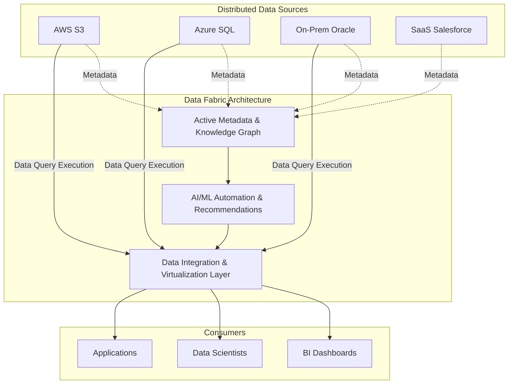

# Data Fabric

## Summary

Data Fabric (Lưới dệt dữ liệu) là một khái niệm kiến trúc quản lý dữ liệu sử dụng công nghệ tự động hóa, siêu dữ liệu (metadata) chủ động và trí tuệ nhân tạo (AI/ML) để tích hợp, kết nối và quản lý dữ liệu một cách linh hoạt bất kể vị trí vật lý của dữ liệu đó nằm ở đâu (On-premises, đa đám mây, hay lưu trữ biên). Mục đích là tạo ra một lớp mạng lưới liền mạch, cung cấp cái nhìn thống nhất để tìm kiếm và truy xuất dữ liệu mà không cần di chuyển toàn bộ dữ liệu vào một kho trung tâm duy nhất.

---

## Definition

Theo Gartner, **Data Fabric** là một khuôn mẫu thiết kế kiến trúc cung cấp khả năng tích hợp linh hoạt, linh động của các endpoint dữ liệu trên nhiều môi trường nền tảng khác nhau. 

Thay vì bắt buộc kỹ sư phải viết mã luân chuyển dữ liệu từ A sang B (ETL) bằng sức người, Data Fabric hoạt động như một lớp mạng lưới trừu tượng. Lớp lưới này liên tục quét (scan) các siêu dữ liệu, học hỏi hành vi sử dụng của người dùng, từ đó đề xuất hoặc tự động điều phối cách kết nối, tích hợp dữ liệu giữa người dùng cuối và dữ liệu lưu trong bất kỳ Data Lake/Warehouse nào.

---

## Why it exists

Những năm gần đây, dữ liệu doanh nghiệp không chỉ phát triển theo chiều dọc (kích thước lớn hơn) mà còn phát triển theo chiều ngang: phân mảnh khủng khiếp trên hàng loạt môi trường: Amazon S3 (AWS), BigQuery (GCP), CSDL Oracle (On-premise), các ứng dụng SaaS như Salesforce, v.v.

Việc cố gắng "bơm" (ingest) toàn bộ dữ liệu từ mọi nguồn về một Data Lake duy nhất trở nên cực kỳ tốn thời gian, tốn kém chi phí mạng (egress cost) và vi phạm nhiều quy định bảo mật biên giới dữ liệu (như GDPR). 

Data Fabric ra đời để trả lời cho câu hỏi: *"Làm thế nào để các nhà phân tích có thể truy vấn và kết nối tất cả dữ liệu phân tán này mà không cần đợi Kỹ sư dữ liệu viết hàng ngàn đường ống ETL để copy vật lý chúng về một nơi?"*

---

## Core idea

Cốt lõi của Data Fabric dựa vào **Active Metadata (Siêu dữ liệu chủ động)** kết hợp **Knowledge Graph (Đồ thị tri thức)**.

Khác với siêu dữ liệu thụ động (ví dụ: chỉ ghi chú bảng A được tạo ngày nào), Active Metadata liên tục giám sát ai đang đọc bảng A, bảng A được dùng kết hợp với bảng B thế nào, và thuật toán ML tự động chạy phân tích đồ thị để đề xuất: *"Hệ thống thấy người dùng ở bộ phận Marketing thường xuyên JOIN dữ liệu Khách hàng trên Salesforce với Log Web trên AWS. Hệ thống sẽ tự động tạo một khung nhìn ảo hóa (Virtualization) liên kết 2 nguồn này để những người khác ở Marketing dùng cho tiện"*.

---

## How it works

Hệ thống Data Fabric thường được xây dựng với các lớp cấu trúc:
1. **Lớp thu thập siêu dữ liệu (Metadata Ingestion)**: Liên tục "lắng nghe" và thu thập dữ liệu về cách dữ liệu khác hoạt động từ tất cả hệ thống.
2. **Lớp Đồ thị Tri thức (Knowledge Graph)**: Vẽ ra biểu đồ các mối quan hệ ngữ nghĩa giữa dữ liệu và thuật ngữ kinh doanh.
3. **Động cơ Đề xuất & Tự động hóa bằng AI (AI/ML Engine)**: Tìm ra các mẫu sử dụng dữ liệu để tự động hóa việc làm sạch, ánh xạ định dạng, tạo các Data Pipeline tự động.
4. **Lớp giao nhận và ảo hóa dữ liệu (Data Virtualization / Delivery)**: Trừu tượng hóa nơi lưu trữ vật lý, cung cấp một đầu mối truy vấn duy nhất qua API hoặc SQL để Data Analysts có thể sử dụng mà không cần quan tâm dữ liệu đó thực tế đang ở AWS hay On-premise.

---

## Architecture / Flow



---

## Practical example

Một ngân hàng đa quốc gia có chi nhánh tại Châu Âu và Việt Nam. Luật GDPR cấm di chuyển dữ liệu thông tin cá nhân khách hàng Châu Âu ra khỏi lãnh thổ. 

Họ áp dụng công nghệ Data Fabric (sử dụng công cụ ảo hóa như Denodo). Kỹ sư dữ liệu không cần viết ETL để tải data Châu Âu về trung tâm.
Khi nhà quản trị muốn biết "Tổng tài sản rủi ro toàn cầu", họ viết một câu truy vấn SQL lên lớp ảo hóa của Data Fabric. Data Fabric sẽ sử dụng siêu dữ liệu, tự động biên dịch câu truy vấn đó thành 2 phần, gửi một truy vấn tới server ở Châu Âu, gửi một truy vấn tới server Việt Nam. Việc thực thi tính toán diễn ra tại nguồn, Data Fabric chỉ thu nhận kết quả cuối cùng (các con số vô danh) và ghép (JOIN) lại thành báo cáo tổng.

Ví dụ, người dùng chỉ cần viết một câu truy vấn hợp nhất duy nhất trên giao diện ảo hóa của Data Fabric (như Trino hoặc Denodo) mà không cần quan tâm dữ liệu thực sự đang nằm ở đâu:

```sql
-- Truy vấn hợp nhất trên Data Fabric
-- Người dùng không cần biết 'customer_eu' nằm ở PostgreSQL (Châu Âu) 
-- và 'customer_vn' nằm ở Oracle (Việt Nam). Lớp ảo hóa sẽ lo việc định tuyến.

SELECT 
    'Europe' as region,
    COUNT(*) as total_high_risk_customers,
    SUM(credit_exposure) as total_risk_asset
FROM fabric_virtual_schema.customer_eu
WHERE risk_score > 80

UNION ALL

SELECT 
    'Vietnam' as region,
    COUNT(*) as total_high_risk_customers,
    SUM(credit_exposure) as total_risk_asset
FROM fabric_virtual_schema.customer_vn
WHERE risk_score > 80;
```

---

## Best practices

* **Đầu tư vào Data Virtualization (Ảo hóa dữ liệu)**: Ảo hóa là trái tim của Data Fabric để không phải copy dữ liệu. Hãy chọn các công cụ ảo hóa có khả năng chia đẩy tính toán xuống nguồn (push-down computation) tốt.
* **Xây dựng Active Metadata một cách hệ thống**: Data Fabric không thể hoạt động tự động nếu không có siêu dữ liệu về kỹ thuật, nghiệp vụ và vận hành. Cần tích hợp các công cụ Data Catalog xuất sắc ngay từ ngày đầu.

---

## Common mistakes

* **Nhầm lẫn Data Fabric với một sản phẩm phần mềm duy nhất**: Nhiều nhà cung cấp đám mây hứa hẹn bán giải pháp "Chìa khóa trao tay Data Fabric". Thực tế, Data Fabric là một kiến trúc thiết kế đòi hỏi kết hợp nhiều công cụ khác nhau (Data Catalog, Data Virtualization, Orchestration).
* **Bỏ qua hiệu suất truy vấn**: Ảo hóa dữ liệu truy xuất thẳng vào cơ sở dữ liệu vận hành có thể làm quá tải hệ thống nguồn nếu truy vấn đó không được quản lý tốt (Cần có cơ chế caching và query optimization tại lớp ảo hóa).

---

## Trade-offs

### Ưu điểm
* Giải quyết triệt để sự phân mảnh dữ liệu (Silos) mà không tốn chi phí và công sức copy/di chuyển dữ liệu (ETL).
* Giảm rủi ro tuân thủ bảo mật vì dữ liệu nhạy cảm có thể nằm yên tại máy chủ ban đầu, chỉ kết quả phân tích mới được di chuyển.
* Tự động hóa đáng kể quy trình Data Engineering truyền thống thông qua AI/ML.

### Nhược điểm
* **Trì hoãn (Latency)**: Các truy vấn phân tích liên mạng (ảo hóa qua cloud khác nhau) thường chậm hơn rất nhiều so với truy vấn trong một kho dữ liệu trung tâm đã đánh index và tối ưu (Data Warehouse).
* Công nghệ vẫn còn rất mới, đắt đỏ và phức tạp để làm chủ hoàn toàn, đặc biệt là các thành phần AI tự động điều phối.

---

## When to use

* Các tổ chức/tập đoàn cực lớn đang vận hành trong môi trường công nghệ hỗn hợp đa dạng (Hybrid-cloud, Multi-cloud) với nhiều quy định kiểm soát dữ liệu nghiêm ngặt.
* Tồn tại hàng ngàn nguồn dữ liệu nhưng không thể dồn chúng về một Data Warehouse do chi phí Egress quá cao.

## When not to use

* Các startup hoặc doanh nghiệp chỉ hoạt động trên một hệ sinh thái Cloud duy nhất (ví dụ chỉ ở AWS). Lúc này một cấu trúc Data Warehouse/Data Lakehouse trung tâm truyền thống sẽ rẻ, nhanh và hiệu quả hơn.

---

## Related concepts

* [Data Mesh](/concepts/data-mesh)
* [Data Lake](/concepts/data-lake)
* [Modern Data Stack](/concepts/modern-data-stack)

---

## Interview questions

### 1. Phân biệt Data Fabric và Data Mesh.
* **Người phỏng vấn muốn kiểm tra**: Khả năng phân biệt hai "buzzword" nổi tiếng bậc nhất về kiến trúc dữ liệu hiện đại.
* **Gợi ý trả lời (Strong Answer)**: Data Mesh là mô hình kiến trúc về mặt **tổ chức và văn hóa**, nhấn mạnh vào việc con người (theo domain) quản lý dữ liệu như một sản phẩm phân tán. Data Fabric ngược lại là một phương pháp tiếp cận thiên về **công nghệ**, sử dụng Trí tuệ nhân tạo (AI/ML) và siêu dữ liệu (Metadata) để tự động hóa việc kết nối, khám phá và ánh xạ các dữ liệu từ các kho lưu trữ vật lý khác nhau một cách mượt mà. Ta có thể nói: Mesh là giải pháp về tư duy con người, Fabric là giải pháp bằng máy móc/AI.

### 2. Vai trò của Active Metadata trong kiến trúc Data Fabric là gì?
* **Người phỏng vấn muốn kiểm tra**: Kiến thức sâu về động lực vận hành của Data Fabric.
* **Gợi ý trả lời (Strong Answer)**: Siêu dữ liệu chủ động (Active metadata) là "bộ não" của Data Fabric. Thay vì chỉ ghi chép thông tin lưu trữ tĩnh, nó liên tục theo dõi hành vi truy cập (logs), cấu trúc truy vấn, và hiệu năng hệ thống. Dữ liệu này được cấp cho các thuật toán học máy (AI/ML) để hệ thống Data Fabric có thể tự động cảnh báo lỗi, đề xuất liên kết (join recommendations), định tuyến lại đường truyền truy vấn tối ưu nhất hoặc tự động tạo ra một đường ống ETL.

---

## References

1. **Gartner Research** - Top Strategic Technology Trends for 2022: Data Fabric.
2. **O'Reilly Media** - Data Fabric and Data Mesh (Sách phân tích sự kết hợp giữa 2 kiến trúc).

---

## English summary

Data Fabric is a technology-driven architectural framework designed to automate the discovery, integration, and delivery of distributed data across hybrid and multi-cloud environments. By leveraging Active Metadata, Knowledge Graphs, and AI/ML, it dynamically suggests and automates data connections and processing pipelines. Often utilizing Data Virtualization, it enables organizations to query dispersed data sources seamlessly as if they were a single repository, without the need for physically moving or copying massive amounts of data, thereby ensuring compliance and agility.
