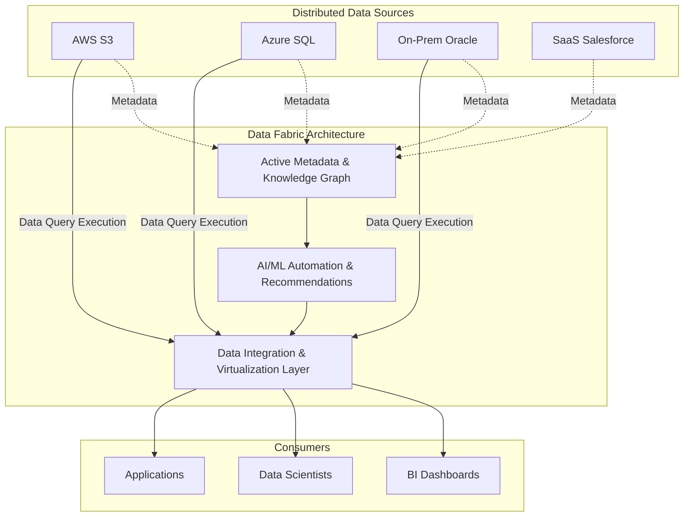

# Data Fabric (Dệt dữ liệu): Kiến trúc tự động hóa kết nối dữ liệu đa đám mây

Trong những năm gần đây, dữ liệu doanh nghiệp không chỉ bùng nổ về mặt kích thước mà còn phân mảnh mạnh mẽ theo chiều ngang. Bạn sẽ dễ dàng bắt gặp những kịch bản mà dữ liệu giao dịch nằm ở hệ thống On-premises (máy chủ vật lý tại công ty), dữ liệu phân tích nằm trên Google BigQuery, tệp log người dùng lưu trên AWS S3, còn thông tin khách hàng lại nằm rải rác trong các ứng dụng SaaS như Salesforce.

Việc cố gắng gom (ingest) toàn bộ dữ liệu khổng lồ này về một Data Lake duy nhất bằng sức người đang trở nên cực kỳ tốn thời gian, tốn kém chi phí đường truyền và thường xuyên vấp phải các rào cản pháp lý về biên giới dữ liệu. Trước thực tế đó, **Data Fabric (Lưới dệt dữ liệu)** xuất hiện như một giải pháp cứu cánh giúp kết nối thế giới dữ liệu phân mảnh này mà không cần dịch chuyển vật lý.

---

## Kiến trúc Data Fabric thực chất là gì?

Theo định nghĩa từ Gartner, **Data Fabric** là một khuôn mẫu thiết kế kiến trúc cung cấp khả năng tích hợp linh hoạt, năng động giữa các đầu mối (endpoints) dữ liệu trên nhiều môi trường nền tảng khác nhau.

Thay vì bắt buộc các kỹ sư dữ liệu phải viết hàng ngàn dòng code ETL để copy dữ liệu từ nơi này sang nơi khác bằng sức người, Data Fabric hoạt động như một lớp mạng lưới trừu tượng dệt lên trên tất cả các kho lưu trữ. Lớp lưới này liên tục quét siêu dữ liệu (metadata), học hỏi hành vi sử dụng của người dùng, từ đó đề xuất hoặc tự động điều phối cách kết nối, tích hợp dữ liệu giữa người dùng cuối và dữ liệu lưu ở bất kỳ nơi đâu.

---

## Ý tưởng cốt lõi: Khi Siêu dữ liệu chủ động (Active Metadata) lên ngôi

Trái tim của kiến trúc Data Fabric nằm ở sự kết hợp giữa **Siêu dữ liệu chủ động (Active Metadata)** và **Đồ thị tri thức (Knowledge Graph)**.

Khác với siêu dữ liệu thụ động (chỉ ghi chép đơn thuần các thông tin tĩnh như ngày tạo bảng, kiểu dữ liệu), Active Metadata liên tục giám sát xem:
* Ai đang đọc bảng dữ liệu này?
* Bảng dữ liệu này thường được kết hợp (JOIN) với bảng nào khác?
* Hiệu năng truy vấn của hệ thống ra sao?

Từ đó, các thuật toán Machine Learning sẽ tự động phân tích đồ thị tri thức để đưa ra đề xuất thông minh: *"Hệ thống nhận thấy bộ phận Marketing thường xuyên kết hợp dữ liệu Khách hàng trên Salesforce với dữ liệu Log Web trên AWS. Hệ thống sẽ tự động tạo ra một khung nhìn ảo hóa (Virtual View) liên kết hai nguồn này để tối ưu hóa hiệu quả làm việc."*

---

## Mô hình kiến trúc hoạt động của Data Fabric

Một hệ thống Data Fabric hoàn chỉnh thường được cấu thành từ các lớp chức năng sau:



1. **Lớp thu thập siêu dữ liệu (Metadata Ingestion)**: Liên tục lắng nghe và ghi nhận các sự kiện về cách dữ liệu hoạt động từ tất cả hệ thống.
2. **Lớp Đồ thị Tri thức (Knowledge Graph)**: Trực quan hóa các mối quan hệ ngữ nghĩa giữa dữ liệu kỹ thuật và các thuật ngữ nghiệp vụ kinh doanh.
3. **Động cơ Đề xuất & Tự động hóa bằng AI**: Phát hiện các mô thức sử dụng dữ liệu để tự động hóa việc làm sạch, ánh xạ định dạng và sinh ra các pipeline tích hợp.
4. **Lớp giao nhận và ảo hóa dữ liệu (Data Virtualization)**: Trừu tượng hóa vị trí vật lý của dữ liệu, cung cấp một cổng truy vấn duy nhất. Data Analyst chỉ cần viết một câu SQL chung mà không cần quan tâm dữ liệu thực tế đang nằm ở AWS S3 hay Oracle On-premise.

---

## Ví dụ thực tế: Giải quyết bài toán tuân thủ GDPR của ngân hàng

Giả sử một ngân hàng đa quốc gia có chi nhánh tại Châu Âu và Việt Nam. Luật GDPR nghiêm cấm việc di chuyển thông tin cá nhân của khách hàng Châu Âu ra ngoài lãnh thổ của họ.

Bằng cách áp dụng công nghệ Data Fabric (sử dụng các công cụ ảo hóa dữ liệu như Denodo hoặc Trino), kỹ sư dữ liệu không cần phải viết code ETL chuyển dữ liệu từ Châu Âu về máy chủ trung tâm tại Việt Nam. Khi giám đốc rủi ro muốn xem báo cáo "Tổng tài sản rủi ro toàn cầu", họ chỉ cần viết một câu truy vấn SQL lên lớp ảo hóa của Data Fabric. 

Hệ thống Data Fabric sẽ tự động phân tích câu SQL, tách nó thành hai truy vấn con gửi đến máy chủ tại Châu Âu và Việt Nam. Việc tính toán sẽ diễn ra ngay tại nguồn, Data Fabric chỉ thu nhận kết quả cuối cùng (các con số tổng hợp phi định danh) rồi ghép chúng lại thành báo cáo tổng hợp.

Dưới đây là ví dụ về câu truy vấn hợp nhất trên lớp ảo hóa mà người dùng thực thi:

```sql
-- Truy vấn hợp nhất trên Data Fabric
-- Người dùng không cần biết 'customer_eu' nằm ở PostgreSQL (Châu Âu) 
-- và 'customer_vn' nằm ở Oracle (Việt Nam). Lớp ảo hóa sẽ lo việc định tuyến.

SELECT 
    'Europe' as region,
    COUNT(*) as total_high_risk_customers,
    SUM(credit_exposure) as total_risk_asset
FROM fabric_virtual_schema.customer_eu
WHERE risk_score > 80

UNION ALL

SELECT 
    'Vietnam' as region,
    COUNT(*) as total_high_risk_customers,
    SUM(credit_exposure) as total_risk_asset
FROM fabric_virtual_schema.customer_vn
WHERE risk_score > 80;
```

---

## Kinh nghiệm triển khai thực tế (Best Practices)

* **Chú trọng công nghệ Ảo hóa dữ liệu (Data Virtualization)**: Ảo hóa chính là xương sống giúp bạn khai thác dữ liệu mà không cần sao chép. Hãy lựa chọn các công nghệ hỗ trợ cơ chế tối ưu hóa truy vấn đẩy tính toán xuống nguồn (`push-down computation`) tốt để tránh tắc nghẽn đường truyền mạng.
* **Xây dựng Active Metadata một cách bài bản**: Data Fabric không thể tự động hóa nếu thiếu đi thông tin về cách hệ thống hoạt động. Việc tích hợp các công cụ Data Catalog mạnh mẽ từ đầu là yếu tố sống còn cho sự thành bại của dự án.

---

## Những sai lầm dễ mắc phải

* **Coi Data Fabric là một phần mềm mua sẵn**: Rất nhiều nhà cung cấp quảng cáo giải pháp "Data Fabric trọn gói". Thực tế, Data Fabric là một tư duy và kiến trúc thiết kế kết hợp từ nhiều công cụ (Catalog, Virtualization, Orchestration, AI/ML).
* **Bỏ qua bài toán hiệu năng hệ thống nguồn**: Khi bạn chạy các câu lệnh ảo hóa trực tiếp trên cơ sở dữ liệu vận hành (OLTP) của doanh nghiệp, nó có thể làm chậm toàn bộ ứng dụng chính nếu câu truy vấn không được tối ưu hoặc thiếu cơ chế lưu trữ đệm (caching).

---

## Ưu điểm và nhược điểm (Trade-offs)

### Ưu điểm
* Giải quyết triệt để vấn đề phân mảnh dữ liệu (Silos) mà không tốn chi phí và công sức xây dựng hệ thống ETL luân chuyển dữ liệu vật lý.
* Đảm bảo tính tuân thủ bảo mật và quyền riêng tư vì dữ liệu nhạy cảm được giữ nguyên tại nguồn gốc.
* Tối giản hóa công việc thủ công của kỹ sư dữ liệu nhờ khả năng tự động hóa của trí tuệ nhân tạo.

### Nhược điểm & Thách thức
* **Độ trễ truy vấn (Latency)**: Các câu lệnh truy xuất ảo hóa liên mạng giữa các đám mây khác nhau chắc chắn sẽ chậm hơn rất nhiều so với việc truy vấn trực tiếp trên một kho dữ liệu tập trung đã được tối ưu hóa chỉ mục (Index).
* Chi phí đầu tư ban đầu cho các công nghệ dệt dữ liệu tự động này là rất lớn và đòi hỏi trình độ làm chủ công nghệ cao.

---

## Khi nào nên và không nên sử dụng Data Fabric?

### Hãy chọn Data Fabric khi:
* Doanh nghiệp là một tập đoàn đa quốc gia có hạ tầng công nghệ hỗn hợp cực kỳ phức tạp (Hybrid-cloud, Multi-cloud) và phải tuân thủ nghiêm ngặt các quy định pháp lý về biên giới dữ liệu.
* Có hàng ngàn nguồn dữ liệu phân tán nhưng chi phí truyền tải (Egress cost) quá lớn để có thể gom tất cả về một chỗ.

### Chưa nên chọn khi:
* Doanh nghiệp của bạn là một công ty khởi nghiệp hoặc chỉ sử dụng một hệ sinh thái đám mây duy nhất (ví dụ chỉ dùng AWS). Khi đó, kiến trúc Data Warehouse hoặc Data Lakehouse tập trung truyền thống sẽ hoạt động nhanh hơn, rẻ hơn và dễ quản lý hơn nhiều.

---

## Góc phỏng vấn: Những câu hỏi thường gặp

### 1. Hãy phân biệt sự khác nhau giữa Data Fabric và Data Mesh?
* **Mục đích của người phỏng vấn**: Đánh giá khả năng phân biệt hai khái niệm kiến trúc dữ liệu hiện đại thường bị nhầm lẫn với nhau.
* **Gợi ý trả lời**: 
  * **Data Mesh** là một mô hình tiếp cận thiên về **tổ chức và văn hóa**. Nó phân rã quyền sở hữu dữ liệu cho các đội ngũ nghiệp vụ (domain teams) tự quản lý dữ liệu của họ như một sản phẩm độc lập.
  * **Data Fabric** là một giải pháp tiếp cận thiên về **công nghệ**. Nó sử dụng Trí tuệ nhân tạo (AI/ML) và Siêu dữ liệu chủ động để tự động hóa việc kết nối, khám phá và dệt các nguồn dữ liệu vật lý lại với nhau.
  * *Tóm lại*: Data Mesh giải quyết bài toán bằng cách phân chia vai trò con người; Data Fabric giải quyết bằng cách áp dụng công nghệ tự động hóa của máy móc.

### 2. Vai trò thực sự của Active Metadata trong Data Fabric là gì?
* **Mục đích của người phỏng vấn**: Kiểm tra xem bạn có hiểu rõ động lực vận hành cốt lõi của kiến trúc này hay không.
* **Gợi ý trả lời**: Active Metadata đóng vai trò như "bộ não" điều khiển toàn bộ lưới Data Fabric. Khác với metadata tĩnh, nó liên tục thu thập nhật ký truy cập, sơ đồ truy vấn và các thông số hiệu năng thời gian thực. Sau đó, nó cung cấp các thông tin này cho công cụ AI để hệ thống tự động phát hiện lỗi, đề xuất cách JOIN các bảng hiệu quả, định tuyến câu truy vấn tối ưu hoặc tự động dựng lên luồng tích hợp dữ liệu.

---

## Tài liệu tham khảo hữu ích
1. **Gartner Research** - Hướng dẫn chi tiết về các xu hướng công nghệ chiến lược: Data Fabric.
2. **O'Reilly Media** - Tập sách phân tích sự giao thoa và kết hợp giữa Data Fabric và Data Mesh.

---

## Tóm tắt bằng tiếng Anh (English Summary)

**Data Fabric** is a technology-driven architectural framework designed to automate the discovery, integration, and delivery of distributed data across hybrid and multi-cloud environments. By leveraging Active Metadata, Knowledge Graphs, and AI/ML, it dynamically suggests and automates data connections and processing pipelines. Often utilizing Data Virtualization, it enables organizations to query dispersed data sources seamlessly as if they were a single repository, without the need for physically moving or copying massive amounts of data, thereby ensuring compliance and agility.
