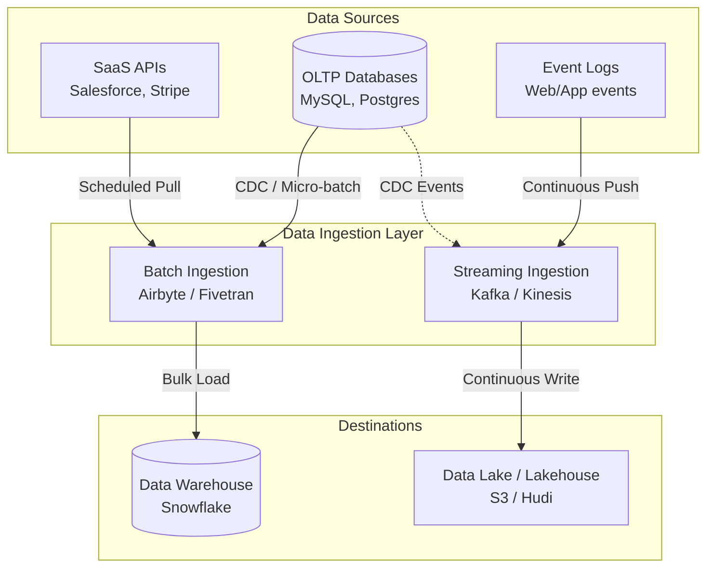

# Data Ingestion

## Summary

Data Ingestion (Thu nạp dữ liệu) là bước đầu tiên và cốt lõi trong bất kỳ vòng đời dữ liệu (Data Lifecycle) nào. Nó là quá trình thu thập, vận chuyển và hấp thụ dữ liệu từ vô số các nguồn bên ngoài (Cơ sở dữ liệu, APIs, Thiết bị IoT, Logs) vào một hệ thống lưu trữ đích trung tâm (như Data Lake hoặc Data Warehouse) để chuẩn bị cho việc xử lý và phân tích sau này.

---

## Definition

**Data Ingestion** ám chỉ toàn bộ cơ chế cơ sở hạ tầng có nhiệm vụ di chuyển dữ liệu từ điểm A (Source) sang điểm B (Destination) một cách an toàn và trọn vẹn. Trong quy trình ETL/ELT, Data Ingestion bao hàm toàn bộ giai đoạn "E" (Extract - Trích xuất) và giai đoạn "L" (Load - Nạp), đóng vai trò như hệ thống "đường ống nước" chính yếu cung cấp nguồn tài nguyên thô cho toàn bộ công ty.

Quá trình này không tập trung vào việc biến đổi nghiệp vụ phức tạp (Business logic transformations), mà tập trung vào **độ tin cậy (reliability), khả năng mở rộng (scalability)** và **đảm bảo không mất mát dữ liệu (no data loss)** trên đường truyền.

---

## Why it exists

Dữ liệu của một doanh nghiệp là mạch máu, nhưng chúng được sinh ra ở những nơi hoàn toàn cô lập:
* Khách hàng đăng ký tài khoản trên app (Lưu ở Postgres).
* Khách hàng xem sản phẩm, click chuột (Lưu ở dạng tệp Log server).
* Giao dịch thanh toán qua cổng điện tử (Lấy qua REST API của Stripe/Paypal).

Doanh nghiệp không thể ra quyết định nếu không chắp vá những mảnh ghép này lại. Nhưng hệ thống nguồn không được thiết kế để đẩy dữ liệu đi, chúng chỉ lo việc chạy ứng dụng. Data Ingestion tồn tại như một hệ thống vận chuyển hậu cần (Logistics) chuyên nghiệp: đến lấy hàng đúng giờ, đóng gói an toàn, và chở về kho trung tâm mà không làm gián đoạn việc kinh doanh tại cửa hàng nguồn.

---

## Core idea

Cơ chế thu nạp dữ liệu được chia làm 2 mô hình (Paradigm) chính dựa trên độ trễ thời gian (Latency):

1. **Batch Ingestion (Thu nạp theo lô)**:
   * Thu thập một cụm dữ liệu lớn định kỳ theo lịch trình (ví dụ: chạy mỗi đêm lúc 1h sáng, hoặc mỗi 4 tiếng một lần).
   * Phù hợp cho việc lấy báo cáo tài chính ngày, sao lưu toàn bộ Database tĩnh.
   * Ưu điểm: Đơn giản, dễ theo dõi lỗi, tối ưu băng thông mạng.
   
2. **Streaming / Real-time Ingestion (Thu nạp luồng)**:
   * Dữ liệu được thu thập và di chuyển ngay lập tức từng bản ghi (record-by-record) ngay khi nó vừa sinh ra (tính bằng milli-giây).
   * Phù hợp cho phát hiện gian lận thẻ tín dụng (Fraud detection), bảng xếp hạng game, khuyến nghị (Recommendation system).
   * Ưu điểm: Phản ứng tức thì. Nhược điểm: Kiến trúc phức tạp, đắt đỏ và yêu cầu hệ thống luôn mở (Always-on).

---

## How it works

Dưới đây là cách một công cụ Data Ingestion tự động (như Airbyte hoặc Fivetran) hoạt động theo lô (Batch Incremental):

1. **Kết nối (Connection)**: Công cụ Ingestion sử dụng tài khoản chỉ-đọc (Read-only) kết nối vào cơ sở dữ liệu nguồn (ví dụ MySQL).
2. **Theo dõi trạng thái (State / Cursor)**: Công cụ lưu lại con trỏ (cursor) của lần chạy trước. Ví dụ: `"Lần cuối tao lấy dữ liệu là lúc 2026-06-06 10:00:00"`.
3. **Phát ra truy vấn (Extract)**: Nó gửi câu lệnh tới MySQL: `SELECT * FROM users WHERE updated_at > '2026-06-06 10:00:00'`.
4. **Vận chuyển**: Nó nhận dữ liệu trả về, nén lại (thường dùng Gzip/JSONL) và chuyển qua mạng.
5. **Nạp (Load)**: Nó mở API của BigQuery (đích), ghi khối dữ liệu JSON này vào bảng `raw_users`.
6. **Cập nhật Cursor**: Ghi nhận thời điểm hoàn thành để chuẩn bị cho lần Ingest tiếp theo.

---

## Architecture / Flow



---

## Practical example

Mã giả (Pseudo-code) minh họa một script Ingestion lấy dữ liệu thời tiết qua API (Batch Mode) dùng Python:

```python
import requests
import boto3
import json
from datetime import datetime

# BƯỚC EXTRACT (Ingestion source)
api_url = "https://api.weather.com/v1/current?city=Hanoi"
response = requests.get(api_url)
weather_data = response.json()

# Đóng gói dữ liệu với Metadata
payload = {
    "ingestion_timestamp": datetime.utcnow().isoformat(),
    "source": "weather_api",
    "data": weather_data
}

# BƯỚC LOAD (Ingestion target)
# Ghi trực tiếp dữ liệu thô (JSON) thẳng vào Data Lake (Amazon S3)
s3_client = boto3.client('s3')
file_name = f"raw/weather/hanoi_{datetime.utcnow().strftime('%Y%m%d%H%M')}.json"

s3_client.put_object(
    Bucket='my-data-lake-bucket',
    Key=file_name,
    Body=json.dumps(payload)
)
print("Ingestion completed.")
```

---

## Best practices

* **Đừng tự code nếu có thể mua/dùng Open-source**: Các API của bên thứ 3 (như Facebook Ads) thay đổi liên tục. Tự viết script Ingestion và bảo trì chúng là "cơn ác mộng" của Data Engineer. Hãy dùng các Managed Ingestion Services (Fivetran, Airbyte) để chúng lo việc xử lý API thay đổi, Rate limit (giới hạn gọi API), và Retry khi rớt mạng.
* **Ghi thêm Metadata**: Khi Ingest dữ liệu thô, luôn tự động thêm 2 cột: `_ingested_at` (Thời điểm hệ thống lấy dữ liệu) và `_source_file` (Tên file hoặc ID lô hàng). Điều này cực kỳ quan trọng để truy vết lỗi (Debugging) sau này.
* **Thiết kế khả năng chịu lỗi (Resilience)**: Mạng Internet có thể rớt, hệ thống nguồn có thể sập. Hệ thống Ingestion phải luôn có cơ chế: Thử lại (Retries), Hàng đợi thư chết (Dead-letter Queue - nơi lưu trữ các bản ghi bị lỗi định dạng không thể nạp), và Cảnh báo (Alerts).

---

## Common mistakes

* **Quên xử lý Rate Limits**: Kéo dữ liệu từ API quá nhanh (hàng ngàn request/giây) khiến máy chủ nguồn chặn IP của công ty bạn (Bị ban). Cần có cơ chế "nghỉ nhịp" (Backoff mechanism) khi Ingest từ API.
* **Tạo "Data Swamp" (Đầm lầy dữ liệu)**: Vì Ingestion dễ dàng vứt mọi thứ vào Data Lake, người ta thường "dump" mọi bảng từ Database lên mà không có phân vùng (Partitioning) thư mục rõ ràng. Kết quả là tạo ra một bãi rác không ai có thể truy vấn.

---

## Trade-offs

### Batch Ingestion
* **Ưu điểm**: Dễ xây dựng, dễ quản lý lỗi, chi phí máy chủ thấp, tối ưu I/O.
* **Nhược điểm**: Dữ liệu trên báo cáo luôn bị "cũ" (có độ trễ từ vài giờ đến một ngày).

### Streaming Ingestion
* **Ưu điểm**: Đáp ứng nhu cầu phân tích theo thời gian thực, xử lý luồng sự kiện lập tức.
* **Nhược điểm**: Yêu cầu kiến trúc phức tạp (phải duy trì Kafka/RabbitMQ), chi phí hạ tầng Always-on đắt đỏ, khó xử lý việc sửa lỗi dữ liệu (Data restatement) hơn batch.

---

## When to use

* **Batch Ingestion**: Cho các báo cáo quản trị KPI ngày, tính lương, đồng bộ CRM/ERP để gửi email marketing.
* **Streaming Ingestion**: Giám sát hệ thống an ninh mạng, bắt lỗi thao tác ứng dụng (Error logging), cảnh báo giao dịch thẻ lạ, ứng dụng Chat.

---

## Related concepts

* [ELT](/concepts/elt)
* [Data Extraction](/concepts/data-extraction)
* [Incremental Load](/concepts/incremental-load)
* [Change Data Capture (CDC)](/concepts/change-data-capture)

---

## Interview questions

### 1. Khi thiết kế một hệ thống Data Ingestion từ cơ sở dữ liệu quan hệ, làm thế nào để đảm bảo việc trích xuất không làm giảm hiệu suất của cơ sở dữ liệu nguồn đang phục vụ người dùng?
* **Người phỏng vấn muốn kiểm tra**: Tư duy thiết kế hệ thống và sự đồng cảm với các nhóm vận hành ứng dụng (Software Engineering).
* **Gợi ý trả lời (Strong Answer)**: 
  Có 3 phương pháp để bảo vệ Database nguồn:
  1) Chỉ chạy các job Batch Ingestion lớn vào khung giờ thấp điểm (đêm khuya).
  2) Yêu cầu đọc dữ liệu từ một Read-Replica (Bản sao đọc) thay vì truy vấn trực tiếp lên Master Database (nơi xử lý giao dịch ghi).
  3) Sử dụng công nghệ Change Data Capture (CDC - như Debezium). CDC đọc trực tiếp từ các file Transaction Logs/Binlog của cơ sở dữ liệu thay vì chạy lệnh `SELECT` lên bảng dữ liệu. Quá trình này có độ trễ cực thấp và gần như không gây áp lực lên CPU/RAM của Database nguồn.

### 2. Sự khác biệt giữa Data Ingestion qua Message Broker (như Kafka) và việc ghi tệp trực tiếp lên Data Lake là gì?
* **Người phỏng vấn muốn kiểm tra**: Hiểu biết về kiến trúc Streaming vs Batch Ingestion.
* **Gợi ý trả lời (Strong Answer)**:
  * Việc ghi tệp trực tiếp lên Data Lake (như S3) là mô hình lưu trữ lô (Batch/Micro-batch). Các ứng dụng đầu cuối phải định kỳ "quét" (poll) thư mục xem có tệp mới chưa để xử lý. Dữ liệu bị đóng gói trong file (ít linh hoạt).
  * Data Ingestion qua Kafka hoạt động theo mô hình Pub/Sub stream. Dữ liệu là các sự kiện (events) rời rạc. Nó cung cấp khả năng tách rời (Decoupling) tuyệt vời: nhiều ứng dụng hạ nguồn (một Data Lake, một Fraud detection model, một Real-time Dashboard) có thể cùng "lắng nghe" luồng dữ liệu đó và xử lý ngay lập tức mà không phải chờ gom thành file.

---

## References

1. **Designing Data-Intensive Applications** - Martin Kleppmann (Chương thảo luận về Batch và Stream Processing).
2. **Fundamentals of Data Engineering** - Joe Reis (Chương Data Ingestion).
3. **Airbyte / Fivetran Documentation** - Nguồn tham khảo tuyệt vời về cách thiết kế các Ingestion Connector chuẩn.

---

## English summary

Data Ingestion is the foundational process of acquiring and moving data from various disparate sources (databases, APIs, logs) into a centralized storage target (Data Lake or Data Warehouse) for downstream analysis. In the context of modern ELT, it focuses purely on secure, scalable transportation (Extract and Load) without applying heavy business logic. Ingestion strategies generally fall into two categories: Batch Ingestion (moving large chunks of data at scheduled intervals, suitable for daily reporting) and Streaming Ingestion (continuously flowing record-by-record, suitable for real-time analytics like fraud detection). Efficient ingestion architectures heavily utilize managed replication tools, event brokers (like Kafka), or CDC to minimize load on operational source systems.
