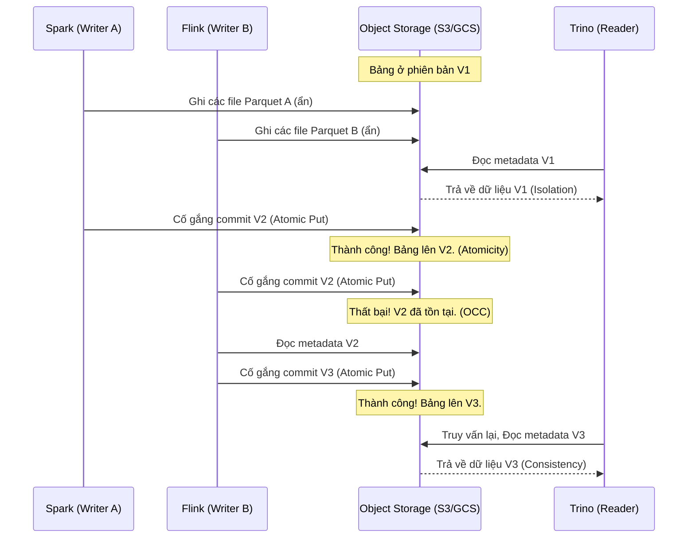

# ACID Transactions trên Data Lake: Mang tính năng Data Warehouse lên Object Storage

Hãy tưởng tượng bạn đang vận hành một hệ thống dữ liệu lớn phục vụ báo cáo tài chính cho doanh nghiệp. Vào lúc 2 giờ sáng, đường ống dẫn dữ liệu (data pipeline) đang cập nhật hàng triệu bản ghi giao dịch mới vào Data Lake. Cùng lúc đó, đội ngũ phân tích chạy các truy vấn SQL để kết xuất báo cáo. Nếu hệ thống đột ngột gặp sự cố mất điện hoặc lỗi mạng, liệu dữ liệu của bạn sẽ ra sao? Báo cáo xuất ra có bị sai lệch, chắp vá hay không?

Để giải quyết những bài toán hóc búa này, chúng ta cần đến **ACID Transactions (Giao dịch ACID)**. Trước đây, ACID vốn là "đặc sản" độc quyền của các cơ sở dữ liệu quan hệ truyền thống hoặc các Data Warehouse đắt đỏ. Giờ đây, nhờ sự phát triển của các Table Format hiện đại, chúng ta hoàn toàn có thể chạy các giao dịch ACID trực tiếp trên các hệ thống Object Storage giá rẻ như AWS S3, Google Cloud Storage hay HDFS.

## Nhắc lại một chút: ACID là gì?

ACID là bộ bốn tiêu chuẩn vàng để bảo vệ tính toàn vẹn của dữ liệu:

* **Atomicity (Tính nguyên tử):** Triết lý "được ăn cả, ngã về không". Một giao dịch gồm nhiều bước hoặc là thành công toàn bộ, hoặc không để lại bất kỳ dấu vết nào. Không có trạng thái "thành công một nửa".
* **Consistency (Tính nhất quán):** Dữ liệu sau khi giao dịch phải luôn tuân thủ các ràng buộc và quy tắc đã định trước (chẳng hạn như đúng định dạng schema).
* **Isolation (Tính cô lập):** Các giao dịch chạy song song không được ảnh hưởng lẫn nhau. Người đọc sẽ không nhìn thấy dữ liệu đang được ghi dở dang của người khác.
* **Durability (Tính bền vững):** Một khi giao dịch đã được xác nhận (commit), dữ liệu sẽ được lưu trữ an toàn lâu dài, bất chấp việc hệ thống có bị sập hay mất điện ngay sau đó.

## Tại sao Data Lake truyền thống lại "kỵ" ACID?

Các dịch vụ Object Storage như Amazon S3 hay GCS được thiết kế để lưu trữ lượng dữ liệu khổng lồ với chi phí cực thấp, nhưng chúng lại **không hỗ trợ khóa tệp tin (file locking)** và chỉ cung cấp tính nhất quán cuối cùng (eventual consistency - dù S3 đã cải tiến lên strong consistency từ cuối năm 2020).

Trong các hệ thống Data Lake thế hệ cũ sử dụng Hadoop/Hive:
1. **Lỗi ghi dở dang:** Nếu một tiến trình đang ghi hàng trăm file Parquet vào thư mục mà bị lỗi giữa chừng, một nửa số file lỗi vẫn sẽ nằm lại đó, khiến dữ liệu bị sai lệch (vi phạm tính Atomicity).
2. **Đọc dữ liệu rác:** Khi một phân tích viên truy vấn dữ liệu đúng lúc đường ống dẫn dữ liệu đang ghi đè file, họ sẽ đọc được dữ liệu chắp vá, không hoàn chỉnh (vi phạm tính Isolation).
3. **Ghi đè lẫn nhau:** Hai tiến trình ETL cùng cập nhật vào một phân vùng dữ liệu sẽ dễ dàng ghi đè và làm mất mát dữ liệu của nhau.

Sự phát triển mạnh mẽ của mô hình **Data Lakehouse** đòi hỏi hệ thống vừa phải lưu trữ rẻ, vừa phải phục vụ trực tiếp các báo cáo BI thời gian thực lẫn các luồng cập nhật liên tục (Streaming, CDC). Đó là lý do vì sao cơ chế ACID trên Data Lake ra đời.

## Triết lý cốt lõi: Quản lý qua Metadata và Transaction Logs

Chìa khóa để mang ACID lên Data Lake là **không bao giờ sửa đổi trực tiếp các file dữ liệu hiện tại**, thay vào đó chúng ta sử dụng **Nhật ký giao dịch (Transaction Logs)** và **Siêu dữ liệu (Metadata)**.

1. **Ghi trước, xác nhận sau (Write-then-Commit):** Khi có dữ liệu mới, hệ thống sẽ ghi chúng dưới dạng các file vật lý mới hoàn toàn. Những file này nằm im hơi lặng tiếng và hoàn toàn vô hình với người đọc cho đến khi bước "commit" diễn ra.
2. **Commit nguyên tử (Atomic Commits):** Bước commit thực chất chỉ là việc ghi nhận một file metadata nhỏ (chứa danh sách các file dữ liệu hợp lệ). Thao tác này dựa vào tính nguyên tử của hệ thống lưu trữ bên dưới (như atomic rename trong HDFS hoặc conditional put trong S3).
3. **Kiểm soát đồng thời lạc quan (Optimistic Concurrency Control - OCC):** 
   * Cả hai tiến trình ghi (Writer A và Writer B) cùng đọc phiên bản hiện tại của bảng (phiên bản X).
   * Cả hai chuẩn bị và ghi các file dữ liệu mới một cách độc lập.
   * Cả hai cố gắng đẩy file commit mới lên để nâng phiên bản bảng lên X+1.
   * Hệ thống sẽ cho phép người nhanh chân hơn (ví dụ Writer A) commit thành công. Writer B bị từ chối, buộc phải đọc lại phiên bản X+1 mới của Writer A, kiểm tra xem có xung đột logic nào không. Nếu không, Writer B sẽ chuẩn bị lại và thử commit phiên bản X+2.

## Cơ chế hoạt động: Khi Spark và Delta Lake bắt tay

Hãy cùng phân tích một kịch bản ghi dữ liệu (Append) sử dụng Delta Lake làm đại diện:

1. **Khởi tạo:** Spark chuẩn bị ghi một lô dữ liệu mới vào bảng.
2. **Ghi dữ liệu vật lý (Data Write):** Spark ghi các file Parquet (ví dụ: `part-0001.parquet`) lên S3. Lúc này, các truy vấn đọc (Reader) đang chạy song song vẫn chỉ nhìn vào các file cũ và không hề biết đến sự tồn tại của file mới này.
3. **Tạo nhật ký (Log Write):** Spark tạo một file JSON mô tả hành động: `"thêm file part-0001.parquet"`. Giả sử bảng đang ở phiên bản 4, Spark sẽ cố gắng tạo file nhật ký tên là `00000005.json`.
4. **Xác thực nguyên tử:** Nếu việc ghi file `00000005.json` thành công (chưa có ai tạo file này trước đó), giao dịch hoàn tất và dữ liệu mới chính thức hiển thị. Nếu có một Writer khác đã nhanh tay tạo file `00000005.json` trước đó 1 mili-giây, giao dịch của Spark sẽ thất bại.
5. **Thử lại tự động:** Spark sẽ tự động tải phiên bản 5 mới cập nhật, kiểm tra xem thay đổi của mình có xung đột với phiên bản 5 hay không. Nếu không, nó sẽ tiến hành thử commit lại với tên file `00000006.json`.

### Kiến trúc luồng xử lý đồng thời (Concurrency Flow)

Sơ đồ dưới đây minh họa cách hai Writer chạy song song tương tác với Object Storage và cách Reader luôn có góc nhìn nhất quán:



## Ví dụ thực tế: Bài toán số dư tài khoản ngân hàng

Hãy tưởng tượng một bảng lưu trữ số dư tài khoản ngân hàng trên Data Lake. Số dư ban đầu (V1) của tài khoản `acc_01` là 100$.

* **Writer A (Giao dịch trừ tiền):** Muốn trừ 20$. A đọc số dư V1 (100$), tính toán và ghi file mới với số dư = 80$.
* **Writer B (Giao dịch cộng tiền):** Muốn cộng 50$. B đọc số dư V1 (100$), tính toán và ghi file mới với số dư = 150$.

Nếu không có ACID, bản ghi của B có thể ghi đè lên A và khiến số dư tài khoản kết thúc ở mức 150$ (hoàn toàn sai thực tế!). 

Nhờ có OCC trong các Table Format, kịch bản sẽ diễn ra như sau: Writer A commit thành công phiên bản V2 (80$). Khi Writer B cố gắng commit phiên bản V2, hệ thống sẽ từ chối. B buộc phải cập nhật lại trạng thái (đọc số dư mới từ V2 là 80$), cộng thêm 50$ để ra 130$, ghi file mới và commit thành công phiên bản V3. Dữ liệu tài chính được bảo vệ vẹn toàn.

Dưới đây là cách chúng ta hiện thực hóa điều này bằng mã nguồn PySpark với Delta Lake:

```python
from delta.tables import *

# 1. Khởi tạo bảng Delta ban đầu
df = spark.createDataFrame([("acc_01", 100)], ["account_id", "balance"])
df.write.format("delta").save("/data/accounts")

deltaTable = DeltaTable.forPath(spark, "/data/accounts")

# 2. Thực hiện cập nhật đồng thời (Delta Lake tự động xử lý ACID dưới nền)
deltaTable.update(
    condition = "account_id = 'acc_01'",
    set = { "balance": "balance - 20" }
)

deltaTable.update(
    condition = "account_id = 'acc_01'",
    set = { "balance": "balance + 50" }
)

# Số dư cuối cùng nhận được luôn là 130
```

## Những "bí kíp" giúp tối ưu giao dịch ACID

* **Tránh các giao dịch quá nhỏ (Small Files Problem):** Đừng liên tục commit các giao dịch siêu nhỏ (ví dụ ghi dữ liệu từng giây một). Việc này sẽ tạo ra vô số file JSON metadata nhỏ lẻ, gây tắc nghẽn hệ thống và tăng tỷ lệ xung đột. Hãy gom dữ liệu thành các đợt nhỏ (Micro-batch) khoảng 1 đến 5 phút một lần.
* **Tận dụng Phân vùng (Partitioning) để giảm xung đột:** Nếu hai luồng ETL ghi vào hai phân vùng khác nhau (chẳng hạn Writer A ghi dữ liệu ngày 01/06, Writer B ghi dữ liệu ngày 02/06), các Table Format đủ thông minh để nhận biết không có xung đột logic và cho phép cả hai commit song song mà không cần retry.
* **Chọn Catalog hỗ trợ khóa tốt:** Đảm bảo bạn sử dụng một Metadata Catalog đáng tin cậy (như AWS Glue, Nessie hoặc Hive Metastore có bật khóa) để làm điểm tựa nguyên tử cho các giao dịch trên môi trường Object Storage đám mây.

## Những sai lầm kinh điển cần né tránh

* **Can thiệp vật lý bỏ qua Table Format:** Sử dụng các công cụ như AWS CLI hay lệnh Hadoop shell để trực tiếp xóa các file Parquet trong thư mục nhằm "tiết kiệm dung lượng" thay vì chạy lệnh `DELETE FROM table`. Việc này sẽ phá vỡ liên kết metadata và trực tiếp gây lỗi hư hỏng dữ liệu (Data Corruption).
* **Quá lạc quan vào OCC ở quy mô cực lớn:** Optimistic Concurrency Control chỉ hoạt động hiệu quả khi tần suất ghi trùng lặp thấp. Nếu bạn có hàng trăm worker cùng liên tục ghi đè lên một phân vùng dữ liệu nhỏ, OCC sẽ dẫn đến tỷ lệ retry cực cao, gây lãng phí tài nguyên tính toán và làm chậm đường ống dẫn dữ liệu.

## Những điều phải đánh đổi khi chọn ACID trên Data Lake

### Điểm cộng (Pros):
* Cho phép các pipeline ETL phức tạp và các công cụ BI của doanh nghiệp cùng làm việc đồng thời trên một kho dữ liệu mà không sợ xung đột.
* Mang lại độ tin cậy của Data Warehouse truyền thống trên hạ tầng lưu trữ Object Storage giá rẻ.
* Hỗ trợ tính năng quay ngược thời gian (Time Travel) để khôi phục dữ liệu về các phiên bản cũ khi có sự cố.

### Điểm trừ (Cons):
* **Chi phí tài nguyên:** Việc quản lý file metadata, kiểm tra xung đột logic và thực hiện retry tự động sẽ tiêu tốn thêm một phần năng lực tính toán của hệ thống.
* **Sinh ra file rác:** Do cơ chế Copy-on-Write hoặc Merge-on-Read, các phiên bản cũ của dữ liệu vẫn nằm lại trên ổ đĩa. Bạn cần phải định kỳ chạy lệnh `VACUUM` để dọn dẹp các file cũ này và tối ưu hóa không gian lưu trữ.

## Khi nào nên áp dụng (và khi nào không)?

* **Nên dùng khi:**
  * Bạn xây dựng các Data Lakehouse hiện đại phục vụ báo cáo BI trực tiếp.
  * Đường ống dẫn dữ liệu của bạn có yêu cầu xóa hoặc cập nhật dữ liệu thường xuyên (ví dụ: tuân thủ GDPR yêu cầu xóa thông tin người dùng).
  * Bạn triển khai CDC (Change Data Capture) để đồng bộ dữ liệu từ các cơ sở dữ liệu giao dịch (OLTP) vào Data Lake.

* **Không nên dùng khi:**
  * Hệ thống của bạn chỉ ghi dữ liệu dạng log (Append-only) với tần suất khổng lồ và không bao giờ sửa đổi dữ liệu lịch sử. Việc áp dụng ACID lúc này chỉ mang lại độ trễ (overhead) không cần thiết.

## Các khái niệm liên quan

* [Table Format](/concepts/data-lake-lakehouse/table-format/)
* [Delta Lake](/concepts/data-lake-lakehouse/delta-lake/)
* [Apache Iceberg](/concepts/data-lake-lakehouse/apache-iceberg/)

## Góc phỏng vấn: Thử thách tư duy phân tán

### 1. Giải thích Optimistic Concurrency Control (OCC) là gì và làm thế nào Delta/Iceberg dùng nó để giải quyết nhiều người viết (multi-writers)?
* **Gợi ý trả lời:** OCC giả định rằng các giao dịch ghi đồng thời ít khi đụng độ nhau. Thay vì khóa cứng bảng dữ liệu từ đầu (gây tắc nghẽn), các Table Format cho phép nhiều tiến trình chuẩn bị dữ liệu độc lập. Khi commit, hệ thống sẽ kiểm tra phiên bản hiện tại. Nếu phiên bản đã bị thay đổi bởi người khác, nó sẽ đối chiếu xem thay đổi đó có đụng chạm đến phần dữ liệu mình vừa ghi hay không. Nếu không trùng phân vùng, commit được chấp nhận; nếu có xung đột thực sự, tiến trình ghi sau sẽ phải tải lại metadata mới và thử thực hiện lại quy trình.

### 2. AWS S3 trước đây không hỗ trợ Atomic Put/Rename. Các Table Format đã xử lý tính toán ACID (Atomicity) trên S3 như thế nào?
* **Gợi ý trả lời:** Trước khi S3 hỗ trợ Strong Consistency và Conditional Writes, các Table Format phải mượn một dịch vụ bên ngoài hỗ trợ tính năng khóa nguyên tử làm điểm tựa (chẳng hạn như AWS DynamoDB hoặc AWS Glue Data Catalog). Mỗi khi thực hiện commit, tiến trình ghi sẽ cố gắng khóa một dòng trạng thái trong DynamoDB/Glue. Tiến trình nào giành được khóa mới được phép hoàn tất việc commit file metadata trên S3, từ đó giúp S3 đạt được tính nguyên tử một cách gián tiếp.

## Tài liệu tham khảo

1. **"Delta Lake: High-Performance ACID Table Storage over Cloud Object Stores"** - (VLDB Paper 2020) Mô tả cách Delta Lake cung cấp ACID.
2. **"Designing Data-Intensive Applications"** - Martin Kleppmann (Chương 7: Transactions).
3. **Apache Iceberg Documentation** (iceberg.apache.org/reliability) - Đặc tả về OCC và Atomicity.

## English Summary

ACID Transactions on a Data Lake guarantee Atomicity, Consistency, Isolation, and Durability over distributed object storage (like S3/GCS) which natively lacks file-locking and transactional support. Modern table formats (Delta Lake, Apache Iceberg, Apache Hudi) achieve this using a combination of metadata management, transaction logs, and Optimistic Concurrency Control (OCC). Instead of mutating physical data files directly, engines write new data files hidden from readers until a successful atomic commit updates the metadata snapshot. This allows concurrent readers and writers to operate reliably without data corruption or dirty reads, unlocking Data Warehouse capabilities directly on cheap Data Lake storage.
