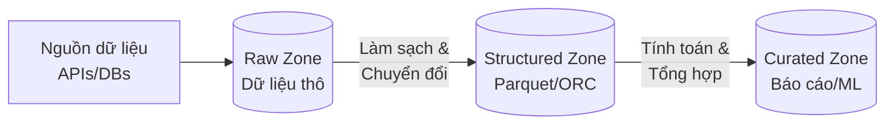

# Hồ dữ liệu (Data Lake): Nơi lưu trữ không giới hạn cho kỷ nguyên Big Data

Trong kỷ nguyên bùng nổ thông tin, dữ liệu được sinh ra với tốc độ chóng mặt và đa dạng về chủng loại. Khi các mô hình Kho dữ liệu (Data Warehouse) truyền thống bắt đầu bộc lộ những giới hạn về mặt chi phí và khả năng lưu trữ các định dạng phi cấu trúc, **Hồ dữ liệu (Data Lake)** đã xuất hiện như một cuộc cách mạng, mở ra một không gian lưu trữ không giới hạn với chi phí cực kỳ tối ưu cho các doanh nghiệp.

---

## Thực chất Hồ dữ liệu (Data Lake) là gì?

**Data Lake** là một hệ thống lưu trữ tập trung quy mô lớn, cho phép bạn giữ lại toàn bộ dữ liệu của doanh nghiệp ở định dạng nguyên bản (raw format). Khác với Data Warehouse chỉ chấp nhận dữ liệu có cấu trúc dạng bảng, Data Lake dang rộng vòng tay đón nhận mọi loại dữ liệu:
* Dữ liệu có cấu trúc: Các bảng cơ sở dữ liệu quan hệ (SQL).
* Dữ liệu bán cấu trúc: Các file JSON, XML, CSV.
* Dữ liệu phi cấu trúc: Hình ảnh, file ghi âm cuộc gọi, video, tài liệu văn bản tự do.

Sự khác biệt cốt lõi nhất nằm ở triết lý thiết kế. Data Warehouse áp dụng mô hình **Schema-on-Write** (bạn phải thiết kế bảng, định nghĩa kiểu dữ liệu sạch sẽ rồi mới được ghi vào). Trong khi đó, Data Lake hoạt động theo mô hình **Schema-on-Read** (cứ lưu dữ liệu thô xuống trước, khi nào cần đọc ra để sử dụng thì ứng dụng đọc mới tiến hành bóc tách và định cấu trúc sau).

---

## Tại sao Data Lake lại ra đời?

Mặc dù Data Warehouse rất xuất sắc trong việc phục vụ các báo cáo kinh doanh, nhưng nó có 3 điểm yếu chí mạng khi đối mặt với Big Data:

1. **Chi phí lưu trữ đắt đỏ**: Data Warehouse gắn chặt tài nguyên tính toán (CPU/RAM) với tài nguyên lưu trữ (Storage). Việc lưu trữ hàng Petabyte dữ liệu thô chưa qua chế biến trên DWH là một sự lãng phí tài chính khủng khiếp.
2. **Không hỗ trợ dữ liệu phi cấu trúc**: Doanh nghiệp sở hữu lượng lớn thông tin giá trị nằm trong các file ghi âm khách hàng, ảnh chụp hóa đơn hay file log hệ thống. DWH truyền thống hoàn toàn bất lực trong việc lưu trữ trực tiếp các tệp tin này.
3. **Mất đi dữ liệu gốc**: Trong quy trình ETL truyền thống của DWH, dữ liệu được cắt tỉa, làm sạch và tổng hợp (aggregate) ngay từ đầu để vừa vặn với cấu trúc báo cáo. Điều này vô tình xóa sạch các chi tiết thô ban đầu – thứ mà các nhà khoa học dữ liệu (Data Scientists) vô cùng cần để huấn luyện các mô hình Machine Learning/AI.

Data Lake giải quyết triệt để các vấn đề này bằng cách tận dụng các hệ thống lưu trữ đối tượng phân tán (Object Storage) có chi phí cực rẻ như AWS S3, Google Cloud Storage hay HDFS để lưu trữ nguyên bản mọi tài sản dữ liệu vô thời hạn.

---

## Bốn nguyên lý vận hành cốt lõi của Data Lake

* **Lưu giữ mọi thứ (Store everything)**: Gom tất cả dữ liệu từ mọi nguồn vận hành và giữ lại ở dạng nguyên bản nhất có thể, không cắt xén, không tổng hợp trước.
* **Tách rời Tính toán và Lưu trữ (Decoupled Compute & Storage)**: Dữ liệu nằm yên trên hệ thống đĩa lưu trữ giá rẻ. Khi nào cần chạy các tác vụ tính toán nặng (như chạy Spark, Athena), doanh nghiệp mới bật các cụm máy chủ CPU/RAM lên để xử lý, sau đó tắt đi để tiết kiệm chi phí.
* **Schema-on-Read**: Không ép buộc dữ liệu phải tuân theo một khuôn mẫu cố định nào khi ghi vào hồ. Cấu trúc sẽ được định nghĩa linh hoạt bởi ứng dụng đọc dữ liệu.
* **Hỗ trợ đa công cụ (Multi-tool Access)**: Một vùng dữ liệu trong hồ có thể được tiếp cận đồng thời bởi Spark (để làm ETL), Python/TensorFlow (để huấn luyện AI) và Presto/Athena (để truy vấn SQL nhanh).

---

## Tổ chức các phân vùng dữ liệu trong Data Lake

Dữ liệu trong một Data Lake chuẩn mực không được để lộn xộn mà cần được tổ chức thành các vùng (Zones) logic đại diện cho các trạng thái xử lý:



1. **Vùng thô (Raw Zone / Landing Zone)**: Nơi chứa dữ liệu nguyên bản đổ về trực tiếp từ nguồn. Dữ liệu ở đây tuyệt đối không được chỉnh sửa và là nguồn sự thật gốc của doanh nghiệp.
2. **Vùng cấu trúc (Structured Zone / Processing Zone)**: Dữ liệu từ vùng thô được làm sạch cơ bản (chuẩn hóa múi giờ, loại bỏ dòng lỗi) và chuyển đổi sang các định dạng tệp tin tối ưu cho phân tích như **Apache Parquet** hoặc **Apache ORC**.
3. **Vùng tinh chọn (Curated Zone / Analytics Zone)**: Nơi lưu trữ dữ liệu đã qua tính toán, tổng hợp chỉ số và tổ chức bài bản, sẵn sàng phục vụ cho các dashboard BI hoặc mô hình học máy.

Dưới đây là một sơ đồ thư mục vật lý điển hình trên Object Storage:

```text
s3://my-company-data-lake/
├── raw/ (Raw Zone)
│   ├── orders/
│   │   ├── year=2026/month=05/day=27/order_data_123.json
│   │   └── year=2026/month=05/day=28/order_data_124.json
│   └── clickstream/
│       └── event_logs_20260527.csv
├── structured/ (Structured Zone)
│   └── orders/
│       ├── year=2026/month=05/day=27/part-000.snappy.parquet
│       └── year=2026/month=05/day=28/part-000.snappy.parquet
└── curated/ (Curated Zone)
    └── monthly_user_activity/
        └── year=2026/month=05/summary.parquet
```

---

## Ví dụ thực tế: Xử lý Log người dùng từ JSON sang Parquet bằng PySpark

Giả sử chúng ta thu thập dữ liệu nhật ký hoạt động (clickstream logs) của khách hàng lướt web dưới dạng JSON thô đổ vào vùng Raw Zone:

```json
{"user_id": "U109", "event": "click_product", "product_id": "P99", "timestamp": "2026-05-27T10:15:30Z"}
{"user_id": "U110", "event": "add_to_cart", "product_id": "P102", "timestamp": "2026-05-27T10:17:12Z"}
```

Đoạn code PySpark dưới đây sẽ đọc dữ liệu thô này, định kiểu lại thời gian và ghi xuống vùng Structured Zone dưới dạng file Parquet nén Snappy:

```python
from pyspark.sql import SparkSession
from pyspark.sql.functions import col, to_timestamp

spark = SparkSession.builder.appName("RawToStructured").getOrCreate()

# 1. Đọc dữ liệu JSON thô từ Raw Zone
df_raw = spark.read.json("s3://data-lake/raw/clickstream/year=2026/month=05/*")

# 2. Làm sạch và định kiểu dữ liệu
df_structured = df_raw.withColumn("event_time", to_timestamp(col("timestamp"))) \
                      .drop("timestamp")

# 3. Ghi dữ liệu dạng Parquet phân vùng theo ngày vào Structured Zone
df_structured.write \
    .partitionBy("event") \
    .mode("overwrite") \
    .parquet("s3://data-lake/structured/clickstream/year=2026/month=05/")
```

---

## Kinh nghiệm thực chiến vận hành Data Lake (Best Practices)

* **Thiết kế phân vùng (Partitioning) thông minh**: Chia thư mục trên Object Storage theo thời gian truy vấn phổ biến (ví dụ: `year=YYYY/month=MM/day=DD`). Điều này giúp các công cụ truy vấn thực hiện cơ chế **Partition Pruning** - chỉ quét đúng thư mục cần thiết, bỏ qua toàn bộ các phần dữ liệu khác, giúp tăng tốc truy vấn lên hàng trăm lần và tiết kiệm chi phí cloud.
* **Chuẩn hóa định dạng file**: Hãy sử dụng định dạng lưu trữ dạng cột (columnar) như **Apache Parquet** cho các tác vụ phân tích, và định dạng dạng hàng (row-based) như **Apache Avro** cho các luồng ghi dữ liệu nhanh (streaming ingestion).
* **Đầu tư vào Data Catalog**: Luôn sử dụng một dịch vụ quản lý siêu dữ liệu (như AWS Glue Catalog hoặc Hive Metastore) để đăng ký cấu trúc schema cho các file trong hồ. Thiếu đi Data Catalog, Data Lake của bạn sẽ nhanh chóng biến thành một **Data Swamp (Đầm lầy dữ liệu)** - nơi chứa đầy các file vô danh không ai biết cấu trúc bên trong là gì để đọc.
* **Giải quyết bài toán file nhỏ (Small Files Problem)**: Tránh việc ghi hàng triệu tệp tin nhỏ kích thước vài KB vào hồ (như việc ghi trực tiếp từng sự kiện IoT). Hãy thiết lập cơ chế gom dữ liệu hoặc chạy các pipeline dọn dẹp định kỳ để gộp chúng thành các file có kích thước tối ưu (từ 128MB đến 512MB).

---

## Những sai lầm thường gặp

* **Xem Data Lake là một bãi rác lưu trữ**: Đổ mọi dữ liệu thô lên hồ mà không phân chia thư mục, không viết mô tả và không có chính sách kiểm soát quyền truy cập.
* **Lưu dữ liệu phân tích dưới dạng CSV/JSON**: Việc truy vấn trên các file text nén CSV/JSON đòi hỏi hệ thống phải tải toàn bộ file về và bóc tách từng chữ, gây lãng phí tài nguyên CPU và băng thông mạng cực kỳ lớn so với định dạng Parquet.

---

## Ưu điểm và nhược điểm (Trade-offs)

### Ưu điểm
* Chi phí lưu trữ cực rẻ, khả năng mở rộng dung lượng gần như vô hạn.
* Hỗ trợ lưu trữ linh hoạt mọi định dạng dữ liệu thô, phi cấu trúc.
* Giữ nguyên vẹn dữ liệu gốc ban đầu phục vụ cho các mục tiêu phân tích dài hạn hoặc huấn luyện AI.

### Nhược điểm & Thách thức
* **Hiệu năng đọc thô chậm hơn DWH**: Do dữ liệu được lưu trữ dạng tệp tin phân tán trên Object Storage, tốc độ truy vấn cơ bản sẽ không thể nhanh bằng các công cụ chuyên dụng được lập chỉ mục sâu của DWH.
* **Khó khăn trong việc cập nhật dữ liệu (Update/Delete)**: Các file trên Object Storage là bất biến (immutable). Muốn xóa hay sửa một dòng dữ liệu, bạn buộc phải đọc cả file chứa dòng đó, lọc bỏ dòng cần xóa và ghi đè lại file mới hoàn toàn.
* **Thiếu hỗ trợ ACID mặc định**: Không có cơ chế khóa giao dịch, dễ dẫn đến hiện tượng người dùng đọc phải dữ liệu bị lỗi/không nhất quán khi pipeline đang thực hiện ghi đè dữ liệu mới.

---

## Góc phỏng vấn: Những câu hỏi thường gặp

### 1. Hãy phân biệt sự khác biệt cốt lõi giữa Data Warehouse và Data Lake.
* **Gợi ý trả lời**:
  * **Cấu trúc dữ liệu**: DWH áp dụng mô hình *schema-on-write* (chỉ lưu trữ dữ liệu có cấu trúc sạch sẽ đã qua thiết kế). Data Lake áp dụng mô hình *schema-on-read* (lưu giữ mọi dạng dữ liệu thô ở cả dạng cấu trúc, bán cấu trúc và phi cấu trúc).
  * **Tính tách rời**: DWH truyền thống ghép chặt tính toán và lưu trữ để đạt hiệu năng tối đa (dù DWH hiện đại bắt đầu tách rời). Data Lake tách rời hoàn toàn Compute và Storage ngay từ kiến trúc gốc.
  * **Đối tượng sử dụng**: DWH phục vụ chủ yếu cho các nhà phân tích nghiệp vụ (Analysts, BI Developers) cần dữ liệu sạch, tổng hợp để làm báo cáo. Data Lake phục vụ thêm cả Data Scientists, Data Engineers cần dữ liệu thô chi tiết cho các mô hình học máy và chế biến sâu.
* **Lỗi cần tránh**: Tránh trả lời đơn giản rằng "DWH dùng SQL còn Data Lake dùng Python" vì thực tế hiện nay có rất nhiều công cụ hỗ trợ truy vấn SQL trực tiếp trên Data Lake với hiệu năng cực cao.

### 2. Sự cố tệp nhỏ (Small Files Problem) trên Data Lake là gì? Tại sao nó lại nguy hiểm và cách xử lý ra sao?
* **Gợi ý trả lời**:
  * **Khái niệm**: Xảy ra khi hệ thống lưu trữ quá nhiều tệp tin có kích thước rất nhỏ (vài KB đến vài MB) thay vì một số lượng ít hơn các tệp tin có kích thước tối ưu (128MB - 512MB).
  * **Nguy cơ**: 
    * Đối với HDFS: NameNode lưu trữ metadata của các tệp tin trong bộ nhớ RAM. Hàng triệu tệp nhỏ sẽ làm cạn kiệt bộ nhớ RAM, gây sập cụm Hadoop.
    * Đối với Object Storage (như S3): Mỗi lần đọc file yêu cầu gửi một yêu cầu HTTP GET. Quét hàng triệu file nhỏ làm phát sinh chi phí gọi API khổng lồ và độ trễ mạng tích lũy cực lớn, làm chậm hiệu năng của Spark/Athena đi hàng trăm lần.
  * **Giải pháp**: Gom dữ liệu ở vùng đệm (Staging) trước khi ghi xuống hồ bằng các công cụ streaming thu thập (ví dụ: dùng Kafka Connect với tính năng flush.size lớn). Ngoài ra, cần thiết lập các Spark jobs dọn dẹp định kỳ (Compaction pipeline) để đọc các file nhỏ và ghi đè thành các file lớn hơn.

### 3. Tại sao định dạng Apache Parquet lại tối ưu hơn CSV cho các truy vấn phân tích trên Data Lake?
* **Gợi ý trả lời**:
  * **Lưu trữ dạng cột (Columnar Storage)**: Parquet lưu trữ dữ liệu theo từng cột. Khi chạy truy vấn phân tích (ví dụ: tính trung bình doanh thu), công cụ chỉ cần đọc cột doanh thu và bỏ qua toàn bộ các cột khác. Với CSV (dạng dòng), hệ thống buộc phải đọc toàn bộ file và phân tích cú pháp từng dòng để lấy dữ liệu cột đó, gây lãng phí I/O ổ đĩa và băng thông mạng.
  * **Kiểu dữ liệu mạnh (Strongly typed)**: Parquet lưu trữ dữ liệu kèm metadata định nghĩa kiểu dữ liệu rõ ràng của từng cột. CSV là file văn bản thuần túy, công cụ đọc phải tự suy luận kiểu dữ liệu làm tốn tài nguyên CPU.
  * **Nén dữ liệu hiệu quả**: Lưu trữ dạng cột giúp các giá trị có cùng kiểu dữ liệu nằm cạnh nhau, tối ưu hóa các thuật toán nén như Snappy hay Gzip, giúp tiết kiệm từ 60% đến 80% dung lượng lưu trữ so với CSV.
  * **Hỗ trợ thống kê tại chỗ (Metadata statistics)**: Parquet lưu trữ giá trị Min/Max của từng cột trong mỗi nhóm dòng (row group). Công cụ đọc có thể nhìn vào metadata này để quyết định bỏ qua không đọc cả một phân đoạn dữ liệu lớn nếu giá trị cần tìm không nằm trong khoảng Min/Max, tăng tốc truy vấn đáng kể.

---

## Tài liệu tham khảo hữu ích
1. **Fundamentals of Data Engineering** - Joe Reis, Matt Housley.
2. **Designing Data-Intensive Applications** - Martin Kleppmann.
3. **Databricks Blog** - Các bài viết chuyên sâu về tối ưu hóa hiệu năng Data Lake và giải quyết Metadata Bottleneck.

---

## Tóm tắt bằng tiếng Anh (English Summary)

A **Data Lake** is a scalable, centralized storage repository that holds vast amounts of raw data in its native format, including structured, semi-structured, and unstructured data. Operating under the "schema-on-read" principle, it decouples compute from storage, utilizing low-cost distributed object storage systems (like Amazon S3 or Google Cloud Storage) to persist raw assets indefinitely. Data in a Data Lake is typically organized into logical zones (Raw, Structured, Curated) and stored in optimized columnar file formats like Apache Parquet or ORC for analytical performance. Implementing a Data Lake requires rigorous metadata management via a Data Catalog and proactive measures to prevent the "small files problem" and "over-partitioning," which can degrade query execution performance.
