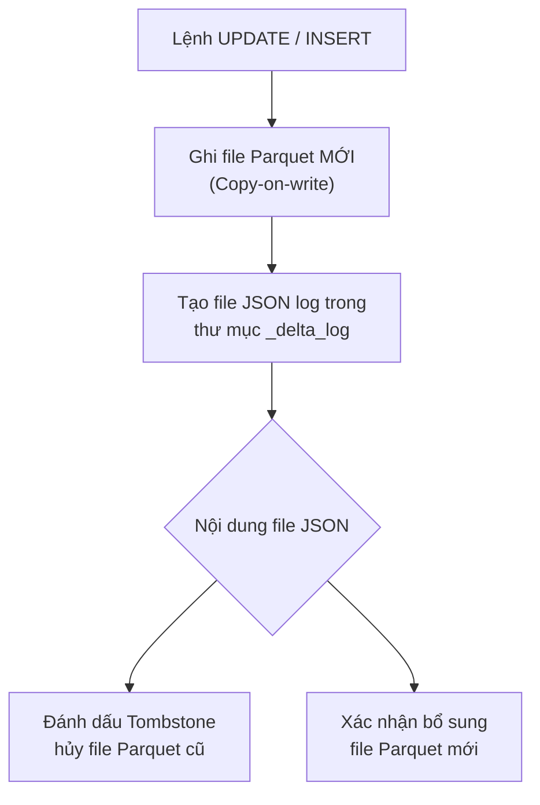

# Delta Lake - Bảng dữ liệu giao dịch mở

Nếu bạn từng làm việc với [Data Lake](/concepts/data-lake-lakehouse/data-lake/) truyền thống (sử dụng các tệp tin Parquet hay CSV lưu trên S3/GCS), chắc hẳn bạn đã quen với những tình huống dở khóc dở cười: Pipeline đang ghi dữ liệu thì bị sập nguồn giữa chừng, để lại một đống tệp tin hỏng nửa vời và bạn không cách nào biết cái nào đúng cái nào sai; hay mỗi lần cần xóa một khách hàng theo luật bảo mật thông tin (GDPR), bạn phải viết một đoạn code cồng kềnh đọc toàn bộ dữ liệu lên RAM, lọc dòng rồi ghi đè lại.

Để giải quyết triệt để những điểm yếu chí mạng này và biến một Data Lake hỗn độn (Data Swamp) thành một hệ thống đáng tin cậy, Databricks đã phát triển và giới thiệu **Delta Lake**.

## Delta Lake thực chất là gì?

**Delta Lake** là một lớp lưu trữ mã nguồn mở (thuộc định dạng Open [Table Format](/concepts/data-lake-lakehouse/table-format/)) nằm trên vùng lưu trữ đám mây giá rẻ của bạn (như Amazon S3, Google [Cloud Storage](/concepts/cloud-data-platform/cloud-storage/), hay Azure Blob Storage). 

Về mặt vật lý, Delta Lake không phải là một máy chủ cơ sở dữ liệu hay một phần mềm cài đặt phức tạp. Nó chỉ đơn giản là một đặc tả định dạng dữ liệu (Data Format Specification) đi kèm các thư viện hỗ trợ tích hợp sâu vào các công cụ tính toán như Apache Spark, Pandas, hay Trino.

Một bảng Delta Lake được lưu trữ dưới dạng thư mục gồm hai thành phần cốt lõi:
1. **Tệp tin dữ liệu (Data Files)**: Các tệp Parquet tiêu chuẩn chứa dữ liệu thực tế.
2. **Tệp tin nhật ký giao dịch (Delta Log)**: Một thư mục đặc biệt có tên `_delta_log` chứa các file JSON ghi lại lịch sử chi tiết của mọi giao dịch từng xảy ra trên bảng (ví dụ: *Thêm file A, hủy file B ở transaction số 1*).

## Cơn ác mộng Data Swamp trước thời Delta Lake

Trước khi Delta Lake xuất hiện vào năm 2019, các kỹ sư làm việc với dữ liệu lớn trên Data Lake thường xuyên phải đối mặt với các vấn đề:

* **Thiếu tính toàn vẹn giao dịch (ACID)**: Nếu job ghi dữ liệu của bạn đang chạy và chép được 50% số tệp Parquet xuống S3 rồi bị crash, bạn sẽ phải tự đi tìm và dọn dẹp các tệp tin rác đó. Người dùng truy vấn vào thời điểm đó cũng sẽ đọc phải dữ liệu bị lỗi nửa vời.
* **Không hỗ trợ UPDATE/DELETE**: Parquet là định dạng file tĩnh, không thể sửa đổi nội dung bên trong sau khi đã ghi. Muốn thay đổi dù chỉ 1 dòng, bạn bắt buộc phải đọc cả bảng lên, sửa rồi ghi đè lại toàn bộ, cực kỳ tốn chi phí và tài nguyên.
* **Lỗi cấu trúc dữ liệu ([Schema Drift](/concepts/observability-reliability/schema-drift/))**: Khi một job vô tình ghi một tệp Parquet chứa cột `age` kiểu `STRING` vào chung thư mục chứa các tệp cũ có cột `age` kiểu `INT`, toàn bộ các job đọc dữ liệu phía sau sẽ bị đổ vỡ (Crash) lập tức do bất đồng nhất kiểu dữ liệu.

## Trái tim của Delta Lake: Transaction Log hoạt động như thế nào?

Để mang các tính năng của một cơ sở dữ liệu quan hệ truyền thống lên Data Lake, Delta Lake sử dụng cơ chế ghi nhật ký giao dịch (Transaction Log) thông minh:



Khi bạn thực hiện một lệnh thay đổi dữ liệu (ví dụ `UPDATE`):
1. Delta Lake áp dụng nguyên tắc **Copy-on-write**: Nó không sửa trực tiếp vào tệp Parquet cũ (vì file Parquet là bất biến). Thay vào đó, nó đọc file chứa dòng dữ liệu cần sửa lên, cập nhật giá trị mới và ghi ra một tệp Parquet mới hoàn toàn.
2. Sau khi ghi thành công file mới, nó tạo một file log định dạng JSON (ví dụ `000001.json`) trong thư mục `_delta_log`. File này ghi rõ: *"Hủy kích hoạt file Parquet cũ (đánh dấu Tombstone) và kích hoạt file Parquet mới"*.

Nhờ cơ chế này, một người dùng đang đọc bảng tại thời điểm đó vẫn sẽ đọc được dữ liệu nhất quán từ các file cũ mà không hề bị chặn (Block) bởi người đang ghi. Điều này mang lại khả năng đọc ghi đồng thời (giao dịch ACID) cực kỳ an toàn.

---

## Những "siêu năng lực" không thể bỏ qua của Delta Lake

* **Giao dịch ACID**: Đảm bảo các job ghi dữ liệu hoạt động theo nguyên tắc "hoặc thành công hoàn toàn, hoặc không thay đổi gì cả", loại bỏ hoàn toàn tình trạng file rác lửng lơ.
* **Du hành thời gian (Time Travel)**: Vì các file Parquet cũ không bị xóa ngay lập tức mà chỉ bị đánh dấu hủy trong file Log, bạn có thể dễ dàng truy vấn lại trạng thái của bảng tại một mốc thời gian hoặc số phiên bản cụ thể trong quá khứ:
  ```sql
  SELECT * FROM my_table TIMESTAMP AS OF '2026-06-01';
  ```
* **Kiểm soát cấu trúc bảng (Schema Enforcement & Evolution)**:
  * **Enforcement**: Tự động chặn và báo lỗi nếu có dữ liệu sai cấu trúc hoặc kiểu dữ liệu cố tình ghi vào bảng.
  * **Evolution**: Cho phép tự động cập nhật, mở rộng thêm các cột mới vào bảng một cách an toàn thông qua cấu hình `mergeSchema = True`.
* **Hỗ trợ đầy đủ DML**: Bạn có thể viết các câu lệnh SQL tiêu chuẩn như `UPDATE`, `DELETE` và đặc biệt là `MERGE INTO` (Upsert dữ liệu) dễ dàng như trên database quan hệ.

---

## Thực hành cơ bản với Delta Lake

Dưới đây là ví dụ sử dụng thư viện PySpark để thao tác cơ bản với bảng Delta:

### 1. Khởi tạo và ghi dữ liệu thô
```python
df = spark.createDataFrame([("Alice", 25), ("Bob", 30)], ["Name", "Age"])

# Ghi dữ liệu ra định dạng delta (thay thế cho Parquet truyền thống)
df.write.format("delta").save("s3://bucket/bronze/users")
```

### 2. Thực hiện cập nhật dữ liệu (Upsert - MERGE INTO)
Khi có dữ liệu khách hàng mới (Alice đổi tuổi thành 26, Charlie là khách hàng mới đăng ký):
```python
from delta.tables import DeltaTable

deltaTable = DeltaTable.forPath(spark, "s3://bucket/bronze/users")
new_data = spark.createDataFrame([("Alice", 26), ("Charlie", 22)], ["Name", "Age"])

deltaTable.alias("target").merge(
    new_data.alias("source"),
    "target.Name = source.Name"
).whenMatchedUpdateAll(
).whenNotMatchedInsertAll(
).execute()
```

### 3. Phục hồi dữ liệu về phiên bản cũ (Time Travel)
Lỡ tay chạy nhầm câu lệnh xóa hay làm hỏng dữ liệu? Khôi phục lại phiên bản ban đầu chỉ với 1 câu lệnh:
```sql
RESTORE TABLE delta.`s3://bucket/bronze/users` TO VERSION AS OF 0;
```

---

## "Bí kíp" vận hành & Những sự đánh đổi thực chiến

### Thói quen tốt cần có (Best Practices)
* **Dọn dẹp định kỳ bằng lệnh `VACUUM`**: Vì Delta Lake giữ lại các file Parquet cũ để phục vụ tính năng Time Travel, ổ cứng đám mây của bạn sẽ ngày càng phình to và tốn kém chi phí. Hãy lên lịch chạy lệnh `VACUUM delta_table RETAIN 168 HOURS` định kỳ hàng tuần để xóa vĩnh viễn các file rác cũ hơn 7 ngày. *(Lưu ý: Sau khi VACUUM, bạn sẽ không thể du hành thời gian về mốc trước 7 ngày nữa).*
* **Hợp nhất tệp nhỏ bằng lệnh `OPTIMIZE`**: Chạy ghi dữ liệu dạng streaming hoặc batch nhỏ sẽ sinh ra hàng ngàn file Parquet kích thước cực nhỏ (vài MB). Hãy chạy lệnh `OPTIMIZE delta_table` thường xuyên để dồn các tệp nhỏ này thành các file 1GB chuẩn, tăng tốc độ quét dữ liệu.
* **Z-Ordering cho các cột thường xuyên tìm kiếm**: Kết hợp `OPTIMIZE delta_table ZORDER BY (customer_id)` để sắp xếp vật lý dữ liệu theo cột hay dùng lọc, giúp tăng tốc độ truy vấn lên hàng chục lần nhờ cơ chế bỏ qua file (Data Skipping).

### Cạm bẫy dễ vấp phải
* **Đọc bảng bằng công cụ không tương thích**: Sử dụng các công cụ cũ không hiểu thư mục `_delta_log` để đọc trực tiếp thư mục chứa các file Parquet. Hệ thống sẽ đọc luôn cả những file cũ đã bị đánh dấu xóa trong log, dẫn đến hiện tượng trùng lặp và sai số nghiêm trọng.
* **Cập nhật từng dòng đơn lẻ**: Chạy các lệnh `UPDATE` hay `INSERT` liên tục cho từng ID đơn lẻ trong vòng lặp `for`. Do tính chất Copy-on-write, việc này sẽ sinh ra hàng triệu file Parquet tí hon. Hãy gom các cập nhật thành một lô (Batch) lớn và dùng lệnh `MERGE INTO`.

### Điểm đánh đổi (Trade-offs)
* **Copy-on-write tốn tài nguyên**: Việc cập nhật chỉ một dòng dữ liệu trong một tệp Parquet lớn 1GB yêu cầu hệ thống phải đọc file đó lên và ghi ra một file mới 1GB khác. Do đó, tốc độ cập nhật dữ liệu của Delta Lake sẽ chậm hơn so với các kho dữ liệu (Data Warehouse) truyền thống.
* **Tải metadata ban đầu chậm**: Khi một bảng Delta có lịch sử giao dịch quá dài, thư mục `_delta_log` sẽ chứa hàng triệu file JSON nhỏ. Engine tính toán sẽ mất một khoảng thời gian đáng kể (Metadata Overhead) để phân tích đống file log này trước khi thực sự đọc dữ liệu.
* **Khó tích hợp với các hạ tầng không dùng Spark**: Delta Lake hoạt động mượt mà và tối ưu nhất trong hệ sinh thái Databricks hoặc các công cụ viết bằng Spark. Nếu tổ chức của bạn dùng các công cụ tính toán khác, các định dạng bảng khác như Apache Iceberg có thể sẽ được hỗ trợ tốt hơn.

---

## Góc phỏng vấn

### 1. Hãy giải thích cơ chế Optimistic Concurrency Control (Kiểm soát đồng thời lạc quan) trong Delta Lake hoạt động ra sao khi có 2 người cùng UPDATE 1 bảng?
* **Gợi ý trả lời**: Cơ chế "Lạc quan" (Optimistic) hoạt động dựa trên giả định rằng xác suất hai giao dịch ghi dữ liệu đụng độ vào cùng một file vật lý là rất nhỏ, do đó hệ thống không khóa cứng (Lock) toàn bộ bảng như các database truyền thống. 
  * Khi User A và User B cùng gửi lệnh cập nhật: Cả hai đều đọc cấu trúc bảng hiện tại (ví dụ: phiên bản số 10), thực hiện tính toán trên bộ nhớ của máy trạm riêng và ghi các file Parquet mới xuống đĩa.
  * Đến giai đoạn ghi nhận vào Transaction Log để tăng phiên bản lên 11: Delta dựa vào cơ chế ghi file độc quyền (Mutual Exclusion) của Cloud Storage. Nếu A ghi file log `0011.json` thành công trước B chỉ một mili-giây, giao dịch của A được chấp nhận (Version 11).
  * Lúc này B cố gắng ghi file `0011.json` nhưng hệ thống báo lỗi vì file đã tồn tại. Engine của Delta sẽ tự động kiểm tra xem thay đổi của A ở Version 11 có trùng lặp file vật lý nào mà B vừa sửa hay không. 
  * Nếu không trùng (ví dụ A sửa khách hàng ở Hà Nội, B sửa khách hàng ở Sài Gòn), Delta sẽ tự động ghép thay đổi của B thành Version 12 (Auto-resolve). Nếu có trùng lặp file vật lý, giao dịch của B sẽ bị báo lỗi và hoàn tác (Rollback) để bảo vệ tính nhất quán.

### 2. Time Travel trong Delta Lake là một tính năng tuyệt vời. Nhưng làm thế nào tôi có thể duy trì dữ liệu của 10 năm quá khứ mà không tốn chi phí ổ cứng khổng lồ cho các file Parquet bị thay thế?
* **Gợi ý trả lời**: Thực tế, chúng ta không nên dùng tính năng [Time Travel](/concepts/data-lake-lakehouse/time-travel/) của hạ tầng Delta Lake để lưu trữ lịch sử dài hạn (ví dụ 10 năm). Việc giữ lại toàn bộ các file cũ của 10 năm qua sẽ làm phình to dung lượng lưu trữ trên cloud cực kỳ khủng khiếp và tốn kém. 
  * Để quản lý chi phí tối ưu, chúng ta bắt buộc phải chạy lệnh `VACUUM` thường xuyên để xóa sạch các file rác cũ hơn 7 hoặc 30 ngày (tức là chỉ giữ khả năng Time Travel trong ngắn hạn để khắc phục sự cố).
  * Đối với bài toán lưu giữ lịch sử phân tích 10 năm của doanh nghiệp, giải pháp chuẩn mực là phải thiết kế mô hình dữ liệu **SCD Type 2 ([Slowly Changing Dimension](/concepts/data-warehouse/slowly-changing-dimension/))** ở lớp Data Modeling. Khi đó, lịch sử thay đổi của thực thể được lưu thành các dòng dữ liệu mới trong cùng một tệp tin Parquet hiện tại, thay vì trông cậy vào tính năng Time Travel vật lý của hệ thống lưu trữ.

---

## Khái niệm liên quan

* [Data Lakehouse](/concepts/data-lake-lakehouse/lakehouse/) - Kiến trúc kết hợp Data Lake và [Data Warehouse](/concepts/data-warehouse/data-warehouse/).
* [Apache Spark](/concepts/batch-processing/apache-spark/) - Công cụ tính toán phân tán đi liền với Delta Lake.

## Tài liệu tham khảo

1. [Delta Lake Home](https://delta.io/) - Official website of the Delta Lake project, featuring guides, blogs, and community forums.
2. [Delta Lake GitHub Repository](https://github.com/delta-io/delta) - Open-source repository, codebase, and issue tracking for Delta Lake.
3. [Delta Lake: High-Performance ACID Table Storage over Cloud Object Stores](https://doi.org/10.14778/3415478.3415560) - Research paper detailing Delta Lake's design and internals, presented at VLDB 2020.
4. [Delta Lake Concurrency Control Documentation](https://docs.delta.io/latest/concurrency-control.html) - Official documentation on multi-version concurrency control (MVCC) and conflict resolution.
5. [Databricks Delta Lake Product Overview](https://www.databricks.com/product/delta-lake-on-databricks) - Managed Delta Lake product page detailing optimizations like Z-Ordering and liquid [clustering](/concepts/database-storage/clustering/).

## English Summary

**Delta Lake** is an open-source storage layer (an open table format) initially developed by Databricks that brings [relational database](/concepts/database-storage/relational-database/) "superpowers"—such as ACID transactions, scalable metadata handling, Schema Enforcement, DML support (UPDATE/DELETE/MERGE), and Time Travel—to massive, low-cost Data Lakes. It achieves this by overlaying a transaction log (`_delta_log`) on top of static Apache Parquet files, utilizing Optimistic Concurrency Control to manage concurrent reads and writes safely. Acting as the foundational building block for the Data Lakehouse architecture, Delta Lake eliminates the "data swamp" problem, enabling organizations to unify [batch processing](/concepts/batch-processing/batch-processing/), streaming, Machine Learning, and Business Intelligence workloads on a single, highly reliable data copy.
