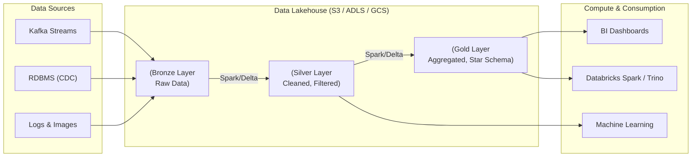

Hãy tưởng tượng bạn đang phải quản lý một hệ thống dữ liệu khổng lồ. Một mặt, bạn cần sự linh hoạt của **[Data Lake](/concepts/data-lake-lakehouse/data-lake/) (Hồ dữ liệu)** để đổ tất cả các loại file (từ log, ảnh đến JSON, CSV) vào một kho lưu trữ giá rẻ như Amazon S3 hay Google [Cloud Storage](/concepts/cloud-data-platform/cloud-storage/). Mặt khác, ban giám đốc và các nhà phân tích BI lại yêu cầu tốc độ truy vấn SQL cực nhanh, tính toàn vẹn dữ liệu và các giao dịch ACID mạnh mẽ vốn là đặc quyền của **[Data Warehouse](/concepts/data-warehouse/data-warehouse/) (Kho dữ liệu)**.

Trước đây, giải pháp duy nhất là xây dựng và vận hành song song cả hai hệ thống. Nhưng điều này giống như việc bạn phải nuôi hai con quái vật cùng một lúc: chi phí nhân đôi, dữ liệu bị phân mảnh và liên tục gặp lỗi đồng bộ. 

Đó chính là lý do **Lakehouse (hay Data Lakehouse)** ra đời — một kiến trúc lai (hybrid architecture) hợp nhất những gì tốt nhất của hai thế giới này.

## Data Lakehouse là gì và hoạt động như thế nào?

Về bản chất, **Lakehouse** là một kiến trúc hệ thống mở, lưu trữ dữ liệu thô trên một lớp Object Storage giá rẻ, nhưng phủ lên đó một **lớp siêu dữ liệu (metadata layer) thông minh**. 

Thay vì phải chạy các đường ống [ETL](/concepts/etl-elt/etl/) phức tạp để chuyển dữ liệu từ Data Lake sang một hệ quản trị cơ sở dữ liệu quan hệ đắt đỏ của Data Warehouse để làm báo cáo, Lakehouse cho phép các công cụ BI và các mô hình Machine Learning trực tiếp truy cập và phân tích trên cùng một bản sao dữ liệu duy nhất.

Lớp metadata layer thông minh này thường được quản lý bởi các công nghệ định dạng bảng mở (Open Table Formats) nổi tiếng như **[Delta Lake](/concepts/data-lake-lakehouse/delta-lake/)** (được khởi xướng bởi Databricks), **[Apache Iceberg](/concepts/data-lake-lakehouse/apache-iceberg/)** (từ Netflix) hoặc **[Apache Hudi](/concepts/data-lake-lakehouse/apache-hudi/)** (từ Uber).

### Động lực đằng sau sự ra đời của Lakehouse

Trong suốt thập kỷ 2010, mô hình kiến trúc hai tầng truyền thống (Two-Tier: Data Lake + Data Warehouse) đã gây ra không ít "nỗi đau" cho các kỹ sư dữ liệu:
* **Chi phí đội lên gấp bội**: Bạn phải trả tiền lưu trữ dữ liệu hai lần (một lần trên S3/ADLS dưới dạng file thô, một lần trong các đĩa lưu trữ đắt đỏ của [Snowflake](/concepts/cloud-data-platform/snowflake/) hay Redshift) và tốn thêm chi phí compute khổng lồ cho các tác vụ ETL trung gian.
* **Dữ liệu bị trễ (Data Staleness)**: Quy trình đồng bộ dữ liệu giữa hai lớp thường chạy theo lô (batch) qua đêm. Điều này có nghĩa là các báo cáo BI luôn sử dụng dữ liệu của ngày hôm qua chứ không thể phản ánh thời gian thực.
* **Đầm lầy dữ liệu (Data Swamp)**: Trên Data Lake, dữ liệu thường được lưu dưới dạng file Parquet hoặc CSV tĩnh. Khi cần cập nhật dữ liệu hoặc xóa thông tin người dùng theo luật bảo mật (GDPR/CCPA), việc thực hiện `UPDATE` hay `DELETE` trực tiếp lên các file tĩnh này gần như là không thể. Kết quả là hồ dữ liệu nhanh chóng biến thành một đầm lầy lộn xộn.

Sự xuất hiện của Lakehouse vào khoảng năm 2020 đã giải quyết triệt để những bất cập này bằng cách tạo ra một nguồn chân lý duy nhất (Single Source of Truth).

### Ý tưởng cốt lõi và cơ chế vận hành

Triết lý cốt lõi của Lakehouse là: **Mang năng lực quản lý bảng (Table Management) từ bên trong Động cơ cơ sở dữ liệu (Database Engine) đặt trực tiếp xuống định dạng File (Open Table Formats)**.

Trong các Data Warehouse truyền thống, cơ sở dữ liệu đóng vai trò là "kẻ giam giữ dữ liệu" (Vendor Lock-in). Bạn không thể mang [Apache Spark](/concepts/batch-processing/apache-spark/) vào đọc trực tiếp các file dữ liệu nằm trong hệ thống lưu trữ đóng của Oracle hay Teradata. 

Với Lakehouse, dữ liệu của bạn vẫn nằm ở đó, dưới dạng các file Parquet mở trên Cloud Object Storage. Tuy nhiên, lớp [Table Format](/concepts/data-lake-lakehouse/table-format/) (như Iceberg hay Delta Lake) sẽ tạo ra một tập hợp các file metadata (JSON/Avro) để ghi nhận xem file Parquet nào thuộc về phiên bản nào của bảng. Nhờ vậy, Spark, Trino, Flink hay Python đều có thể đồng thời đọc/ghi dữ liệu một cách an toàn nhờ tính năng kiểm soát giao dịch (ACID).

**Một truy vấn SQL trong Lakehouse hoạt động như thế nào?**
1. **Lưu trữ**: Dữ liệu thực tế được lưu dưới dạng các file Parquet trên S3.
2. **Metadata Layer**: Một thư mục log (ví dụ: `_delta_log` của Delta Lake) sẽ lưu lại lịch sử thay đổi: *"Tại transaction số 5, file A được thêm vào, file B bị đánh dấu xóa"*.
3. **Đọc dữ liệu**: Khi một công cụ truy vấn (query engine) như Trino hay Spark nhận câu lệnh SQL `SELECT * FROM sales`, nó không quét mù toàn bộ thư mục. Nó sẽ đọc file Log trước để biết chính xác những file Parquet nào là phiên bản mới nhất và hợp lệ.
4. **Tối ưu hóa**: Query Engine chỉ đọc đúng những file đó, đồng thời tận dụng tính năng đẩy bộ lọc xuống (Filter Pushdown / Data Skipping) trực tiếp ở tầng lưu trữ để giảm thiểu tối đa băng thông mạng.

---

## Kiến trúc Medallion trong Lakehouse

Để tổ chức dữ liệu một cách khoa học và tối ưu hiệu năng, kiến trúc Lakehouse thường áp dụng mô hình **Medallion Architecture** (Đồng - Bạc - Vàng):


Trong mô hình này:
- **Bronze Layer (Raw)**: Nơi chứa dữ liệu thô y hệt như nguồn được đưa vào, đóng vai trò lưu trữ lịch sử để có thể tái tạo lại bất cứ lúc nào.
- **Silver Layer (Cleaned)**: Dữ liệu đã được chuẩn hóa, lọc sạch lỗi, làm giàu (enriched) và sẵn sàng cho các bài toán phân tích ad-hoc hoặc huấn luyện Machine Learning.
- **Gold Layer (Curated)**: Dữ liệu được tổng hợp (aggregated) và tổ chức theo các mô hình chuẩn như Star Schema (Fact/Dimension) để phục vụ trực tiếp cho các báo cáo BI với hiệu năng cao nhất.

---

## Trải nghiệm thực tế với Lakehouse

Điểm tuyệt vời của Lakehouse là bạn có thể thực hiện những câu lệnh SQL nâng cao vốn trước đây chỉ có ở Data Warehouse, ngay trên các file lưu trữ phân tán:
```sql
-- Đọc dữ liệu tại bảng lưu trữ trên S3
SELECT * FROM gold_sales_fact;

-- Time-Travel: Truy vấn lại trạng thái dữ liệu chính xác vào ngày hôm qua
SELECT * FROM gold_sales_fact TIMESTAMP AS OF '2026-06-07 00:00:00';

-- Xóa dữ liệu (Điều không thể làm dễ dàng với Data Lake truyền thống)
DELETE FROM gold_sales_fact WHERE customer_id = 'C123';

-- Tối ưu hóa: Gộp các file Parquet nhỏ thành file lớn để tăng tốc độ truy vấn
OPTIMIZE gold_sales_fact ZORDER BY (date_id);
```

---

## Đánh giá trade-off và lưu ý khi triển khai

Bất kỳ một kiến trúc nào cũng có những mặt lợi và hại riêng. Hãy cùng đặt lên bàn cân trước khi quyết định áp dụng Lakehouse cho dự án của bạn.

### Những điểm cộng lớn (Pros)
* **Tiết kiệm chi phí vượt trội**: Bạn chỉ cần duy trì một lớp lưu trữ duy nhất trên Cloud Object Storage (rẻ hơn hàng chục lần so với lưu trữ chuyên dụng của Data Warehouse).
* **Đơn giản hóa hạ tầng**: Giảm bớt số lượng đường ống ETL di chuyển qua lại giữa Lake và Warehouse, từ đó giảm thiểu các điểm dễ lỗi (point of failure) trong hệ thống.
* **Hợp nhất Analytics và Data Science**: Các Data Scientist có thể dùng Python đọc trực tiếp dữ liệu ở lớp Silver để train model, trong khi các Data Analyst chạy SQL trên lớp Gold mà không hề gây xung đột hay tranh chấp tài nguyên.
* **Khả năng du hành thời gian (Time-Travel)**: Nhờ cơ chế Transaction Log, bạn có thể dễ dàng rollback hoặc truy vấn dữ liệu tại một thời điểm chính xác trong quá khứ để debug hoặc kiểm toán.

### Những hạn chế cần lưu ý (Cons)
* **Hiệu năng truy vấn điểm (Point Lookups)**: Đối với các truy vấn siêu nhỏ yêu cầu độ trễ tính bằng mili-giây (như tìm kiếm thông tin của đúng một khách hàng duy nhất), Lakehouse vẫn khó lòng bì kịp các Data Warehouse truyền thống do giới hạn về việc đọc file qua môi trường mạng mạng của Object Storage.
* **Gánh nặng vận hành Metadata**: Bạn sẽ phải chủ động quản lý các tác vụ bảo trì định kỳ như dọn dẹp file cũ (`VACUUM`), gộp file nhỏ (`Compaction`) để duy trì hiệu năng tốt nhất.

### Lời khuyên thiết thực khi triển khai (Best Practices)
* **Bắt buộc dùng Open Table Format**: Đừng bao giờ lưu trữ các file Parquet trần trụi. Hãy bọc chúng bằng Delta Lake, Iceberg hoặc Hudi để có ACID và khả năng quản lý schema.
* **Tách biệt hoàn toàn Storage và Compute**: Lưu trữ dữ liệu cố định trên Object Storage và cấu hình các công cụ truy vấn (Databricks, Trino, Snowflake Serverless) tự động scale hoặc tắt đi khi không sử dụng để tối ưu hóa ngân sách.
* **Giải quyết vấn nạn file nhỏ (Small Files Problem)**: Các tác vụ streaming liên tục sẽ tạo ra hàng nghìn file Parquet nhỏ dung lượng vài KB, làm nghẽn quá trình quét dữ liệu. Hãy lên lịch chạy `OPTIMIZE` định kỳ để gộp chúng lại thành các file lớn (từ 128MB đến 1GB).

### Những sai lầm phổ biến cần tránh
* **Xem Lakehouse là "chiếc đũa thần"**: Nhiều đội ngũ nghĩ rằng chỉ cần chuyển sang Delta Lake là dữ liệu tự động chạy nhanh. Thực tế, nếu bạn không tổ chức mô hình dữ liệu (như Star Schema ở tầng Gold) một cách chuẩn chỉ, các câu truy vấn BI của bạn vẫn sẽ rất chậm.
* **Lạm dụng Micro-updates**: Parquet là định dạng lưu trữ cột tĩnh. Việc chạy liên tục các câu lệnh `UPDATE` nhỏ lẻ cho từng dòng dữ liệu sẽ tạo ra một lượng file rác khổng lồ và gây quá tải cho metadata layer. Hãy chuyển sang cơ chế CDC hoặc cập nhật theo Batch.

---

## Khi nào nên và không nên chọn Lakehouse?

### Nên chọn khi:
* Doanh nghiệp của bạn đang xây dựng một hệ thống dữ liệu hiện đại trên Cloud ([Modern Data Stack](/concepts/system-architecture/modern-data-stack/)) từ đầu.
* Bạn có lượng dữ liệu khổng lồ bao gồm cả dữ liệu có cấu trúc (SQL), bán cấu trúc (JSON, Logs) và phi cấu trúc (ảnh, video) cần khai thác song song cho cả BI và AI/ML.
* Bạn muốn nắm giữ toàn quyền kiểm soát dữ liệu gốc dưới định dạng mở, tránh việc bị phụ thuộc vào một nhà cung cấp cơ sở dữ liệu cụ thể (Vendor Lock-in).

### Không nên chọn khi:
* Nhu cầu của doanh nghiệp rất đơn giản: chỉ có dữ liệu dạng bảng từ ERP/CRM với dung lượng nhỏ (dưới 1TB) và chỉ cần làm các báo cáo tài chính cơ bản. Khi đó, một Data Warehouse truyền thống như PostgreSQL hoặc BigQuery sẽ gọn nhẹ và nhanh chóng hơn nhiều.
* Hệ thống của bạn phục vụ các ứng dụng [OLTP](/concepts/database-storage/oltp/) cần xử lý hàng ngàn giao dịch ghi/đọc siêu nhỏ mỗi giây.

---

## Khái niệm liên quan

* [Data Lake](/concepts/data-lake-lakehouse/data-lake/)
* [Data Warehouse](/concepts/data-warehouse/data-warehouse/)
* [Delta Lake](/concepts/data-lake-lakehouse/delta-lake/)
* [Apache Iceberg](/concepts/data-lake-lakehouse/apache-iceberg/)
* [Medallion Architecture](/concepts/data-lake-lakehouse/medallion-architecture/)

---

## Góc phỏng vấn: Câu hỏi thường gặp

### 1. Tại sao không thể chạy lệnh UPDATE trực tiếp lên một file Parquet trong Data Lake thông thường, và Lakehouse giải quyết bài toán đó như thế nào?
* **Mục đích của người phỏng vấn**: Đánh giá sự hiểu biết của bạn về cách lưu trữ vật lý của tệp tin và cơ chế hoạt động của Table Formats.
* **Gợi ý trả lời**: 
  * Định dạng Parquet là bất biến (immutable). Một khi file Parquet đã được ghi xuống đĩa, ta không thể nhảy vào giữa file để sửa đổi một dòng dữ liệu mà không làm hỏng cấu trúc cột của nó. Ở Data Lake thông thường, muốn sửa một dòng, ta buộc phải đọc toàn bộ file lên bộ nhớ, chỉnh sửa, rồi ghi đè file mới. Quy trình này không có cơ chế giao dịch (ACID), nên rất dễ dẫn đến mất mát hoặc sai lệch dữ liệu nếu hệ thống gặp sự cố giữa chừng.
  * Lakehouse (như Delta Lake hay Apache Iceberg) giải quyết việc này bằng hai cơ chế: **Copy-on-Write** (tạo file Parquet mới chứa dữ liệu đã cập nhật) hoặc **Merge-on-Read** (ghi nhận các dòng thay đổi vào một file nhật ký phụ). Sau đó, metadata layer sẽ cập nhật vào file Log để thông báo rằng file cũ đã hết hạn và hệ thống cần đọc file mới. Việc này giúp đảm bảo tính nhất quán của dữ liệu (ACID transactions) mà không làm ảnh hưởng đến các truy vấn đang chạy.

### 2. Sự khác biệt cốt lõi giữa Data Warehouse, Data Lake và Data Lakehouse trong một câu ngắn gọn là gì?
* **Gợi ý trả lời**:
  * **Data Warehouse**: Tối ưu cực mạnh cho truy vấn SQL trên dữ liệu có cấu trúc, nhưng đắt đỏ, khép kín và khó tích hợp với Machine Learning.
  * **Data Lake**: Nơi lưu trữ mọi định dạng dữ liệu thô với chi phí cực rẻ, nhưng thiếu tính quản trị, dễ biến thành "đầm lầy dữ liệu" và không hỗ trợ ACID.
  * **Data Lakehouse**: Mang các tính năng quản trị mạnh mẽ (ACID, Schema) và hiệu năng truy vấn SQL của Data Warehouse đặt trực tiếp lên trên lớp lưu trữ mở, giá rẻ của Data Lake.

## Tài liệu tham khảo

1. [Lakehouse: A New Generation of Open Platforms that Unify Data Warehousing and Advanced Analytics](http://cidrdb.org/cidr2021/papers/cidr2021_paper17.pdf) - Seminal CIDR 2021 research paper outlining the architecture and design of the data lakehouse.
2. [What is a Data Lakehouse?](https://www.databricks.com/blog/2020/01/30/what-is-a-data-lakehouse.html) - Foundational Databricks blog post defining the lakehouse concept.
3. [Fundamentals of Data Engineering](https://www.oreilly.com/library/view/fundamentals-of-data/9781098108298/) - Comprehensive guide by Joe Reis and Matt Housley on modern data storage systems and architectural patterns.
4. [Apache Hudi Overview](https://hudi.apache.org/docs/overview) - Official Hudi documentation detailing one of the primary table formats enabling the lakehouse architecture.
5. [Apache Iceberg Table Spec](https://iceberg.apache.org/spec/) - Technical specification for the Iceberg table format, explaining how transactional metadata maps files in a lakehouse.

## English summary

The Data Lakehouse is a modern data architecture paradigm that unifies the best elements of a Data Lake (cheap, infinitely scalable object storage for all data types like S3 or GCS) with the robust capabilities of a Data Warehouse (ACID transactions, schema enforcement, and high-performance SQL analytics). By abstracting the table management layer away from proprietary database engines and utilizing open table formats (such as Delta Lake, Apache Iceberg, or Apache Hudi) on top of open [file formats](/concepts/database-storage/file-formats/) (like Parquet), the Lakehouse eliminates the need to maintain parallel systems or complex ETL pipelines transferring data between a lake and a warehouse. This unified "Single Source of Truth" significantly reduces costs, accelerates data freshness, and seamlessly supports both Machine Learning (AI) and Business Intelligence (BI) workloads simultaneously.