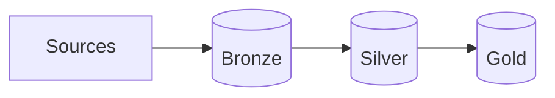

# Kiến trúc Medallion - Medallion Architecture

Khi phong trào xây dựng **[Data Lake](/concepts/data-lake-lakehouse/data-lake/) (Hồ dữ liệu)** bùng nổ, nhiều doanh nghiệp đã hào hứng đổ tất cả mọi nguồn dữ liệu họ có vào một nơi lưu trữ tập trung duy nhất (như Amazon S3 hay Google [Cloud Storage](/concepts/cloud-data-platform/cloud-storage/)). Tuy nhiên, chỉ sau một thời gian ngắn, hồ dữ liệu nhanh chóng biến thành một **Đầm lầy dữ liệu (Data Swamp)**. Lý do rất đơn giản: không ai biết file nào là dữ liệu thô, file nào đã được làm sạch, và bảng nào là bảng chuẩn xác để làm báo cáo.

Để lập lại trật tự cho hồ dữ liệu, Databricks đã đề xuất **Kiến trúc Medallion (Medallion Architecture)** — hay còn gọi là kiến trúc phân tầng dữ liệu Đồng, Bạc, Vàng. Đây là một mẫu thiết kế logic giúp tổ chức dữ liệu một cách khoa học, nâng cấp dần chất lượng dữ liệu qua từng chặng để phục vụ tốt nhất cho mọi nhu cầu phân tích của doanh nghiệp.

## Lộ trình dòng chảy dữ liệu qua Ba lớp Huy chương

Kiến trúc Medallion chia nhỏ quy trình xử lý dữ liệu ([ETL](/concepts/etl-elt/etl/)/[ELT](/concepts/etl-elt/elt/)) thành ba lớp (zones) với các vai trò và mức độ tinh sạch khác nhau:

### 1. Bronze Layer (Lớp Đồng - Ingestion Zone)
Đây là điểm dừng chân đầu tiên của mọi dữ liệu đổ về từ các nguồn khác nhau (APIs, cơ sở dữ liệu quan hệ, IoT logs,...).
* **Nhiệm vụ**: Đón nhận và lưu trữ dữ liệu thô (raw data) nhanh nhất có thể.
* **Đặc điểm**: Dữ liệu được lưu trữ nguyên bản, không qua bất kỳ bộ lọc hay biến đổi logic nào (chỉ thêm mới - append-only). Chúng thường được tổ chức dưới dạng file thô (JSON, CSV, Avro) kèm theo một vài cột metadata kỹ thuật (như thời gian nạp dữ liệu, ID của batch chạy).
* **Mục đích**: Đóng vai trò là bản sao lưu lịch sử vĩnh viễn. Nếu sau này các bước xử lý phía sau gặp lỗi, chúng ta luôn có thể quay lại lớp Bronze để chạy lại hệ thống từ đầu mà không cần phải kết nối lại vào cơ sở dữ liệu gốc của doanh nghiệp.

### 2. Silver Layer (Lớp Bạc - Cleansed/Filtered Zone)
Ở chặng tiếp theo, dữ liệu từ lớp Bronze sẽ được gột rửa và chuẩn hóa.
* **Nhiệm vụ**: Làm sạch, lọc nhiễu, đồng nhất kiểu dữ liệu và khử trùng lặp ([deduplication](/concepts/etl-elt/deduplication/)).
* **Đặc điểm**: Dữ liệu được ép vào một schema chung rõ ràng (schema enforcement), các bản ghi bị thiếu thông tin quan trọng hoặc có giá trị vô lý sẽ bị lọc bỏ. Định dạng lưu trữ thường được chuyển sang các tệp cột tối ưu như Parquet, [Delta Lake](/concepts/data-lake-lakehouse/delta-lake/) hoặc Iceberg.
* **Mục đích**: Cung cấp một nguồn chân lý chung cho toàn doanh nghiệp (Enterprise View). Đây là khu vực yêu thích của các kỹ sư Machine Learning và Data Scientist vì họ cần dữ liệu chi tiết, đã được làm sạch nhưng chưa bị tổng hợp làm mất đi các đặc trưng tự nhiên.

### 3. Gold Layer (Lớp Vàng - Curated/Business Zone)
Đây là chặng cuối cùng của dòng chảy dữ liệu, nơi dữ liệu được chế biến thành món ăn sẵn sàng phục vụ thực khách.
* **Nhiệm vụ**: Tổng hợp và mô hình hóa dữ liệu theo các quy tắc nghiệp vụ kinh doanh (Business Rules).
* **Đặc điểm**: Dữ liệu tại đây được tổ chức theo các mô hình chuẩn hóa cho phân tích như [Star Schema](/concepts/data-warehouse/star-schema/) (Fact và Dimension tables) hoặc được tổng hợp sẵn (aggregated) theo ngày, tháng, phòng ban.
* **Mục đích**: Tối ưu hóa tốc độ truy vấn cao nhất cho các công cụ BI (Tableau, PowerBI) và phục vụ trực tiếp cho các báo cáo của ban giám đốc.

---

## Luồng xử lý dữ liệu tổng quan

Dưới đây là sơ đồ dòng chảy dữ liệu tuần tự của kiến trúc Medallion:



---

## Minh họa thực tế: Hệ thống IoT đo lường không khí

Hãy xem cách dữ liệu của một thiết bị đo chất lượng không khí thay đổi qua 3 tầng:

**1. Tại tầng Bronze (Thô)**:
Hệ thống lưu lại nguyên vẹn chuỗi JSON nhận được từ thiết bị cảm biến:
```json
{"device_id": "A-123", "temp_f": "75.2", "pm25": "12", "timestamp": "1686090000"}
```
*(Lưu ý: Tầng này có thể chứa cả các bản ghi bị lỗi do thiết bị mất sóng như `"temp_f": "NULL"`)*.

**2. Tại tầng Silver (Làm sạch)**:
Dữ liệu được chuyển sang dạng bảng Delta Lake tối ưu. Nhiệt độ độ F (`temp_f`) được đổi sang độ C (`temp_c`). Lọc bỏ các dòng bị lỗi NULL hoặc các thiết bị gửi trùng lặp dữ liệu:

| device_id | temp_c | pm25 | event_time |
| :--- | :--- | :--- | :--- |
| A-123 | 24.0 | 12 | 2026-06-07 08:00:00 |

**3. Tại tầng Gold (N nghiệp vụ)**:
Các nhà phân tích không muốn đọc hàng triệu dòng dữ liệu theo từng giây. Họ cần báo cáo trung bình theo ngày và theo thành phố. Ta thực hiện JOIN bảng Silver với bảng danh mục thiết bị (`dim_device`) để lấy thông tin thành phố và tính toán:

| date | city | avg_temp_c | avg_pm25 | alert_level |
| :--- | :--- | :--- | :--- | :--- |
| 2026-06-07 | Hanoi | 30.5 | 45 | High |

---

## Điểm cộng, điểm trừ và lưu ý khi áp dụng

### Ưu điểm vượt trội (Pros)
* **Quy hoạch rõ ràng (Organizational Clarity)**: Phân định rạch ròi vai trò của từng tầng dữ liệu. Đội ngũ kỹ sư, phân tích và khoa học dữ liệu đều biết chính xác họ cần kết nối vào đâu để lấy dữ liệu phù hợp với công việc của mình.
* **Traceability & Easy Debugging**: Nếu báo cáo PowerBI ở lớp Gold hiển thị sai số, bạn có thể dễ dàng kiểm tra ngược lại lớp Silver xem dữ liệu sạch có bị sai không. Nếu Silver đúng, lỗi nằm ở code biến đổi lên Gold. Nếu Silver sai, lỗi nằm ở khâu làm sạch. Việc khoanh vùng sự cố trở nên cực kỳ đơn giản.
* **Bảo vệ hệ thống nguồn**: Các báo cáo BI chạy liên tục trên lớp Gold hoàn toàn độc lập và không gây ảnh hưởng gì đến hiệu năng của các cơ sở dữ liệu vận hành (RDBMS) của công ty.

### Hạn chế cần cân nhắc (Cons)
* **Độ trễ dữ liệu (Latency)**: Vì dữ liệu phải đi qua 3 trạm trung chuyển tuần tự, nếu bạn chạy pipeline theo lô (batch) thì người dùng cuối sẽ phải chấp nhận một độ trễ nhất định trước khi thấy dữ liệu mới trên dashboard.
* **Tăng chi phí lưu trữ**: Một bộ dữ liệu được sao lưu ở 3 trạng thái khác nhau trên cùng hệ thống. Tuy nhiên, với chi phí Cloud Storage (S3, GCS) cực rẻ hiện nay, đây thường không phải là rào cản quá lớn đối với hầu hết doanh nghiệp.

### Lời khuyên thiết thực (Best Practices)
* **Đừng quá máy móc**: Medallion is a guideline, không phải là luật lệ bắt buộc. Tùy thuộc vào quy mô dự án, bạn có thể tạo thêm một tầng đệm Landing/Staging trước Bronze hoặc chia lớp Gold thành nhiều Data Mart nhỏ cho từng phòng ban.
* **Khử trùng lặp tại lớp Silver**: Khi bạn tích hợp dữ liệu khách hàng từ nhiều nguồn (như CRM Salesforce và hệ thống bán hàng Shopify), hãy biến lớp Silver thành "lõi tích hợp" để tạo ra một bản ghi khách hàng duy nhất đã được chuẩn hóa.
* **Cấm chỉnh sửa thủ công**: Tuyệt đối không cho phép bất kỳ ai (kể cả quản trị viên) dùng các lệnh `UPDATE` hay `DELETE` thủ công trực tiếp lên cơ sở dữ liệu. Mọi thay đổi về mặt dữ liệu phải được thực hiện thông qua mã nguồn được quản lý bằng Git của pipeline.

---

## Khi nào nên và không nên chọn kiến trúc Medallion?

### Nên chọn khi:
* Bạn đang xây dựng một kiến trúc **Data [Lakehouse](/concepts/data-lake-lakehouse/lakehouse/)** hiện đại (đặc biệt là sử dụng hệ sinh thái Databricks hoặc [Apache Spark](/concepts/batch-processing/apache-spark/)).
* Công ty bạn có nhiều nhóm khai thác dữ liệu khác nhau với các mục đích từ báo cáo BI truyền thống đến nghiên cứu AI/ML chuyên sâu.
* Hệ thống có nhiều đường ống xử lý dữ liệu phức tạp cần được module hóa để dễ quản trị và bảo trì.

### Không nên chọn khi:
* Doanh nghiệp có quy mô nhỏ, dữ liệu chủ yếu là dạng bảng có cấu trúc và có thể ném thẳng vào một [Data Warehouse](/concepts/data-warehouse/data-warehouse/) (như BigQuery hoặc [Snowflake](/concepts/cloud-data-platform/snowflake/)) để xử lý trực tiếp. Khi đó, các mô hình phân tầng đơn giản như Staging -> Core sẽ gọn nhẹ hơn nhiều.

---

## Khái niệm liên quan

* [Data Lakehouse](/concepts/data-lake-lakehouse/lakehouse/)
* [Delta Lake](/concepts/data-lake-lakehouse/delta-lake/)
* [Dimensional Modeling](/concepts/data-warehouse/dimensional-modeling/)

---

## Góc phỏng vấn: Câu hỏi thường gặp

### 1. Tại sao các Data Scientists thường lấy dữ liệu từ lớp Silver (Bạc) thay vị lấy ở lớp Gold (Vàng) vốn đã được gom nhóm rất đẹp đẽ?
* **Mục đích của người phỏng vấn**: Kiểm tra xem bạn có hiểu sự khác biệt về bản chất công việc giữa Data Science (mang tính dự báo) và Business Intelligence (mang tính mô tả).
* **Gợi ý trả lời**:
  * Các thuật toán Machine Learning cần tìm kiếm các mẫu hành vi vi mô trong một lượng lớn dữ liệu chi tiết (atomic [grain](/concepts/data-warehouse/grain/)). Lớp Gold thường là dữ liệu đã bị tổng hợp (aggregated) theo các chiều cụ thể (ví dụ: tổng doanh số theo ngày). 
  * Khi dữ liệu bị tổng hợp, các biến động tự nhiên và chi tiết của từng sự kiện sẽ bị biến mất, làm mất đi các tín hiệu (features) quan trọng giúp mô hình AI học hỏi. Do đó, lớp Silver — nơi dữ liệu đã được lọc sạch nhiễu nhưng vẫn giữ nguyên cấu trúc phẳng và chi tiết ban đầu — mới là nguồn nguyên liệu hoàn hảo cho Data Scientists.

### 2. Nếu logic kinh doanh để tính toán Doanh thu bị thay đổi (ví dụ: Doanh thu thực tế phải trừ đi phần phí hoàn tiền), bạn sẽ áp dụng sửa đổi này ở lớp nào trong Medallion Architecture? Tại sao?
* **Mục đích của người phỏng vấn**: Kiểm tra xem bạn có hiểu rõ ranh giới trách nhiệm giữa các tầng dữ liệu không.
* **Gợi ý trả lời**:
  * Logic nghiệp vụ này bắt buộc phải được áp dụng và chỉnh sửa ở bước biến đổi từ **Silver lên Gold**.
  * Bởi vì lớp Silver có nhiệm vụ làm sạch về mặt kỹ thuật (loại bỏ null, chuẩn hóa kiểu dữ liệu). Nó phải phản ánh trung thực thực tế khách quan (doanh thu là bao nhiêu, phí hoàn tiền là bao nhiêu dưới dạng các cột riêng biệt). 
  * Việc định nghĩa công thức *"Doanh thu thực tế = Doanh thu - Phí hoàn tiền"* là một Business Rule. Nếu chúng ta sửa đổi trực tiếp ở Silver, chúng ta sẽ bóp méo dữ liệu đầu vào chung của toàn doanh nghiệp, gây ảnh hưởng đến các phòng ban khác vốn có thể sử dụng công thức tính toán doanh thu khác. Lớp Gold mới là nơi dành riêng cho các Business Rules này.

## Tài liệu tham khảo

1. [Databricks Medallion Architecture Guide](https://www.databricks.com/glossary/medallion-architecture) - Official design pattern documentation detailing Bronze, Silver, and Gold layer structures.
2. [Azure Databricks Lakehouse: Medallion Architecture](https://learn.microsoft.com/en-us/azure/databricks/lakehouse/medallion) - Microsoft guide on configuring Bronze, Silver, and Gold tables in an Azure environment.
3. [AWS Big Data Blog](https://aws.amazon.com/blogs/big-data/) - Official blog featuring case studies, tutorials, and best practices for building multi-hop data lake architectures on AWS.
4. [Apache Hudi Overview](https://hudi.apache.org/docs/overview) - Hudi guide on building incremental, multi-hop medallion data pipelines.
5. [Data Engineering with Databricks](https://www.oreilly.com/library/view/data-engineering-with/9781805128038/) - O'Reilly book on implementing medallion pipelines, [data governance](/concepts/governance-metadata/data-governance/), and analytics in Databricks.

## English summary

The Medallion Architecture is a data design pattern fundamentally associated with the Data Lakehouse (often popularized by Databricks) that logically organizes data flowing through a pipeline into three distinct zones: Bronze, Silver, and Gold. 
* **Bronze** ingests and stores raw, immutable data from [source systems](/concepts/foundation/source-systems/) exactly as it arrives. 
* **Silver** contains cleansed, deduped, and conformed data providing an "Enterprise view" optimized for data scientists and downstream processing. 
* **Gold** houses highly refined, business-aggregated data typically modeled in star schemas specifically for Business Intelligence and dashboarding. 
This multi-hop approach guarantees modularity, traceability, and strict separation of concerns, decoupling raw data storage from complex business-logic aggregations.
