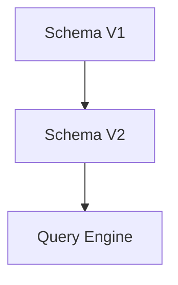

# Schema Evolution (Tiến hóa lược đồ)

Trong thế giới Data Engineering, có một sự thật hiển nhiên: **Dữ liệu luôn thay đổi**. Hôm nay, ứng dụng nguồn thêm một cột để theo dõi hành vi người dùng; ngày mai, họ đổi kiểu dữ liệu của trường số điện thoại từ số sang chuỗi để hỗ trợ mã quốc gia. 

Nếu hệ thống của bạn quá cứng nhắc, mỗi lần thay đổi như vậy sẽ là một lần pipeline bị sập, kéo theo hàng giờ cày cuốc để sửa code và chạy lại dữ liệu lịch sử. Để giải quyết vấn đề này, các công nghệ lưu trữ hiện đại đã giới thiệu một khái niệm cứu cánh: **Schema Evolution (Tiến hóa lược đồ)**.

## Schema Evolution là gì? Khi dữ liệu không bao giờ đứng yên

**Schema Evolution** là khả năng tự động theo dõi, quản lý và áp dụng các thay đổi cấu trúc bảng (như thêm cột, đổi tên, xóa cột hoặc đổi kiểu dữ liệu) theo thời gian. 

Điểm kỳ diệu của tính năng này là hệ thống đảm bảo các truy vấn vẫn hoạt động bình thường, đọc mượt mà cả dữ liệu cũ (được ghi bằng cấu trúc cũ) lẫn dữ liệu mới (được ghi bằng cấu trúc mới) mà không đòi hỏi bạn phải ghi đè (`rewrite`) lại hàng petabyte dữ liệu lịch sử đã lưu trữ. Đây là một tính năng cốt lõi của các Table Format hiện đại như Apache Iceberg hay Delta Lake.

## Tại sao chúng ta cần Schema Evolution?

Hãy thử nhớ lại cách chúng ta xử lý khi hệ thống nguồn (OLTP) thay đổi cấu trúc trước đây:

1. **Pipeline đổ vỡ hàng loạt**: Chỉ cần nguồn gửi thêm một trường mới hoặc thiếu một trường so với cấu trúc bảng đích, job ETL/ELT sẽ lập tức báo lỗi và dừng hoạt động.
2. **Chi phí vận hành đắt đỏ**: Với các định dạng lưu trữ cũ trên Data Lake (như file Parquet thô qua Hive), nếu muốn đổi tên một cột hoặc xóa một trường, cách duy nhất là dùng Spark đọc toàn bộ dữ liệu lịch sử lên, biến đổi cấu trúc, rồi ghi đè lại toàn bộ. Quá trình này không chỉ tốn hàng ngày trời mà còn ngốn hàng ngàn đô la chi phí tính toán của máy chủ.
3. **Mất an toàn dữ liệu**: Đôi khi hệ thống tự động ép kiểu dữ liệu mới vào cấu trúc cũ (ví dụ: chuyển kiểu `FLOAT` thành `INT`) dẫn đến việc dữ liệu bị làm tròn và mất mát thông tin quan trọng một cách âm thầm.

Schema Evolution ra đời để biến những thay đổi cấu trúc phức tạp này thành một **thao tác cập nhật siêu dữ liệu (metadata) tức thì**, giúp giảm thiểu tối đa công sức bảo trì của kỹ sư dữ liệu.

## Cơ chế hoạt động: Phép thuật từ Column ID Tracking

Làm sao hệ thống có thể đọc file cũ và file mới cùng lúc dù chúng có cấu trúc khác nhau? Bí quyết nằm ở cách quản lý metadata. Hãy lấy ví dụ về cơ chế **Column ID Tracking** cực kỳ thông minh của Apache Iceberg:

* **Không dựa vào tên cột**: Thay vì dùng tên cột để đối chiếu dữ liệu (rất dễ lỗi nếu đổi tên), Iceberg gán cho mỗi cột một ID duy nhất và bất biến khi bảng được tạo (ví dụ: `id` -> ID=1, `name` -> ID=2).
* **Ánh xạ qua Metadata**: Hệ thống lưu trữ một file metadata đóng vai trò là "bản đồ". Khi bạn đổi tên cột từ `name` thành `full_name`, hệ thống chỉ đơn giản cập nhật bản đồ metadata: `full_name` -> ID=2. File Parquet vật lý bên dưới hoàn toàn không bị đụng tới!
* **Truy vấn thông minh**: Khi Engine truy vấn yêu cầu cột `full_name`, nó sẽ nhìn vào metadata để biết cần tìm dữ liệu của ID=2. Khi quét qua các file Parquet cũ (nơi cột vẫn được đặt tên là `name`), nó vẫn đọc đúng dữ liệu nhờ khớp ID=2.



### Các quy tắc tiến hóa cơ bản được xử lý thế nào?

* **Thêm cột**: Khi bạn thêm một cột mới, engine đọc dữ liệu từ các file cũ (chưa có cột này) sẽ tự động trả về giá trị `NULL`.
* **Xóa cột**: Metadata chỉ cần đánh dấu ẩn cột đó đi. Khi đọc, engine sẽ bỏ qua không tải cột đó lên bộ nhớ nữa. Dữ liệu vật lý cũ vẫn nằm đó cho đến khi bảng được dọn dẹp (compact), nhưng người dùng hoàn toàn không nhìn thấy nó nữa.
* **Đổi tên cột**: Như đã giải thích ở trên, nhờ liên kết qua Column ID, việc đổi tên diễn ra trong tích tắc mà không ảnh hưởng tới dữ liệu cũ.
* **Nâng cấp kiểu dữ liệu (Type promotion)**: Hệ thống cho phép tự động nâng lên kiểu dữ liệu rộng hơn (ví dụ: từ `INT` lên `BIGINT`, từ `FLOAT` lên `DOUBLE`). Engine sẽ tự động ép kiểu ngay trên bộ nhớ (on-the-fly) khi trả kết quả truy vấn.

## Thực hành: Tự động hóa tiến hóa cấu trúc với Delta Lake

Dưới đây là ví dụ minh họa cách Apache Spark kết hợp với **Delta Lake** tự động cập nhật cấu trúc bảng khi phát hiện dữ liệu mới có thêm cột:

```python
# Ghi DataFrame ban đầu với 2 cột
df_v1 = spark.createDataFrame([(1, "Alice")], ["id", "name"])
df_v1.write.format("delta").save("/tmp/my_table")

# DataFrame mới xuất hiện thêm cột 'age'
df_v2 = spark.createDataFrame([(2, "Bob", 30)], ["id", "name", "age"])

# Nếu ghi đè thông thường, Spark sẽ báo lỗi cấu trúc không khớp (Schema Mismatch).
# Bằng cách bật mergeSchema, ta kích hoạt tính năng Schema Evolution:
df_v2.write.format("delta") \
     .mode("append") \
     .option("mergeSchema", "true") \
     .save("/tmp/my_table")

# Kiểm tra kết quả sau khi tiến hóa lược đồ:
spark.read.format("delta").load("/tmp/my_table").show()
# Kết quả hiển thị:
# +---+-----+----+
# | id| name| age|
# +---+-----+----+
# |  1|Alice|null| -> Dữ liệu cũ tự động nhận giá trị NULL cho cột age mới thêm
# |  2|  Bob|  30|
# +---+-----+----+
```

## Những lưu ý để tránh biến Data Lake thành "bãi rác"

Mặc dù Schema Evolution rất tiện lợi, việc lạm dụng nó có thể dẫn đến những hệ quả khôn lường:

* **Đừng lạm dụng `mergeSchema = true`**: Nếu tự động chấp nhận mọi thay đổi cấu trúc từ nguồn đổ về, bảng của bạn sẽ nhanh chóng tích tụ hàng chục cột rác do lỗi gõ phím (typo) hoặc dữ liệu sai định dạng của hệ thống nguồn. Đối với các môi trường Production quan trọng, hãy thực hiện thay đổi schema một cách chủ động thông qua các lệnh `ALTER TABLE` có kiểm soát.
* **Tránh hạ cấp kiểu dữ liệu (Downcasting)**: Schema Evolution chỉ hỗ trợ nâng cấp (widening). Bạn không thể tự động chuyển một cột từ `STRING` về lại `INT` vì điều này chắc chắn gây ra lỗi đọc dữ liệu hoặc mất mát thông tin. Nếu bắt buộc phải hạ cấp, bạn phải tạo cột mới hoặc ghi đè lại toàn bộ bảng.
* **Sự khác biệt giữa các Table Format**: Nếu bạn đang xây dựng Data Lakehouse từ đầu, hãy cân nhắc chọn Apache Iceberg. Cơ chế quản lý qua Column ID của Iceberg hoạt động độc lập và an toàn hơn hẳn so với một số format vẫn còn phụ thuộc một phần vào tên cột.

### So sánh các hướng tiếp cận xử lý:

| Tiêu chí | Cố định Schema (Strict Schema) | Tiến hóa Schema (Schema Evolution) |
| :--- | :--- | :--- |
| **Độ ổn định** | Rất cao, tránh tuyệt đối lỗi ở các Dashboard cuối. | Trung bình, có thể gây lỗi logic cho hạ nguồn. |
| **Độ linh hoạt** | Kém, dễ làm sập pipeline khi nguồn thay đổi. | Cực tốt, dữ liệu thô luôn được lưu giữ đầy đủ. |
| **Phù hợp cho** | Tầng dữ liệu cuối (Data Marts/Gold layer). | Tầng dữ liệu thô (Raw/Bronze layer). |

## Khái niệm liên quan

* [Table Format](/concepts/data-lake-lakehouse/table-format/): Định dạng bảng dữ liệu.
* Data Lakehouse: Kiến trúc kết hợp Data Lake và Data Warehouse.
* [Delta Lake](/concepts/data-lake-lakehouse/delta-lake/): Định dạng lưu trữ mã nguồn mở của Databricks.
* [Apache Iceberg](/concepts/data-lake-lakehouse/apache-iceberg/): Định dạng bảng phân tích hiệu năng cao.

## Góc phỏng vấn: Đào sâu về Schema Evolution

### 1. Tại sao Apache Iceberg được nhận xét là hỗ trợ Schema Evolution tốt hơn Apache Hive truyền thống?
* **Gợi ý trả lời**: Apache Hive quản lý cột dựa trên **tên cột** hoặc **vị trí vật lý** trong file. Điều này dẫn đến việc đổi tên hoặc xóa cột ở giữa bảng sẽ làm Hive đọc sai lệch dữ liệu hoặc bị lỗi crash khi quét các file cũ. Ngược lại, Apache Iceberg sử dụng cơ chế **Column ID Tracking** – gán cho mỗi cột một ID bất biến. Dù bạn đổi tên hay thay đổi vị trí, truy vấn của Iceberg vẫn ánh xạ chính xác đến ID của cột đó trong file vật lý cũ, giúp quá trình tiến hóa lược đồ diễn ra an toàn và chỉ tốn chi phí cập nhật metadata cực kỳ nhỏ ($O(1)$).

### 2. Sự khác biệt giữa Upcasting và Downcasting trong tiến hóa cấu trúc là gì?
* **Gợi ý trả lời**: 
  * **Upcasting (Widening)** là việc chuyển đổi kiểu dữ liệu sang một định dạng rộng hơn (như từ `INT` lên `BIGINT`, `FLOAT` lên `DOUBLE`). Việc này rất an toàn vì kiểu dữ liệu mới bao hàm hoàn toàn kiểu dữ liệu cũ, hệ thống có thể tự động ép kiểu (cast) ngay khi đọc dữ liệu mà không lo mất mát thông tin.
  * **Downcasting (Narrowing)** là chiều ngược lại (ví dụ từ `BIGINT` xuống `INT`, hoặc `STRING` về `DATE`). Việc này không được hỗ trợ tự động vì tiềm ẩn nguy cơ tràn số (overflow) hoặc lỗi phân tích định dạng (parse error) trên dữ liệu cũ, làm hỏng toàn bộ luồng xử lý phía sau.

## Tài liệu tham khảo

1. **Apache Iceberg Documentation**: Schema Evolution (iceberg.apache.org/evolution) - Giải thích chi tiết về Column ID tracking.
2. **Delta Lake Documentation**: Schema Validation & Evolution.

## English Summary

Schema Evolution is a critical feature in modern Data Lakehouse architectures (via table formats like Iceberg, Delta Lake, and Hudi) that allows users to modify a table's structure—such as adding, dropping, renaming, or upcasting columns—without the need to rewrite historical data files. By utilizing metadata mapping and unique column ID tracking, query engines can seamlessly read old data formats alongside new ones. This eliminates costly pipeline breakages and rewrite operations when upstream source schemas change, significantly enhancing the agility and reliability of data engineering workflows.
