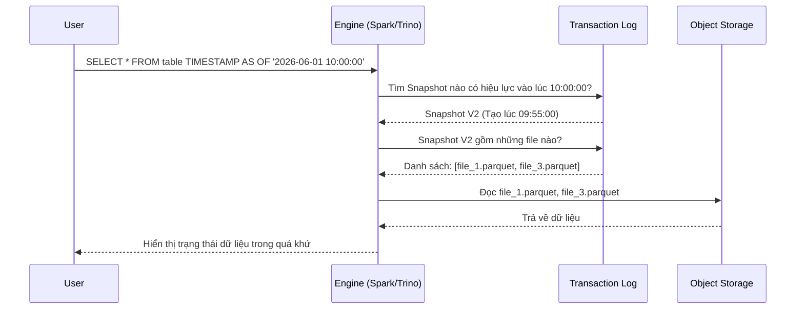

# Time Travel - Du hành thời gian: Chiếc vé khứ hồi cho dữ liệu của bạn

Hãy tưởng tượng bạn vừa lỡ tay chạy một câu lệnh `UPDATE` hoặc `DELETE` nhạy cảm trên một bảng dữ liệu khổng lồ mà... quên viết kèm điều kiện `WHERE`. Chỉ trong tích tắc, toàn bộ dữ liệu khách hàng quan trọng đã bốc hơi hoặc bị ghi đè hỗn loạn. Cơn ác mộng của mọi kỹ sư dữ liệu bắt đầu. 

Thế nhưng, nếu hệ thống của bạn hỗ trợ tính năng **Time Travel (Du hành thời gian)**, bạn có thể thở phào nhẹ nhõm. Chỉ bằng một câu lệnh SQL đơn giản, bạn có thể đưa bảng dữ liệu quay ngược trở lại trạng thái hoàn hảo của nó cách đây 10 phút hoặc tại một phiên bản (version) cụ thể trong quá khứ.

## Time Travel là gì? Tính năng "Undo" thần kỳ của dữ liệu

**Time Travel** là tính năng cho phép hệ thống (như Cloud Data Warehouse hay Data Lakehouse) truy vấn và xem lại trạng thái của một bảng dữ liệu tại một mốc thời gian cụ thể hoặc ở một số phiên bản trong quá khứ, miễn là mốc đó nằm trong cửa sổ lưu giữ lịch sử (retention window) được cấu hình trước.

Về cơ bản, Time Travel biến kho dữ liệu của bạn từ một nơi chỉ lưu giữ trạng thái hiện tại thành một hệ thống quản lý phiên bản (version control) thông minh – tương tự như cách Git hoạt động nhưng là dành cho dữ liệu cấp độ hàng Petabyte. Tính năng này được hỗ trợ cực kỳ mạnh mẽ bởi các Table Format hiện đại (như Delta Lake, Apache Iceberg, Apache Hudi) và các nền tảng Data Warehouse đám mây (như Snowflake, BigQuery).

## Tại sao chúng ta cần đến khả năng "Du hành thời gian"?

Trước khi có Time Travel, nếu xảy ra sự cố thao tác nhầm làm hỏng dữ liệu, quy trình khôi phục thường vô cùng gian nan:
1. Gửi yêu cầu khẩn cấp cho Quản trị viên cơ sở dữ liệu (DBA).
2. Tạm dừng toàn bộ hệ thống (Downtime).
3. Tìm kiếm file backup từ đêm hôm trước trên băng từ hoặc bộ lưu trữ dự phòng và tiến hành restore lại.
4. Chấp nhận mất sạch dữ liệu phát sinh từ thời điểm backup đến lúc xảy ra sự cố.

Bên cạnh việc cứu nguy cho các sự cố vận hành, Time Travel còn là vị cứu tinh của các nhà khoa học dữ liệu (Data Scientists). Khi xây dựng mô hình Machine Learning, việc tái tạo (reproduce) lại kết quả thử nghiệm là tối quan trọng. Nếu dữ liệu trong bảng liên tục biến động mỗi ngày, việc chạy lại code huấn luyện hôm nay sẽ cho ra kết quả khác xa với tuần trước. Nhờ Time Travel, các nhà khoa học dữ liệu có thể đóng băng và truy xuất chính xác tập dữ liệu gốc tại thời điểm huấn luyện để đối chiếu và sửa lỗi.

## Cơ chế hoạt động: Làm sao hệ thống có thể quay ngược thời gian?

Bí mật đằng sau khả năng "du hành thời gian" của dữ liệu dựa trên hai cơ chế cốt lõi: **Lưu trữ chỉ ghi thêm (Append-only storage)** và **Nhật ký giao dịch (Transaction Logs)**.

1. **Không bao giờ ghi đè vật lý:** Khi bạn thực hiện lệnh cập nhật (`UPDATE`) hoặc xóa (`DELETE`), hệ thống không hề can thiệp xóa đi các byte dữ liệu cũ trên ổ đĩa. Thay vào đó, nó ghi thêm các file dữ liệu mới chứa trạng thái mới nhất.
2. **Quản lý phiên bản (Snapshot/Versioning):** Mỗi hành động làm thay đổi bảng tạo ra một phiên bản mới. Nhật ký giao dịch sẽ ghi chép tỉ mỉ: *"Phiên bản V5 bao gồm những file vật lý cụ thể nào"*.
3. **Truy vấn theo ngữ cảnh thời gian:** Khi bạn gửi yêu cầu: *"Cho tôi xem dữ liệu lúc 9:00 sáng hôm qua"*, bộ tối ưu truy vấn (Query Engine) sẽ đối chiếu với nhật ký giao dịch để tìm xem thời điểm đó bảng đang ở phiên bản nào (ví dụ: V2). Sau đó, nó chỉ quét các file vật lý thuộc về phiên bản V2 và hoàn toàn phớt lờ các file mới được tạo ra sau mốc 9:00 sáng.

## Sơ đồ quy trình thực thi truy vấn Time Travel

Dưới đây là cách mà Engine tính toán phối hợp với lớp Metadata để lấy dữ liệu quá khứ cho người dùng:



## Ví dụ thực tế: Cứu nguy dữ liệu bằng SQL

Dưới đây là một số câu lệnh thực tế mà bạn có thể dùng để kiểm tra và khôi phục dữ liệu trên Snowflake hoặc Databricks:

**Truy vấn dữ liệu tại một mốc thời gian cụ thể:**
```sql
SELECT * 
FROM customer_table TIMESTAMP AS OF '2026-06-01 09:00:00'
WHERE customer_id = 12345;
```

**Truy vấn dữ liệu tại một số hiệu phiên bản (Version):**
```sql
SELECT * 
FROM customer_table VERSION AS OF 10;
```

**Khôi phục lại dữ liệu sau khi lỡ tay xóa nhầm:**
```sql
-- Cách 1: Chèn lại dữ liệu từ trạng thái cách đây 1 giờ
INSERT INTO customer_table
SELECT * FROM customer_table TIMESTAMP AS OF (CURRENT_TIMESTAMP() - INTERVAL 1 HOUR);

-- Cách 2: Khôi phục trực tiếp bảng về thời điểm an toàn (Delta Lake/Snowflake)
RESTORE TABLE customer_table TO TIMESTAMP AS OF '2026-06-07 10:00:00';
```

## Các Best Practices và cạm bẫy cần tránh

* **Thiết lập khoảng thời gian lưu giữ (Retention Period) hợp lý:** Việc giữ lại các file dữ liệu cũ sẽ làm tăng dung lượng lưu trữ trên đám mây. Bạn nên cấu hình thời gian lưu giữ vừa đủ dùng, ví dụ từ 7 đến 30 ngày cho môi trường phát triển và vận hành. Rất ít khi hệ thống thực sự cần Time Travel về mốc thời gian cách đây 1 năm vì chi phí lưu trữ metadata và file rác khi đó sẽ cực kỳ khổng lồ.
* **Lên lịch dọn dẹp định kỳ bằng lệnh `VACUUM`:** Khi các phiên bản cũ đã vượt quá thời hạn Time Travel quy định, hãy chạy lệnh `VACUUM` (hoặc cấu hình tự động dọn dẹp) để xóa sạch vật lý các file rác đó khỏi Object Storage (S3/GCS) nhằm tối ưu hóa chi phí.
* **Không coi Time Travel là giải pháp Sao lưu thảm họa (Disaster Recovery):** Đây là sai lầm nguy hiểm. Time Travel chỉ bảo vệ bạn trước các lỗi logic hoặc thao tác nhầm lẫn. Nếu một quản trị viên vô tình xóa mất bucket lưu trữ S3 hoặc tài khoản đám mây bị hack, mọi phiên bản lịch sử của Time Travel cũng sẽ biến mất theo. Hãy luôn duy trì một cơ chế Backup/Replication độc lập ở một vùng địa lý khác.

## Những đánh đổi của cơ chế Time Travel

### Điểm mạnh
* Sửa lỗi dữ liệu nhanh chóng mà không cần dừng hệ thống (zero downtime).
* Dễ dàng thực hiện kiểm toán (audit) sự thay đổi dữ liệu theo thời gian.
* Đóng băng dữ liệu huấn luyện giúp việc phát triển các mô hình Machine Learning có thể tái lập chính xác 100%.

### Điểm yếu
* **Chi phí lưu trữ tăng thêm:** Do các file dữ liệu cũ chưa bị xóa đi ngay lập tức, dung lượng ổ đĩa sử dụng sẽ cao hơn so với một bảng thông thường chỉ lưu trạng thái hiện tại.
* **Metadata phình to:** Transaction Log quá lớn có thể làm chậm quá trình lập kế hoạch truy vấn (Query Planning) nếu không được nén và tối ưu hóa định kỳ.

## Khái niệm liên quan & Tài liệu tham khảo

**Khái niệm liên quan:**
* [Table Format - Định dạng bảng](/concepts/data-lake-lakehouse/table-format/)
* [Delta Lake](/concepts/data-lake-lakehouse/delta-lake/)
* [Apache Iceberg](/concepts/data-lake-lakehouse/apache-iceberg/)
* Data Lakehouse

**Tài liệu tham khảo:**
1. **Delta Lake Documentation** - *"Time Travel (data versioning)"*.
2. **Snowflake Documentation** - *"Understanding & Using Time Travel"*.
3. **Apache Iceberg Documentation** - *"Time Travel and Rollback"*.

---

## Góc phỏng vấn: Câu hỏi thường gặp

### 1. Phân biệt sự khác nhau giữa Time Travel và Slowly Changing Dimension (SCD Type 2). Cả hai đều dùng để xem lịch sử dữ liệu, vậy khi nào nên dùng cái nào?
**Gợi ý trả lời:**
* **SCD Type 2** là một kỹ thuật *mô hình hóa dữ liệu ở cấp độ nghiệp vụ*. Nó được thiết kế bằng các cột cụ thể (như `start_date`, `end_date`, `is_current`) để phục vụ trực tiếp cho việc phân tích kinh doanh (ví dụ: tính doanh thu của nhân viên kinh doanh gắn với từng chi nhánh họ đã từng làm việc qua các năm). Lịch sử của SCD2 được lưu giữ vĩnh viễn và tham gia trực tiếp vào các báo cáo BI hàng ngày.
* **Time Travel** là một tính năng *ở cấp độ hệ thống/hạ tầng*. Nó lưu giữ trạng thái vật lý của file dữ liệu nhằm phục vụ các tác vụ kỹ thuật như phục hồi lỗi thao tác, gỡ lỗi pipeline, hoặc tái lập mô hình Machine Learning. Nó thường bị giới hạn thời gian (ví dụ chỉ lưu giữ trong 30 ngày) để tránh làm phình to chi phí lưu trữ.
* **Kết luận:** Chúng ta không dùng Time Travel để thay thế cho SCD Type 2 cho các báo cáo phân tích nghiệp vụ dài hạn.

### 2. Lệnh `VACUUM` (hoặc Expire Snapshots) hoạt động ra sao và nó ảnh hưởng thế nào đến tính năng Time Travel?
**Gợi ý trả lời:**
Lệnh `VACUUM` quét toàn bộ hệ thống lưu trữ để tìm và xóa vật lý (physically delete) các tệp tin dữ liệu cũ không còn thuộc về phiên bản hiện tại và đã nằm ngoài khoảng thời gian lưu giữ (retention window) được thiết lập. 

Sau khi chạy lệnh `VACUUM`, các file vật lý cũ sẽ bị xóa vĩnh viễn khỏi storage (như S3/GCS), và chúng ta sẽ không thể thực hiện Time Travel về các mốc thời gian cần sử dụng các file này được nữa. Vì thế, việc cấu hình `VACUUM` là một sự cân nhắc đánh đổi quan trọng giữa việc tiết kiệm chi phí lưu trữ và giới hạn thời gian quay ngược lịch sử của hệ thống.

---

## English summary

Time Travel is a system-level feature found in modern Data Warehouses and Lakehouse architectures (via table formats like Delta Lake, Iceberg) that allows users to query data as it existed at a specific timestamp or historical version in the past. It relies on an append-only storage mechanism paired with transaction logs, keeping older data files intact until a vacuum process physically removes them. Time travel is crucial for recovering from human errors (accidental updates/deletes), auditing data changes over time, and ensuring perfect reproducibility for Machine Learning experiments without requiring complex database restores.
