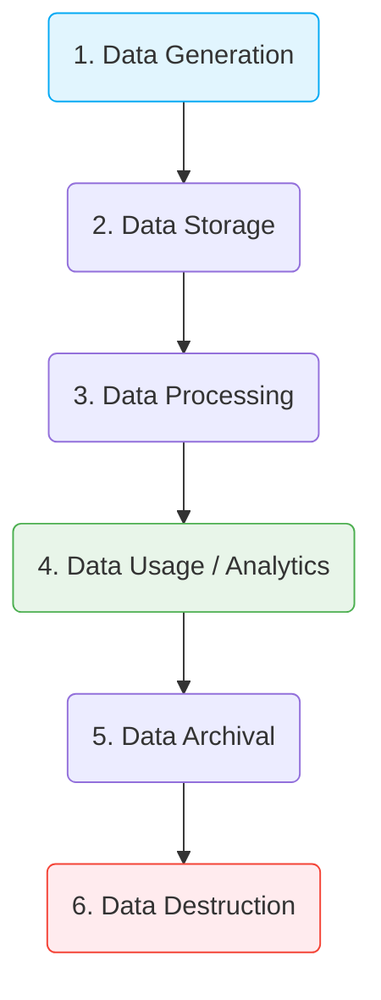

# Vòng đời Dữ liệu - Data Lifecycle

## Summary

Vòng đời dữ liệu (Data Lifecycle) là chuỗi các giai đoạn mà dữ liệu trải qua trong toàn bộ vòng đời của nó, từ thời điểm được sinh ra (Generation) cho đến khi bị xóa bỏ hoàn toàn (Destruction). Việc quản lý vòng đời dữ liệu một cách chặt chẽ giúp tổ chức tối ưu hóa chi phí lưu trữ, đảm bảo tuân thủ các quy định pháp luật (như GDPR) và giữ được tính bảo mật, toàn vẹn của thông tin.

---

## Definition

**Data Lifecycle Management (DLM)** không chỉ là khái niệm kỹ thuật mà còn là một chiến lược quản trị (Data Governance). Nó quy định cách thức dữ liệu được đối xử ở từng giai đoạn thời gian. Một vòng đời điển hình bao gồm các giai đoạn: Sinh ra (Creation) -> Lưu trữ (Storage) -> Xử lý (Processing) -> Tiêu thụ (Usage/Consumption) -> Lưu trữ dài hạn/Đóng băng (Archiving) -> Tiêu hủy (Destruction).

---

## Why it exists

Dữ liệu không có giá trị vĩnh viễn. Một bản ghi log của hệ thống ngày hôm nay cực kỳ quan trọng để debug lỗi, nhưng 5 năm sau nó hoàn toàn vô giá trị và chỉ gây tốn kém chi phí đĩa cứng. 
1. **Tối ưu chi phí**: Các dữ liệu cũ cần được di chuyển từ ổ đĩa SSD đắt tiền sang ổ cứng HDD rẻ hơn (Cold storage).
2. **Tuân thủ pháp luật (Compliance)**: Các luật như GDPR, HIPAA yêu cầu dữ liệu người dùng phải được bảo vệ, và phải bị xóa hoàn toàn khỏi hệ thống (kể cả backup) khi người dùng yêu cầu hoặc sau một thời hạn lưu trữ quy định.
3. **Quản trị bảo mật**: Giảm thiểu rủi ro rò rỉ dữ liệu bằng cách loại bỏ các dữ liệu nhạy cảm không còn cần thiết.

---

## Core idea

Mỗi giai đoạn trong vòng đời đòi hỏi các công cụ và chính sách riêng biệt:

1. **Generation/Collection**: Dữ liệu được tạo ra từ user, hệ thống IoT, APIs.
2. **Storage/Ingestion**: Đưa dữ liệu vào Database hoặc Data Lake.
3. **Processing**: Làm sạch, ETL, chuẩn hóa dữ liệu.
4. **Usage**: Truy vấn, làm báo cáo BI, huấn luyện Machine Learning. (Giai đoạn mang lại giá trị lớn nhất).
5. **Archiving**: Khi dữ liệu ít được truy cập (ví dụ: hóa đơn 3 năm trước), di chuyển sang các nền tảng lưu trữ chi phí thấp (Glacier).
6. **Destruction/Purging**: Xóa vĩnh viễn dữ liệu theo chính sách bảo lưu (Retention Policy).

---

## How it works

Quy trình quản lý Data Lifecycle thường được tự động hóa.
1. Quản trị viên dữ liệu (Data Steward) định nghĩa các **Data Retention Policies** (Chính sách lưu giữ). Ví dụ: "Log ứng dụng giữ 30 ngày. Dữ liệu giao dịch giữ 7 năm".
2. Kỹ sư dữ liệu thiết lập các Data Pipeline có gắn siêu dữ liệu (Metadata) về thời gian tạo để phân loại.
3. Sử dụng các tính năng tự động của Cloud (như S3 Lifecycle Rules) để tự động chuyển tier (hạng lưu trữ) hoặc xóa dữ liệu theo quy tắc thời gian.

---

## Architecture / Flow



---

## Practical example

Sử dụng AWS S3 Lifecycle Configuration để quản lý vòng đời dữ liệu dạng Object:

Giả sử bạn có bucket `s3://my-company-logs/`. Bạn muốn tự động hóa quá trình tối ưu chi phí:

```json
{
    "Rules": [
        {
            "ID": "LogLifecycleRule",
            "Filter": { "Prefix": "app-logs/" },
            "Status": "Enabled",
            "Transitions": [
                {
                    "Days": 30,
                    "StorageClass": "STANDARD_IA" 
                    // Sau 30 ngày, chuyển sang lớp lưu trữ truy cập thưa (Rẻ hơn)
                },
                {
                    "Days": 90,
                    "StorageClass": "GLACIER" 
                    // Sau 90 ngày, chuyển sang Glacier (Lưu trữ đóng băng, rất rẻ)
                }
            ],
            "Expiration": {
                "Days": 365 
                // Xóa vĩnh viễn sau 1 năm
            }
        }
    ]
}
```

---

## Best practices

* **Phân loại dữ liệu (Data Classification)** ngay từ khâu đầu tiên. Gắn thẻ dữ liệu nào là PII (Thông định danh cá nhân) để có chính sách lifecycle riêng (nhạy cảm, xóa nhanh).
* **Tự động hóa**: Đừng sử dụng con người để xóa dữ liệu thủ công. Phải dùng script hoặc cloud lifecycle rules.
* **Bảo vệ môi trường Archive**: Dữ liệu trong Archive (Glacier) cần được mã hóa và hạn chế quyền truy cập nghiêm ngặt.
* **Xác nhận tiêu hủy (Proof of destruction)**: Trong các hệ thống ngân hàng, việc xóa đĩa cứng có thể cần phải có biên bản tiêu hủy vật lý.

---

## Common mistakes

* **Giữ mọi thứ mãi mãi (Hoarding)**: Tư duy "cứ lưu lại biết đâu sau này cần" dẫn đến việc Data Lake biến thành Data Swamp, chi phí Cloud phình to không kiểm soát.
* **Quên xử lý dữ liệu sao lưu (Backups)**: Người dùng yêu cầu xóa thông tin cá nhân của họ theo luật GDPR. Tổ chức xóa trên Database chính nhưng quên xóa trong bản backup ở S3, vi phạm pháp luật.

---

## Trade-offs

### Ưu điểm
* Giảm thiểu rủi ro pháp lý và chi phí vi phạm (Compliance).
* Giảm thiểu đáng kể hóa đơn (Billing) lưu trữ trên Cloud.
* Cải thiện hiệu suất truy vấn hệ thống vì lượng dữ liệu quét (scan) bị thu gọn lại tập trung vào dữ liệu "nóng" (hot data).

### Nhược điểm
* Việc thiết kế và thực thi chính sách vòng đời đòi hỏi sự đồng thuận liên phòng ban (IT, Legal, Business), gây tốn thời gian.
* Quá trình truy xuất dữ liệu đã Archive (Glacier) thường mất nhiều giờ đến nhiều ngày và tốn phí cao nếu đột xuất có nhu cầu phân tích lại dữ liệu quá khứ.

---

## When to use

* Là bắt buộc đối với mọi tổ chức xử lý dữ liệu người dùng (Healthcare, Finance, E-commerce).
* Bắt buộc áp dụng khi hệ thống chuyển đổi lên Cloud để quản lý chi phí.

## When not to use

* Với các dữ liệu tham chiếu cốt lõi (Master Data) như Danh mục quốc gia, Danh mục tiền tệ, chúng gần như có vòng đời vĩnh viễn và không tuân theo các quy tắc archive/xóa bỏ thông thường.

---

## Related concepts

* [Data Platform Architecture](/concepts/data-platform-architecture)

---

## Interview questions

### 1. Cold Data và Hot Data khác nhau thế nào trong Vòng đời dữ liệu?
* **Gợi ý trả lời**: 
  * **Hot Data**: Dữ liệu mới sinh ra, được truy cập liên tục, đòi hỏi tốc độ I/O nhanh nhất (ví dụ: giao dịch trong ngày). Lưu trên ổ SSD, trong bộ nhớ (RAM), hoặc Database chính. Chi phí lưu trữ đắt nhất.
  * **Cold Data**: Dữ liệu hiếm khi được truy cập (ví dụ: Log của 1 năm trước). Tốc độ đọc không quan trọng. Lưu trữ ở dạng nén trên ổ HDD, S3 Glacier hoặc băng từ (Tape). Chi phí cực rẻ.
  DLM chính là quá trình chuyển đổi trạng thái của dữ liệu từ Hot sang Cold dần theo thời gian.

### 2. GDPR "Right to be forgotten" ảnh hưởng thế nào đến kiến trúc dữ liệu?
* **Gợi ý trả lời**: Đây là thử thách lớn đối với kỹ sư dữ liệu. Khi có yêu cầu "Quyền được lãng quên", ta phải tìm và xóa mọi dấu vết cá nhân của user đó trên toàn bộ Data Warehouse, Data Lake và Backups. Thay vì xóa vật lý (Hard Delete) có thể làm vỡ tính toàn vẹn (referential integrity), ta thường dùng kỹ thuật "Crypto-shredding" (Xóa khóa giải mã của riêng người dùng đó) hoặc "Anonymization" (Làm ẩn danh dữ liệu PII thành chuỗi ngẫu nhiên, giữ lại lịch sử giao dịch để không làm sai lệch báo cáo tổng doanh thu).

---

## References

1. **DAMA-DMBOK: Data Management Body of Knowledge** - Data Management Association.
2. **AWS Storage Best Practices** - Cloud Lifecycle documentation.

---

## English summary

The Data Lifecycle represents the sequence of stages that data goes through from its initial generation or capture to its final destruction or archiving. Proper Data Lifecycle Management (DLM) involves setting policies for data retention, shifting older data to cheaper "cold" storage (archiving), and permanently purging data to comply with regulations like GDPR. This systematic approach optimizes cloud storage costs, enhances system performance, and mitigates legal and security risks by preventing indefinite data hoarding.
