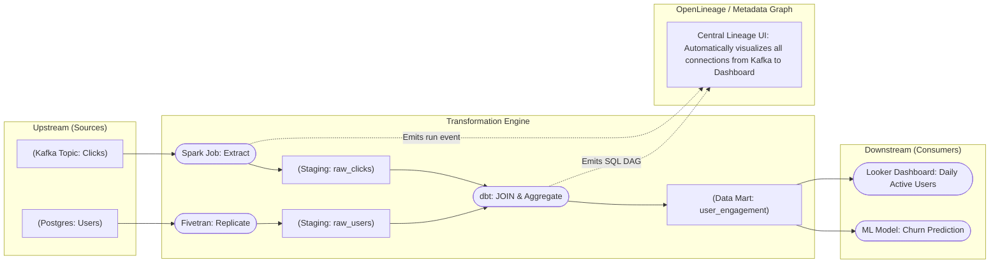

# Phả hệ dữ liệu - Data Lineage

## Summary

Data Lineage (Phả hệ dữ liệu hay Bản đồ luồng dữ liệu) là khả năng theo dõi, lập bản đồ và hiển thị trực quan toàn bộ hành trình vòng đời (lifecycle) của dữ liệu: Nó bắt nguồn từ hệ thống nào, đã di chuyển đi đâu, đi qua những bước biến đổi (transformations) nào, và cuối cùng hiển thị trên báo cáo hoặc bảng điều khiển (dashboards) nào. Trong kỷ nguyên kỹ thuật dữ liệu hiện đại, nơi dữ liệu đi qua hàng trăm lớp bảng phức tạp, Data Lineage là chiếc "bản đồ kho báu" duy nhất giúp kỹ sư sửa lỗi (Debug), phân tích tác động (Impact Analysis) và tuân thủ các cuộc kiểm toán (Compliance Audit).

---

## Definition

**Data Lineage** là lịch sử dòng chảy của thông tin. Về mặt kỹ thuật, nó là một Đồ thị có hướng (Directed Acyclic Graph - DAG), trong đó các **Nút (Nodes)** đại diện cho các thực thể dữ liệu (Bảng nguồn, Cột dữ liệu, Bảng Data Mart, Biểu đồ BI) và các **Cạnh (Edges)** đại diện cho quá trình xử lý (Câu lệnh SQL JOIN, luồng ETL đẩy dữ liệu).

Có hai mức độ chi tiết của Data Lineage:
1. **Table-level Lineage (Cấp độ Bảng)**: Cho biết Bảng C được cấu thành từ việc nối (JOIN) Bảng A và Bảng B. Giúp cái nhìn tổng quan.
2. **Column-level Lineage (Cấp độ Cột)**: Cho biết một cột siêu cụ thể (Ví dụ cột `Tổng lợi nhuận` trên báo cáo Tableau) được cộng gộp chính xác từ cột `giá_bán` của Bảng A trừ đi cột `phí_vận_chuyển` của Bảng B. (Cấp độ này phức tạp hơn rất nhiều để xây dựng tự động).

---

## Why it exists

Hai "cơn ác mộng" kinh điển của người làm Kỹ thuật dữ liệu là nguyên nhân chính ra đời của Data Lineage:

1. **Phân tích tác động (Impact Analysis - Forward Lineage)**
   * Đội ngũ phát triển phần mềm (Software Engineers) dự định sẽ xóa một cột tên là `shipping_address` trong cơ sở dữ liệu người dùng (PostgreSQL) vào tuần sau. Họ hỏi đội Data: "Liệu có cái báo cáo nào của Giám đốc bị sập nếu tôi xóa cột này không?". 
   * Không có Lineage: Đội Data phải mở mã nguồn (source code) lên và gõ `CTRL+F` tìm kiếm chữ `shipping_address` xuyên suốt hàng ngàn file SQL/Python, cực kỳ dễ sót.
   * Có Lineage: Bấm vào cột `shipping_address`, hệ thống truy theo đường đi (trace forward) và bôi đỏ ngay một báo cáo "Bản đồ phân bổ khách hàng" trên Tableau.

2. **Tìm nguyên nhân gốc rễ (Root Cause Analysis - Backward Lineage)**
   * Giám đốc tài chính phát hiện con số "Doanh thu" trên Dashboard tự nhiên bị rớt mất 50%.
   * Không có Lineage: Kỹ sư hoảng loạn đọc ngược lại từng lớp câu lệnh SQL từ Dashboard -> Data Mart -> Staging -> Raw để tìm xem bước nào bị lỗi làm rớt dữ liệu (Mất nhiều giờ hoặc nhiều ngày).
   * Có Lineage: Hệ thống truy ngược (trace backward) ngay lập tức và chỉ ra: Con số trên Dashboard được cấu thành từ 3 bảng, trong đó có một luồng lấy dữ liệu từ `Salesforce_API` bị đánh dấu đỏ (Fail) do chưa chạy ETL sáng nay. Kỹ sư biết ngay chỗ cần sửa.

---

## Core idea

Sức mạnh thực sự của Data Lineage hiện đại nằm ở tính **Tự động (Automated)**.
Các thế hệ trước, kỹ sư thường phải tự vẽ bằng tay sơ đồ luồng dữ liệu trên Visio hoặc Lucidchart. Sơ đồ này trở thành rác chỉ sau 1 tuần vì cấu trúc dữ liệu bị đổi liên tục trong thực tế.
Ý tưởng hiện đại là dùng **Phân tích cú pháp (SQL Parsing/Log Parsing)**. Hệ thống phân tích tự động đọc các file mã nguồn SQL (như dbt model `SELECT a, b FROM table_x JOIN table_y`), dịch nó thành cấu trúc cây ngữ pháp (AST), suy luận ra quan hệ giữa X, Y với bảng đầu ra, sau đó vẽ lên sơ đồ đồ họa ngầm định (Graphic graph) theo thời gian thực (Real-time).

---

## How it works

Hệ thống cung cấp Data Lineage tự động (như DataHub, OpenLineage, dbt docs) hoạt động qua cơ chế:
1. **Lắng nghe (Instrumentation/Parsing)**: 
   * Tích hợp chuẩn **OpenLineage**: Các engine xử lý (như Spark, Airflow) tự động phát ra (emit) một bản tin JSON (Lineage Event) khi một tác vụ đọc bảng X ghi bảng Y kết thúc thành công.
   * Trình phân tích cú pháp (SQL Parser): Công cụ (như dbt) phân tích các macro `{{ ref('table_name') }}` trong mã nguồn biên dịch để xây dựng biểu đồ DAG.
2. **Tổng hợp (Graph Construction)**: Metadata server trung tâm thu thập hàng ngàn sự kiện này, dùng một Cơ sở dữ liệu đồ thị (Graph Database như Neo4j) để nối các mảng đứt gãy lại với nhau. (Ví dụ: Nối bảng X từ hệ thống Spark với bảng X trong BigQuery mà Tableau đang trỏ tới).
3. **Hiển thị trực quan (Visualization)**: Chuyển hóa Đồ thị thành các sơ đồ nút và đường kẻ có thể click (Interactive UI) cho người dùng dễ thao tác.

---

## Architecture / Flow



---

## Practical example

Một ví dụ vô cùng thực tế về **Regulatory Compliance (Tuân thủ pháp luật)** trong ngân hàng.
Các ngân hàng toàn cầu chịu sự giám sát của chuẩn BCBS 239. Khi báo cáo rủi ro tài chính tổng hợp được nộp lên Cục Dự trữ Liên bang (Ngân hàng nhà nước), thanh tra viên có quyền chỉ vào một con số "Dự phòng rủi ro là 5 tỷ" và hỏi:
* "Các anh đã dùng công thức gì, cộng trừ từ những bảng dữ liệu gốc nào để ra được con số 5 tỷ này?"
Nếu không có hệ thống Data Lineage (Provenance - nguồn gốc xuất xứ), ngân hàng sẽ không thể chứng minh (audit-proof) được đường đi của thuật toán, dẫn đến rủi ro bị phạt hoặc đình chỉ hoạt động. Nhờ Data Lineage, chỉ cần 1 cú click chuột truy ngược (trace-back), ngân hàng in ra ngay một biểu đồ minh chứng rõ ràng mọi bước Transformation mà con số 5 tỷ đó đã đi qua từ hệ thống chi nhánh lên trung tâm.

Dưới đây là ví dụ về một gói tin (payload) JSON theo chuẩn **OpenLineage** do một tác vụ Spark hoặc Airflow sinh ra để thông báo việc bảng Đầu ra được tính toán từ bảng Đầu vào. Metadata này sau đó được hệ thống Lineage thu thập để vẽ bản đồ tự động:

```json
{
  "eventType": "COMPLETE",
  "eventTime": "2026-06-08T00:00:00.000Z",
  "run": {
    "runId": "12345678-1234-5678-1234-567812345678"
  },
  "job": {
    "namespace": "my_airflow_cluster",
    "name": "daily_risk_calculation.compute_risk_assets"
  },
  "inputs": [{
    "namespace": "postgresql://eu-branch-db",
    "name": "public.raw_transactions",
    "facets": {
      "schema": {
        "fields": [
          {"name": "tx_id", "type": "VARCHAR"},
          {"name": "amount", "type": "NUMERIC"}
        ]
      }
    }
  }],
  "outputs": [{
    "namespace": "bigquery://central-data-warehouse",
    "name": "finance_mart.risk_assets",
    "facets": {}
  }]
}
```

---

## Best practices

* **Tiêu chuẩn hóa bằng OpenLineage**: Khi xây dựng Data Stack, ưu tiên lựa chọn các công cụ hệ sinh thái hiện đại có hỗ trợ xuất bản chuẩn dữ liệu Mở (OpenLineage API) để các hệ thống (Spark, Fivetran, Airflow) nói chung một ngôn ngữ khi báo cáo đường đi dữ liệu.
* **Coi trọng Column-level Lineage**: Table-level lineage là tốt, nhưng với những bảng rộng (wide tables) có 300 cột, Table-level không giải quyết được vấn đề debug. Hãy đầu tư các parser hoặc công cụ thương mại có khả năng mổ xẻ tận cấp độ Cột (Column-level) để phân tích tác động chính xác nhất.
* **Tích hợp vào CI/CD (Shift-left Lineage)**: Giống như Data Contract, khi một lập trình viên đệ trình Pull Request xóa một cột `address`, hệ thống CI/CD có thể gọi API của Lineage Service. Nếu Lineage API trả về "Cột này đang nuôi 5 Dashboards", hệ thống CI/CD tự động chặn (Block) việc triển khai mã nguồn đó và yêu cầu lập trình viên báo cáo cho Data team.

---

## Common mistakes

* **Tin tưởng tuyệt đối vào SQL Parser tự động**: SQL phức tạp (Ví dụ như Dynamic SQL sinh ra bằng hàm, String Manipulation cực độ, View chồng View lồng qua các Stored Procedures trong SQL Server cũ) thường làm mù mắt các bộ phân tích cú pháp tĩnh. Phả hệ sinh ra bị đứt đoạn và không phản ánh đúng thực tế.
* **Bỏ quên chặng cuối (The Last Mile)**: Vẽ được Lineage từ Source đến Data Warehouse rất đẹp bằng dbt. Nhưng bỏ quên chặng xuất từ Data Warehouse ra các công cụ BI (Tableau, Excel, Sheets). Khi bảng lỗi, ta vẫn không biết ai là người thực sự đang hứng chịu (Downstream impact). Bắt buộc phải chọn các công cụ có khả năng quét cả Metadata của các BI tools.
* **Bảo trì vẽ tay**: Dùng một bạn thực tập sinh dùng Visio vẽ lại luồng dữ liệu của hệ thống mỗi tháng một lần. Việc làm này gây ảo giác quản lý an toàn (False sense of security) vì bản đồ luôn sai so với mã nguồn thực tế.

---

## Trade-offs

### Ưu điểm
* Giảm 80% thời gian Điều tra nguyên nhân gốc rễ (Root Cause Analysis - MTTR) khi xảy ra sự cố.
* Mang lại niềm tin tuyệt đối (Trust) cho Business User khi họ biết con số mình xem đến từ CSDL uy tín nào.
* Phân tích tác động chủ động (Proactive Change Management).

### Nhược điểm
* **Rào cản công nghệ cực cao**: Xây dựng hoặc mua giải pháp Column-level Lineage xịn là vô cùng phức tạp và đắt tiền. Phân tích ngữ nghĩa SQL chéo qua nhiều phương ngữ (Dialects: Snowflake, Postgres, Trino, Spark) là một trong những bài toán khoa học máy tính khó nhất (Tương đương viết một trình biên dịch Compiler nhỏ).
* **Hiệu năng hệ thống**: Liên tục phát (emit) sự kiện lineage theo thời gian thực có thể tạo ra overhead làm nghẽn luồng xử lý nếu không có kiến trúc streaming đủ khỏe (như Kafka) đứng giữa hứng.

---

## When to use

* Với môi trường Data Warehouse/Data Lake trưởng thành: hàng ngàn Pipeline, nhiều Team làm việc phân tán, các dữ liệu chồng chéo lên nhau tạo thành lưới (Data Mesh). Lineage là chìa khóa chống lại sự hỗn loạn (Spaghetti data).
* Đối mặt với kiểm toán ngặt nghèo (GDPR, HIPAA, Tài chính). Cần biết dữ liệu PII chảy qua những ống nào để kiểm soát truy cập.

## When not to use

* Hệ thống rất nhỏ, một Data Engineer quản lý toàn bộ 20 bảng bằng các scripts Python đơn giản và 2 cái bảng điều khiển. Sự phức tạp (overhead) của việc dựng hệ thống Lineage vượt xa lợi ích thu được.

---

## Related concepts

* [Data Catalog](/concepts/data-catalog)
* [Data Governance](/concepts/data-governance)
* [Impact Analysis / Root Cause Analysis (Software Eng)]

---

## Interview questions

### 1. Phân biệt Forward Lineage và Backward Lineage. Cho ví dụ ứng dụng của mỗi loại.
* **Người phỏng vấn muốn kiểm tra**: Khả năng ứng dụng tư duy phân tích đồ thị vào các Use Case kinh doanh thực tế.
* **Gợi ý trả lời (Strong Answer)**: 
  * Forward Lineage (Trace Forward): Theo dõi dữ liệu từ Nguồn -> Đích. Ứng dụng chính yếu: *Phân tích tác động (Impact Analysis)*. Khi dự định xóa hoặc đổi kiểu dữ liệu một cột ở hệ thống gốc, ta tra Forward Lineage để biết chính xác sẽ làm "chết" bao nhiêu báo cáo BI ở hạ nguồn (Downstream), từ đó gửi email thông báo trước cho các phòng ban liên quan.
  * Backward Lineage (Trace Backward): Dò ngược từ Đích <- Nguồn. Ứng dụng chính yếu: *Sửa lỗi (Root Cause Analysis / Troubleshooting)*. Khi phát hiện một biểu đồ BI bị sai số, ta tra Backward Lineage để dò ngược tìm ra chính xác khâu ETL/bảng nguồn (Upstream) nào bị thất bại (Fail) để sửa ngay tại cội rễ.

### 2. Sự khác biệt giữa việc tạo Lineage bằng phương pháp "Static SQL Parsing" (Phân tích tĩnh) và "Runtime Execution/Logs" (Thời gian thực) là gì?
* **Người phỏng vấn muốn kiểm tra**: Kiến thức thiết kế chuyên sâu về công nghệ thu thập Metadata.
* **Gợi ý trả lời (Strong Answer)**: 
  * Phân tích tĩnh (Static SQL Parsing): Công cụ (như dbt) dịch file text SQL trước khi chạy. Ưu điểm: Lập bản đồ nhanh, biết trước sơ đồ. Nhược điểm: Bị "mù" nếu luồng dữ liệu dùng logic động ẩn giấu (như Stored Procedures hoặc Python Pandas tự nạp thư viện).
  * Runtime/Logs (như OpenLineage/Query Logs analyzer): Phân tích lịch sử truy vấn thực tế đã được Server thực thi. Ưu điểm: Độ chính xác là 100%, có thể phản ánh chính xác các lệnh DDL/DML đã thực sự diễn ra vào một thời điểm cụ thể. Bắt được cả thông tin động. Nhược điểm: Bắt buộc code phải được CHẠY thành công ít nhất 1 lần thì nó mới vẽ được đường (Reactive). Thực tế tốt nhất là kết hợp cả hai.

---

## References

1. **OpenLineage Standard** (openlineage.io) - Chuẩn mực công nghiệp đang nổi lên nhằm thống nhất cách các công cụ Data chia sẻ thông tin phả hệ.
2. **"Data Management at Scale"** - Piethein Strengholt (Chương Data Lineage and Provenance).

---

## English summary

Data Lineage is the discipline of mapping and visualizing the lifecycle and flow of data—tracking its provenance from source operational systems, through various ETL/ELT transformation layers, down to its final consumption in BI dashboards or ML models. Represented technically as a Directed Acyclic Graph (DAG), automated lineage (both at table and column levels) is indispensable for Root Cause Analysis (tracing backward to fix pipeline bugs when a dashboard shows corrupted metrics) and Impact Analysis (tracing forward to alert downstream consumers when upstream schemas change). It serves as the definitive map for auditing, regulatory compliance, and maintaining trust in a complex data ecosystem.
