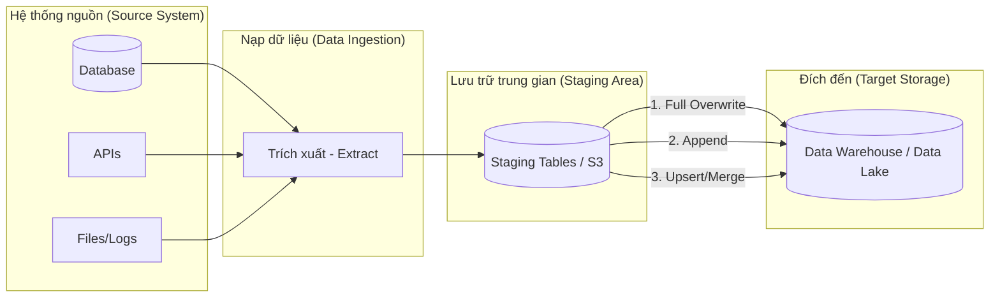

# Nạp dữ liệu (Data Loading): Nghệ thuật ghi dữ liệu hiệu năng cao vào kho chứa

Trong quy trình trích xuất, biến đổi và nạp dữ liệu (ETL/ELT - Extract, Transform, Load / Extract, Load, Transform) kinh điển, chữ cái cuối cùng đại diện cho **Loading (Nạp dữ liệu)**. Đây là bước vật lý trực tiếp ghi hoặc đẩy toàn bộ dữ liệu (cho dù là dữ liệu thô vừa lấy về hay dữ liệu tinh chọn đã qua xử lý) vào hệ thống lưu trữ đích cuối cùng – nơi mà các nhà phân tích hay các công cụ báo cáo thông minh (BI - Business Intelligence) như Tableau, PowerBI đang chờ sẵn để khai thác.

---

## Data Loading thực chất là gì?

**Nạp dữ liệu (Data Loading)** là thao tác đưa kết quả của quá trình trích xuất hoặc biến đổi dữ liệu vào các bảng vật lý tại hệ thống đích (thường là Kho dữ liệu - Data Warehouse, Hồ dữ liệu - Data Lake hoặc các cơ sở dữ liệu phân tích).

Trong các kiến trúc ELT hiện đại, bước nạp dữ liệu thường được chia làm hai giai đoạn rõ rệt:
1. **Nạp dữ liệu thô (Load Raw)**: Sao chép nguyên bản dữ liệu từ hệ thống nguồn (Source) và đẩy thẳng vào vùng chứa dữ liệu thô (Raw/Landing Zone) của Data Warehouse mà không áp đặt logic biến đổi nào.
2. **Nạp dữ liệu sau biến đổi (Load Transformed)**: Thực hiện nạp kết quả của các câu truy vấn làm sạch, tổng hợp dữ liệu từ các bảng staging vào các bảng dữ liệu đích (Data Marts/Serving tables) để cập nhật các báo cáo.

Thách thức lớn nhất của Data Loading là làm thế nào để cập nhật chính xác trạng thái thay đổi của dữ liệu (ví dụ: một đơn hàng hôm qua có trạng thái "Đang giao", hôm nay nạp lại đã chuyển sang "Hoàn thành") mà không làm trùng lặp bản ghi hay làm sai lệch số liệu lịch sử.

---

## Tại sao chúng ta cần các chiến lược nạp dữ liệu chuyên biệt?

Dữ liệu sẽ hoàn toàn vô nghĩa nếu nó chỉ nằm lơ lửng trên bộ nhớ tạm (RAM) của máy chủ xử lý hoặc nằm rải rác trong các tệp CSV rời rạc. Nó phải được tổ chức, định hình cấu trúc và ghi xuống ổ đĩa cứng của các Database phân tích để sẵn sàng cho các câu lệnh SQL truy vấn.

Hơn nữa, khi đối mặt với hàng chục triệu dòng dữ liệu, chúng ta không thể sử dụng các câu lệnh `INSERT INTO` từng dòng đơn lẻ như cách lập trình web truyền thống. Việc đó sẽ tạo ra hàng triệu giao dịch (transactions) kết nối mạng, gây nghẽn cổ chai hệ thống (network bottleneck) và tốn hàng tuần để hoàn thành. Thay vào đó, kỹ sư dữ liệu phải sử dụng các cơ chế **Nạp khối lượng lớn (Bulk Load)** chuyên dụng.

---

## Kiến trúc và Các phương pháp nạp dữ liệu

Kiến trúc nạp dữ liệu (Data Loading Architecture) trong quy trình ETL/ELT hiện đại thường bao gồm 3 phân lớp chính:
1. **Lớp nguồn (Source System)**: Nơi phát sinh dữ liệu gốc như cơ sở dữ liệu giao dịch (OLTP), tệp nhật ký (logs), hoặc các API từ bên thứ ba.
2. **Lớp trung gian (Staging Area / Landing Zone)**: Vùng lưu trữ đệm tạm thời (như AWS S3, Google Cloud Storage, hoặc các bảng tạm `staging_table` trong Data Warehouse) để kiểm tra chất lượng dữ liệu trước khi nạp chính thức.
3. **Lớp đích (Target Storage)**: Nơi lưu trữ cuối cùng phục vụ cho phân tích (Data Warehouse, Data Lake, hoặc Data Mart).

Dưới đây là sơ đồ luồng kiến trúc nạp dữ liệu tổng quan:



Tùy thuộc vào đặc tính và dung lượng của dữ liệu, kỹ sư sẽ quyết định áp dụng một trong ba chiến lược nạp dưới đây:

### 1. Ghi đè toàn bộ (Full Overwrite / Drop & Create)
* **Cách thực hiện**: Xóa sạch toàn bộ dữ liệu đang có trong bảng đích (hoặc chạy lệnh `TRUNCATE TABLE`), sau đó nạp mới toàn bộ dữ liệu từ đầu.
* **Đặc điểm**: Đơn giản nhất để viết code và tuyệt đối an toàn vì không lo ngại vấn đề trùng lặp bản ghi cũ. Chiến lược này cực kỳ phù hợp cho các bảng dữ liệu danh mục nhỏ, ít biến động (như danh sách quốc gia, bảng tỷ giá ngoại tệ).

### 2. Chỉ nạp thêm (Append / Insert Only)
* **Cách thực hiện**: Giữ nguyên dữ liệu cũ, chỉ nhét thêm các dòng dữ liệu mới phát sinh vào cuối bảng.
* **Đặc điểm**: Tốc độ ghi cực nhanh và tốn rất ít tài nguyên I/O. Phương pháp này hoạt động hoàn hảo cho các dạng dữ liệu nhật ký sự kiện bất biến (`Immutable events`) như clickstream (lượt click chuột) hay nhật ký lỗi (logs) – những sự kiện một khi đã xảy ra thì không bao giờ thay đổi trạng thái trong quá khứ.

### 3. Cập nhật hoặc Thêm mới (Upsert / Merge)
* **Cách thực hiện**: Hệ thống so sánh dữ liệu chuẩn bị nạp (Source) với dữ liệu đang có ở đích (Target) dựa trên một Khóa chính (`Primary Key`). Nếu khóa đã tồn tại, hệ thống tiến hành cập nhật trạng thái mới (`Update`). Nếu khóa chưa từng xuất hiện, hệ thống tiến hành tạo mới dòng dữ liệu (`Insert`).
* **Đặc điểm**: Đây là xương sống để duy trì các bảng thông tin khách hàng (Dimensions) hay bảng đơn hàng (Sales). Quá trình này ngốn rất nhiều tài nguyên tính toán vì Database phải dò quét và đối chiếu khóa của từng bản ghi trước khi quyết định ghi đĩa.

### Cơ chế kỹ thuật nạp tối ưu:
* **Bulk Copy / Bulk Load**: Thay vì dùng lệnh `INSERT` thông thường, hệ thống nạp dữ liệu sẽ nén tập tin thành CSV/Parquet, tải lên môi trường Cloud (như S3), sau đó yêu cầu Data Warehouse gọi các lệnh nội bộ cực nhanh để "hút" file vào đĩa cứng bỏ qua tầng kiểm tra mạng (Ví dụ: lệnh `COPY INTO` trong Snowflake/Redshift).
* **Partition Swap (Hoán đổi phân vùng)**: Khi Overwrite một bảng lớn (hàng trăm triệu dòng), thay vì xóa bảng cũ (gây downtime lúc đang nạp lại), kỹ sư dữ liệu ghi dữ liệu mới vào một phân vùng ảo (hoặc bảng tạm). Sau khi ghi xong 100%, họ chạy một lệnh hoán đổi con trỏ (Swap) từ bảng cũ sang bảng mới. Thời gian cập nhật với người dùng chỉ mất tích tắc.

---

## Ví dụ thực tế: Cú pháp SQL MERGE cập nhật đơn hàng

Dưới đây là một câu lệnh SQL sử dụng cơ chế **MERGE** (được hỗ trợ bởi các nền tảng lớn như Snowflake, BigQuery, Delta Lake) để cập nhật dữ liệu từ bảng tạm (staging) vào bảng chính:

```sql
-- MERGE dữ liệu từ bảng tạm 'staging_orders' vào bảng chính 'fact_orders'
MERGE INTO fact_orders target
USING staging_orders source
ON target.order_id = source.order_id   -- Điều kiện đối chiếu khóa chính

-- Nếu khóa đã tồn tại -> Cập nhật trạng thái và thời gian mới
WHEN MATCHED THEN
  UPDATE SET 
    target.status = source.status,
    target.updated_at = source.updated_at

-- Nếu khóa chưa tồn tại -> Chèn thêm dòng mới
WHEN NOT MATCHED THEN
  INSERT (order_id, customer_id, total_amount, status, updated_at)
  VALUES (source.order_id, source.customer_id, source.total_amount, source.status, source.updated_at);
```

---

## Ưu nhược điểm và Đánh đổi (Pros & Cons)

Khi thiết kế hệ thống nạp dữ liệu, kỹ sư dữ liệu phải luôn cân nhắc sự đánh đổi giữa hiệu năng xử lý (performance) và tính nhất quán của dữ liệu (data consistency), cũng như chi phí tính toán (compute cost) phát sinh trên các nền tảng điện toán đám mây.

Dưới đây là bảng so sánh chi tiết các chiến lược nạp dữ liệu:

| Chiến lược | Ưu điểm | Nhược điểm | Trường hợp sử dụng |
| :--- | :--- | :--- | :--- |
| **Full Overwrite** | Đơn giản, dọn sạch bản ghi rác, không lo trùng lặp. | Chạy lâu, tốn tài nguyên với bảng lớn, gây downtime nếu không xử lý swap. | Bảng cấu hình, danh mục nhỏ (< 100MB). |
| **Append** | Tốc độ cực nhanh, nhẹ nhàng cho ổ đĩa. | Dễ gây trùng lặp nếu nạp lại, chỉ dùng được cho dữ liệu bất biến. | Nhật ký hệ thống (Logs), clickstream, IoT events. |
| **Upsert (Merge)** | Cập nhật trạng thái dữ liệu chính xác, tối ưu hóa dung lượng. | Tốn tài nguyên tính toán CPU do phải quét tìm khóa chính. | Hồ sơ khách hàng, trạng thái đơn hàng. |

---

## Sai lầm thường gặp và Best Practices

### Những sai lầm thường gặp (Common Pitfalls)
* **Chạy MERGE trên dữ liệu nguồn bị trùng lặp**: Nếu Khóa chính ở bảng nguồn bị trùng lặp (ví dụ có 2 dòng cùng chung một `order_id` nhưng mang 2 trạng thái khác nhau), câu lệnh MERGE của Data Warehouse sẽ bị lỗi kẹt (`Multiple match error`) or ghi đè lung tung. Bắt buộc phải thực hiện khử trùng (Deduplicate) dữ liệu nguồn trước khi nạp.
* **Lạm dụng Full Overwrite cho các bảng khổng lồ**: Việc xóa và ghi lại toàn bộ bảng giao dịch hàng trăm triệu dòng mỗi đêm chỉ để cập nhật vài ngàn dòng mới là một sự lãng phí tài chính khủng khiếp trên các dịch vụ đám mây (nơi tính phí dựa trên tài nguyên quét). Hãy thiết lập cơ chế nạp gia tăng (Incremental Upsert).

### Best Practices khi thiết kế
* **Đảm bảo tính lũy đẳng (Idempotency)**: Cho dù chạy lại một job nạp dữ liệu bao nhiêu lần, kết quả cuối cùng trong bảng đích vẫn phải nhất quán không đổi. Đối với chiến lược Append, việc chạy lại dễ khiến dữ liệu bị nhân đôi. Do đó, trước khi nạp thêm, hãy chạy một câu lệnh xóa sạch dữ liệu của riêng ngày hôm đó trước (Ví dụ pattern: `DELETE WHERE date = '2026-06-07'` rồi mới chạy `APPEND`).
* **Sử dụng lệnh Bulk Load**: Thay vì dùng nhiều câu lệnh `INSERT`, hãy nén dữ liệu thành các tệp CSV hoặc Parquet, tải lên Object Storage (như AWS S3), rồi dùng câu lệnh nạp lô chuyên dụng của Data Warehouse (như `COPY INTO` trong Snowflake) để hút trực tiếp file vào hệ thống. Việc này giúp bỏ qua chi phí kết nối mạng cho từng dòng dữ liệu.
* **Xây dựng Bảng tạm (Staging Tables)**: Tuyệt đối không nạp dữ liệu trực tiếp từ API vào thẳng bảng báo cáo chính. Hãy nạp toàn bộ vào một bảng tạm trung gian (`staging_table`), chạy các bài kiểm thử chất lượng dữ liệu (Data Quality Tests). Khi dữ liệu đã vượt qua vòng kiểm tra, lúc đó mới thực hiện lệnh `MERGE` vào bảng thật.

---

## Góc phỏng vấn

### 1. Sự khác biệt lớn nhất giữa Append và Upsert là gì? Nếu cần lưu thông tin trạng thái đơn hàng (Đang giao, Đang xử lý, Hoàn thành), bạn sẽ chọn chiến lược nào?
* **Gợi ý trả lời**: 
  * Append chỉ đơn thuần ghi thêm dữ liệu mới vào cuối bảng. Upsert dựa vào khóa chính để đối chiếu: cập nhật nếu đã có, và thêm mới nếu chưa.
  * Đối với bảng trạng thái đơn hàng, vì một đơn hàng (`order_id`) có thể thay đổi trạng thái theo thời gian, nếu ta dùng Append, bảng sẽ xuất hiện nhiều dòng cho cùng một đơn hàng. Khi chạy báo cáo tính tổng doanh thu, số tiền sẽ bị nhân đôi. Do đó, tôi chọn chiến lược **Upsert** để ghi đè trạng thái mới nhất lên dòng đơn hàng cũ, đảm bảo báo cáo doanh thu luôn chuẩn xác.
  *(Nâng cao: Nếu nghiệp vụ yêu cầu lưu lại toàn bộ lịch sử thay đổi trạng thái để phân tích thời gian xử lý đơn hàng, lúc đó tôi sẽ dùng chiến lược Append kết hợp mô hình thiết kế SCD Type 2).*

### 2. Lệnh Bulk Load (ví dụ COPY INTO trong Snowflake/Redshift) khác biệt thế nào so với việc dùng vòng lặp chạy câu lệnh INSERT INTO?
* **Gợi ý trả lời**:
  * Việc chạy vòng lặp `INSERT INTO` thông thường sẽ khởi tạo một giao dịch (transaction) kết nối mạng riêng biệt cho từng dòng dữ liệu, phải đi qua bộ phân tích cú pháp (Parser) của Database và ghi đĩa liên tục nên tốc độ cực kỳ chậm.
  * Lệnh `COPY INTO` (Bulk Load) hoạt động như một giao dịch duy nhất. Data Warehouse sẽ tự động phân chia công việc cho nhiều node tính toán song song, đọc trực tiếp từ các file CSV/Parquet nén trên Cloud Storage để hút dữ liệu vào đĩa cứng. Cách làm này bỏ qua hoàn toàn các chi phí mạng và transaction của từng dòng, giúp tốc độ nạp nhanh hơn gấp hàng trăm đến hàng ngàn lần.

### 3. Làm thế nào để đảm bảo tính lũy đẳng (Idempotency) khi nạp dữ liệu theo phương pháp Append-only trong trường hợp pipeline bị lỗi giữa chừng và phải chạy lại?
* **Gợi ý trả lời**:
  * Để đảm bảo tính lũy đẳng với chiến lược Append, kỹ sư dữ liệu thường sử dụng cơ chế "Delete-then-Insert" (Xóa trước khi nạp). Cụ thể, dữ liệu nạp sẽ được phân đoạn (partition) theo một trường cụ thể, thường là thời gian (ví dụ ngày chạy `run_date`).
  * Trước khi tiến hành nạp (insert) dữ liệu mới của ngày đó, ta chạy một lệnh xóa dữ liệu cũ của đúng ngày đó: `DELETE FROM target_table WHERE partition_date = 'YYYY-MM-DD'`.
  * Sau khi hoàn tất lệnh xóa, chúng ta mới thực hiện nạp dữ liệu mới. Bằng cách này, cho dù pipeline bị lỗi và phải chạy lại nhiều lần cho cùng một ngày, số liệu tại bảng đích luôn nhất quán và không bao giờ bị nhân đôi.

---

## Đọc thêm và Tài liệu tham khảo
* [Idempotency (Tính lũy đẳng)](/concepts/idempotency) - Cơ chế đảm bảo tính nhất quán của dữ liệu khi chạy lại pipeline.
* [ETL (Extract - Transform - Load)](/concepts/etl) - Quy trình trích xuất, biến đổi và nạp dữ liệu kinh điển.
* [Data Pipeline (Đường ống dữ liệu)](/concepts/data-pipeline) - Hệ thống tự động hóa di chuyển dữ liệu từ nguồn đến đích.
* **Snowflake Documentation** - Hướng dẫn sử dụng câu lệnh MERGE trong cơ sở dữ liệu.
* **dbt Labs Documentation** - Tài liệu hướng dẫn thiết kế các mô hình Materializations (Table, View, Incremental).

---

## English Summary

**Data Loading** is the final execution phase in ETL/ELT pipelines, where extracted or transformed data is physically written into the target analytical database or data warehouse. Selecting the right loading strategy is critical for pipeline performance and data integrity. Engineers generally choose between Full Overwrite (dropping and recreating the table, ideal for small reference data), Append (blindly inserting new rows, ideal for immutable event logs), and Upsert/Merge (updating existing rows matching a primary key while inserting new ones, crucial for mutable transactional data). Utilizing Bulk Load commands (like `COPY INTO`) rather than single-row inserts ensures massive scalability when loading millions of records.
