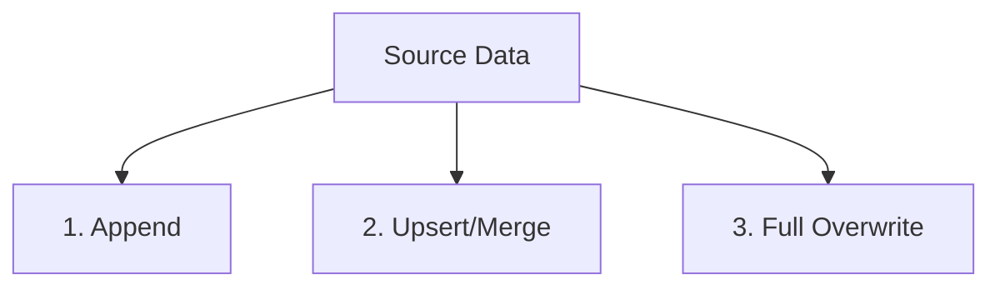

# Data Loading

## Summary

Data Loading (Nạp dữ liệu) là chữ "L" trong quy trình ETL/ELT, đây là bước vật lý ghi/đẩy bộ dữ liệu (từ nguồn hoặc đã qua biến đổi) vào hệ thống lưu trữ đích (như Data Warehouse, Data Lake, hoặc Database phân tích). Tùy thuộc vào yêu cầu nghiệp vụ và kích thước dữ liệu, kỹ sư dữ liệu phải lựa chọn chiến lược nạp phù hợp—Ghi đè hoàn toàn (Overwrite), Thêm nối tiếp (Append) hay Cập nhật thay đổi (Upsert)—để đảm bảo hiệu năng và duy trì tính toàn vẹn của dữ liệu lịch sử.

---

## Definition

**Data Loading** là thao tác di chuyển kết quả của quá trình trích xuất/biến đổi vào các bảng dữ liệu ở hệ thống đích. 

Trong kiến trúc ELT hiện đại, bước Load thường có hai giai đoạn:
1. **Load Raw (Nạp thô)**: Bê nguyên dữ liệu từ hệ thống vận hành đập thẳng vào vùng Raw của Data Warehouse.
2. **Load Transformed (Nạp sau biến đổi)**: Nạp kết quả của các câu truy vấn biến đổi (từ các lớp trung gian) vào các bảng trình bày cuối cùng (Data Marts) để cập nhật trạng thái báo cáo.

Thách thức lớn nhất của Data Loading là xử lý các luồng dữ liệu thay đổi (ví dụ một đơn hàng hôm qua trạng thái "Đang giao", hôm nay nạp lại trạng thái đã đổi thành "Hoàn thành") mà không làm trùng lặp bản ghi.

---

## Why it exists

Dữ liệu không có giá trị nếu nó nằm "treo" trên bộ nhớ của máy chủ xử lý, hoặc nằm lạc lõng trong file CSV tải về. Nó phải được cấu trúc và ghi xuống hệ thống Database phân tích để các công cụ BI (Tableau, PowerBI) có thể phát lệnh truy vấn SQL. 

Bên cạnh đó, việc nạp hàng chục triệu dòng dữ liệu không thể dùng những lệnh `INSERT INTO table VALUES (1, 'A')` từng dòng một như lập trình web, vì điều này sẽ gây nghẽn cổ chai mạng (network bottleneck) và mất vài tuần để hoàn thành. Do đó, cần có các cơ chế Nạp khối lượng lớn (Bulk Load) chuyên dụng.

---

## Core idea

Cốt lõi của Data Loading nằm ở việc áp dụng đúng **Chiến lược Nạp (Loading Strategies)** cho từng loại bảng. Có 3 chiến lược nền tảng:

1. **Full Overwrite (Ghi đè toàn bộ - Drop & Create)**:
   * **Cách làm**: Xóa sạch sẽ toàn bộ bảng ở đích (hoặc truncate). Nạp lại toàn bộ dữ liệu mới tinh từ đầu.
   * **Đặc điểm**: Bạo lực nhưng an toàn tuyệt đối. Chắc chắn không có rác hay trùng lặp. Phù hợp cho dữ liệu nhỏ.

2. **Append / Insert Only (Nạp nối tiếp / Chỉ thêm)**:
   * **Cách làm**: Bỏ qua dữ liệu cũ, chỉ nạp thêm (nhét thêm) các dòng dữ liệu mới vào cuối bảng. 
   * **Đặc điểm**: Rất nhanh. Hoạt động hoàn hảo cho dữ liệu nhật ký sự kiện (Event Logs, Web Clicks) - những sự kiện đã xảy ra thì không bao giờ bị thay đổi trạng thái trong quá khứ.

3. **Upsert / Merge (Cập nhật hoặc Thêm mới)**:
   * **Cách làm**: So sánh dữ liệu chuẩn bị nạp (Source) với dữ liệu đang có (Target) dựa trên một Khóa chính (Primary Key). Nếu Khóa đã tồn tại, tiến hành Cập nhật (Update) các giá trị cột. Nếu Khóa chưa tồn tại, tiến hành Thêm mới (Insert).
   * **Đặc điểm**: Cực kỳ quan trọng để duy trì các bảng chiều (Dimensions) hoặc bảng đơn hàng (Sales). Quá trình này nặng về tính toán nhất vì phải tìm kiếm và đối chiếu (matching) từng bản ghi.

---

## How it works

Dưới đây là một số cơ chế "vật lý" để thực hiện Data Loading đạt hiệu năng cao:

* **Bulk Copy / Bulk Load**: Thay vì dùng lệnh `INSERT` thông thường, hệ thống nạp dữ liệu sẽ nén tập tin thành CSV/Parquet, tải lên môi trường Cloud (như S3), sau đó yêu cầu Data Warehouse gọi các lệnh nội bộ cực nhanh để "hút" file vào đĩa cứng bỏ qua tầng kiểm tra mạng (Ví dụ: lệnh `COPY INTO` trong Snowflake/Redshift).
* **Partition Swap (Hoán đổi phân vùng)**: Khi Overwrite một bảng lớn (1 tỷ dòng), thay vì xóa bảng cũ (gây downtime lúc đang nạp lại), kỹ sư dữ liệu ghi dữ liệu mới vào một phân vùng ảo (hoặc bảng tạm). Sau khi ghi xong 100%, họ chạy một lệnh hoán đổi con trỏ (Swap) từ bảng cũ sang bảng mới. Thời gian cập nhật với người dùng chỉ mất 0.1 giây.

---

## Architecture / Flow



---

## Practical example

Ví dụ sử dụng thao tác **UPSERT / MERGE** bằng cú pháp SQL chuẩn (được hỗ trợ bởi Snowflake, BigQuery, Delta Lake):

```sql
-- MERGE dữ liệu từ bảng tạm 'staging_orders' vào bảng chính 'fact_orders'
MERGE INTO fact_orders target
USING staging_orders source
ON target.order_id = source.order_id   -- Điều kiện ghép nối (Primary Key)

-- Nếu Khóa đã tồn tại (Ví dụ: trạng thái đơn hàng thay đổi) -> Cập nhật
WHEN MATCHED THEN
  UPDATE SET 
    target.status = source.status,
    target.updated_at = source.updated_at

-- Nếu Khóa chưa từng có (Đơn hàng mới hoàn toàn) -> Thêm mới
WHEN NOT MATCHED THEN
  INSERT (order_id, customer_id, total_amount, status, updated_at)
  VALUES (source.order_id, source.customer_id, source.total_amount, source.status, source.updated_at);
```

---

## Best practices

* **Áp dụng Idempotent Loading**: Cho dù bạn dùng chiến lược nào, hãy đảm bảo rằng nếu Job Load bị rớt mạng và chạy lại lần thứ hai, thứ ba, thì kết quả trong bảng vẫn không đổi (Lũy đẳng). Với Append, nếu chạy 2 lần bạn sẽ nhân đôi dữ liệu. Do đó với Append, trước khi nạp hãy thêm lệnh xóa dữ liệu của ngày cụ thể đó đi (Ví dụ: `DELETE FROM table WHERE date = '2026-06-07'`).
* **Batch Loading (Nạp theo lô)**: Không mở và đóng kết nối Database để Insert cho từng dòng đơn lẻ. Gom các bản ghi thành các file (Ví dụ file CSV chứa 10,000 dòng) và thực hiện Bulk Load.
* **Xây dựng bảng tạm (Staging Tables)**: Đừng Merge trực tiếp dữ liệu từ API thẳng vào bảng Báo cáo. Hãy Load mọi thứ vào một `tmp_table` trước, kiểm tra xem dữ liệu có bị lỗi, null không, nếu Data Quality Test pass thì mới chạy câu lệnh `MERGE` vào bảng chính.

---

## Common mistakes

* **UPSERT mà không có Primary Key rõ ràng**: Khi sử dụng Merge, nếu Khóa chính ở bảng nguồn bị trùng lặp (có 2 dòng cùng 1 `order_id` mang 2 trạng thái khác nhau), câu lệnh Merge của Data Warehouse sẽ bị lỗi kẹt (Multiple match error) hoặc cập nhật dữ liệu một cách ngẫu nhiên. Phải Deduplicate (khử trùng) bảng nguồn trước khi Load.
* **Full Overwrite với bảng lớn**: Chạy lệnh xóa toàn bộ bảng Transaction 100 triệu dòng mỗi đêm chỉ để thêm vào 10,000 dòng mới. Điều này lãng phí hàng ngàn USD tiền máy chủ tính toán trên Cloud DWH (do tính phí theo lượng dữ liệu quét và xử lý). Hãy học cách thiết lập Incremental Upsert thay vì Full Overwrite.

---

## Trade-offs

### Full Overwrite
* **Ưu điểm**: Code đơn giản (1 dòng lệnh), dọn dẹp sạch sẽ các bản ghi rác và bản ghi bị xóa (hard deletes) ở nguồn.
* **Nhược điểm**: Thời gian chạy lâu, lãng phí tài nguyên khủng khiếp với tập dữ liệu từ trung bình đến lớn. Gây downtime báo cáo nếu không thiết kế hoán đổi an toàn.

### Append
* **Ưu điểm**: Nhanh, nhẹ, an toàn, I/O cực thấp vì chỉ chèn tiếp vào cuối đĩa cứng.
* **Nhược điểm**: Chỉ dùng được cho dữ liệu tĩnh bất biến (Immutable events). Nếu dùng cho dữ liệu thường xuyên thay đổi (như User profile) sẽ dẫn đến việc bảng bị trùng lặp nhiều version của 1 user.

### Upsert (Merge)
* **Ưu điểm**: Giải pháp cân bằng nhất, chỉ tác động đến những gì thay đổi, duy trì được tính nhất quán trạng thái mới nhất của thực thể.
* **Nhược điểm**: Câu lệnh Merge khá đắt đỏ (Tốn I/O vì phải quét các chỉ mục/index để tìm Khóa trước khi Cập nhật). Tốc độ chậm hơn nhiều so với Append.

---

## When to use

* **Full Overwrite**: Các bảng danh mục, mapping nghiệp vụ (như bảng tên quốc gia, tỷ giá tiền tệ). Thường dung lượng cực nhỏ < 100MB.
* **Append**: Các dữ liệu chuỗi thời gian (Time-series), Clickstream (Lịch sử lướt web), Logs (Nhật ký lỗi hệ thống).
* **Upsert/Merge**: Các bảng Dimension khách hàng, sản phẩm; Bảng Fact lưu trữ đơn hàng có trạng thái thay đổi theo thời gian (Từ Đặt hàng -> Thanh toán -> Hủy).

---

## Related concepts

* [ETL](/concepts/etl)
* [ELT](/concepts/elt)
* [Data Ingestion](/concepts/data-ingestion)
* [Incremental Load](/concepts/incremental-load)

---

## Interview questions

### 1. Sự khác biệt giữa Append và Upsert là gì? Nếu một bảng lưu thông tin trạng thái đơn hàng (đang giao, hoàn thành, hủy), bạn sẽ áp dụng chiến lược nào và tại sao?
* **Người phỏng vấn muốn kiểm tra**: Hiểu biết về tính chất dữ liệu (Mutable vs Immutable) và chọn chiến lược Load.
* **Gợi ý trả lời (Strong Answer)**: 
  * *Append* chỉ mù quáng thêm bản ghi mới vào cuối bảng. *Upsert* dựa vào Khóa chính để cập nhật nếu bản ghi đã tồn tại, và thêm mới nếu chưa.
  * Đối với bảng trạng thái đơn hàng, vì cùng một Đơn hàng (`order_id`) có thể trải qua nhiều trạng thái (hôm nay Đang giao, ngày mai đổi thành Hoàn thành), nếu ta dùng Append, bảng sẽ có 2 dòng cùng chung một `order_id`. Khi chạy báo cáo Sum doanh thu, nó sẽ tính đúp. Do đó, tôi bắt buộc phải dùng **Upsert** để khi nhận được trạng thái mới, nó sẽ tìm `order_id` cũ và ghi đè trạng thái 'Hoàn thành' lên, giúp báo cáo luôn đúng doanh thu thực tế.
  *(Nâng cao: Nếu nghiệp vụ yêu cầu giữ lại LỊCH SỬ thay đổi trạng thái thay vì trạng thái hiện tại, tôi sẽ áp dụng Append kèm theo kỹ thuật SCD Type 2).*

### 2. Copy Command (ví dụ COPY INTO trong Snowflake/Redshift) khác gì so với dùng vòng lặp INSERT INTO?
* **Người phỏng vấn muốn kiểm tra**: Hiểu biết về tối ưu hóa cơ sở hạ tầng (Database Internals).
* **Gợi ý trả lời (Strong Answer)**:
  Lệnh `INSERT INTO` thông thường (Single-row insert) sinh ra một "giao dịch" (Transaction) riêng cho mỗi dòng, gửi qua mạng, phải đi qua tầng parser của Database, và làm việc với cây Index (chỉ mục) liên tục -> Hiệu năng rất chậm. Lệnh `COPY INTO` (Bulk Load) là một giao dịch duy nhất. DWH sẽ tự động phân chia công việc cho nhiều node (parallel processing) đọc song song từ một file CSV/Parquet nằm trên Cloud Storage (S3). Bỏ qua hoàn toàn chi phí mạng từng dòng và chi phí transaction, do đó nó nhanh hơn hàng trăm, ngàn lần.

---

## References

1. **Snowflake Documentation** - "Using the MERGE statement".
2. **dbt Labs** - "Materializations" (Giải thích sự khác biệt giữa Table, View, Incremental - tương đương với Overwrite và Upsert).

---

## English summary

Data Loading is the final execution phase in ETL/ELT pipelines, where extracted or transformed data is physically written into the target analytical database or data warehouse. Selecting the right loading strategy is critical for pipeline performance and data integrity. Engineers generally choose between Full Overwrite (dropping and recreating the table, ideal for small reference data), Append (blindly inserting new rows, ideal for immutable event logs), and Upsert/Merge (updating existing rows matching a primary key while inserting new ones, crucial for mutable transactional data). Utilizing Bulk Load commands (like `COPY INTO`) rather than single-row inserts ensures massive scalability when loading millions of records.
