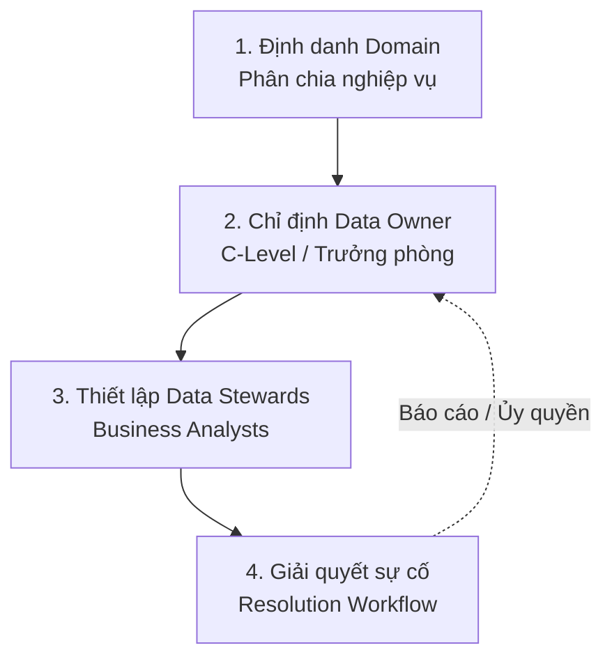

# Quyền sở hữu dữ liệu - Data Ownership

## Summary

Data Ownership (Quyền sở hữu dữ liệu) là nguyên tắc cốt lõi trong Quản trị dữ liệu (Data Governance), trong đó phân định rõ ràng cá nhân hoặc nhóm nghiệp vụ nào (thường không phải phòng IT) chịu trách nhiệm tối cao cho tính chính xác, tính bảo mật, và toàn vẹn của một tập dữ liệu cụ thể. Gán đúng "Chủ sở hữu" giúp xóa bỏ tình trạng đùn đẩy trách nhiệm ("Cha chung không ai khóc") khi xảy ra sự cố sai lệch số liệu.

---

## Definition

**Data Ownership** không có nghĩa là quyền sở hữu tài sản vật lý (dữ liệu vẫn là tài sản chung của doanh nghiệp). Nó ám chỉ **Sự chịu trách nhiệm (Accountability)**.
Một **Data Owner (Chủ sở hữu dữ liệu)** thường là lãnh đạo nghiệp vụ cấp cao (Business Leader) sinh ra hoặc tiêu thụ chính luồng dữ liệu đó. Ví dụ: Giám đốc Nhân sự (CHRO) là Data Owner của CSDL Hồ sơ nhân viên. Giám đốc Kinh doanh là Data Owner của CSDL Khách hàng (CRM).

Trách nhiệm của Data Owner bao gồm:
1. Định nghĩa từ vựng nghiệp vụ (Quyết định xem "Lợi nhuận" được tính thế nào).
2. Phê duyệt quyền truy cập (Duyệt cho phòng MKT được xem dữ liệu CRM hay không).
3. Quyết định tiêu chuẩn chất lượng (Data Quality SLA) và tính bảo mật của dữ liệu (PII).

*(Lưu ý: Data Owner chịu trách nhiệm vĩ mô, công việc vận hành hàng ngày (viết mô tả, cấp quyền trên app) thường được họ ủy quyền cho cấp dưới gọi là **Data Stewards**).*

---

## Why it exists

Tình huống phổ biến ở mọi doanh nghiệp truyền thống (Centralized IT):
1. **Sự cố**: Dashboard doanh thu của CEO báo số liệu tháng 5 rớt một nửa. CEO tức giận gọi cho Trưởng phòng Dữ liệu (Head of Data / Data Engineer).
2. **Kỹ sư kêu oan**: Data Engineer chạy kiểm tra và bảo: "Pipeline của tôi chạy 100% đúng luồng. Dữ liệu sai là do mấy anh Sales (Bán hàng) dùng hệ thống nguồn CRM nhưng lười không nhập đơn hàng hệ thống mà ghi ra sổ tay".
3. **Phòng Sales phản pháo**: "Hệ thống CRM lỗi thời, nhập chậm, chúng tôi bận đi bán hàng kiếm tiền, IT đi mà tự quét sổ tay vào".

**Hậu quả**: Lỗ hổng trách nhiệm. IT (phòng kỹ thuật) không thể ép phòng Sales nhập dữ liệu vì họ không có quyền về mặt tổ chức. IT biến thành "thùng rác" gánh mọi tội lỗi dữ liệu nhưng không có khả năng khắc phục nguyên nhân gốc rễ.

Data Ownership ra đời để trả trách nhiệm về đúng người đẻ ra dữ liệu: **"You build it, you own it, you fix it"**. Giám đốc Sales phải làm Data Owner cho CSDL Sales, nếu nhân viên của họ nhập liệu bẩn gây hỏng báo cáo CEO, Giám đốc Sales chịu trách nhiệm.

---

## Core idea

Sự dịch chuyển tư duy từ **IT Ownership** sang **Business Domain Ownership**:

* **Mô hình cũ (Monolithic)**: Đội IT/Data Engineering là trung tâm. Họ làm ETL hút mọi thứ từ các phòng ban về Data Warehouse, làm sạch và phục vụ. Họ (tự coi mình) là chủ sở hữu cái Data Warehouse đó. Việc này dẫn đến việc tạo ra nút thắt cổ chai (bottleneck) vì họ không bao giờ hiểu hết nghiệp vụ (Business logic) của cả công ty.
* **Mô hình hiện đại (Data Mesh)**: Dữ liệu được coi là **Sản phẩm (Data as a Product)**. Mỗi phòng ban (Domain) tự làm chủ, tự làm sạch dữ liệu của mình và cung cấp một "hợp đồng dữ liệu" (Data Contract) sạch sẽ ra bên ngoài. Đội IT chỉ là người cung cấp "Nền tảng hạ tầng" (Self-serve Platform) như hệ thống Cloud, dbt để phòng ban tự chơi. Các Domain Leader chính thức trở thành Data Owners đích thực.

---

## How it works

Quy trình gán quyền và vận hành Ownership:


1. **Định danh Domain**: Phân chia công ty thành các khối dữ liệu chuyên biệt (Tài chính, Marketing, Logistic, Nhân sự).
2. **Chỉ định Owner**: C-Level (CDO/CEO) chỉ định các Trưởng phòng tương ứng làm Data Owner cho các Domain đó. Tên/Email của họ được ghi cứng (hard-coded) vào thẻ Metadata trên hệ thống Data Catalog.
3. **Thiết lập Data Stewards**: Data Owner cắt cử các Business Analyst (BA) hoặc Data Analyst trong phòng mình làm Steward. Steward là người cầm tài khoản điền Business Glossary và xử lý các Ticket yêu cầu cấp quyền hàng ngày.
4. **Giải quyết sự cố (Resolution workflow)**: Khi hệ thống Data Quality quét thấy lỗi NULL tăng vọt ở bảng `logistic_shipping_time`, cảnh báo tự động gửi về Email của Chủ sở hữu (Logistic Owner) thay vì bắn vào kênh của kỹ sư IT. Owner có trách nhiệm yêu cầu kỹ sư của team Logistic tự sửa.

---

## Practical example

Chính sách bảo mật (Data Privacy & Compliance).

Có một thực tập sinh mới vào phòng Phân tích. Cậu ta muốn chạy một mô hình Machine Learning dự đoán độ tuột hạng khách hàng (Churn). Cậu ta mở Data Catalog và thấy bảng `dim_customer_behavior` nhưng bị khóa bảo mật (Lock) vì chứa thu nhập cá nhân.
* Thay vì gửi ticket cho bộ phận IT support như ngày xưa (IT support cũng chả biết có nên cấp quyền không), cậu ta bấm nút "Request Access".
* Hệ thống Data Catalog nhìn vào cột `Data Owner` của bảng đó, thấy ghi: "Giám đốc Phân tích Khách hàng - Ms. Lan". Một thông báo được bắn sang Slack của Ms. Lan.
* Ms. Lan đánh giá nhu cầu công việc thực tập sinh này là chính đáng, nhấn "Approve". 
* Công cụ tự động kích hoạt Script nhả quyền (Grant access) trên Snowflake.

Mọi thứ diễn ra theo đúng quy trình pháp lý với sự đồng thuận của Chủ sở hữu thực sự, kiểm toán (Auditing) ghi lại rõ ràng không sai một ly.

Trong các hệ thống Data Warehouse hiện đại như Snowflake, quyền sở hữu (Ownership) được thực thi cực kỳ nghiêm ngặt bằng mã lệnh phân quyền (RBAC - Role-Based Access Control). Ví dụ:

```sql
-- 1. Tạo một Role đại diện cho Data Owner của phòng Marketing
CREATE ROLE marketing_data_owner;
GRANT ROLE marketing_data_owner TO USER ms_lan_marketing_director;

-- 2. Chuyển giao quyền "Sở hữu" (OWNERSHIP) của bảng cho Role này
GRANT OWNERSHIP ON TABLE crm_db.public.dim_customer_behavior 
TO ROLE marketing_data_owner REVOKE CURRENT GRANTS;

-- Kể từ bây giờ, đội IT (sysadmin) cũng không thể tự tiện cấp quyền đọc bảng này cho người khác.
-- Mọi câu lệnh GRANT SELECT trên bảng này BẮT BUỘC phải do tài khoản của Ms. Lan thực thi.
```

---

## Best practices

* **Rõ ràng và Duy nhất**: Mỗi bảng dữ liệu cấp lõi (Core/Tier 1) chỉ được phép có **Một và chỉ Một** Data Owner. Nếu "Mọi người cùng sở hữu" thì tức là "Không ai sở hữu cả".
* **Gắn quyền lợi với trách nhiệm (Incentives)**: Đừng chỉ dí trách nhiệm bắt các trưởng phòng làm việc vô bổ. Cần biến chất lượng dữ liệu của miền đó thành một trong những chỉ số KPI đánh giá thưởng cuối năm (Bonus) của vị Trưởng phòng đó.
* **Owner phải là Business, không phải Kỹ thuật**: Các Kỹ sư dữ liệu (Data Engineers) hay Quản trị CSDL (DBA) là **Data Custodians** (Người trông coi/bảo vệ), không phải Data Owners. Họ giữ chìa khóa hạ tầng kỹ thuật, đảm bảo máy chủ chạy 24/7, tự động backup, nhưng không chịu trách nhiệm giải thích ý nghĩa kinh doanh của một cột số liệu bị nhập sai.

---

## Common mistakes

* **Ủy quyền ảo (Phantom Ownership)**: Chỉ định một người làm Data Owner cho có trên giấy tờ, nhưng thực tế người đó không có quyền hành/ngân sách gì để sửa chữa quy trình khi dữ liệu nguồn bị sai. (Ví dụ: Chỉ định một anh Data Analyst quèn làm Owner CSDL Hệ thống kế toán, anh ta không thể bắt Kế toán trưởng đổi cách làm việc).
* **Quá tải vì cấp quyền**: Data Owner là giám đốc, rất bận rộn. Mỗi ngày họ nhận được 50 email xin cấp quyền dữ liệu nhỏ lẻ. Sự bực bội khiến họ duyệt bừa (Approve all) mà không đọc, phá vỡ mọi quy tắc bảo mật. (Cách giải quyết là phải thiết lập hệ thống tự động cho Data Stewards cấp dưới hoặc duyệt theo Role nhóm (Group) thay vì User lẻ).

---

## Trade-offs

### Ưu điểm
* Giải phóng gánh nặng "Đổ rác" cho đội Data Engineering, đưa họ trở về đúng chuyên môn kỹ thuật sâu.
* Cải thiện chất lượng dữ liệu tận gốc (Shift-left data quality) vì đội sản xuất phần mềm giờ đây phải chịu trách nhiệm cho dữ liệu họ ném ra.
* Giảm thiểu cực độ thời gian tranh cãi trong các cuộc họp lãnh đạo.

### Nhược điểm
* Rất, rất khó thực thi về mặt chính trị và văn hóa tổ chức (Cultural resistance). Các phòng ban không muốn rước thêm việc "Quản trị dữ liệu" vào người, họ coi đó là việc của IT. Thường đòi hỏi biến động tái cơ cấu cấp cao.

---

## When to use

* Là thành phần xương sống BẮT BUỘC khi tổ chức chuyển đổi (Transform) sang mô hình kiến trúc **Data Mesh** phân tán.
* Khi hệ thống dữ liệu doanh nghiệp phình to (Scale-up) quá mức giới hạn năng lực quản lý của một đội IT tập trung (Central Data Team bottleneck).

## When not to use

* Công ty siêu nhỏ (Start-up) hoặc tổ chức truyền thống với 1 nguồn CSDL duy nhất. Lập ra danh sách Data Owner cồng kềnh sẽ tạo ra rào cản hành chính rườm rà (Red tape) làm chậm sự sáng tạo.

---

## Related concepts

* [Data Governance](/concepts/data-governance)
* [Data Mesh](/concepts/data-mesh)
* Data Stewardship
* Data as a Product

---

## Interview questions

### 1. Hãy phân biệt rõ 3 vai trò: Data Owner, Data Steward và Data Custodian?
* **Người phỏng vấn muốn kiểm tra**: Sự nắm vững cơ cấu phân quyền (Roles) trong một tổ chức quản trị dữ liệu trưởng thành.
* **Gợi ý trả lời (Strong Answer)**: 
  * **Data Owner**: Là chủ nhân (Business Leader) chịu trách nhiệm giải trình cuối cùng về mặt pháp lý và chất lượng của tài sản dữ liệu đó. Quyết định AI được dùng.
  * **Data Steward**: Là quản gia (Business/Data Analyst). Được Owner ủy quyền làm công việc tay chân hằng ngày: Viết định nghĩa Data Catalog, kiểm duyệt chất lượng, giải đáp thắc mắc của người dùng khác.
  * **Data Custodian**: Là bảo vệ/kỹ thuật viên (Data Engineer, DBA). Người quản lý phần cứng, phần mềm, cloud. Đảm bảo CSDL không bị sập, thiết lập Role cấp quyền trên kho dữ liệu (nhưng chỉ cấp khi có lệnh từ Owner/Steward).

### 2. Ý nghĩa của nguyên tắc "Domain-Oriented Data Ownership" trong kiến trúc Data Mesh là gì?
* **Người phỏng vấn muốn kiểm tra**: Hiểu biết sâu sắc về tư duy phi tập trung (Decentralization) hiện đại.
* **Gợi ý trả lời (Strong Answer)**: Mô hình truyền thống là "IT Ownership" - gom hết mọi dữ liệu đổ về một cái hồ DWH rồi bắt phòng IT dọn dẹp. Vấn đề là IT không có chuyên môn kinh doanh. "Domain-Oriented" trong Data Mesh đảo ngược điều đó. Nó quy định các miền kinh doanh (Domain như Sales, Logistic) vốn hiểu sâu sắc nhất về nghiệp vụ của họ sẽ sở hữu luôn từ A-Z tài sản dữ liệu đó (tự chạy ETL, tự dọn dẹp, tự làm báo cáo). Họ biến dữ liệu của phòng ban mình thành một "Sản phẩm" chuẩn chỉnh, rồi trưng bày nó ra cho phần còn lại của công ty tiêu thụ.

---

## References

1. **DAMA-DMBOK** - (Data Management Body of Knowledge) chương Data Governance and Data Stewardship.
2. **"Data Mesh: Delivering Data-Driven Value at Scale"** - Zhamak Dehghani (Tác giả sáng tạo ra mô hình Data Mesh với trụ cột đầu tiên là Domain Ownership).

---

## English summary

Data Ownership is a foundational principle of Data Governance that assigns ultimate accountability for the quality, security, and lifecycle of a specific dataset to a business leader (Data Owner) rather than the IT department. By clearly defining roles—such as Data Owners (decision-makers), Data Stewards (operational caretakers), and Data Custodians (technical engineers)—it prevents the classic "blame game" where IT is held responsible for poor data originating from business operational systems. This domain-driven ownership paradigm is critical for modern decentralized architectures like Data Mesh, shifting the responsibility of data quality to those who produce and understand the data best.
