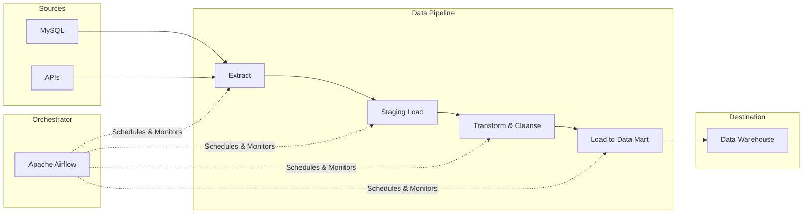

# Đường ống Dữ liệu - Data Pipeline

## Summary

Đường ống dữ liệu (Data Pipeline) là một tập hợp các quy trình và công cụ tự động để vận chuyển dữ liệu từ hệ thống nguồn (Source) đến hệ thống đích (Destination), đồng thời thực hiện các thao tác làm sạch, biến đổi và tổng hợp trên đường đi. Data pipeline chính là "hệ tuần hoàn" trong mọi kiến trúc nền tảng dữ liệu, đảm bảo dữ liệu đến đúng nơi, đúng lúc và đúng định dạng.

---

## Definition

**Data Pipeline** là chuỗi các bước xử lý dữ liệu tự động. Mỗi bước trong pipeline nhận dữ liệu đầu vào (input) từ bước trước, áp dụng một hoặc nhiều thao tác xử lý, và chuyển kết quả (output) sang bước tiếp theo. Quá trình nổi tiếng nhất trong Data Pipeline là ETL (Extract, Transform, Load) hoặc biến thể của nó là ELT.

Một pipeline không chỉ vận chuyển dữ liệu mà còn bao gồm các cơ chế kiểm tra lỗi, xử lý lại (retry logic), và cảnh báo (alerting) để đảm bảo độ tin cậy.

---

## Why it exists

Dữ liệu thô từ hệ thống nguồn hiếm khi ở trạng thái sẵn sàng để phân tích ngay lập tức. 
1. **Thiếu sự tự động hóa**: Nếu không có pipeline, một chuyên viên phân tích sẽ phải tự tải file CSV hàng ngày, làm sạch thủ công bằng Excel, và tạo báo cáo. Quá trình này dễ sai sót và không thể mở rộng.
2. **Nhu cầu đồng bộ (Integration)**: Để có báo cáo kinh doanh toàn cảnh, dữ liệu từ CRM (Salesforce) phải được hợp nhất (Join) với dữ liệu thanh toán (Stripe). Data pipeline tự động hóa sự tích hợp này.
3. **Độ tin cậy và Khả năng chịu lỗi**: Máy chủ nguồn có thể sập mạng, file tải về có thể lỗi định dạng. Một Pipeline chuẩn có cơ chế tự phục hồi (resilience) mà việc copy-paste thủ công không thể có được.

---

## Core idea

Các thành phần cốt lõi của một Data Pipeline:
* **Extract (Trích xuất)**: Kéo dữ liệu ra khỏi hệ thống vận hành.
* **Transform (Biến đổi)**: Làm sạch, lọc bỏ dữ liệu rỗng, chuyển đổi múi giờ, che dấu dữ liệu nhạy cảm (data masking), và kết hợp nhiều bảng lại với nhau.
* **Load (Nạp)**: Lưu dữ liệu đã xử lý vào Data Warehouse hoặc Data Lake.
* **Orchestration (Điều phối)**: "Bộ não" quản lý luồng chạy, quy định khi nào task A chạy, nếu A xong thì chạy B, nếu B lỗi thì chạy C. (Tiêu biểu: Apache Airflow, Dagster).

Hai mô hình thời gian chạy:
* **Batch Pipeline**: Chạy định kỳ (mỗi giờ, mỗi ngày). Phù hợp cho báo cáo lịch sử.
* **Streaming Pipeline**: Xử lý dữ liệu liên tục theo thời gian thực (real-time). Phù hợp cho hệ thống phát hiện gian lận (Fraud detection).

---

## How it works

Cách thức hoạt động của một Batch ETL Pipeline điển hình:
1. **Trigger**: Bộ điều phối (Scheduler) kích hoạt pipeline vào 2:00 AM mỗi ngày.
2. **Extract Task**: Chạy script Python kết nối vào cơ sở dữ liệu MySQL, trích xuất các bản ghi của ngày hôm trước, và lưu tạm dưới dạng file `.parquet` vào một bucket S3 (Staging Area).
3. **Load Task**: Nạp dữ liệu thô từ file Parquet vào một bảng thô (Raw Table) trong Snowflake.
4. **Transform Task**: Sử dụng công cụ như `dbt` chạy câu lệnh SQL biến đổi dữ liệu từ bảng thô, ghép với bảng danh mục, tính tổng doanh thu, và đẩy kết quả vào bảng phục vụ (Data Mart).
5. **Quality Check**: Chạy một truy vấn để kiểm tra xem có trường hợp nào `doanh_thu < 0` không. Nếu có, gửi cảnh báo qua Slack.
6. **Completion**: Đánh dấu pipeline hoàn thành.

---

## Architecture / Flow



---

## Practical example

Một ví dụ mã nguồn (Python giả mã) sử dụng Airflow (DAG) định nghĩa Pipeline:

```python
from airflow import DAG
from airflow.operators.python import PythonOperator
from datetime import datetime

# Định nghĩa các hàm xử lý
def extract_data():
    print("Extracting data from API...")
    # Code kéo API

def transform_data():
    print("Cleaning and standardizing data...")
    # Code xử lý pandas hoặc Spark

def load_data():
    print("Loading data into PostgreSQL DWH...")
    # Code INSERT vào Database

# Khởi tạo DAG
with DAG('daily_sales_pipeline', start_date=datetime(2026, 6, 7), schedule_interval='@daily') as dag:
    
    t1 = PythonOperator(task_id='extract', python_callable=extract_data)
    t2 = PythonOperator(task_id='transform', python_callable=transform_data)
    t3 = PythonOperator(task_id='load', python_callable=load_data)

    # Định nghĩa luồng phụ thuộc (Dependency)
    t1 >> t2 >> t3
```
Đoạn code trên định nghĩa `t1` chạy trước, thành công mới chạy `t2`, và sau đó là `t3`.

---

## Best practices

* **Thiết kế theo Module (Modularity)**: Tách các bước Extract, Transform, Load thành các module độc lập. Nếu phần Transform bị lỗi, ta chỉ cần chạy lại Transform mà không phải đi trích xuất (Extract) lại từ đầu.
* **Idempotency**: Như đã nhắc ở bài trước, pipeline phải có khả năng chạy lại nhiều lần an toàn, tạo ra kết quả y hệt thay vì nhân đôi dữ liệu.
* **Quản lý cấu hình (Configuration-driven)**: Không hard-code các thông tin như database credentials, đường dẫn file vào trong code pipeline. Hãy dùng biến môi trường (Environment Variables) hoặc file cấu hình (YAML/JSON).
* **Logging & Alerting đầy đủ**: Ghi log mọi thứ (bắt đầu lúc mấy giờ, xử lý bao nhiêu dòng) và gắn cảnh báo tự động khi pipeline fail.

---

## Common mistakes

* **Quên xử lý Late Data**: Trong môi trường thực tế, dữ liệu có thể đến trễ (ví dụ: người dùng dùng app offline, 2 ngày sau mới có mạng để đồng bộ dữ liệu về server). Nếu pipeline chỉ quét dữ liệu sinh ra của ngày hôm qua (dựa trên giờ server nhận) mà không xử lý các luồng dữ liệu trễ hạn này, báo cáo sẽ bị sai.
* **Chạy các truy vấn nặng trực tiếp trên Source**: Thiết kế pipeline làm cho quá trình Extract ngốn quá nhiều CPU làm chậm hệ thống nguồn.

---

## Trade-offs

### Ưu điểm
* Tính tự động hóa cao, mở khóa sức mạnh phân tích liên tục.
* Đảm bảo tính nhất quán của số liệu qua nhiều bộ phận kinh doanh.

### Nhược điểm
* Việc bảo trì pipeline tốn rất nhiều công sức (Maintenance Hell). Khi hệ thống nguồn đổi cấu trúc (schema change), pipeline sẽ bị "gãy" và cần Kỹ sư can thiệp ngay lập tức.
* Sự gia tăng phức tạp: Khi số lượng pipeline lên tới hàng trăm, việc quản lý sự phụ thuộc (dependency) giữa chúng là một ác mộng nếu không có hệ thống Orchestration tốt.

---

## When to use

* Luôn luôn cần thiết trong bất kỳ tổ chức nào muốn xây dựng kho dữ liệu (Data Warehouse/Lake) và báo cáo BI tự động.

## When not to use

* Khi tổ chức chỉ cần xem các báo cáo trực tiếp từ một ứng dụng độc lập (ví dụ: xem dashboard có sẵn bên trong Google Analytics mà không cần kết hợp dữ liệu ngoài).

---

## Related concepts

* [Source Systems](/concepts/source-systems)
* [Data Engineering](/concepts/data-engineering)

---

## Interview questions

### 1. Phân biệt Batch Pipeline và Streaming Pipeline.
* **Gợi ý trả lời**:
  * **Batch Pipeline**: Thu thập và xử lý một khối lượng lớn dữ liệu (một "lô") tại các khoảng thời gian cố định (ví dụ: mỗi đêm lúc 2h sáng). Nó có độ trễ (latency) cao tính bằng giờ/ngày nhưng tối ưu tốt về băng thông và dễ quản lý.
  * **Streaming Pipeline**: Xử lý các dòng dữ liệu nhỏ lẻ (event) ngay khi chúng vừa được tạo ra. Nó có độ trễ cực thấp (tính bằng milliseconds) nhưng thiết kế phức tạp hơn, đòi hỏi công cụ đặc thù như Kafka, Flink và xử lý khó khăn hơn trong việc join dữ liệu và late data.

### 2. DAG là gì trong ngữ cảnh của Data Pipeline?
* **Gợi ý trả lời**: DAG viết tắt của Directed Acyclic Graph (Đồ thị có hướng không có chu trình). Trong các công cụ Orchestration như Airflow, DAG được dùng để biểu diễn các tác vụ (tasks) trong pipeline. Có hướng (Directed) nghĩa là task A phải chạy trước task B. Không có chu trình (Acyclic) nghĩa là không được phép xảy ra vòng lặp vô tận (ví dụ A phụ thuộc B, B lại phụ thuộc A), đảm bảo pipeline luôn có điểm khởi đầu và điểm kết thúc.

---

## References

1. **Fundamentals of Data Engineering** - Joe Reis.
2. **Apache Airflow Documentation**.

---

## English summary

A Data Pipeline is an automated set of processes that extracts data from various sources, transforms it to ensure quality and compatibility, and loads it into a destination system such as a Data Warehouse or Data Lake (ETL/ELT). Orchestration tools (like Apache Airflow) manage the scheduling and dependencies of these pipelines using Directed Acyclic Graphs (DAGs). Pipelines can operate in batch mode (processing data in chunks at scheduled intervals) or streaming mode (processing events in real-time), and they are essential for eliminating manual data wrangling and ensuring reliable, scalable analytics.
