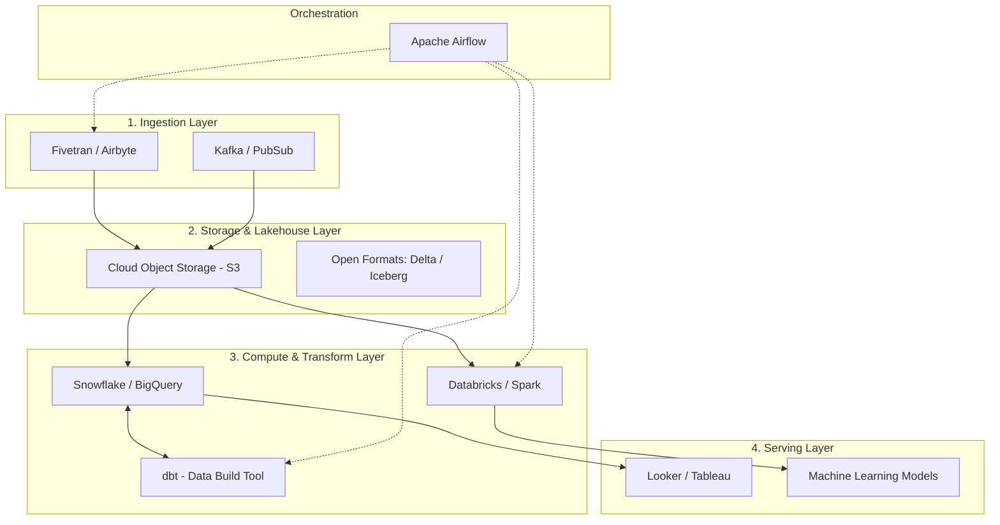

# Kiến trúc Nền tảng Dữ liệu - Data Platform Architecture

## Summary

Kiến trúc nền tảng dữ liệu (Data Platform Architecture) là bản thiết kế tổng thể mô tả cách thức một tổ chức tích hợp các công nghệ lưu trữ, xử lý và phân phối dữ liệu. Một nền tảng dữ liệu hiện đại (Modern Data Stack) không chỉ bao gồm một cơ sở dữ liệu duy nhất mà là sự kết hợp linh hoạt của nhiều hệ thống để phục vụ nhiều mục đích khác nhau: từ báo cáo BI truyền thống đến huấn luyện mô hình Machine Learning. 

---

## Definition

**Data Platform** (Nền tảng Dữ liệu) là một hệ sinh thái các công cụ công nghệ thông tin tương tác với nhau để thu thập (ingest), lưu trữ (store), xử lý (process) và cung cấp (serve) dữ liệu cho người dùng cuối và các ứng dụng.

**Architecture** (Kiến trúc) quyết định các "khối xếp hình" (building blocks) nào được sử dụng và chúng giao tiếp với nhau qua các quy chuẩn (patterns) nào để tối ưu hóa hiệu năng, chi phí và bảo mật.

---

## Why it exists

Dữ liệu của một công ty đa dạng về hình thái: dữ liệu có cấu trúc (bảng SQL), bán cấu trúc (JSON, XML từ API) và phi cấu trúc (hình ảnh, video, âm thanh).
Không có một cơ sở dữ liệu nào đủ sức giải quyết hoàn hảo mọi bài toán:
* Data Warehouse truyền thống rất xuất sắc cho SQL báo cáo nhưng quá đắt đỏ và không thể lưu video/hình ảnh.
* Hệ thống Hadoop mạnh mẽ trong tính toán phân tán nhưng quá phức tạp để thiết lập và truy vấn chậm chạp.
Do đó, nền tảng dữ liệu hiện đại ra đời để lắp ghép ưu điểm của từng công nghệ lại với nhau trên nền tảng Điện toán đám mây (Cloud).

---

## Core idea

Sự tiến hóa của kiến trúc nền tảng dữ liệu:

1. **Thế hệ 1 - Data Warehouse (DWH)**: Mọi dữ liệu (chỉ có cấu trúc) được gom về một kho dữ liệu trung tâm chuẩn hóa cao. Tối ưu cho BI. (Ví dụ: Teradata, Oracle).
2. **Thế hệ 2 - Data Lake (Hồ dữ liệu)**: Sự bùng nổ của Big Data. Gom mọi thứ (cấu trúc, phi cấu trúc) thô kệch vào một kho lưu trữ cực rẻ (HDFS, Amazon S3). Phù hợp cho Data Scientist và Machine Learning nhưng kém hiệu quả trong việc tạo báo cáo BI nhanh.
3. **Thế hệ 3 - Cloud Data Warehouse & Data Lakehouse**: Kết hợp cả hai! Data Lakehouse mang khả năng quản lý giao dịch (ACID) và tối ưu truy vấn SQL của Data Warehouse trực tiếp lên các tệp tin lưu trữ giá rẻ của Data Lake. (Ví dụ: Databricks, Snowflake, BigQuery).

---

## How it works

Một Modern Data Stack (Kiến trúc dữ liệu hiện đại) tiêu biểu ngày nay thường bao gồm các tầng (Layers) sau:
1. **Ingestion Layer (Tầng thu nạp)**: Dùng các công cụ SaaS quản lý hoàn toàn như Fivetran, Airbyte để kéo dữ liệu từ Nguồn.
2. **Storage Layer (Tầng lưu trữ)**: Lưu toàn bộ dữ liệu thô trên Cloud Object Storage (S3, GCS) dưới định dạng mở như Parquet hoặc Iceberg (đây chính là phần Lake).
3. **Compute & Transformation Layer (Tầng tính toán & biến đổi)**: Sử dụng Cloud Data Warehouse (Snowflake, BigQuery) hoặc nền tảng Spark (Databricks) để xử lý dữ liệu. Dùng công cụ **dbt** để viết logic SQL biến đổi dữ liệu một cách kỹ nghệ (như viết phần mềm).
4. **Serving Layer (Tầng phục vụ)**: Kết nối các BI Tools (Tableau, PowerBI, Looker) trực tiếp vào các bảng Data Mart đã được chuẩn hóa.
5. **Orchestration Layer (Tầng điều phối)**: Apache Airflow, Dagster, Prefect bọc lấy tất cả để lên lịch chạy.

---

## Architecture / Flow



---

## Practical example

Mô hình kiến trúc **Medallion Architecture (Kiến trúc Huy chương)** rất phổ biến trong Data Lakehouse:
Dữ liệu đi qua 3 lớp chất lượng:
1. **Lớp Bronze (Đồng - Raw)**: Dữ liệu thô nguyên bản từ hệ thống nguồn, chỉ thêm metadata ngày lấy. Dữ liệu có thể trùng lặp, có lỗi định dạng.
2. **Lớp Silver (Bạc - Cleaned)**: Dữ liệu đã được làm sạch, loại bỏ trùng lặp, chuẩn hóa kiểu ngày tháng, có cấu trúc rõ ràng. Sẵn sàng cho Data Scientist khám phá.
3. **Lớp Gold (Vàng - Aggregated)**: Dữ liệu kinh doanh được tổng hợp (Aggregated), thiết kế dưới dạng Star Schema phục vụ trực tiếp cho báo cáo BI.

```sql
-- Chuyển từ Bronze sang Silver
CREATE TABLE silver.users AS
SELECT DISTINCT user_id, LOWER(email) as email, CAST(signup_date AS DATE)
FROM bronze.raw_users
WHERE user_id IS NOT NULL;

-- Chuyển từ Silver sang Gold
CREATE TABLE gold.daily_signups AS
SELECT signup_date, COUNT(user_id) as total_signups
FROM silver.users
GROUP BY signup_date;
```

---

## Best practices

* **Decoupling Storage and Compute (Tách biệt Lưu trữ và Tính toán)**: Đây là quy tắc vàng của Cloud. Lưu trữ dữ liệu ở hệ thống giá rẻ (S3) độc lập với hệ thống máy chủ tính toán (EC2, Snowflake warehouses). Bạn có thể tắt hệ thống máy chủ khi không dùng để tiết kiệm tiền mà không bị mất dữ liệu.
* **Sử dụng Open File Formats (Định dạng Mở)**: Lưu trữ dữ liệu ở các định dạng chuẩn như Apache Parquet, ORC, Delta Lake, Apache Iceberg. Điều này giúp bạn không bị "khóa chặt" (vendor lock-in) vào một nhà cung cấp công nghệ duy nhất.
* **Xây dựng Data Mesh/Data Fabric**: (Dành cho doanh nghiệp khổng lồ) Phân tán quyền sở hữu dữ liệu về cho các phòng ban thay vì dồn tất cả cho một đội Data trung tâm để giảm thiểu "bottleneck" con người.

---

## Common mistakes

* **Xây Data Lake nhưng trở thành Data Swamp (Đầm lầy dữ liệu)**: Đẩy mọi thứ lên S3 mà không có tổ chức thư mục rõ ràng, không có Data Catalog (từ điển dữ liệu) để tra cứu, khiến không ai biết trong hồ có chứa dữ liệu gì và lấy ra như thế nào.
* **Dùng sai công cụ cho tác vụ (Anti-pattern)**: Dùng Kafka để chuyển file tĩnh có kích thước lớn, hoặc dùng Data Warehouse để lưu hình ảnh/PDF.

---

## Trade-offs

### DWH truyền thống
* Ưu điểm: Hiệu suất truy vấn SQL cao nhất, quản lý bảo mật chặt chẽ.
* Nhược điểm: Đắt đỏ, khó xử lý dữ liệu phi cấu trúc, thiếu tính linh hoạt cho Data Science.

### Data Lakehouse
* Ưu điểm: Cân bằng tốt giữa chi phí lưu trữ cực rẻ của Data Lake và khả năng quản lý/truy vấn acid của Data Warehouse.
* Nhược điểm: Công nghệ còn tương đối mới (Iceberg, Delta), hệ sinh thái và công cụ quản trị vẫn đang phát triển và thay đổi liên tục.

---

## When to use

* (Lakehouse Architecture) Nên được sử dụng như là tiêu chuẩn cho hầu hết các công ty khởi nghiệp công nghệ mới (startups) hoặc doanh nghiệp đang chuyển đổi lên Cloud.

## When not to use

* Các kiến trúc quá phức tạp không nên áp dụng cho doanh nghiệp truyền thống quy mô nhỏ, nơi một Database PostgreSQL cấu hình mạnh là đủ cho mọi bài toán nội bộ.

---

## Related concepts

* [Data Warehouse](/concepts/data-warehouse)
* [Data Pipeline](/concepts/data-pipeline)

---

## Interview questions

### 1. Sự khác biệt giữa Data Warehouse, Data Lake và Data Lakehouse là gì?
* **Gợi ý trả lời**: 
  * **Data Warehouse**: Lưu dữ liệu có cấu trúc, tối ưu cho SQL và phân tích báo cáo (BI). Tốc độ nhanh nhưng chi phí lưu trữ đắt.
  * **Data Lake**: Lưu mọi loại hình dữ liệu (cấu trúc, bán/phi cấu trúc) ở dạng nguyên bản giá rẻ. Tốt cho Machine Learning nhưng khó truy vấn SQL nhanh.
  * **Data Lakehouse**: Kiến trúc lai, mang lớp quản lý metadata và giao dịch (ACID) của Warehouse đặt lên trên tầng lưu trữ giá rẻ của Data Lake. Hỗ trợ tốt cả BI và ML trên cùng một bản sao dữ liệu duy nhất.

### 2. Kiến trúc Medallion (Bronze, Silver, Gold) giải quyết bài toán gì?
* **Gợi ý trả lời**: Nó giải quyết bài toán quản lý chất lượng và vòng đời dữ liệu bằng cách phân tách rõ ràng trách nhiệm. Thay vì biến đổi dữ liệu thô thành kết quả cuối cùng trong một bước nhảy vọt (rất khó debug nếu sai), nó tạo ra các trạm dừng. Lớp Silver cung cấp nguồn sự thật sạch sẽ (single source of truth) có thể tái sử dụng cho nhiều báo cáo Gold khác nhau.

---

## References

1. **Data Mesh** - Zhamak Dehghani.
2. **Databricks Lakehouse Platform Documentation**.

---

## English summary

The Data Platform Architecture outlines the overarching design of an organization's data ecosystem. The industry has evolved from centralized Data Warehouses (optimized for structured BI) to Data Lakes (cheap storage for vast amounts of unstructured raw data for ML), and now toward the Data Lakehouse paradigm. A Lakehouse combines the cost-efficiency and flexibility of a Data Lake (using open formats like Parquet/Iceberg on cloud storage like S3) with the reliability, ACID transactions, and fast SQL performance of a Data Warehouse. A typical Modern Data Stack decouples storage from compute and utilizes tools for ingestion, transformation (like dbt), and orchestration (like Airflow).
