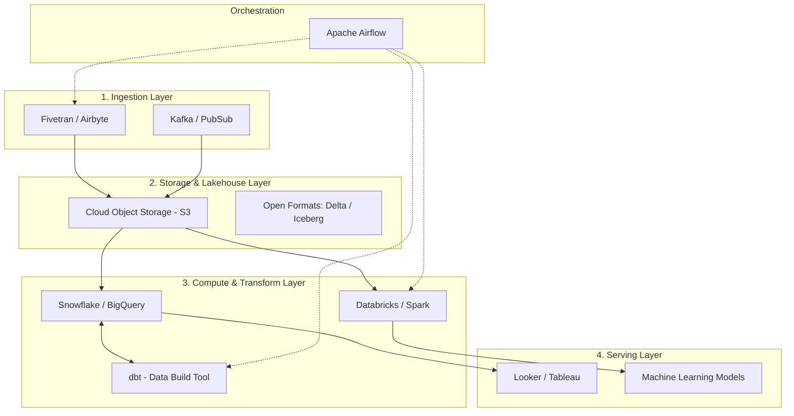

# Kiến trúc Nền tảng Dữ liệu (Data Platform Architecture): Bản thiết kế cho hệ sinh thái thông tin hiện đại

Trong bất kỳ tổ chức hướng dữ liệu (data-driven) nào, việc sở hữu một hạ tầng dữ liệu (data infrastructure) hoạt động trơn tru là yếu tố sống còn. Tuy nhiên, dữ liệu của doanh nghiệp không chỉ tăng trưởng về kích thước mà còn đa dạng về mặt hình thái: từ dữ liệu có cấu trúc (structured data) dạng bảng (SQL), dữ liệu bán cấu trúc (semi-structured data) như JSON từ API, XML, cho đến dữ liệu phi cấu trúc (unstructured data) như hình ảnh, video, âm thanh.

Không có một công nghệ hay cơ sở dữ liệu đơn lẻ nào đủ sức giải quyết hoàn hảo mọi bài toán phân tích. Đó là lý do chúng ta cần đến **Kiến trúc Nền tảng Dữ liệu (Data Platform Architecture)** – bản thiết kế tổng thể giúp liên kết linh hoạt các khối công nghệ lưu trữ, xử lý và phân phối thông tin.

---

## Nền tảng dữ liệu hiện đại là gì?

**Nền tảng dữ liệu (Data Platform)** là một hệ sinh thái tích hợp các công cụ công nghệ thông tin tương tác chặt chẽ với nhau nhằm thực hiện chuỗi nhiệm vụ: Thu nạp (Ingest), Lưu trữ (Store), Xử lý (Process) và Cung cấp (Serve) dữ liệu cho người dùng cuối và các ứng dụng.

**Kiến trúc nền tảng (Architecture)** chính là cách chúng ta lựa chọn các "khối xếp hình" công nghệ và định nghĩa các quy chuẩn giao tiếp giữa chúng để tối ưu hóa hiệu năng truy vấn, tiết kiệm chi phí đám mây và bảo vệ an toàn thông tin.

---

## Sự tiến hóa của các mô hình Kiến trúc dữ liệu

Để đạt được kiến trúc hiện đại ngày nay, ngành công nghệ dữ liệu đã trải qua ba thế hệ tiến hóa lớn:

1. **Thế hệ 1 - Kho dữ liệu tập trung (Data Warehouse - DWH)**: Mọi dữ liệu có cấu trúc từ các phòng ban được gom về một kho dữ liệu trung tâm chuẩn hóa cao. Mô hình này rất xuất sắc cho các báo cáo phân tích kinh doanh (BI) nhưng chi phí lưu trữ cực kỳ đắt đỏ và hoàn toàn bất lực trước dữ liệu phi cấu trúc như hình ảnh hay video.
2. **Thế hệ 2 - Hồ dữ liệu (Data Lake)**: Ra đời cùng sự bùng nổ của Big Data. Dữ liệu được đổ đống ở dạng thô vào các hệ thống lưu trữ phân tán chi phí rẻ (như HDFS, Amazon S3). Mô hình này rất được các nhà khoa học dữ liệu (Data Scientists) ưa chuộng để chạy mô hình học máy (Machine Learning) nhưng lại cực kỳ khó khăn và chậm chạp khi cần truy vấn SQL làm báo cáo BI nhanh.
3. **Thế hệ 3 - Kiến trúc lai (Data Lakehouse)**: Đây là xu hướng thịnh hành nhất hiện nay. Data Lakehouse mang các tính năng quản lý giao dịch an toàn (ACID) và khả năng truy vấn SQL tốc độ cao của Data Warehouse đặt trực tiếp lên trên lớp lưu trữ đối tượng giá rẻ của Data Lake, giúp doanh nghiệp khai thác cả BI và AI trên cùng một bản sao dữ liệu duy nhất.

---

## Kiến trúc và Nguyên lý hoạt động

Một kiến trúc dữ liệu hiện đại tiêu chuẩn được chia thành các tầng (Layers) chuyên biệt hoạt động nhịp nhàng dưới sự điều khiển của bộ điều phối:



1. **Tầng Thu nạp (Ingestion Layer)**: Sử dụng các công cụ như Airbyte hoặc Fivetran để kéo dữ liệu định kỳ từ APIs/DBs, hoặc sử dụng Kafka để hứng các luồng dữ liệu thời gian thực.
2. **Tầng Lưu trữ (Storage Layer)**: Lưu trữ dữ liệu thô trên Cloud Object Storage (như AWS S3, Google Cloud Storage) sử dụng các định dạng tệp tin mở tối ưu như Parquet, Delta Lake hoặc Apache Iceberg.
3. **Tầng Tính toán & Biến đổi (Compute & Transformation Layer)**: Tận dụng sức mạnh tính toán của Cloud Data Warehouse (Snowflake, BigQuery) hoặc nền tảng Apache Spark (Databricks) để xử lý dữ liệu. Sử dụng công cụ **dbt (data build tool)** để viết mã nguồn SQL biến đổi dữ liệu một cách khoa học và có quản lý phiên bản.
4. **Tầng Phục vụ (Serving Layer)**: Cung cấp dữ liệu sạch cho các công cụ BI (Tableau, PowerBI, Looker) truy xuất báo cáo hoặc cung cấp đầu vào cho các mô hình Machine Learning.
5. **Tầng Điều phối (Orchestration Layer)**: Sử dụng Apache Airflow hoặc Dagster làm "nhạc trưởng" lên lịch trình và giám sát toàn bộ luồng chạy của các tầng công nghệ trên.

---

## Kiến trúc Huy chương (Medallion Architecture) trong Data Lakehouse

Trong kiến trúc Data Lakehouse hiện đại, dữ liệu thường được xử lý và nâng cấp chất lượng qua 3 lớp huy chương:

* **Lớp Đồng (Bronze / Raw)**: Lưu giữ dữ liệu thô nguyên bản được lấy về từ nguồn. Dữ liệu ở đây có thể trùng lặp, sai định dạng nhưng tuyệt đối không được xóa bỏ vì đây là nguồn kiểm chứng gốc.
* **Lớp Bạc (Silver / Cleaned)**: Dữ liệu từ lớp Đồng được lọc trùng, làm sạch, định kiểu ngày tháng chuẩn hóa. Đây là "nguồn sự thật" sạch sẽ sẵn sàng cho các nhà phân tích khám phá.
* **Lớp Vàng (Gold / Aggregated)**: Dữ liệu được tổng hợp theo các chỉ số kinh doanh nghiệp vụ, thiết kế dưới dạng Star Schema phục vụ trực tiếp và nhanh chóng cho các báo cáo của ban giám đốc.

Dưới đây là ví dụ minh họa bằng SQL chuyển đổi dữ liệu qua các lớp huy chương:

```sql
-- Bước 1: Làm sạch dữ liệu từ lớp Bronze sang lớp Silver
CREATE TABLE silver.users AS
SELECT DISTINCT user_id, LOWER(email) as email, CAST(signup_date AS DATE)
FROM bronze.raw_users
WHERE user_id IS NOT NULL;

-- Bước 2: Tổng hợp dữ liệu từ lớp Silver sang lớp Gold làm báo cáo
CREATE TABLE gold.daily_signups AS
SELECT signup_date, COUNT(user_id) as total_signups
FROM silver.users
GROUP BY signup_date;
```

---

## Ưu nhược điểm và Đánh đổi (Pros & Cons)

### Ưu điểm (Pros)
* **Hiệu năng và Chi phí tối ưu**: Việc phân tách Tính toán (Compute) và Lưu trữ (Storage) giúp doanh nghiệp chỉ trả tiền cho tài nguyên tính toán thực sự sử dụng.
* **Linh hoạt và Đa dạng**: Hỗ trợ đồng thời cả SQL phân tích (BI) và các mô hình Học máy (Machine Learning/AI) trên cùng một lớp lưu trữ duy nhất.
* **Không bị khóa bởi nhà cung cấp (No Vendor Lock-in)**: Việc sử dụng định dạng tệp tin mở (Open Formats) giúp dễ dàng chuyển đổi công cụ tính toán mà không phải di chuyển dữ liệu.

### Nhược điểm & Đánh đổi (Cons & Trade-offs)
* **Độ phức tạp vận hành cao**: Việc tích hợp nhiều công cụ khác nhau đòi hỏi đội ngũ kỹ sư phải có kiến thức bao quát và kinh nghiệm điều phối (Orchestration).
* **Độ trễ xử lý (Latency)**: Qua nhiều lớp trung gian (Bronze -> Silver -> Gold) khiến dữ liệu không thể xuất hiện ngay lập tức tại tầng phục vụ mà cần một khoảng thời gian xử lý nhất định.
* **Quản trị khó khăn**: Nếu không có chính sách rõ ràng, Data Lake rất dễ trở thành "đầm lầy dữ liệu" (Data Swamp) với vô vàn tệp tin không có tài liệu hay từ điển dữ liệu đi kèm.

---

## Sai lầm thường gặp và Best Practices

* **Quy tắc vàng: Tách rời Tính toán và Lưu trữ**: Hãy đảm bảo bạn lưu trữ dữ liệu trên Object Storage giá rẻ độc lập với máy chủ tính toán. Khi không có tác vụ xử lý, bạn có thể tắt bớt máy chủ tính toán để tiết kiệm chi phí cloud mà không sợ mất mát dữ liệu.
* **Sử dụng định dạng tệp tin mở (Open Formats)**: Hãy lưu dữ liệu dưới định dạng Parquet, Iceberg hoặc Delta Lake. Việc này giúp bạn dễ dàng chuyển đổi nhà cung cấp công nghệ trong tương lai (ví dụ từ Snowflake sang Databricks) mà không bị khóa chặt vào một hệ sinh thái độc quyền (vendor lock-in).
* **Tránh biến Data Lake thành "đầm lầy dữ liệu"**: Luôn kết hợp công cụ Data Catalog để quản lý siêu dữ liệu (metadata) và định nghĩa từ điển dữ liệu rõ ràng. Đừng đổ đống dữ liệu lên cloud mà không phân chia thư mục logic.
* **Sai lầm: Không quản lý vòng đời dữ liệu (Data Lifecycle)**: Lưu giữ dữ liệu thô ở lớp Bronze vô thời hạn mà không thiết lập chính sách lưu trữ dài hạn (archiving) hoặc tự động xóa bỏ dữ liệu cũ, dẫn đến chi phí lưu trữ tăng vọt.
* **Sai lầm: Chọn công cụ quá phức tạp khi chưa cần thiết**: Áp dụng Apache Spark và các định dạng Lakehouse phức tạp cho các tập dữ liệu nhỏ dưới vài chục GB, trong khi một cơ sở dữ liệu quan hệ đơn giản (như PostgreSQL) là đủ để giải quyết bài toán nhanh và rẻ hơn nhiều.

---

## Góc phỏng vấn: Những câu hỏi thường gặp

### 1. Hãy phân biệt sự khác biệt cốt lõi giữa Data Warehouse, Data Lake và Data Lakehouse?
* **Gợi ý trả lời**:
  * **Data Warehouse**: Chỉ lưu trữ dữ liệu có cấu trúc sạch sẽ, áp dụng mô hình *schema-on-write*. Tối ưu cực tốt cho truy vấn SQL và làm báo cáo BI nhanh, nhưng chi phí lưu trữ rất đắt và không xử lý được dữ liệu phi cấu trúc.
  * **Data Lake**: Lưu trữ mọi định dạng dữ liệu (cấu trúc, bán cấu trúc, phi cấu trúc) ở dạng thô nguyên bản trên Object Storage giá rẻ, áp dụng mô hình *schema-on-read*. Rất tốt cho các nhà khoa học dữ liệu chạy Machine Learning nhưng truy vấn SQL làm báo cáo BI rất chậm và khó quản lý chất lượng.
  * **Data Lakehouse**: Là mô hình lai hiện đại, mang lớp quản lý metadata và giao dịch ACID đặt trực tiếp lên trên lớp lưu trữ giá rẻ của Data Lake. Nó cho phép doanh nghiệp vừa truy vấn SQL làm báo cáo BI hiệu năng cao, vừa chạy Machine Learning trên cùng một nguồn dữ liệu duy nhất.

### 2. Kiến trúc Medallion (Bronze, Silver, Gold) mang lại lợi ích gì cho việc quản lý dữ liệu doanh nghiệp?
* **Gợi ý trả lời**: Kiến trúc Medallion giúp phân tách rõ ràng trách nhiệm quản lý chất lượng dữ liệu. Thay vì cố gắng biến đổi dữ liệu thô thành báo cáo cuối cùng chỉ trong một bước lớn (rất khó dò lỗi và sửa chữa khi sai số), kiến trúc này tạo ra các trạm dừng trung gian. Lớp Silver đóng vai trò là nguồn dữ liệu sạch, đáng tin cậy duy nhất của doanh nghiệp, giúp nhiều đội ngũ phân tích khác nhau có thể tái sử dụng để xây dựng nhiều bảng Gold phục vụ các mục tiêu báo cáo khác nhau mà không cần làm sạch lại từ đầu.

### 3. Tại sao việc phân tách giữa Tính toán (Compute) và Lưu trữ (Storage) lại cực kỳ quan trọng trong Modern Data Stack?
* **Gợi ý trả lời**: Việc phân tách Compute và Storage giải quyết bài toán lãng phí tài nguyên của kiến trúc truyền thống. Trước đây, khi muốn lưu trữ nhiều dữ liệu hơn, doanh nghiệp phải mua thêm máy chủ có cả ổ cứng và CPU, dẫn đến tình trạng thừa năng lực tính toán nhưng thiếu dung lượng lưu trữ (hoặc ngược lại). Với Modern Data Stack, dữ liệu được lưu trữ trên Cloud Object Storage (như S3) cực kỳ rẻ và vô hạn, trong khi tài nguyên tính toán (như Snowflake, Databricks) chỉ được bật lên khi có nhu cầu truy vấn hoặc chạy ETL. Điều này giúp tối ưu hóa chi phí vận hành một cách tối đa.

---

## Đọc thêm và Tài liệu tham khảo
1. [Data Lake](/concepts/data-lake) - Khái niệm và cách xây dựng hồ dữ liệu.
2. [Data Warehouse](/concepts/data-warehouse) - Khái niệm và thiết kế kho dữ liệu truyền thống.
3. [Batch Processing](/concepts/batch-processing) - Kỹ thuật xử lý dữ liệu theo lô.
4. [Change Data Capture (CDC)](/concepts/change-data-capture) - Kỹ thuật theo dõi và đồng bộ thay đổi dữ liệu.
5. **Databricks Lakehouse Platform Documentation** - Tài liệu hướng dẫn thiết kế và vận hành kiến trúc Lakehouse.
6. **Data Mesh** - Zhamak Dehghani (Chương viết về thiết kế hạ tầng dữ liệu tự phục vụ).

---

## English Summary

The **Data Platform Architecture** outlines the overarching design of an organization's data ecosystem. The industry has evolved from centralized Data Warehouses (optimized for structured BI) to Data Lakes (cheap storage for vast amounts of unstructured raw data for ML), and now toward the Data Lakehouse paradigm. A Lakehouse combines the cost-efficiency and flexibility of a Data Lake (using open formats like Parquet/Iceberg on cloud storage like S3) with the reliability, ACID transactions, and fast SQL performance of a Data Warehouse. A typical Modern Data Stack decouples storage from compute and utilizes tools for ingestion, transformation (like dbt), and orchestration (like Airflow).
