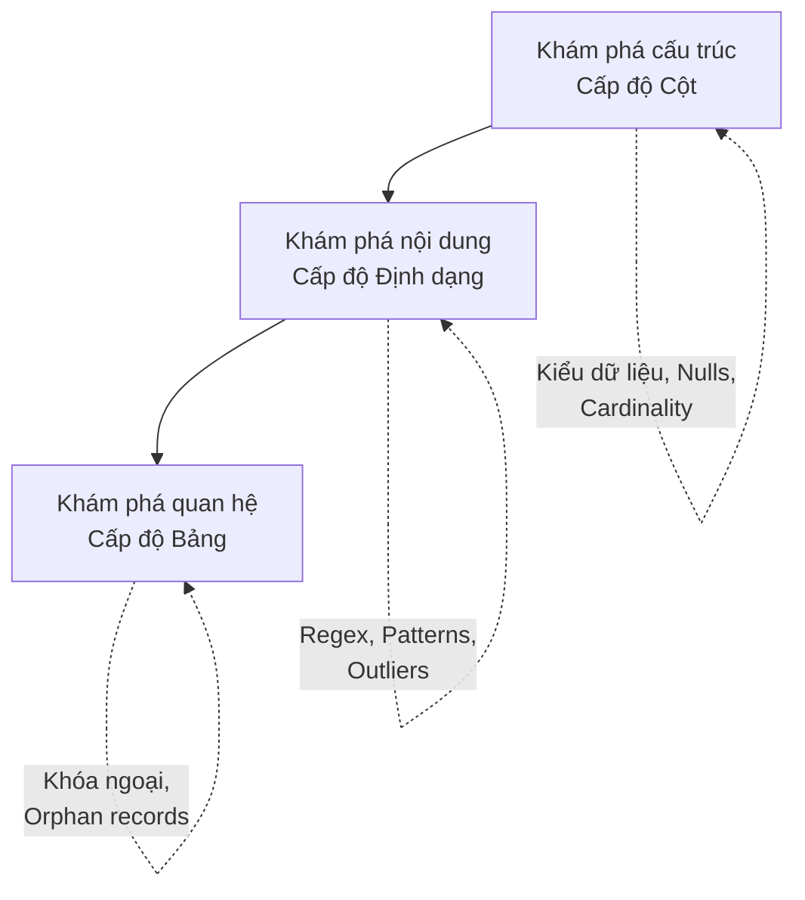

# Lập hồ sơ dữ liệu - Data Profiling

## Summary

Data Profiling (Lập hồ sơ dữ liệu) là bước khám phá, phân tích thống kê và đánh giá cấu trúc (structure), nội dung (content) và chất lượng (quality) của một tập dữ liệu thô chưa biết. Thay vì nhắm mắt viết code ETL/ELT ngay lập tức, Data Profiling cho phép các Kỹ sư dữ liệu và Nhà phân tích "chụp X-quang" hệ thống nguồn để phát hiện ra sự phân phối dữ liệu (distribution), giá trị NULL, độ dài chuỗi tối đa, cũng như các sự bất thường, từ đó thiết kế đường ống xử lý an toàn và chính xác.

---

## Definition

**Data Profiling** là quá trình quét (scan) qua hàng nghìn/triệu dòng dữ liệu trong cơ sở dữ liệu để trích xuất ra các siêu dữ liệu thống kê mô tả (Descriptive Metadata). Nó giống như bước EDA (Exploratory Data Analysis) của Data Scientist, nhưng tập trung vào góc nhìn Kỹ thuật phần mềm. 
Quá trình này giải quyết các câu hỏi: Tập dữ liệu này chứa cái gì? Các cột có quan hệ với nhau không? Có bao nhiêu % dữ liệu bị rỗng? Giá trị cao nhất, thấp nhất, trung bình là bao nhiêu?

---

## Why it exists

"Giả định là mẹ của mọi thất bại" (Assumption is the mother of all mess-ups). 
Khi đối tác bàn giao cho Data Engineer một file CSV hoặc thông tin kết nối tới CSDL MySQL, tài liệu (documentations) thường không tồn tại hoặc đã lỗi thời nghiêm trọng.
* **Tài liệu nói**: Cột `country_code` là 2 ký tự mã quốc gia (US, VN).
* **Thực tế**: Người dùng đôi khi nhập "USA", "Vietnam", hoặc thậm chí để NULL.

Nếu Kỹ sư nhắm mắt tin tài liệu và tạo bảng Data Warehouse với khai báo `country_code VARCHAR(2)`, khi nạp dữ liệu (Data Ingestion), pipeline sẽ bị "nổ tung" (Crash) ngay lập tức do vượt quá giới hạn ký tự. Profiling giúp loại bỏ phỏng đoán, buộc ta phải đối mặt với **hình hài thật sự** của dữ liệu trước khi xây dựng bất kỳ logic Transformation nào.

---

## Core idea

Quá trình Profiling thường thực hiện ở 3 cấp độ:



1. **Structure Discovery (Khám phá cấu trúc / Cấp độ Cột)**
   * Xem xét từng cột độc lập. Tính toán các chỉ số: Kiểu dữ liệu thực sự (Số, Chữ, Ngày tháng), chiều dài cực đại/cực tiểu (Max/Min length), giá trị lớn nhất/nhỏ nhất (Max/Min value), Tỷ lệ NULL (Null percentage), số lượng giá trị duy nhất (Cardinality / Distinct count).

2. **Content Discovery (Khám phá nội dung / Định dạng)**
   * Dữ liệu có tuân thủ quy luật định dạng (Patterns) nào không? Ví dụ: Quét cột số điện thoại xem có bao nhiêu % theo định dạng `(XXX) XXX-XXXX`.

3. **Relationship Discovery (Khám phá quan hệ / Cấp độ Bảng)**
   * Phân tích mối quan hệ chồng chéo giữa nhiều cột, nhiều bảng. (Ví dụ: Cột `user_id` ở bảng A có khớp 100% với cột `id` ở bảng B không để làm Khóa ngoại? Hay là bảng này bị mồ côi (Orphan records)?).

---

## How it works

Lập hồ sơ dữ liệu có thể làm bằng tay thông qua các lệnh SQL, hoặc dùng công cụ tự động hóa.
* **SQL Thủ công**: Chạy hàng loạt câu lệnh `SELECT MAX(LENGTH(col)), COUNT(DISTINCT col), COUNT(*)` để xem tóm tắt thông tin.
* **Công cụ BI**: Dùng tính năng Data Prep của Tableau, PowerBI để xem biểu đồ phân phối cột (Histogram).
* **Công cụ chuyên dụng (Python / Modern Data Stack)**: Thư viện `ydata-profiling` (trước đây là `pandas-profiling`) trong Python hoặc Data Catalog tools (như Atlan, DataHub) sẽ quét tự động ban đêm và hiển thị giao diện báo cáo dạng thẻ cho toàn bộ Data Warehouse.

---

## Practical example

Sử dụng thư viện mã nguồn mở rất nổi tiếng trong giới Python `ydata-profiling` để làm hồ sơ dữ liệu với 3 dòng code.

```python
import pandas as pd
from ydata_profiling import ProfileReport

# Đọc file dữ liệu thô
df = pd.read_csv("raw_customer_data.csv")

# Phát sinh báo cáo Profiling HTML tự động
profile = ProfileReport(df, title="Customer Data Profiling Report")
profile.to_file("report.html")
```

Kết quả báo cáo `report.html` sẽ cung cấp giao diện trực quan cho bạn biết:
* Cột `email`: Có 10,000 dòng. 200 dòng bị rỗng (2%). Có 5 email bị trùng lặp (Uniqueness không đạt 100%).
* Cột `age`: Phân phối hình chuông (Normal distribution) nhưng có một giá trị Max dị biệt (Outlier) là `999`. 
* Cảnh báo tự động: "Cột `is_test_account` có giá trị `False` chiếm 99.9% -> Có thể cột này không mang lại nhiều giá trị phân tích, độ phân tán thấp (Low Variance)".

---

## Best practices

* **Profile trên một mẫu (Sample), không quét toàn bộ (Full scan)**: Nếu bảng nguồn có 10 tỷ dòng, việc chạy lệnh đếm phân phối (COUNT DISTINCT) trên toàn bộ bảng sẽ làm hệ thống OLTP sập hoặc tốn vài ngàn đô tiền cloud. Hãy cấu hình công cụ chỉ lấy ngẫu nhiên 100,000 dòng (Stratified Sampling) để làm profile. Xác suất cao là các mẫu định dạng đã xuất hiện hết trong lượng sample này.
* **Thực hiện ngay bước đầu tiên của dự án (Phase 1)**: Profiling phải là task đầu tiên được kéo vào Sprint Jira khi bắt đầu tích hợp một nguồn dữ liệu mới, trước cả việc họp lấy yêu cầu kinh doanh (Business Requirements). Bạn không thể hứa với Business là tính được chỉ số A nếu cột chứa thông tin A hoàn toàn rỗng.
* **Profile liên tục (Continuous Profiling)**: Dữ liệu thay đổi. Đừng chỉ Profile lúc bắt đầu dự án. Nên lên lịch cho các công cụ Data Catalog quét profile hàng tuần để lưu lại lịch sử biến động dữ liệu.

---

## Common mistakes

* **Tin tưởng cấu trúc nguồn (Source Schema) quá mức**: Cột CSDL định nghĩa là `INTEGER`, bạn mặc định nó sẽ chứa các giá trị tính toán được. Nhưng khi Profile, bạn phát hiện bảng này là bảng cấu hình kế thừa, trong đó số `1` nghĩa là "Màu xanh", số `2` nghĩa là "Màu đỏ" -> Bạn phải xử lý nó như Category (Danh mục chữ) chứ không thể đem đi lấy Trung bình (AVG).
* **Bỏ qua Data Profiling**: Nhiều công ty bỏ qua bước này để "tiết kiệm thời gian", nhảy thẳng vào viết code dbt/Spark. Kết quả là mất gấp 10 lần thời gian ở giai đoạn Debug và UAT vì code liên tục vấp phải các dị thường dữ liệu (Edge cases).

---

## Trade-offs

### Ưu điểm
* Triệt tiêu sự mập mờ, mang lại cái nhìn thực tế và khách quan (Fact-based) về tình trạng tài sản dữ liệu.
* Giúp dự đoán sớm khối lượng công việc làm sạch (Data Cleansing) cần thiết để báo đúng tiến độ cho quản lý.

### Nhược điểm
* **Rủi ro bảo mật**: Các công cụ Profiling quét qua toàn bộ dữ liệu, bao gồm cả dữ liệu nhạy cảm cá nhân (PII như Thẻ tín dụng, Mật khẩu). Cần cấu hình cẩn thận để các báo cáo HTML sinh ra không làm rò rỉ (leak) dữ liệu mật ra ngoài.
* **Tiêu tốn Compute**: Các thao tác sắp xếp, gom nhóm để tìm giá trị Distinct là những thuật toán nặng (Heavy sorting). 

---

## When to use

* Khi bắt đầu (Onboarding) một nguồn dữ liệu mới, SaaS bên thứ 3 hoặc file Excel do đối tác gửi.
* Khi tham gia vào một công ty có hạ tầng dữ liệu tồn tại lâu đời (Legacy DW) mà không có tài liệu kỹ thuật nào đi kèm. Bạn phải Profile để tự khám phá thiết kế (Reverse Engineering).

## When not to use

* Với các luồng dữ liệu (Streams) tốc độ siêu cao (Kafka real-time data), việc chèn công cụ profiling vào giữa luồng sẽ làm chậm (Latency) quá trình cung cấp dữ liệu.

---

## Related concepts

* [Data Quality Dimensions](/concepts/data-quality-dimensions)
* [Data Discovery](/concepts/data-discovery)
* [Data Catalog](/concepts/data-catalog)
* [Exploratory Data Analysis (EDA) - mảng Data Science]

---

## Interview questions

### 1. Phân biệt Data Profiling và Data Testing?
* **Người phỏng vấn muốn kiểm tra**: Hiểu biết khái niệm cơ bản, trật tự thực hiện trong chu trình Data Quality.
* **Gợi ý trả lời (Strong Answer)**: Data Profiling trả lời câu hỏi "Dữ liệu hiện tại ĐANG như thế nào?" (Khám phá - Descriptive). Nó không phân định đúng/sai. Data Testing trả lời câu hỏi "Dữ liệu có NHƯ KỲ VỌNG không?" (Xác thực - Prescriptive). Về mặt quy trình, Profiling thường làm trước tiên bằng tay/công cụ để lấy thông tin. Từ thông tin thu được ở Profiling (VD: Thấy cột giá bán bị âm), Kỹ sư mới rút ra quy luật và đem viết thành các mã Data Testing tự động (VD: Assert Price >= 0) để chạy bảo vệ đường ống mỗi ngày.

### 2. Cardinality trong Data Profiling là gì? Chỉ số này có ý nghĩa quan trọng như thế nào đối với hiệu năng của Data Warehouse?
* **Người phỏng vấn muốn kiểm tra**: Kiến thức sâu về cấu trúc dữ liệu và tối ưu hiệu năng (Performance Tuning).
* **Gợi ý trả lời (Strong Answer)**: Cardinality (Lực lượng) là số lượng các giá trị độc nhất (Distinct values) trong một cột. 
  * *High Cardinality* (Ví dụ: cột `Email`, mỗi dòng một giá trị) rất khó để áp dụng nén dữ liệu (Data Compression) hoặc mã hóa từ điển (Dictionary Encoding), làm tăng dung lượng lưu trữ.
  * *Low Cardinality* (Ví dụ: cột `Gender` chỉ có M/F) nén siêu tốt và là ứng cử viên lý tưởng để dùng làm khóa phân mảnh (Partition Key) hoặc Cluster Key trong các kho dữ liệu dạng cột (Columnar DW như BigQuery, Snowflake) để tối ưu tốc độ đọc. Do đó, Profiling ra được Cardinality ảnh hưởng trực tiếp đến quyết định thiết kế vật lý của DW.

---

## References

1. **"Data Quality: The Accuracy Dimension"** - Jack E. Olson (Chương về Analytical Profiling).
2. **ydata-profiling (Pandas Profiling)** - Thư viện chuẩn mực trong hệ sinh thái Python.

---

## English summary

Data Profiling is the systematic exploratory analysis of a dataset to extract descriptive metadata, such as value distributions, max/min limits, null percentages, pattern conformity, and cardinality. By "x-raying" the raw data source before writing any ETL code, data teams replace unsafe assumptions with factual evidence about the data's true structure and health. It serves as the foundational first step in any data integration project, dictating the necessary data cleansing strategies and informing the automated Data Quality tests that will be built downstream.
