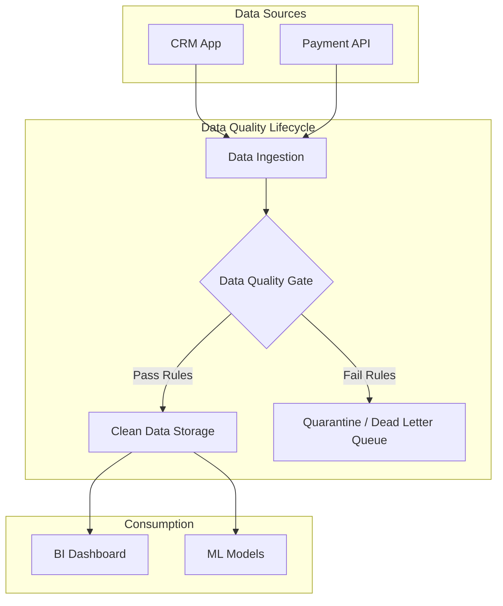

# Chất lượng dữ liệu - Data Quality

Hãy tưởng tượng bạn vừa chi ra hàng triệu USD để xây dựng một hệ thống Data Warehouse hiện đại, thuê những Data Scientist giỏi nhất về để tối ưu hóa mô hình AI. Nhưng khi chạy thực tế, báo cáo doanh thu liên tục bị lệch, còn AI thì đưa ra những gợi ý mua sắm vô lý cho khách hàng. Cuối cùng, ban giám đốc quay trở lại dùng những file Excel thủ công vì không tin vào hệ thống nữa. 

Đó chính là bi kịch của việc bỏ quên **Data Quality (Chất lượng dữ liệu)**.

## Bản chất của Chất lượng dữ liệu: Không có "đúng sai" tuyệt đối

Nói một cách thực tế, **Chất lượng dữ liệu (Data Quality - DQ)** là thước đo mức độ phù hợp, độ tin cậy và sự toàn vẹn của dữ liệu đối với một mục đích sử dụng cụ thể. Điều quan trọng cần nhớ: chất lượng dữ liệu không phải là một khái niệm tuyệt đối mà phụ thuộc hoàn toàn vào ngữ cảnh sử dụng (Fitness for use).

* **Ví dụ**: Cột tuổi (`age`) của khách hàng bị trống (NULL). 
  * Đối với đội ngũ Marketing cần gửi email giới thiệu sản phẩm hàng loạt, dữ liệu này vẫn **đạt chất lượng** vì họ chỉ cần địa chỉ email.
  * Nhưng đối với đội ngũ Data Science cần huấn luyện mô hình chấm điểm tín dụng dựa trên độ tuổi, dữ liệu này lại **kém chất lượng** và không thể sử dụng.

Dữ liệu được coi là "đạt chất lượng" khi nó phản ánh trung thực thực tế và phục vụ tốt cho công việc của người tiêu thụ nó.

## Tại sao "Garbage In, Garbage Out" luôn là nỗi ám ảnh?

Trong giới công nghệ có câu nói kinh điển: **"Garbage In, Garbage Out" (GIGO) - Rác vào thì Rác ra**. Sự tồn tại của các sáng kiến và phòng ban chuyên trách Chất lượng dữ liệu bắt nguồn từ những tổn thất khổng lồ mà "Dữ liệu bẩn" (Bad Data) gây ra:

1. **Đánh mất niềm tin**: Đây là tổn thất lớn nhất. Chỉ cần một vài lần dashboard hiển thị số liệu sai lệch, người dùng kinh doanh sẽ mất niềm tin hoàn toàn vào hệ thống dữ liệu mà bạn dày công xây dựng.
2. **Quyết định sai lầm**: Báo cáo sai dẫn đến việc ban lãnh đạo đưa ra các quyết định chiến lược sai lệch, ví dụ như giảm giá sai tệp khách hàng hoặc đánh giá sai tiềm năng thị trường.
3. **Mô hình AI bị "lệch lạc"**: Thuật toán Machine Learning được huấn luyện trên dữ liệu thiên kiến, lỗi thời sẽ đưa ra các phán đoán sai lầm và gây nguy hại trực tiếp đến trải nghiệm người dùng.
4. **Rủi ro pháp lý**: Báo cáo số liệu sai lệch lên cơ quan thuế hoặc cơ quan quản lý nhà nước có thể khiến doanh nghiệp đối mặt với các án phạt tài chính nặng nề.

## Từ "chữa cháy" bị động sang "phòng thủ" chủ động

Mục tiêu cốt lõi của quản trị Chất lượng dữ liệu là chuyển dịch từ trạng thái **Khắc phục (Reactive)** sang **Phòng ngừa (Proactive)**. 

Thay vì ngồi đợi người dùng phát hiện ra lỗi trên báo cáo rồi mở ticket hỗ trợ (Jira Ticket) để kỹ sư dữ liệu đi sửa, hệ thống cần được thiết lập các "chốt kiểm soát" (Data Quality Gates) để tự động phát hiện, ngăn chặn và cảnh báo về dữ liệu xấu trước khi nó kịp đi vào kho lưu trữ chính.

## Vòng đời và Kiến trúc kiểm soát chất lượng dữ liệu

Quy trình quản lý chất lượng dữ liệu là một vòng lặp khép kín gồm 4 bước:

1. **Khám phá (Profiling)**: Quét qua tập dữ liệu thô để phân tích cấu trúc và phát hiện các dấu hiệu bất thường (ví dụ: phát hiện cột số điện thoại chứa ký tự chữ).
2. **Định nghĩa quy tắc (Rule Definition)**: Phối hợp với các chuyên gia nghiệp vụ (Domain Experts) để thiết lập các quy tắc rõ ràng (ví dụ: *"Giá bán sản phẩm không được phép nhỏ hơn hoặc bằng 0"*).
3. **Kiểm soát & Giám sát (Validation & Monitoring)**: Nhúng các bài kiểm thử tự động (Data Tests) vào pipeline ETL/ELT để ngăn chặn dữ liệu bẩn hoặc phát đi cảnh báo ngay lập tức.
4. **Xử lý sự cố (Remediation)**: Cách ly dữ liệu lỗi vào một khu vực riêng (Quarantine Zone/Dead Letter Queue) để xử lý sau, tránh làm nghẽn toàn bộ đường ống dẫn dữ liệu.

### Luồng kiến trúc kiểm soát chất lượng dữ liệu



---

## Một ví dụ thực tế: Khi "dữ liệu rác" gửi thiệp chúc thọ

Một công ty thương mại điện tử tổ chức chương trình gửi tin nhắn chúc mừng sinh nhật khách hàng tự động.
* **Vấn đề**: CSDL cũ lưu ngày sinh mặc định của những khách hàng không khai báo là `1900-01-01`.
* **Hệ quả**: Hệ thống gửi thiệp chúc thọ 126 tuổi hàng loạt cho các khách hàng trẻ tuổi, gây lãng phí chi phí gửi tin nhắn và làm giảm uy tín thương hiệu.
* **Giải pháp**: 
  1. Ở tầng Frontend: Ràng buộc người dùng nhập ngày sinh hợp lý.
  2. Ở tầng Pipeline: Thiết lập một chốt chặn kiểm tra chất lượng dữ liệu bằng code.

Dưới đây là cách bạn có thể sử dụng thư viện **Great Expectations** trong Python để tạo chốt chặn này:

```python
import great_expectations as ge

# Tải tập dữ liệu khách hàng vừa mới thu thập
df = ge.read_csv("new_customers_batch.csv")

# 1. Định nghĩa Quy tắc: Cột ngày sinh không được phép là '1900-01-01'
df.expect_column_values_to_not_be_null("date_of_birth")
df.expect_column_values_to_not_be_in_set("date_of_birth", ["1900-01-01"])

# 2. Chạy kiểm thử tự động
validation_results = df.validate()

# 3. Quyết định (Data Quality Gate)
if validation_results["success"]:
    print("Dữ liệu đạt chuẩn, tiến hành nạp vào Data Warehouse.")
    # code_to_load_data()
else:
    print("PHÁT HIỆN DỮ LIỆU BẨN! Đẩy file vào vùng cách ly (Quarantine).")
    # code_to_quarantine_data()
```

---

## Kinh nghiệm thực tế và những đánh đổi lớn

### Những "bí kíp" bỏ túi (Best Practices)
* **Dịch chuyển về nguồn (Shift-left / Data Contract)**: Đừng cố gắng dọn rác ở cuối con đường (Data Warehouse). Hãy bắt buộc các đội phát triển ứng dụng nguồn (Software Engineers) phải cam kết cung cấp dữ liệu sạch thông qua các giao ước dữ liệu (Data Contracts).
* **Tự động hóa hoàn toàn**: Loại bỏ việc kiểm tra dữ liệu bằng mắt hay chạy script thủ công. Mọi quy tắc chất lượng phải được viết thành code và chạy tự động trong pipeline (ví dụ: dùng dbt test).
* **Đo lường có trọng tâm (Tiering)**: Hãy phân loại dữ liệu của bạn. Tập trung nguồn lực kiểm soát chất lượng nghiêm ngặt cho Tier 1 (dữ liệu tài chính, khách hàng cốt lõi) và nới lỏng hơn cho Tier 3 (dữ liệu log, nháp).

### Những sai lầm phổ biến cần tránh
* **Coi Data Quality là việc riêng của Data Engineer**: DE chỉ là người xây dựng đường ống dẫn nước, họ không tạo ra nước và cũng không biết nước đó có uống được hay không. Người sở hữu dữ liệu (Data Owners/Business Users) mới là người chịu trách nhiệm cuối cùng về tính đúng đắn của thông tin.
* **Theo đuổi sự hoàn hảo tuyệt đối (100% Clean)**: Việc cố gắng làm sạch những dữ liệu cũ từ 10 năm trước đôi khi tốn kém hơn rất nhiều so với giá trị thực tế mà nó mang lại. Hãy biết dừng lại ở mức "vừa đủ dùng".
* **Sửa thủ công (Manual updates)**: Thấy số liệu trên báo cáo bị sai, bạn dùng lệnh `UPDATE` chọc thẳng vào DB để sửa số. Đây là cách làm cực kỳ nguy hiểm vì nó chỉ giải quyết phần ngọn, che giấu lỗi hệ thống và lỗi đó chắc chắn sẽ lặp lại vào tuần sau.

### Đánh đổi (Trade-offs)
* **Tốc độ phát triển vs. Độ an toàn**: Việc viết code kiểm thử và thiết lập quy trình chất lượng dữ liệu sẽ làm chậm tiến độ bàn giao dự án (Time-to-market) trong ngắn hạn, nhưng lại giúp hệ thống vận hành cực kỳ ổn định trong dài hạn.
* **Chi phí hạ tầng**: Việc chạy hàng ngàn câu lệnh kiểm thử trên hàng tỷ dòng dữ liệu mỗi ngày sẽ làm tăng hóa đơn cloud của bạn đáng kể.
* **Không áp dụng khi làm PoC**: Khi bạn chỉ đang thử nghiệm nhanh một ý tưởng (Proof of Concept) trên máy cá nhân với một file dữ liệu nhỏ, việc áp dụng quy trình kiểm soát DQ cồng kềnh là hoàn toàn không cần thiết.

---

## Góc phỏng vấn

### 1. Tại sao chúng ta nói Chất lượng dữ liệu là "Fitness for use" (Phù hợp để sử dụng) thay vì "Tính đúng đắn tuyệt đối"? Hãy cho một ví dụ.
* **Gợi ý trả lời**: Tính đúng đắn tuyệt đối là một mục tiêu rất xa xỉ và đôi khi không cần thiết. Một tập dữ liệu được coi là có chất lượng tốt khi nó đáp ứng được nhu cầu thực tế của người dùng. 
  * Ví dụ: Dữ liệu tọa độ GPS của người dùng bị làm tròn và lệch khoảng 200 mét. Nếu dùng để vẽ bản đồ mật độ người dùng theo Quận/Huyện, dữ liệu này hoàn toàn "Đạt" (Fitness for use). Nhưng nếu dùng để điều hướng cho xe tự lái hoặc giao hàng bằng drone, dữ liệu này chắc chắn là "Không đạt".

### 2. Nếu phát hiện ra hệ thống CRM đang đẩy hàng loạt dữ liệu bị lỗi định dạng tên khách hàng vào Data Warehouse, quy trình xử lý của bạn với tư cách là một Kỹ sư dữ liệu là gì?
* **Gợi ý trả lời**: Quy trình xử lý chuẩn gồm 4 bước:
  1. **Cô lập (Containment)**: Tạm thời chặn hoặc gắn cờ để ngăn dữ liệu lỗi chảy vào các bảng báo cáo chính, tránh làm sai lệch số liệu hiển thị cho người dùng.
  2. **Tìm nguyên nhân gốc rễ (Root-cause Analysis)**: Kiểm tra lịch sử thay đổi code ở hệ thống CRM để tìm ra nguyên nhân gây lỗi.
  3. **Phối hợp xử lý (Collaboration)**: Liên hệ với đội ngũ phát triển CRM (Data Producer) để họ sửa lỗi ngay tại nguồn (áp dụng tư duy Shift-left).
  4. **Khắc phục tạm thời (Remediation)**: Trong thời gian chờ đợi fix từ nguồn, viết một logic làm sạch tạm thời ở tầng Staging của DWH để chuẩn hóa lại tên khách hàng, giúp pipeline tiếp tục vận hành bình thường.

---

## Đọc thêm & Tài liệu tham khảo

1. **[Các chiều chất lượng dữ liệu](/concepts/data-quality-dimensions)** - Đi sâu vào 6 khía cạnh đo lường chất lượng dữ liệu tiêu chuẩn.
2. **[Data Testing](/concepts/data-testing)** - Hướng dẫn chi tiết cách viết code để kiểm thử dữ liệu.
3. **[Data Contract](/concepts/data-contract)** - Giải pháp giao ước dữ liệu để ngăn chặn rác từ nguồn.
4. **"Data Quality: The Accuracy Dimension"** - Cuốn sách nổi tiếng của tác giả Jack E. Olson.

## English Summary

Data Quality (DQ) represents the degree to which data is "fit for use" in operational and analytical contexts. It is not an absolute state but rather a context-dependent measurement of reliability, accuracy, and completeness. High data quality is paramount to building Trust within an organization, avoiding flawed business decisions ("Garbage In, Garbage Out"), and mitigating compliance risks. A robust DQ strategy shifts focus from reactive patching in the Data Warehouse to proactive validation, automated testing, and establishing strong Data Governance protocols directly at the data sources (Shift-left).
