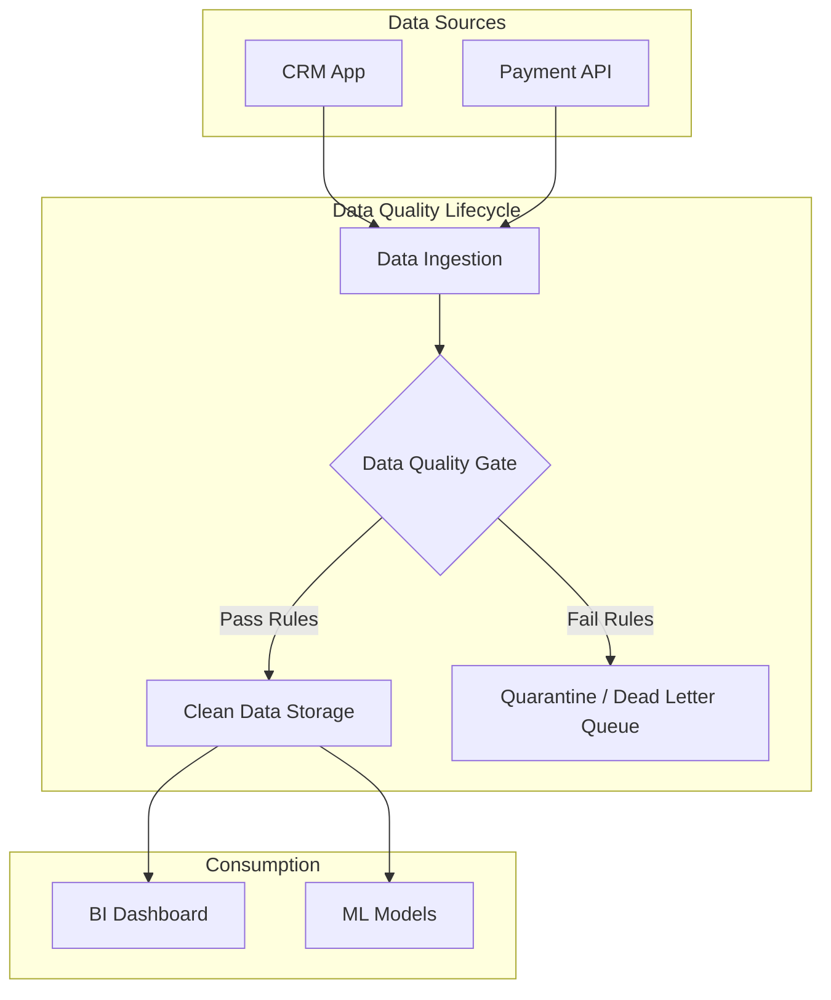

# Chất lượng dữ liệu - Data Quality

## Summary

Chất lượng dữ liệu (Data Quality - DQ) là thước đo đánh giá mức độ phù hợp, độ tin cậy và sự toàn vẹn của dữ liệu để phục vụ cho các mục đích cụ thể như ra quyết định kinh doanh, vận hành hệ thống, hay huấn luyện mô hình học máy (Machine Learning). Dữ liệu có chất lượng cao khi nó phản ánh chính xác thế giới thực tế và đáp ứng kỳ vọng của những người tiêu thụ nó. Đây là nền tảng cốt lõi của mọi chiến lược dữ liệu thành công.

---

## Definition

**Chất lượng dữ liệu** không phải là một trạng thái tuyệt đối (đúng hoặc sai), mà là một khái niệm mang tính bối cảnh (context-dependent). Dữ liệu được coi là "chất lượng tốt" khi nó đạt yêu cầu về trạng thái để thực thi công việc (Fitness for use). 
Ví dụ: Một cột tuổi (Age) của khách hàng không có giá trị (NULL). Đối với đội ngũ gửi Email tiếp thị hàng loạt, dữ liệu này vẫn có chất lượng ĐẠT vì họ chỉ cần địa chỉ Email. Nhưng đối với mô hình Học máy chấm điểm tín dụng dựa trên độ tuổi, dữ liệu này có chất lượng KÉM và không thể sử dụng.

---

## Why it exists

Thuật ngữ kinh điển trong giới công nghệ: **"Garbage In, Garbage Out" (GIGO) - Rác vào thì Rác ra**.
Sự tồn tại của các sáng kiến và phòng ban chuyên trách Chất lượng dữ liệu bắt nguồn từ những tổn thất khổng lồ mà "Bad Data" (Dữ liệu bẩn) gây ra:
1. **Mất niềm tin**: Khi người dùng mở Dashboard và phát hiện báo cáo doanh thu tháng bị sai, họ sẽ vĩnh viễn không còn tin vào hệ thống dữ liệu, quay lại dùng Excel thủ công. Toàn bộ tiền đầu tư cho hạ tầng Data Warehouse trị giá triệu USD trở nên vô nghĩa.
2. **Quyết định sai lầm**: Giảm giá sai tệp khách hàng do phân tích nhầm dữ liệu, gây thất thoát lợi nhuận.
3. **Thất bại AI/ML**: Thuật toán AI được train trên dữ liệu thiên kiến, lỗi thời sẽ đưa ra các phán đoán nguy hiểm.
4. **Vấn đề pháp lý (Compliance)**: Báo cáo sai lệch lên các cơ quan nhà nước, vi phạm quy định bảo mật thông tin do dữ liệu khách hàng thiếu tính toàn vẹn.

---

## Core idea

Ý tưởng cốt lõi của việc quản trị Chất lượng dữ liệu là chuyển từ trạng thái **Khắc phục (Reactive)** sang trạng thái **Phòng ngừa (Proactive)**.
Thay vì đợi người dùng kinh doanh phát hiện ra lỗi và mở thẻ hỗ trợ (Jira Ticket) để kỹ sư sửa, hệ thống cần có cơ chế tự động theo dõi, đo lường và cảnh báo trước khi dữ liệu bẩn chạm tới tay người tiêu dùng cuối.

Hệ thống đánh giá DQ thường xoay quanh các "Chiều chất lượng" (Data Quality Dimensions) kinh điển như tính chính xác, tính đầy đủ, tính kịp thời (sẽ được đề cập chi tiết ở một bài riêng).

---

## How it works

Quy trình vòng đời đảm bảo chất lượng dữ liệu thường bao gồm 4 bước liên tục:
1. **Phát hiện (Discovery / Profiling)**: Dùng các công cụ quét qua tập dữ liệu để phân tích cấu trúc, tìm ra các vấn đề tiềm ẩn (ví dụ: phát hiện 30% trường Số điện thoại chứa ký tự chữ cái).
2. **Định nghĩa quy tắc (Rule Definition)**: Làm việc cùng chuyên gia nghiệp vụ (Domain Experts) để thiết lập các quy tắc ràng buộc. Ví dụ: "Giá bán sản phẩm không bao giờ được phép < 0".
3. **Kiểm soát & Giám sát (Validation & Monitoring)**: Viết các bài kiểm thử tự động (Data Testing / Data Observability tools) gắn vào pipeline ETL để chặn dòng dữ liệu xấu hoặc cảnh báo ngay lập tức khi quy tắc bị vi phạm.
4. **Xử lý & Cải thiện (Remediation)**: Khi phát hiện lỗi, đội ngũ thực hiện quy trình "Làm sạch" (Data Cleansing) ở tầng nguồn, hoặc cô lập dữ liệu lỗi ra một khu vực riêng (Quarantine zone) để xử lý sau.

---

## Architecture / Flow

---

## Practical example

Một công ty thương mại điện tử gửi chiến dịch tri ân sinh nhật khách hàng.
* Dữ liệu bẩn: Trường Ngày sinh (Date of Birth) của 10.000 khách hàng đều là `1900-01-01` do đây là giá trị mặc định hệ thống cũ lưu khi khách không chịu nhập.
* Hậu quả: Hệ thống marketing tự động gửi thiệp chúc thọ 126 tuổi cho hàng loạt thanh niên, gây tổn hại hình ảnh thương hiệu và lãng phí tiền SMS/Email.
* Giải pháp Data Quality: Đặt quy tắc (Rule) tại lúc nhập liệu (Frontend) buộc người dùng chọn năm sinh hợp lý. Tại kho dữ liệu, tạo cảnh báo (Alert) nếu phát hiện bất kỳ cụm ngày sinh `1900-01-01` tăng đột biến, loại bỏ chúng khỏi tệp dữ liệu phân phối marketing.

---

## Best practices

* **Đẩy trách nhiệm về nguồn (Shift-left / Data Contract)**: Đừng cố gắng làm sạch mọi rác thải ở cuối con đường (Data Warehouse). Hãy xây dựng cơ chế bắt đội ngũ phát triển phần mềm (Software Engineers) phải gửi dữ liệu sạch ngay từ ban đầu.
* **Tự động hóa toàn diện**: Không kiểm tra dữ liệu bằng mắt hay các tập lệnh chạy thủ công. Mọi quy tắc chất lượng phải được viết thành Code và tự động kiểm tra mỗi khi pipeline chạy (dbt test, Great Expectations).
* **Gắn kết yếu tố kinh doanh**: Không có "Chất lượng dữ liệu" trừu tượng. Hãy gắn mỗi chỉ số chất lượng với một chỉ số KPI kinh doanh (Ví dụ: "Tăng 5% độ chính xác của trường địa chỉ giúp giảm 2% chi phí giao hàng thất bại").
* **Chỉ đo lường những gì quan trọng (Tiering)**: Không cào bằng. Hãy phân loại dữ liệu thành Tier 1 (Cốt lõi, Tài chính) và Tier 3 (Log, Nháp). Chỉ đổ công sức làm quy tắc DQ khắt khe cho Tier 1.

---

## Common mistakes

* **Coi Data Quality là trách nhiệm của riêng Data Engineer**: Data Engineers quản lý đường ống, họ không sinh ra dữ liệu và cũng không hiểu sâu sắc nghiệp vụ (VD: Trạng thái hóa đơn A chuyển sang B có hợp lệ hay không). Chất lượng dữ liệu phải là trách nhiệm của Data Owner (những người làm Business).
* **Cố gắng đạt 100% độ hoàn hảo**: Mất quá nhiều thời gian làm sạch những dữ liệu lịch sử từ 10 năm trước mà không ai còn dùng đến. Ở một mức độ nhất định, chi phí làm sạch sẽ vượt quá lợi ích kinh tế mang lại.
* **Sửa thẳng vào dữ liệu (Manual updates)**: Thấy dữ liệu sai trên báo cáo, dùng lệnh SQL `UPDATE` chọc thẳng vào kho dữ liệu để sửa số cho khớp. Cách làm này vá được bề nổi nhưng che giấu nguồn gốc sinh ra lỗi, tuần sau lỗi sẽ lại xuất hiện.

---

## Trade-offs

### Ưu điểm
* Tạo ra sự Tin tưởng (Trust) — tài sản quý giá nhất của mọi hệ thống phân tích.
* Tối ưu hóa chi phí vận hành (giảm thời gian debug lỗi lặt vặt của Data Engineers).
* Giảm thiểu rủi ro pháp lý (Compliance risks).

### Nhược điểm
* Tăng thời gian phát triển và phân phối dữ liệu (Time-to-market). Việc nghĩ ra quy tắc và viết code kiểm thử đôi khi mất thời gian hơn cả việc viết code logic chuyển đổi.
* Tốn chi phí tài nguyên điện toán (Compute cost). Chạy hàng nghìn bài kiểm thử (rules) trên hàng tỷ dòng dữ liệu mỗi đêm trên cloud tiêu tốn hóa đơn khổng lồ.

---

## When to use

* Data Quality là yếu tố bắt buộc, không phụ thuộc vào loại hình tổ chức. Ngay khi bạn bắt đầu lưu trữ và sử dụng dữ liệu để tạo ra giá trị, bạn cần phải quan tâm đến Data Quality.

## When not to use

* Khi bạn đang ở giai đoạn "Proof of Concept" (PoC) xây dựng nhanh một mô hình học máy nháp bằng file CSV trên máy cá nhân để chứng minh một ý tưởng. Áp dụng quy trình DQ cồng kềnh lúc này làm chậm tiến độ không cần thiết.

---

## Related concepts

* [Data Quality Dimensions](/concepts/data-quality-dimensions)
* [Data Testing](/concepts/data-testing)
* [Data Governance](/concepts/data-governance)
* [Data Contract](/concepts/data-contract)

---

## Interview questions

### 1. Tại sao chúng ta nói Chất lượng dữ liệu là "Fitness for use" thay vì "Tính đúng đắn tuyệt đối"? Hãy cho một ví dụ.
* **Người phỏng vấn muốn kiểm tra**: Tư duy thực tế và hiểu biết về ngữ cảnh ứng dụng của dữ liệu.
* **Gợi ý trả lời (Strong Answer)**: Tính đúng đắn tuyệt đối thường là một lý tưởng tốn kém vô ích. Dữ liệu tốt là dữ liệu phục vụ được công việc hiện tại. Ví dụ: Dữ liệu tọa độ vĩ độ/kinh độ của khách hàng bị làm tròn mất 2 số thập phân cuối. Dữ liệu này không chính xác tuyệt đối (vị trí lệch vài trăm mét). Nhưng đối với bài toán "Thống kê người dùng theo khu vực Quận/Huyện", nó là "Đạt" (Fitness for use). Tuy nhiên, với bài toán "Giao hàng bằng máy bay không người lái tới tận cửa", nó là "Không đạt".

### 2. Nếu phát hiện ra hệ thống CRM đang đẩy hàng loạt dữ liệu bị lỗi định dạng tên khách hàng vào Data Warehouse, quy trình xử lý của bạn với tư cách là một Kỹ sư dữ liệu là gì?
* **Người phỏng vấn muốn kiểm tra**: Phản xạ xử lý sự cố (Incident Management) và tư duy làm việc nhóm chéo (Cross-functional).
* **Gợi ý trả lời (Strong Answer)**:
  1. Cảnh báo/Chặn (Containment): Ngăn luồng pipeline đẩy tiếp dữ liệu lỗi lên Data Marts để báo cáo không bị sai thêm.
  2. Phân tích nguyên nhân (Root-cause): Tìm xem thay đổi nào gần đây (từ đội dev CRM) gây ra lỗi.
  3. Báo cáo chéo: Lập tức liên hệ Data Owner / CRM Engineering team để yêu cầu sửa code tận gốc (Shift-left).
  4. Vá lỗi (Remediation): Tạm thời viết một logic làm sạch (Cleansing logic) tại tầng Staging của DWH để sửa lại chuỗi ký tự, cho phép pipeline chạy tiếp để duy trì hoạt động doanh nghiệp trong lúc đợi team CRM fix gốc.
* **Lỗi cần tránh**: Trả lời là tự âm thầm viết code REPLACE sửa lại tên và không báo cho ai. Dẫn đến ôm cục nợ kỹ thuật (Technical Debt) vào tầng Data.

---

## References

1. **"Data Quality: The Accuracy Dimension"** - Jack E. Olson.
2. **DAMA-DMBOK (Data Management Body of Knowledge)** - Chương 13 về Data Quality.

---

## English summary

Data Quality (DQ) represents the degree to which data is "fit for use" in operational and analytical contexts. It is not an absolute state but rather a context-dependent measurement of reliability, accuracy, and completeness. High data quality is paramount to building Trust within an organization, avoiding flawed business decisions ("Garbage In, Garbage Out"), and mitigating compliance risks. A robust DQ strategy shifts focus from reactive patching in the Data Warehouse to proactive validation, automated testing, and establishing strong Data Governance protocols directly at the data sources (Shift-left).
