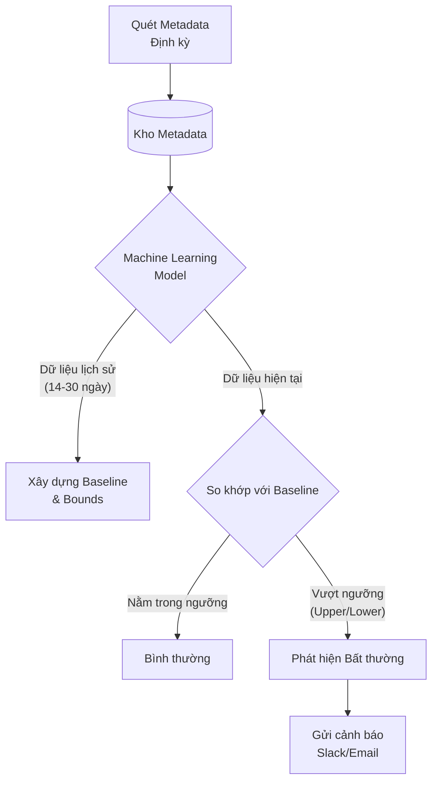

# Phát hiện bất thường (Anomaly Detection): Rada tự động bảo vệ chất lượng dữ liệu

Trong thế giới Kỹ thuật Dữ liệu, có một câu nói nổi tiếng: *"Chúng ta không biết những gì mình không biết"* (We don't know what we don't know). Bạn có thể viết hàng trăm bài kiểm thử tĩnh để kiểm tra xem cột ID có bị trùng lặp không, hoặc số tiền thanh toán có bị âm không. Nhưng làm thế nào để bạn phát hiện ra việc số lượng đơn hàng đổ về hôm nay bỗng dưng giảm mất 30% so với thứ Hai tuần trước? Hay làm sao để biết tỉ lệ giá trị trống (NULL) ở một cột thông tin khách hàng bỗng nhiên tăng vọt một cách kỳ lạ?

Đây chính là lúc chúng ta cần đến **Phát hiện bất thường (Anomaly Detection / Outlier Detection)**. Thay vì dựa vào các quy tắc cứng nhắc do con người tự viết, phương pháp này ứng dụng các thuật toán Thống kê và Học máy (Machine Learning) để tự động theo dõi hành vi của dữ liệu theo thời gian, từ đó phát hiện ra những điểm bất thường ẩn sâu mà mắt thường và các bộ kiểm thử thông thường dễ dàng bỏ sót.

## Tại sao các bài kiểm thử tĩnh (Rule-based Tests) là chưa đủ?

Các công cụ kiểm thử chất lượng dữ liệu truyền thống (như [dbt](/concepts/transformation-analytics/dbt/) tests hay Great Expectations) hoạt động dựa trên các bộ quy tắc cố định (Rule-based). Bạn chỉ viết được kiểm thử cho những lỗi mà bạn **lường trước được** nó sẽ xảy ra.

Hãy xem hai ví dụ thực tế dưới đây để thấy lỗ hổng của phương pháp này:

* **Ví dụ 1:** Bạn viết một kiểm thử quy định: `doanh_thu > 0`. Vào một ngày đẹp trời, hệ thống mạng gặp sự cố khiến một nửa số giao dịch bị mất, doanh thu cả ngày sụt giảm thê thảm từ 1 tỷ đồng xuống còn 500 nghìn đồng. Vì `500.000 > 0`, bài kiểm thử tĩnh của bạn vẫn hiển thị màu xanh (PASS) và báo cáo lỗi hoàn toàn trôi qua êm đẹp.
* **Ví dụ 2:** Bạn cố gắng khắc phục bằng cách nâng ngưỡng kiểm thử lên: `doanh_thu > 500_000_000`. Tuy nhiên, vào những ngày nghỉ Tết Nguyên Đán, việc doanh thu sụt giảm tự nhiên xuống 300 triệu là hoàn toàn bình thường. Lúc này, bài kiểm thử của bạn lại liên tục báo lỗi đỏ (False Positive), buộc bạn phải thức dậy vào ngày nghỉ để kiểm tra một hệ thống không hề có lỗi.

Việc ngồi cập nhật các ngưỡng kiểm thử thủ công này mỗi ngày là bất khả thi. Anomaly Detection ra đời để giúp hệ thống tự động tính toán ra các **"Ngưỡng động" (Dynamic Thresholds)** thích ứng theo thời gian thực dựa trên dữ liệu lịch sử.

## Triết lý cốt lõi: Ngưỡng động và Phân tích chuỗi thời gian

Về bản chất, Anomaly Detection trong [Data Quality](/concepts/data-quality/data-quality/) là bài toán **Phân tích chuỗi thời gian (Time-series Forecasting)**:

1. **Ghi nhận chỉ số (Metrics):** Hệ thống liên tục đo đạc và ghi nhận một chỉ số cụ thể (ví dụ: Số lượng bản ghi mới nạp vào mỗi giờ).
2. **Vạch ra dải ruy-băng dự đoán (Confidence Interval):** Các thuật toán (như ARIMA, Prophet hoặc phân phối Z-score) sẽ phân tích dữ liệu quá khứ để đưa ra dự đoán hợp lý: *"Vào khoảng 12 giờ trưa thứ Sáu, số lượng dòng mới nạp vào thông thường sẽ dao động trong khoảng từ 8.000 đến 12.000 dòng"*.
3. **Phát hiện dị thường:** Nếu số liệu thực tế đo được vượt ra ngoài dải ruy-băng an toàn này (chẳng hạn chỉ có 1.500 dòng), hệ thống sẽ lập tức đánh dấu đây là một bất thường (Anomaly) và gửi cảnh báo.

Một hệ thống Anomaly Detection thông minh sẽ tự động học được **Tính mùa vụ (Seasonality)** (ví dụ: lượng truy cập ngày cuối tuần luôn thấp hơn ngày thường) và **Tính xu hướng (Trend)** (ví dụ: quy mô công ty ngày càng lớn nên lượng dữ liệu tháng sau luôn nhiều hơn tháng trước) để tránh đưa ra các cảnh báo sai lệch.

## Cơ chế vận hành của hệ thống giám sát bất thường

Các công cụ Data Observability hiện đại (như Monte Carlo, re_data) thường triển khai ngầm quy trình này qua các bước sau:

1. **Thu thập siêu dữ liệu (Metadata):** Định kỳ mỗi giờ hoặc mỗi ngày, hệ thống chạy các câu lệnh đếm dữ liệu (`COUNT(*)`, tỷ lệ NULL, số lượng giá trị duy nhất) trên các bảng cần giám sát và lưu các chỉ số này vào kho Metadata riêng.
2. **Huấn luyện mô hình:** Nạp dữ liệu chuỗi thời gian của 14 đến 30 ngày gần nhất vào mô hình Machine Learning.
3. **Thiết lập giới hạn:** Mô hình tự động tính toán ra đường Baseline trung bình cùng hai giới hạn: Giới hạn trên (Upper Bound) và Giới hạn dưới (Lower Bound).
4. **Đối chiếu và Cảnh báo:** Đưa số liệu mới nhất vừa đo được vào mô hình. Nếu nó nằm ngoài phạm vi an toàn, một cảnh báo kèm biểu đồ trực quan sẽ được gửi thẳng tới kênh Slack của đội ngũ kỹ sư.



## Thử nghiệm thực tế: Tính toán Z-Score bằng SQL

Một trong những thuật toán đơn giản nhưng cực kỳ hiệu quả để phát hiện bất thường là **Z-score** (Độ lệch chuẩn). 
* Z-score đo lường xem một điểm dữ liệu mới lệch bao nhiêu lần độ lệch chuẩn so với giá trị trung bình trong quá khứ.
* Trên phân phối chuẩn, nếu giá trị tuyệt đối của Z-score lớn hơn 3 (`Z > 3` hoặc `Z < -3`), khả năng xuất hiện của điểm dữ liệu đó chỉ là 0.3%. Đây là dấu hiệu rõ ràng của một sự bất thường cực độ.

Dưới đây là cách bạn có thể tự viết một đoạn code SQL trong dbt để phát hiện bất thường về thể tích dữ liệu (Volume) của ngày hôm nay dựa trên lịch sử 7 ngày trước đó:

```sql
-- Bước 1: Tính trung bình và độ lệch chuẩn của lượng dữ liệu trong 7 ngày qua
WITH historical_stats AS (
  SELECT 
    AVG(daily_count) as mean_count,
    STDDEV(daily_count) as stddev_count
  FROM daily_volume_log
  WHERE date >= CURRENT_DATE - INTERVAL '7 DAY'
)
-- Bước 2: Tính Z-score cho ngày hôm nay và lọc ra các giá trị lệch chuẩn vượt quá 3
SELECT 
  today.daily_count,
  h.mean_count,
  (today.daily_count - h.mean_count) / h.stddev_count AS z_score
FROM today_volume today
CROSS JOIN historical_stats h
WHERE ABS((today.daily_count - h.mean_count) / h.stddev_count) > 3;
```

If câu truy vấn trên trả về bất kỳ bản ghi nào, điều đó có nghĩa là dữ liệu ngày hôm nay của bạn đang có biến động bất thường nghiêm trọng.

## Những nguyên tắc giúp triển khai hiệu quả

* **Tận dụng các công cụ có sẵn:** Đừng cố gắng tự viết lại toàn bộ thư viện Machine Learning bằng Python để giám sát dữ liệu nếu nguồn lực của bạn có hạn. Các nền tảng Data Observability SaaS (như Monte Carlo, Datafold) hoặc các thư viện mã nguồn mở chuyên dụng (như `re_data` chạy dưới dạng một dbt package) đã làm việc này rất tốt.
* **Phối hợp nhịp nhàng giữa Kiểm thử tĩnh và Ngưỡng động:** Anomaly Detection không sinh ra để thay thế hoàn toàn Data Testing. Hãy dùng Data Testing (Rule-based) để bắt các lỗi logic nghiệp vụ cố định (như cột `age` phải lớn hơn 0). Và dùng Anomaly Detection để giám sát các chỉ số biến động khó lường như số lượng bản ghi hoặc tỷ lệ giá trị trống (NULL rate) trên toàn bộ hệ thống.
* **Cho mô hình thời gian để học hỏi:** Tránh bật cảnh báo ngay khi vừa tạo bảng dữ liệu. Các thuật toán ML cần tối thiểu từ 14 đến 21 ngày thu thập số liệu lịch sử để hiểu được chu kỳ hoạt động của dữ liệu. Trong những ngày đầu tiên, mô hình có thể sẽ đưa ra khá nhiều cảnh báo sai (False Positives).

## Những cái bẫy thường gặp khi cấu hình Anomaly Detection

* **Rơi vào thảm họa kiệt sức vì cảnh báo (Alert Fatigue):** Bật tính năng phát hiện bất thường một cách vô tội vạ cho hàng vạn bảng dữ liệu trong hệ thống. Hậu quả là mỗi ngày kênh Slack của bạn nhận hàng trăm tin nhắn cảnh báo trồi sụt dữ liệu không quan trọng, khiến cả team chán nản và tắt thông báo kênh. Giải pháp là chỉ bật tính năng này cho các bảng dữ liệu cốt lõi (Tier 1) phục vụ trực tiếp cho báo cáo tài chính hoặc các dashboard BI quan trọng.
* **Không tính đến các sự kiện đặc biệt (Black Swan Events):** Vào các ngày siêu sale lớn như Black Friday hay Double 11, lượng dữ liệu giao dịch có thể tăng vọt gấp 10 lần bình thường. Mô hình ML sẽ hiểu nhầm đây là một lỗi nghiêm trọng và báo động đỏ. Bạn cần cấu hình cơ chế cho phép mô hình bỏ qua (ignore) hoặc gắn thẻ các ngày đặc biệt này để tránh làm sai lệch dữ liệu huấn luyện cho các tuần tiếp theo.

## Được và mất khi áp dụng phát hiện bất thường tự động

### Điểm cộng (Pros):
* **Cấu hình tối giản (Zero-configuration):** Bạn không cần phải ngồi viết và duy trì hàng ngàn dòng code YAML kiểm thử cho từng bảng. Chỉ cần kích hoạt, hệ thống sẽ tự động quét và học hỏi dưới nền.
* **Phát hiện những lỗi ngoài dự kiến (Unknown Unknowns):** Bắt được các lỗi kỳ lạ mà bạn chưa từng nghĩ là nó có thể xảy ra trong đời.

### Điểm trừ (Cons):
* **Hộp đen khó giải thích (Black Box):** Khi hệ thống báo động đỏ, nó chỉ có thể nói cho bạn biết dữ liệu đang có bất thường, chứ không thể giải thích cụ thể *"tại sao"* tỷ lệ NULL hay thể tích dữ liệu lại biến động như vậy. Bạn vẫn phải tự lần theo bản đồ Lineage để debug thủ công.
* **Cảnh báo mang tính phản ứng (Reactive):** Cảnh báo chỉ được đưa ra sau khi dữ liệu đã được nạp vào [Data Warehouse](/concepts/data-warehouse/data-warehouse/) và mô hình chạy xong. Có nghĩa là dữ liệu lỗi có thể đã hiển thị lên biểu đồ của người dùng trong một khoảng thời gian ngắn trước khi bị phát hiện. Nó không mang tính ngăn chặn ngay từ cửa ngõ (Preventative) như cơ chế [Data Contract](/concepts/transformation-analytics/data-contract/).

## Khi nào bạn thực sự cần đến nó?

* **Nên dùng khi:** Hệ thống dữ liệu của bạn đã phình to lên đến hàng nghìn bảng và hàng vạn cột. Lúc này, việc sử dụng sức người để viết và duy trì các bài kiểm thử tĩnh cho từng cột là bất khả thi. Bạn bắt buộc phải sử dụng một "rada tự động tuần tra" diện rộng như Anomaly Detection.
* **Không nên dùng khi:** Bạn đang làm việc với các đường ống dẫn dữ liệu nhỏ lẻ, dữ liệu không có tính chu kỳ hoặc dữ liệu của các chiến dịch ngắn hạn (chạy một lần rồi bỏ). Lúc này, mô hình ML sẽ không có đủ dữ liệu lịch sử để học tập, khiến các cảnh báo đưa ra hoàn toàn mất đi độ chính xác.

## Các khái niệm liên quan

* [Data Observability](/concepts/observability-reliability/data-observability/)
* [Data Testing](/concepts/data-quality/data-testing/)
* [Data Quality Dimensions](/concepts/data-quality/data-quality-dimensions/)

## Góc phỏng vấn: Thử thách tư duy về chất lượng dữ liệu động

### 1. Sự khác biệt lớn nhất về mặt triết lý giữa Data Testing và Anomaly Detection là gì?
* **Gợi ý trả lời:** Data Testing mang tính chất tất định (Deterministic) – sử dụng các quy tắc tĩnh do con người thiết lập trước nhằm phát hiện và ngăn chặn các lỗi đã biết trước (Known Unknowns). Trong khi đó, Anomaly Detection mang tính chất xác xuất (Probabilistic) – sử dụng Machine Learning và dữ liệu lịch sử động để phát hiện các hành vi lệch chuẩn của dữ liệu, từ đó tìm ra các lỗi kỳ lạ chưa từng xuất hiện và không thể lường trước (Unknown Unknowns).

### 2. Thuật toán phân tích chuỗi thời gian thường gặp phải lỗi cảnh báo giả (False Positive) vào các dịp Lễ, Tết hoặc mùa mua sắm. Bạn sẽ xử lý vấn đề này như thế nào?
* **Gợi ý trả lời:** Chúng ta có hai phương án xử lý: (1) Cung cấp dữ liệu sự kiện (Event mapping): Đẩy thông tin về các ngày nghỉ lễ hoặc chiến dịch sale vào mô hình dưới dạng các biến ngoại lai (Exogenous variables) để mô hình tự động điều chỉnh dải an toàn rộng hơn trong những ngày này. (2) Thiết lập tính năng can thiệp thủ công: Cung cấp tính năng cho phép kỹ sư ấn nút "Đánh dấu là bình thường" (Acknowledge) trên giao diện cảnh báo để mô hình tự động cập nhật trọng số và học hỏi ngay lập tức rằng biến động này là hợp lệ.

## Tài liệu tham khảo

1. [Monte Carlo Data: How to Detect Data Anomalies with SQL](https://www.montecarlodata.com/blog/data-observability-in-practice-using-sql/) - Practical guide on implementing Z-score and rolling average calculations in SQL for data quality metrics.
2. [Meta Prophet Documentation Quick Start](https://facebook.github.io/prophet/docs/quick_start.html) - Documentation for Meta's Prophet library, used for forecasting seasonal time-series data.
3. [Netflix Tech Blog: RAD Outlier Detection on Big Data](https://netflixtechblog.com/rad-outlier-detection-on-big-data-d6b0494371cc) - Netflix's engineering approach to detecting anomalies in high-volume, multi-dimensional stream processing.
4. [Uber Engineering Blog: uVitals Anomaly Detection & Alerting System](https://www.uber.com/blog/uvitals-an-anomaly-detection-alerting-system/) - Overview of Uber's real-time, multi-dimensional unsupervised anomaly detection system.
5. [Databricks Blog: Near Real-Time Anomaly Detection with Delta Live Tables](https://www.databricks.com/blog/2022/08/29/near-real-time-anomaly-detection-delta-live-tables-and-databricks-machine-learning.html) - Implementing unsupervised anomaly detection pipelines on data lakes using [MLflow](/concepts/genai-ml/mlflow/) and Spark.

## English Summary

Anomaly Detection in Data Quality refers to the application of statistical methods and Machine Learning (like Z-score or time-series forecasting) to autonomously monitor datasets for unexpected behavioral deviations. Unlike hard-coded rule-based Data Testing, which catches anticipated structural errors, anomaly detection learns historical patterns (seasonality and trend) to construct dynamic thresholds. It acts as an automated wide-net radar, sending alerts for "unknown unknowns"—such as a sudden 40% drop in row volume or an unexplained spike in NULL rates—without requiring manual configuration for every single table.
