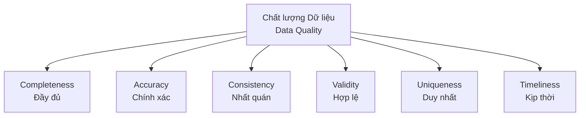

Khi sếp hoặc khách hàng yêu cầu: *"Hãy đảm bảo dữ liệu trong bảng Doanh thu có chất lượng tốt"*, bạn sẽ bắt đầu từ đâu? Định nghĩa thế nào là "tốt"? Với một lập trình viên, mơ hồ là kẻ thù số một. Đó là lý do tại sao chúng ta cần đến **Data Quality Dimensions (Các chiều chất lượng dữ liệu)**. Đây là hệ thống phân loại tiêu chuẩn giúp phân tách khái niệm trừu tượng "chất lượng dữ liệu" thành các thuộc tính có thể định lượng và đo lường bằng các con số cụ thể.

Theo tổ chức quản trị dữ liệu danh tiếng DAMA (Data Management Association), có 6 chiều chất lượng dữ liệu cốt lõi giúp bạn đánh giá sức khỏe của một tập dữ liệu.



## 6 Trụ cột đo lường chất lượng dữ liệu

### 1. Tính đầy đủ (Completeness)
Chiều này trả lời câu hỏi: *Dữ liệu có bị khuyết thiếu những trường thông tin quan trọng hay không?*
* **Ví dụ thực tế**: Bạn có một bảng danh sách khách hàng, nhưng có tới 30% số dòng bị trống cột số điện thoại hoặc email. Khi đó, tính đầy đủ của cột này chỉ đạt 70%.

### 2. Tính chính xác (Accuracy)
Dữ liệu có phản ánh đúng thực tế của đối tượng ngoài đời thật hay không?
* **Ví dụ thực tế**: Một khách hàng tên là "Nguyễn Văn A" nhưng hệ thống lại ghi nhận là "Nguyễn Văn C". Bản ghi này hoàn toàn đầy đủ (không NULL), định dạng hợp lệ, nhưng nó **không chính xác**. Việc đo lường tính chính xác thường rất khó vì máy tính không tự biết được thực tế đời thực nếu không có nguồn đối chiếu chuẩn.

### 3. Tính nhất quán (Consistency)
Thông tin khi xuất hiện ở nhiều nơi hoặc nhiều hệ thống khác nhau có trùng khớp với nhau không? Hoặc quan hệ logic giữa các cột có mâu thuẫn không?
* **Ví dụ thực tế**: Hệ thống nhân sự (HR) ghi nhận nhân viên A đã nghỉ việc từ tháng trước, nhưng hệ thống trả lương (Payroll) vẫn báo trạng thái là đang hoạt động và chuyển khoản đều đặn. Sự mâu thuẫn logic này chính là lỗi mất nhất quán dữ liệu.

### 4. Tính hợp lệ (Validity)
Dữ liệu có tuân thủ đúng định dạng, quy tắc nghiệp vụ, hoặc kiểu dữ liệu đã được định nghĩa sẵn không?
* **Ví dụ thực tế**: Cột `age` (tuổi) chứa giá trị âm (`-5`) hoặc chữ cái (`ABC`). Hay số điện thoại Việt Nam nhưng chỉ có 5 chữ số. Đó là những dữ liệu không hợp lệ.

### 5. Tính duy nhất (Uniqueness)
Mỗi thực thể ngoài đời thực (khách hàng, đơn hàng, sản phẩm) chỉ được đại diện bằng một bản ghi duy nhất trong cơ sở dữ liệu.
* **Ví dụ thực tế**: Một khách hàng đăng ký tài khoản hai lần bằng hai email khác nhau để săn mã giảm giá. Hệ thống ghi nhận đây là hai khách hàng độc lập, làm sai lệch chỉ số phân tích về số lượng khách hàng thực tế.

### 6. Tính kịp thời (Timeliness)
Dữ liệu có sẵn sàng đúng thời điểm người dùng cần để đưa ra quyết định hay không?
* **Ví dụ thực tế**: Báo cáo doanh thu cần phải có mặt lúc 8 giờ sáng để ban giám đốc họp giao ban. Dù dữ liệu chính xác 100% nhưng nếu pipeline chạy quá chậm và đến 11 giờ trưa mới ra kết quả, dữ liệu đó đã mất đi phần lớn giá trị.

---

## Tại sao chúng ta cần phân tách rõ các chiều này?

Người ta thường nói: *"Bạn không thể cải thiện những gì bạn không thể đo lường"*.

Nếu bạn không định nghĩa rõ ràng các chiều này, bạn sẽ không thể viết code để kiểm thử dữ liệu một cách tự động. Bằng cách chia nhỏ chất lượng dữ liệu thành các chiều cụ thể, Data Engineer có thể thiết lập các bài kiểm thử toán học rõ ràng và xây dựng bộ chỉ số KPI Chất lượng dữ liệu (Data Quality Scorecard) cho toàn hệ thống.

---

## Hiện thực hóa đo lường chất lượng bằng SQL và dbt

Trong thực tế, bạn có thể dễ dàng viết các câu lệnh SQL để đo lường các chiều chất lượng này:

* **Completeness** (Đếm số lượng bản ghi bị khuyết thiếu):
  ```sql
  SELECT count(*) FROM customers WHERE email IS NULL;
  ```
* **Validity** (Kiểm tra định dạng email bằng Regex):
  ```sql
  SELECT * FROM customers 
  WHERE NOT REGEXP_CONTAINS(email, r'^[a-zA-Z0-9_.+-]+@[a-zA-Z0-9-]+\.[a-zA-Z0-9-.]+$');
  ```
* **Uniqueness** (Tìm các ID bị trùng lặp):
  ```sql
  SELECT user_id, COUNT(*) FROM customers 
  GROUP BY user_id HAVING COUNT(*) > 1;
  ```
* **Timeliness** (Đo lường độ trễ cập nhật dữ liệu):
  ```sql
  SELECT MAX(updated_at) < CURRENT_TIMESTAMP() - INTERVAL '24' HOUR AS is_stale 
  FROM sales;
  ```

### Áp dụng dbt để tự động hóa việc kiểm thử

Nếu bạn đang sử dụng **[dbt](/concepts/transformation-analytics/dbt/) (Data Build Tool)** trong [Modern Data Stack](/concepts/system-architecture/modern-data-stack/), việc thiết lập các bài kiểm tra này trở nên cực kỳ tinh gọn thông qua file cấu hình YAML:

```yaml
version: 2

models:
  - name: dim_customers
    columns:
      - name: user_id
        tests:
          - not_null       # Đảm bảo Completeness (Tính đầy đủ)
          - unique         # Đảm bảo Uniqueness (Tính duy nhất)

      - name: age
        tests:
          - accepted_values: # Đảm bảo Validity (Tính hợp lệ)
              values: ['18-25', '26-35', '36-50', '50+']
              
      - name: email
        tests:
          - not_null       # Đảm bảo Completeness
          - dbt_expectations.expect_column_values_to_match_regex:
              regex: "^[a-zA-Z0-9_.+-]+@[a-zA-Z0-9-]+\\.[a-zA-Z0-9-.]+$" # Validity cho định dạng Email
```

---

## Kinh nghiệm thực tế và những cạm bẫy dễ vấp phải

### Điểm tựa vận hành (Best Practices)
* **Đo lường có chọn lọc**: Không phải cột nào cũng cần đo đủ 6 chiều. Ví dụ: cột `middle_name` (tên đệm) có thể trống thoải mái, nhưng cột `user_id` hay `email` đăng nhập thì bắt buộc phải đầy đủ và duy nhất.
* **Xây dựng Data Quality Scorecard**: Hãy hiển thị điểm số chất lượng của các bảng dữ liệu cốt lõi lên một dashboard tổng để toàn bộ công ty cùng theo dõi. Điều này tạo động lực cho các đội ngũ tạo dữ liệu (Data Producers) cải thiện chất lượng dữ liệu ngay từ nguồn.

### Cạm bẫy thường gặp (Common Mistakes)
* **Nhầm lẫn giữa Validity và Accuracy**: Đây là lỗi cực kỳ phổ biến. Một khách hàng nhập tuổi là `35` (hoàn toàn hợp lệ về mặt định dạng và nằm trong khoảng hợp lý từ 0-100), nhưng thực tế họ mới `20` tuổi. Các bài test tự động của Data Engineer đa phần chỉ phát hiện được lỗi Validity chứ khó phát hiện lỗi Accuracy.
* **Bỏ quên Timeliness**: Nhiều đội ngũ chỉ chăm chăm làm sạch dữ liệu mà quên mất thời gian bàn giao. Trong ngành tài chính hay chứng khoán, dữ liệu cập nhật chậm trễ 1 phút đôi khi cũng gây thiệt hại khôn lường.

### Cân nhắc đánh đổi (Trade-offs)
* **Chi phí tính toán vs. Giá trị mang lại**: Chạy các truy vấn gom nhóm, so khớp chéo để đo lường chất lượng dữ liệu trên hàng tỷ dòng sẽ ngốn rất nhiều tài nguyên và chi phí cloud. Đừng lạm dụng đo lường mọi thứ trên mọi bảng.
* **Accuracy rất đắt đỏ**: Để đo lường tính chính xác, bạn cần một nguồn dữ liệu tham chiếu chuẩn vàng (Golden Source) để đối soát. Hãy cân nhắc xem doanh nghiệp có thực sự cần đầu tư chi phí lớn cho việc này không, hay chỉ cần kiểm soát tốt tính hợp lệ (Validity) là đủ.
* **Không áp dụng cho dữ liệu phi cấu trúc**: 6 chiều chất lượng này hoạt động tốt nhất trên dữ liệu dạng bảng (tabular). Nếu bạn làm việc với hình ảnh, video hay âm thanh, các khái niệm như Uniqueness hay Validity kiểu truyền thống sẽ không còn phù hợp.

---

## Góc phỏng vấn

### 1. Sự khác biệt giữa Validity (Tính hợp lệ) và Accuracy (Tính chính xác) là gì? Tại sao Kỹ sư Dữ liệu thường chỉ tập trung vào Validity?
* **Gợi ý trả lời**: 
  * **Validity** kiểm tra xem dữ liệu có tuân thủ đúng định dạng và quy tắc nghiệp vụ định trước hay không (ví dụ: số điện thoại phải đủ 10 chữ số). Việc này có thể tự động hóa 100% bằng SQL hoặc Regex.
  * **Accuracy** kiểm tra xem dữ liệu đó có phản ánh đúng thực tế đời thực hay không (số điện thoại đó có thực sự thuộc về khách hàng đó hay không). Để đo Accuracy, ta cần đối soát chéo với bên thứ ba hoặc gọi điện xác nhận (rất tốn kém và khó tự động hóa). Do đó, ở góc độ kỹ thuật, DE thường tập trung đảm bảo Validity trước để giữ cho hệ thống chạy ổn định.

### 2. Làm thế nào để đo lường "Consistency" (Tính nhất quán) trong một Data Warehouse?
* **Gợi ý trả lời**: Tính nhất quán có thể đo ở mức nội bộ một bảng hoặc giữa nhiều bảng khác nhau. 
  * Ở mức liên bảng, ta thường sử dụng phép JOIN để đối soát chéo. Ví dụ: Tính tổng doanh thu ghi nhận trong bảng `Fact_Orders` (hệ thống bán hàng) và so sánh với tổng tiền thu được trong bảng `Fact_Invoices` (hệ thống kế toán). Nếu xuất hiện chênh lệch (Delta), chứng tỏ dữ liệu giữa hai hệ thống đang bị mất nhất quán.

---

## Khái niệm liên quan
* [Data Quality](/concepts/data-quality/data-quality/)
* [Data Testing](/concepts/data-quality/data-testing/)
* [Data Profiling](/concepts/data-quality/data-profiling/)

## Tài liệu tham khảo

1. [Collibra: The 6 Dimensions of Data Quality](https://www.collibra.com/us/en/blog/the-6-dimensions-of-data-quality) - Guide exploring DAMA-aligned dimensions of data quality and validation.
2. [Monte Carlo Data: What are Data Quality Dimensions?](https://www.getmontecarlo.com/blog/the-6-data-quality-dimensions-plus-1-you-cant-ignore/) - Detailed breakdown of the foundational dimensions with real-world technical implementation examples.
3. [DAMA International Official Site](https://www.dama.org/) - Official web page of the Data Management Association, authors of the DMBOK framework.
4. DAMA-DMBOK: Data Management Body of Knowledge - O'Reilly reference guide specifying standards for data quality dimensions.
5. [Great Expectations Official Documentation](https://docs.greatexpectations.io/) - Open-source validation library that automates testing for validity, completeness, and uniqueness.

## English Summary

**Data Quality Dimensions** are a standardized classification system used to objectively measure and evaluate the health of datasets. The core six dimensions defined by DAMA include Completeness (absence of missing values), Accuracy (reflection of real-world truth), Consistency (agreement across different data stores), Validity (conformity to defined formats and domains), Uniqueness (no duplicate representations of the same entity), and Timeliness (availability when needed). Understanding these dimensions allows Data Engineers to translate abstract "data health" goals into concrete, executable SQL tests.
