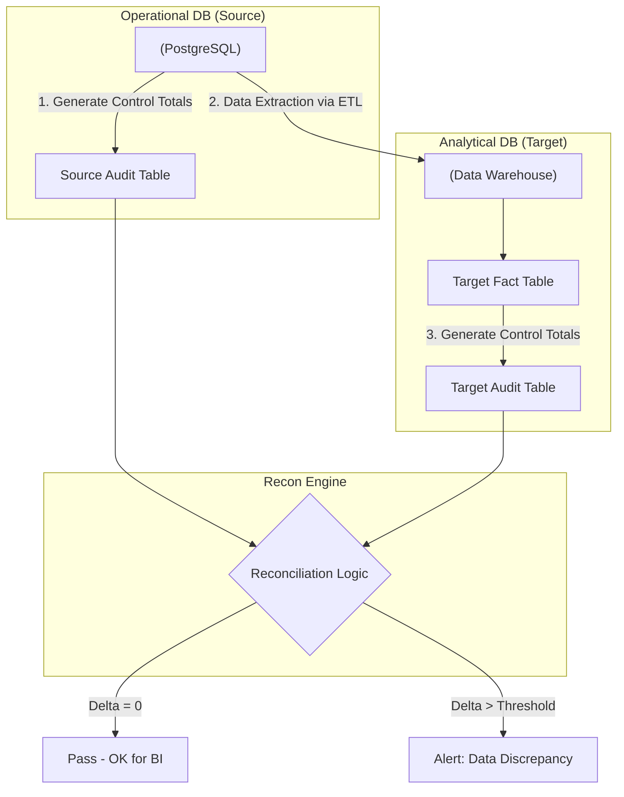

Hãy tưởng tượng bạn đang vận hành một đường ống dẫn dữ liệu (Data Pipeline) khổng lồ cho một ví điện tử hoặc một trang thương mại điện tử lớn. Sáng sớm thức dậy, bạn thấy hệ thống báo pipeline đã chạy thành công (Success) với một màu xanh mướt mát mắt. Nhưng khoan mừng vội! Liệu có dòng doanh thu nào bị "rơi rớt" trên đường truyền từ cơ sở dữ liệu bán hàng qua Data Lake rồi tới Data Warehouse không? Logic JOIN của bạn có vô tình làm nhân bản dữ liệu khiến doanh thu vọt lên gấp đôi?

Để trả lời những câu hỏi mang tính "sống còn" này, chúng ta cần đến **Data Reconciliation (Đối soát hay kiểm tra chéo dữ liệu)**.

## Bản chất của đối soát dữ liệu

Trong ngành kỹ thuật dữ liệu, **Reconciliation (Đối soát)** là kỹ thuật đối chiếu tự động các chỉ số đo lường hoặc giá trị dữ liệu giữa hai hệ thống: **Nguồn (Source)** và **Đích (Target)**.

Quy tắc bất biến của đối soát là: `Total(Source) = Total(Target)`

Nếu xuất hiện bất kỳ sai lệch nào (`Delta != 0`), hệ thống sẽ phát đi cảnh báo để chúng ta vào cuộc điều tra ngay lập tức. Quy trình này là bắt buộc trong các ngành nhạy cảm với tiền bạc như Tài chính, Ngân hàng, và Thương mại điện tử.

## Tại sao pipeline chạy thành công (Success) vẫn có thể là "cú lừa"?

Một pipeline báo "Success" chỉ có nghĩa là code của bạn chạy không bị crash và hệ thống không ném ra lỗi cú pháp. Nó không hề đảm bảo dữ liệu bên trong là chính xác. Có rất nhiều lỗi ngầm (Silent failures) có thể xảy ra:
* Công cụ CDC (Change Data Capture) hoặc Ingestion tool đọc dữ liệu từ Kafka bị rớt mạng trong vài mili-giây, làm lọt mất một số sự kiện (events). Pipeline vẫn chạy tiếp như chưa có chuyện gì xảy ra.
* Phép toán JOIN trong SQL bị lỗi "fan-out" (nhân bản dòng) do thiếu khóa chính hoặc quan hệ nhiều-nhiều chưa được xử lý, làm tổng tiền doanh thu nhân lên gấp nhiều lần.
* Lỗi múi giờ (Timezone mismatch) khiến một số hóa đơn của ngày hôm nay bị nhảy sang ngày hôm sau trên Data Warehouse.

Nếu chỉ kiểm tra cấu trúc bảng hay định dạng cột thì chưa đủ. Chúng ta cần đối soát để đảm bảo "Định luật bảo toàn vật chất": *Dữ liệu không tự nhiên sinh ra cũng không tự nhiên mất đi qua đường ống xử lý.*

## 3 Cấp độ đối soát từ dễ đến khó

Tùy vào mức độ quan trọng của dữ liệu và tài nguyên tính toán, bạn có thể áp dụng 3 cấp độ đối soát:

1. **Đối soát số dòng (Row-count Reconciliation)**: Đây là cách dễ nhất và nhanh nhất. Bạn chỉ cần đếm số dòng ở nguồn `COUNT(*)` trong ngày hôm qua và so sánh với số dòng ở đích.
2. **Đối soát giá trị tổng hợp (Metric / Value-based Reconciliation)**: Cấp độ này cực kỳ quan trọng đối với dữ liệu tài chính. Thay vì chỉ đếm dòng, bạn thực hiện tính tổng ví dụ `SUM(revenue)` ở nguồn và so sánh với tổng tiền trên báo cáo BI. Con số này phải khớp nhau đến từng đồng xu lẻ.
3. **Đối soát chi tiết từng dòng (Row-by-Row / Data Fingerprinting)**: Đây là cấp độ phức tạp và tốn kém nhất. Chúng ta dùng thuật toán băm (như MD5, SHA-256) gộp toàn bộ nội dung của dòng dữ liệu đầu nguồn thành một mã định danh (fingerprint). Sau khi đi qua pipeline, ta tính lại mã băm này ở đích và so khớp trực tiếp để phát hiện ra ngay cả những lỗi sai lệch ký tự nhỏ nhất.

## Quy trình đối soát tự động hóa hoạt động ra sao?

Kiến trúc đối soát chuẩn thường đi qua các bước sau:



1. **Tạo snapshot nguồn**: Tạo một bảng tổng hợp chỉ số nguồn (ví dụ: số giao dịch và tổng tiền trong ngày). Đây được gọi là *Source Control Total*.
2. **Xử lý ETL**: Đường ống dẫn dữ liệu chạy bình thường.
3. **Tạo snapshot đích**: Tính toán các chỉ số tương đương trên bảng đích cuối cùng thu được để tạo *Target Control Total*.
4. **Đối chiếu chéo (Cross-check)**: So sánh hai bảng Control Total để tính toán độ lệch (`Delta`).
5. **Cảnh báo vượt ngưỡng**: Thiết lập một ngưỡng dung sai cho phép (ví dụ: `0.01%` do lệch mili-giây múi giờ). Nếu độ lệch vượt quá ngưỡng này, hệ thống sẽ tự động gửi cảnh báo qua Slack hoặc PagerDuty.

---

## Một ví dụ thực tế: Đối soát doanh thu giao dịch hàng ngày

Hãy cùng xem một kịch bản đối soát thực tế cho một công ty tài chính.

**Bước 1: Tính toán trên CSDL nguồn (MySQL)**
```sql
-- Chạy lúc 00:00 AM ngày 08/06/2026 cho ngày hôm trước
SELECT 
    '2026-06-07' as date,
    COUNT(transaction_id) as src_count,
    SUM(amount) as src_amount
FROM transactions
WHERE DATE(created_at) = '2026-06-07';
-- Kết quả thu được: src_count = 10000, src_amount = 500000.50
```

**Bước 2: Tính toán trên Data Mart đích (BigQuery)** sau khi pipeline hoàn tất:
```sql
SELECT 
    '2026-06-07' as date,
    COUNT(tx_id) as tgt_count,
    SUM(final_revenue) as tgt_amount
FROM fact_daily_transactions
WHERE tx_date = '2026-06-07';
-- Kết quả thu được: tgt_count = 9998, tgt_amount = 499900.00
```

**Bước 3: Tổng hợp vào bảng Audit đối soát**
| Date | Delta_Count | Delta_Amount | Status |
|------|-------------|--------------|--------|
| 2026-06-07 | -2 | -100.50 | **FAIL** |

*Phân tích*: Hệ thống bị lệch mất 2 giao dịch với tổng số tiền là 100.50. Dựa vào đây, Data Engineer sẽ nhanh chóng khoanh vùng điều tra xem logic ETL đã bỏ sót hoặc lọc nhầm 2 bản ghi này ở bước nào.

---

## Kinh nghiệm thực chiến và Những cạm bẫy

### "Bí kíp" bỏ túi cho Data Engineer (Best Practices)
* **Đóng mốc thời gian (Watermarking/Batching)**: Dữ liệu nguồn liên tục được thêm mới. Nếu bạn đối soát mà không chốt một mốc thời gian cố định, số liệu nguồn và đích sẽ không bao giờ khớp. Hãy dùng cột `updated_at` hoặc Kafka offset để chia lô đối soát rõ ràng.
* **Lưu vết lịch sử đối soát (Audit Trail)**: Đừng chỉ print log ra màn hình rồi thôi. Hãy lưu toàn bộ lịch sử đối soát vào một bảng chuyên biệt. Đây sẽ là bằng chứng kiểm toán vô cùng giá trị để chứng minh tính toàn vẹn của dữ liệu qua thời gian.
* **Tích hợp vào Orchestrator**: Biến bước đối soát thành task cuối cùng trong luồng công việc (DAG) trên Apache Airflow. Nếu task đối soát thất bại, hãy chặn không cho gửi báo cáo hàng ngày đến ban giám đốc.

### Cạm bẫy thường gặp (Common Mistakes)
* **Không tính toán đến độ trễ (Latency Mismatch)**: Nguồn cập nhật liên tục (real-time) nhưng đích lại cập nhật theo giờ. Việc đối soát ngay lúc hệ thống đích chưa kịp cập nhật hết sẽ tạo ra các báo động giả (False Positives) liên tục, gây mệt mỏi cho đội ngũ vận hành.
* **Lạm dụng đối soát chi tiết (Row-by-Row)**: Chạy so khớp băm MD5 trên bảng có hàng tỷ dòng cực kỳ ngốn tài nguyên và tốn tiền cloud. Hãy chỉ dùng nó khi thực sự cần thiết (ví dụ: giao dịch ngân hàng cần chính xác tuyệt đối).
* **Bỏ quên việc xóa cứng (Hard Deletes)**: Khi nguồn xóa hẳn một dòng dữ liệu mà đích không đồng bộ được việc xóa này, phép đếm dòng (`COUNT`) sẽ bị lệch mà bạn rất khó tìm ra nguyên nhân nếu không có đối soát chi tiết.

### Điểm đánh đổi (Trade-offs)
* **Độ chính xác vs. Chi phí**: Đối soát càng chi tiết thì hệ thống càng chạy chậm và hóa đơn cloud càng tăng cao. Hãy lựa chọn cấp độ đối soát phù hợp với mức độ quan trọng của từng loại dữ liệu.
* **Thời gian bàn giao dữ liệu**: Các bước đối soát chéo sẽ tốn thêm thời gian xử lý, làm tăng độ trễ (Latency) của dữ liệu trước khi đến tay người dùng cuối.

---

## Góc phỏng vấn

### 1. Kỹ thuật "Data Hashing/Fingerprinting" ứng dụng như thế nào trong Data Reconciliation?
* **Gợi ý trả lời**: Data Hashing được dùng để đối soát chi tiết dòng-sang-dòng trên các bảng lớn. Thay vì phải so sánh từng cột một cách thủ công (rất chậm và tốn tài nguyên), chúng ta dùng thuật toán băm (như MD5) để gộp toàn bộ các cột của một dòng dữ liệu thành một chuỗi mã duy nhất ở cả nguồn và đích: `MD5(CONCAT(colA, colB, colC))`. Khi đối soát, ta chỉ cần JOIN hai bảng dựa trên cột mã băm này. Dòng nào có mã băm lệch hoặc không tìm thấy ở đích tức là dòng đó đã bị biến đổi sai lệch hoặc bị mất trong quá trình truyền tải.

### 2. Bạn gặp vấn đề "False Positives" (Cảnh báo sai) liên tục vì dữ liệu nguồn liên tục thay đổi trong lúc bạn đang đối soát. Cách giải quyết của bạn là gì?
* **Gợi ý trả lời**: Đây là bài toán đụng độ thời gian (Race condition) điển hình. Để giải quyết, chúng ta tuyệt đối không đối soát dữ liệu trên một mục tiêu di động. Chúng ta phải áp dụng kỹ thuật **Watermarking** (đóng mốc thời gian cố định). Ví dụ: Khi chạy đối soát vào lúc 2h sáng, ta chỉ lấy dữ liệu có mốc thời gian trước 00:00:00 ngày hôm đó (`WHERE event_time < '00:00:00'`). Bằng cách này, mọi giao dịch phát sinh sau đó sẽ được đẩy sang lô đối soát của ngày tiếp theo, giúp số liệu đối chiếu luôn cố định và chuẩn xác.

---

## Khái niệm liên quan
* [Data Testing](/concepts/data-quality/data-testing/)
* [Data Quality](/concepts/data-quality/data-quality/)

## Tài liệu tham khảo

1. [Netflix Tech Blog: Netflix Billing Migration to AWS — Part II](https://netflixtechblog.com/netflix-billing-migration-to-aws-part-ii-834f6358126) - Case study detailing datastore migration and financial reconciliation strategies under high consistency constraints.
2. [Stripe: Reconciliation Documentation](https://stripe.com/docs/reconciliation) - Official Stripe documentation on automated transaction matching and payout audit loops.
3. Monte Carlo Data: What is Data Reconciliation? - Practical guide on why and how to build automated cross-system data checks in the modern data stack.
4. Datafold: Reconciling Databases and Warehouses - Technical engineering post explaining row-by-row data reconciliation using data diffing tools.
5. [O'Reilly: Fundamentals of Data Engineering](https://www.oreilly.com/library/view/fundamentals-of-data/9781098108298/) - Chapter on data verification, auditing, and reconciliation patterns across end-to-end pipelines.

## English Summary

**Data Reconciliation** is the automated auditing process of comparing datasets between a Source system and a Target Data Warehouse to ensure zero data loss, duplication, or corruption during the ETL/ELT transit. Through techniques like row-count checks, metric/value aggregations (e.g., verifying `SUM(revenue)` matches), and data hashing/fingerprinting for row-by-row accuracy, it proves the integrity of financial and operational reporting. Establishing solid reconciliation pipelines prevents silent failures and serves as the ultimate audit trail for data accuracy.
