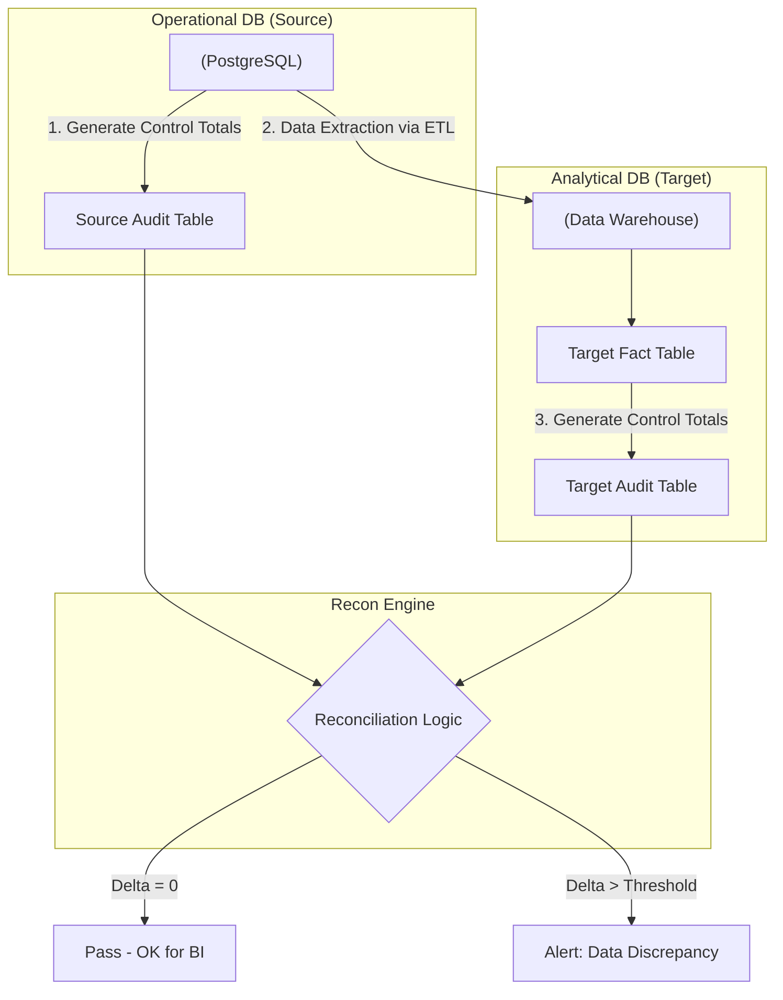

# Đối soát dữ liệu - Data Reconciliation

## Summary

Data Reconciliation (Đối soát/Kiểm tra chéo dữ liệu) là quy trình so sánh và xác minh tự động tính đồng nhất của dữ liệu khi nó di chuyển từ một hệ thống này sang hệ thống khác (ví dụ: từ CSDL OLTP nguồn qua Data Lake, tới Data Warehouse). Mục tiêu của đối soát là đảm bảo không có bất kỳ một dòng dữ liệu, hay một đồng doanh thu nào bị rơi rớt (Data loss), biến dạng hoặc tính toán sai trong suốt hành trình phức tạp của đường ống (Data Pipeline).

---

## Definition

Trong ngành dữ liệu, **Reconciliation** là kỹ thuật toán học và hệ thống đối chiếu số lượng hoặc giá trị giữa **Nguồn (Source)** và **Đích (Target)**.
Quy tắc cốt lõi: `Total(Source) = Total(Target)`. 
Nếu `Total(Target) - Total(Source) != 0`, tức là có một sự sai lệch (Delta) cần phải điều tra. Quá trình này đặc biệt mang tính bắt buộc trong ngành Tài chính, Ngân hàng, và E-commerce nơi dữ liệu liên quan trực tiếp đến tiền bạc.

---

## Why it exists

Pipeline dữ liệu (ETL/ELT) rất phức tạp và hay "rỉ sét". Một pipeline có thể báo "Chạy thành công (Success)" màu xanh nhưng dữ liệu bên trong vẫn sai.
* Ingestion tool đọc dữ liệu từ Kafka nhưng bị rớt mạng, lọt mất 5 event. Pipeline vẫn chạy tiếp.
* Logic biến đổi (SQL JOIN) bị nhân bản dữ liệu (Fan-out) do thiếu khóa chính, làm tổng tiền doanh thu nhân lên gấp đôi.
* Khách hàng đổi múi giờ, hàm chuyển đổi Timezone chạy sai ngày làm hóa đơn nhảy sang tháng khác.

Nếu chỉ dùng Data Testing để kiểm tra cấu trúc bảng là không đủ. Ta cần Data Reconciliation để đảm bảo luật bảo toàn vật chất: "Dữ liệu không tự nhiên sinh ra cũng không tự nhiên mất đi, chúng phải được bảo toàn khi đi qua pipeline".

---

## Core idea

Có 3 cấp độ đối soát dữ liệu cơ bản:

1. **Row-count Reconciliation (Đối soát số dòng)**
   * Dễ làm nhất, nhanh nhất.
   * `COUNT(*)` số dòng của bảng Nguồn trong ngày X, đem so với `COUNT(*)` số dòng ở bảng Đích trong ngày X.

2. **Metric / Value-based Reconciliation (Đối soát giá trị tổng hợp)**
   * Rất quan trọng. 
   * Tính `SUM(revenue)` ở hệ thống CRM, so sánh với `SUM(revenue)` ở bảng báo cáo BI. Đảm bảo tổng tiền khớp đến từng xu (Cent).

3. **Row-by-Row / Data Fingerprinting (Đối soát mức độ dòng/cột)**
   * Đắt đỏ và phức tạp nhất.
   * Dùng hàm Băm (Hash) gộp toàn bộ nội dung của dòng dữ liệu đầu nguồn thành 1 chuỗi mã (ví dụ: `MD5(col1+col2)`). Sau khi xử lý ETL, tính lại mã MD5 và so khớp từng dòng một giữa nguồn và đích để bắt ngay cả những lỗi sai chính tả nhỏ nhất.

---

## How it works

Quy trình tự động hóa đối soát trong Data Engineering:

1. **Chụp nhanh (Snapshotting)**: Hệ thống tạo ra một báo cáo tổng hợp (Aggregated snapshot) của dữ liệu nguồn (Ví dụ: `SELECT date, COUNT(id), SUM(amount) FROM raw_db GROUP BY date`). Bảng này gọi là *Source Control Total*.
2. **Xử lý ETL**: Chạy các thao tác làm sạch, biến đổi vào Data Warehouse.
3. **Tính toán đích**: Tính toán các chỉ số tương đương trên Data Mart cuối cùng. Lấy *Target Control Total*.
4. **Đối chiếu chéo (Cross-check)**: Một đoạn script so sánh 2 bảng Control Total, tính ra `Variance (Delta)`. 
5. **Cảnh báo ngưỡng (Threshold Alert)**: Đôi khi các hệ thống lệch nhau vài chục mili-giây dẫn đến chênh lệch 1-2 dòng trong một ngày do chênh lệch múi giờ. Có thể thiết lập ngưỡng `Tolerance = 0.01%`. Nếu Delta vượt ngưỡng này, chuông báo động (PagerDuty/Slack) sẽ reo lên.

---

## Architecture / Flow



---

## Practical example

Một công ty tài chính đối soát giao dịch hàng ngày.

**Bước 1: Tính bên Nguồn (MySQL Database)**
```sql
-- Chạy lúc 00:00AM ngày 08/06/2026
SELECT 
    '2026-06-07' as date,
    COUNT(transaction_id) as src_count,
    SUM(amount) as src_amount
FROM transactions
WHERE DATE(created_at) = '2026-06-07';
-- Kết quả: src_count = 10000, src_amount = 500000.50
```

**Bước 2: Tính bên Đích (BigQuery Data Mart)** sau quá trình ETL:
```sql
SELECT 
    '2026-06-07' as date,
    COUNT(tx_id) as tgt_count,
    SUM(final_revenue) as tgt_amount
FROM fact_daily_transactions
WHERE tx_date = '2026-06-07';
-- Kết quả: tgt_count = 9998, tgt_amount = 499900.00
```

**Bước 3: Bảng Reconciliation Audit**
| Date | Delta_Count | Delta_Amount | Status |
|------|-------------|--------------|--------|
| 2026-06-07 | -2 | -100.50 | **FAIL** |

*Nguyên nhân*: Pipeline bị lỗi, lọc sót 2 giao dịch có giá trị 100.50. Data Engineer phải điều tra xem đoạn `WHERE` nào trong mã dbt đã vô tình vứt bỏ 2 giao dịch này.

---

## Best practices

* **Đóng gói dữ liệu đối soát (Watermarking/Batching)**: Dữ liệu OLTP thay đổi liên tục, nếu bạn đối soát mà không neo một mốc thời gian cố định (point-in-time) thì hai con số sẽ không bao giờ khớp. Hãy dùng cột `updated_at` hoặc Kafka offset để chia lô đối soát.
* **Theo dõi lịch sử đối soát**: Đừng chỉ in ra màn hình. Hãy lưu kết quả Recon (Delta_Count, Delta_Amount) vào một bảng `recon_history`. Nó làm bằng chứng kiểm toán (Audit Trail) cho ban kiểm soát rằng dữ liệu luôn toàn vẹn qua các năm.
* **Nhúng vào Orchestration**: Dùng Apache Airflow, đặt bước `Recon_Check` làm task cuối cùng của DAG. Nếu task này rớt, chặn không gửi Email báo cáo sáng cho sếp.

---

## Common mistakes

* **Quên tính toán độ trễ (Latency Mismatch)**: Nguồn cập nhật thời gian thực, nhưng kho dữ liệu cập nhật theo lô 1 giờ/lần. Bạn đi đối soát lúc 10h15 sáng, chắc chắn số ở đích sẽ thấp hơn nguồn (vì thiếu 15 phút). Dẫn đến False Positive (báo động giả) liên tục.
* **Đối soát 100% dòng dữ liệu mỗi ngày**: Chạy Hash MD5 trên bảng tỷ dòng rất ngốn RAM và tiền. Trừ khi là hệ thống giao dịch ngân hàng lỗi 1 xu cũng bị đi tù, còn lại chỉ nên dùng Row-count và Metric-based Recon cho tiết kiệm.
* **Bỏ sót dữ liệu bị Xóa (Hard Deletes)**: Ở nguồn người ta xóa cứng dòng dữ liệu, ở đích không cập nhật được. Khi đối soát theo COUNT thì bị lệch và loay hoay không tìm ra lý do.

---

## Trade-offs

### Ưu điểm
* Là bằng chứng tuyệt đối cho tính đúng đắn của dữ liệu tài chính (Auditable).
* Khẳng định niềm tin 100% giữa đội Data và đội Vận hành Kế toán.

### Nhược điểm
* **Rất khó cấu hình đồng bộ thời gian (Sync timing)**: Việc chụp ảnh (snapshot) cả 2 hệ thống ở cùng 1 phần nghìn giây là bài toán cực kỳ hóc búa ở hệ thống phân tán.
* Gấp đôi lượng truy vấn lên cơ sở dữ liệu để tính toán bảng tổng hợp.

---

## When to use

* Đối với các lĩnh vực: Ngân hàng (Banking), Ví điện tử (Fintech), Thương mại điện tử, Dữ liệu quảng cáo (Ads Billing).
* Đối chiếu khi di chuyển (Migration) trung tâm dữ liệu cũ sang Cloud mới. Bạn cần chứng minh 2 hệ thống có data khớp nhau 100% trước khi tắt hệ thống cũ.

## When not to use

* Dữ liệu dạng Clickstream, Web Analytics (Google Analytics logs). Mất vài trăm click không làm ảnh hưởng đến quyết định kinh doanh vĩ mô, không đáng để xây dựng hệ thống đối soát phức tạp.

---

## Related concepts

* [Data Testing](/concepts/data-testing)
* [Data Quality](/concepts/data-quality)
* ETL vs ELT

---

## Interview questions

### 1. Kỹ thuật "Data Hashing/Fingerprinting" ứng dụng như thế nào trong Data Reconciliation?
* **Người phỏng vấn muốn kiểm tra**: Kiến thức sâu về đối soát dòng-sang-dòng (Row-by-row reconciliation) cho các bài toán cực kỳ khắt khe.
* **Gợi ý trả lời (Strong Answer)**: Data Hashing là dùng thuật toán băm (VD: MD5, SHA-256) nối tất cả các cột của một dòng thành một chuỗi duy nhất: `MD5(CONCAT(colA, colB, colC))`. Ta tạo cột hash này ở nguồn và ở đích. Khi đối soát, thay vì join hàng chục cột với nhau (rất chậm), ta chỉ cần `JOIN ON source.hash = target.hash`. Những bản ghi nào ở nguồn không có hash khớp ở đích tức là dòng dữ liệu đó đã bị thay đổi sai lệch (Data corruption) hoặc bị rớt trong quá trình truyền tải.

### 2. Bạn gặp vấn đề "False Positives" (Cảnh báo sai) liên tục vì dữ liệu nguồn OLTP liên tục thay đổi (Late-arriving data) trong lúc bạn đang đối soát. Cách giải quyết?
* **Người phỏng vấn muốn kiểm tra**: Kinh nghiệm xử lý kiến trúc dữ liệu thực tế (Race conditions).
* **Gợi ý trả lời (Strong Answer)**: Để tránh tình trạng nguồn "đang chạy" (moving target), ta không đối soát thời gian thực. Thay vào đó ta áp dụng **Watermarking** (đóng mốc). Ví dụ: Lúc 2h sáng, ta trích xuất và đối soát dữ liệu với điều kiện `WHERE event_time < '00:00:00'`. Mọi giao dịch đến trễ sau 0h sẽ không được tính vào lô đối soát của ngày hôm qua mà sẽ đẩy sang lô ngày hôm nay. Bằng cách khóa "chặn trên" thời gian, ta có một bộ số cố định để so sánh an toàn.

---

## References

1. **Fundamentals of Data Engineering** - Joe Reis (Chương đề cập đến Auditing & Validation).
2. **"Data Reconciliation in FinTech"** - Bài viết chuyên môn về cách các kỳ lân Fintech xử lý đối soát tiền tỷ (Uber/Stripe tech blogs).

---

## English summary

Data Reconciliation is the automated auditing process of comparing datasets between a Source system and a Target Data Warehouse to ensure zero data loss, duplication, or corruption during the ETL/ELT transit. Through techniques like row-count checks, metric/value aggregations (e.g., verifying `SUM(revenue)` matches), and data hashing/fingerprinting for row-by-row accuracy, it proves the integrity of financial and operational reporting. Establishing solid reconciliation pipelines prevents silent failures and serves as the ultimate audit trail for data accuracy.
