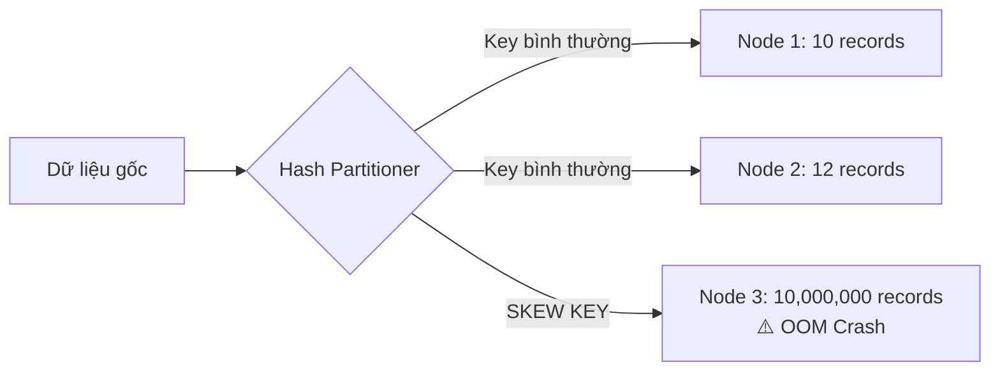

# Lệch dữ liệu - Data Skew

## Summary

Data Skew (Lệch dữ liệu) là hiện tượng dữ liệu không được phân phối đồng đều giữa các node xử lý (partitions) trong một hệ thống phân tán. Nó dẫn đến tình trạng một vài CPU core phải xử lý 99% lượng dữ liệu, trong khi các CPU core khác đã chạy xong và "ngồi chơi", biến toàn bộ quá trình xử lý song song thành xử lý tuần tự chậm chạp. Data Skew là nguyên nhân hàng đầu gây ra hiện tượng sập hệ thống do hết bộ nhớ (Out Of Memory) trong các Data Pipeline lớn.

---

## Definition

Trong lý thuyết cơ sở dữ liệu phân tán, **Data Skew** xảy ra khi khóa chia dữ liệu (Partition Key / Join Key) có phân phối xác suất không đồng đều (như phân phối Zipfian thay vì phân phối chuẩn hay đều). 



Khi tiến hành gom nhóm (`GROUP BY`) hoặc kết nối (`JOIN`) sử dụng khóa đó làm định tuyến, hàng triệu bản ghi mang cùng một giá trị Khóa sẽ bị hệ thống băm (Hash) và đẩy dồn về duy nhất **MỘT** phân vùng (Partition), được giao cho một Executor cụ thể.

Do tài nguyên RAM và CPU trên máy Executor đó là có hạn, việc nhận cục dữ liệu khổng lồ sẽ gây ra độ trễ cực lớn hoặc làm Crash tiến trình do OOM (Out Of Memory).

---

## Why it exists

Thế giới thực có tính chất tập trung cao độ (Pareto 80/20). Dữ liệu tự nhiên sinh ra vốn dĩ luôn bị Skew. Ví dụ:
* **Luật rỗng (NULL values)**: Bảng dữ liệu có 30% trường `customer_id` bị để trống (NULL hoặc mảng rỗng ""). Tất cả các trường NULL này khi Join sẽ bị đẩy về cùng một máy chủ.
* **Người dùng khổng lồ**: Trong hệ thống mạng xã hội, tài khoản của một người nổi tiếng (Cristiano Ronaldo) có hàng trăm triệu Followers. Nếu Join bảng Like theo User ID, máy tính phụ trách tính toán cho ID của Ronaldo sẽ sập, trong khi máy phụ trách ID của bạn (với 100 followers) tính xong trong 1 phần nghìn giây.
* **Quốc gia/Khu vực**: Dữ liệu dân số, doanh số của New York sẽ bóp nghẹt 1 máy chủ so với dữ liệu của 1 bang nhỏ nhặt như Wyoming.

---

## How it works (Cách nhận biết)

1. **Quan sát Spark Web UI**: Mở tab `Stages`, chọn Stage đang chạy rất lâu (hoặc vừa Failed). Kéo xuống danh sách các **Tasks**. 
2. **Quan sát thời gian (Duration)**: Nếu thấy Min/Median task time là 2 giây, nhưng Max task time là 40 phút (vẫn chưa chạy xong) hoặc biểu tượng vạch tiến trình (Timeline) có 199 vạch ngắn và 1 vạch dài bất tận.
3. **Quan sát lượng dữ liệu Shuffle (Shuffle Read Size)**: Các task thông thường chỉ đọc vài MB, nhưng Task bị kẹt đang phải xử lý hàng chục Gigabytes.

Đây là triệu chứng chắc chắn 100% hệ thống đã dính Skew. Spark sẽ báo lỗi ngắt kết nối do "GC Overhead limit exceeded" (Garbage Collection nghẽn) hay "FetchFailedException".

---

## Practical example & Solutions

**Vấn đề**: Bạn có một bảng hóa đơn (`sales`) 10 Tỷ dòng muốn JOIN với bảng khách hàng (`customers`) dựa trên trường `city`. Nhưng 80% khách hàng sống ở `"Ho Chi Minh"`. 

```python
# Lệnh gây ra SKEW
result_df = sales_df.join(customers_df, "city", "inner")
```

**Các Kỹ thuật xử lý (Mitigation Techniques):**

### 1. Lọc bỏ nhiễu và khóa NULL (Filter Nulls)
Nếu các trường NULL không đóng góp vào kết quả Join của bạn (Inner Join), việc để chúng tham gia sẽ dồn toàn bộ NULL vào 1 máy. Hãy lọc trước!
```python
sales_valid = sales_df.filter(col("city").isNotNull())
```

### 2. Kỹ thuật Broadcast Join (Tuyệt chiêu tốt nhất)
Nếu bảng `customers_df` đủ nhỏ để nhét vừa vào bộ nhớ của 1 máy (ví dụ nhỏ hơn 1GB ở cấu hình cụm lớn, mặc định là 10MB), hãy bắt Spark copy toàn bộ bảng `customers_df` sang tất cả các máy (Broadcast). Không cần dùng Hash để chia lại dữ liệu `sales_df` nữa -> Không bị Skew.
```python
from pyspark.sql.functions import broadcast

result_df = sales_df.join(broadcast(customers_df), "city")
```

### 3. Kỹ thuật Ướp muối (Salting / Key Salting)
Đây là kỹ thuật tinh vi nhất nếu CẢ HAI bảng đều quá lớn không thể Broadcast. Mục tiêu là bẻ nhỏ cục Skew ("Ho Chi Minh") thành nhiều cục nhỏ bằng cách đính kèm thêm một số ngẫu nhiên.
* **Bảng Sales**: Thêm 1 cột Salt chứa một số nguyên ngẫu nhiên từ 0 đến N (ví dụ N = 10). Dữ liệu "Ho Chi Minh" giờ trở thành `Ho Chi Minh_0, Ho Chi Minh_1...` sẽ rải đều sang 10 máy.
* **Bảng Customers**: Nhân bản mỗi dòng thành 10 dòng (Explode), tương ứng với suffix từ 0 đến 10.
* Thực hiện Join trên cột `city_salt` mới. Kết quả sẽ hoàn hảo nhờ dữ liệu khổng lồ đã bị xé lẻ, chạy song song tuyệt vời.

```python
# Ví dụ logic Salting
import pyspark.sql.functions as F

# Sales: Thêm số ngẫu nhiên từ 0-4
sales_salted = sales_df.withColumn("salt", F.floor(F.rand() * 5))

# Customers: Dùng mảng [0,1,2,3,4] rồi Explode nhân bản dòng lên 5 lần
cust_salted = customers_df.withColumn("salt", F.explode(F.array([F.lit(i) for i in range(5)])))

# Tiến hành JOIN theo cả 2 khóa
result_df = sales_salted.join(cust_salted, ["city", "salt"]).drop("salt")
```

---

## Best practices

* **Kiểm tra dữ liệu phân tích mảng (Profiling)**: Trước khi làm đường ống, hãy chạy `df.groupBy("join_key").count().orderBy(desc("count"))` để biết ngay đâu là các Key quái vật.
* **Nâng cấp phiên bản Spark**: Kể từ Apache Spark 3.0+, tính năng **AQE (Adaptive Query Execution)** được kích hoạt mặc định. Nó có một bộ phận gọi là `Optimize Skewed Join`. Spark khi đang chạy (run-time) nếu phát hiện Task nào nhận dữ liệu to bất thường, nó tự động lấy kéo bẻ vụn Task đó ra làm nhiều Task nhỏ (Auto Salting). Điều này cứu vớt 90% lỗi Skew cho người dùng cơ bản.

---

## Common mistakes

* **Mù quáng tăng RAM hoặc Executor**: Khi dính Skew, có tăng lên 1000 CPU cũng vô nghĩa vì toàn bộ dữ liệu chỉ vào đúng 1 CPU. Việc tăng RAM quá lớn cho Executor khiến trình dọn rác (GC) của Java chạy mất vài phút làm treo cụm. Chữa bệnh phải đúng bệnh (Salting).
* **Tăng số lượng Shuffle Partitions**: Người ta hay đổi `spark.sql.shuffle.partitions` từ 200 lên 2000 với hy vọng máy tính bẻ nhỏ dữ liệu. Nhưng Hàm Băm (Hash) vẫn sẽ ném các Key giống hệt nhau vào cùng chung 1 lỗ. Hạt vừng nhỏ đi nhưng Khối đá tảng Skew vẫn không bị xé đôi.

---

## Trade-offs

### Nhược điểm của kỹ thuật Salting
* Làm mã nguồn (Code) phức tạp, rối rắm, rất khó để đọc hiểu đối với Data Analyst bình thường.
* Việc nhân bản bảng thứ hai (Explode array) làm tăng kích thước bảng này lên N lần, tiêu thụ I/O disk lớn hơn một chút. Chỉ nên dùng hệ số Salt (N) vừa đủ (thường 10-50), không nên quá lớn.

---

## When to use

Khi ứng dụng pipeline của bạn gặp lỗi Timeout hoặc OOM tại giai đoạn Join / GroupBy mặc dù tổng dữ liệu rất bé so với tài nguyên cấu hình. Đặc biệt thường gặp ở các dữ liệu Transactional gắn với NULL user hoặc Guest user.

---

## Related concepts

* [Shuffle](/concepts/shuffle)
* [Spark Joins](/concepts/spark-joins)
* [Adaptive Query Execution (AQE)](#)

---

## Interview questions

### 1. Bạn xử lý như thế nào nếu một Data Pipeline chạy bị treo và nghi ngờ do Data Skew?
* **Người phỏng vấn muốn kiểm tra**: Kỹ năng phân tích nguyên nhân lỗi (Troubleshooting) và xử lý sự cố nâng cao.
* **Gợi ý trả lời**: 
  - *Bước 1 (Nhận diện)*: Vào Spark Web UI > Stages, xem thời gian thực thi của các Task. Nếu thấy 199 Task chạy mất 10s, duy nhất 1 Task mất 2 giờ và báo OOM, đó là Skew.
  - *Bước 2 (Gỡ gỡ)*: Xác định loại dữ liệu ở phép JOIN. Kiểm tra xem có chứa nhiều NULLs hay chuỗi rỗng không? Nếu có, `filter()` bỏ đi.
  - *Bước 3 (Giải pháp)*: Nếu đó không phải NULL mà là Key nghiệp vụ khổng lồ (ví dụ Thành phố Hà Nội), đánh giá xem bảng cần Join có nhỏ không. Nếu nhỏ, dùng `broadcast()`.
  - *Bước 4 (Tuyệt chiêu)*: Nếu cả 2 bảng đều to (Big x Big Join), tôi sẽ sử dụng kỹ thuật Key Salting, thêm một cột số ngẫu nhiên vào bảng to và explode bảng kia ra để phá nát khối lượng Key khổng lồ này, ép hệ thống luân chuyển đều tải cho các Core.

### 2. Tính năng AQE (Adaptive Query Execution) của Spark 3 có giải quyết triệt để Data Skew chưa?
* **Gợi ý trả lời**: AQE có cơ chế tối ưu Skew Join rất mạnh mẽ, nó bắt kích thước các khối dữ liệu lúc run-time và tự động chia cắt các Partition bị Skew. Tuy nhiên, nó không giải quyết được **Skew GroupBy** hoặc Aggregations. Đối với các thuật toán Window Function hay tự code logic phức tạp, kỹ sư vẫn phải can thiệp thủ công thông qua Salting.

---

## References

* **Spark: The Definitive Guide** - Bill Chambers, Matei Zaharia (Tham chiếu về Data Skew).
* Tài liệu Databricks về AQE (Adaptive Query Execution) và Skew Join.

---

## English summary

Data Skew is a critical performance bottleneck in distributed computing where an uneven distribution of partition keys causes one or a few nodes to process a vastly disproportionate volume of data (often leading to Out-Of-Memory errors). It sabotages cluster parallelism. Mitigation strategies include identifying the "hot tasks" via the Spark UI, filtering out irrelevant null/default values, leveraging Broadcast Joins for asymmetric datasets, and implementing Key Salting (adding random suffixes and exploding the lookup table) to manually fracture and distribute massive key payloads evenly across the cluster. Modern Spark (3.0+) partially automates this via Adaptive Query Execution (AQE).
