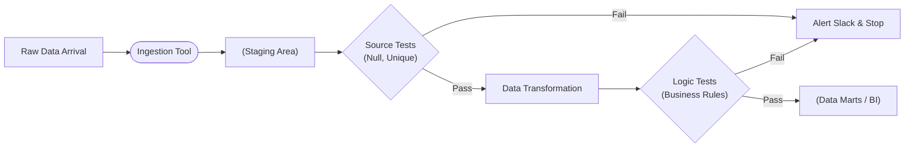

# Kiểm thử dữ liệu động - Data Testing

## Summary

Data Testing là quá trình lập trình các xác nhận tự động (automated assertions) chạy lặp đi lặp lại bên trong đường ống dữ liệu (Data Pipeline) để xác minh xem dữ liệu luân chuyển có đáp ứng đúng các kỳ vọng chất lượng (như cấu trúc, định dạng, logic kinh doanh) hay không. Khác với Software Testing (kiểm tra code có chạy đúng hay không), Data Testing kiểm tra trạng thái linh động của chính luồng dữ liệu (data payload) thay đổi mỗi ngày. 

---

## Definition

**Data Testing** là một phương pháp phòng thủ kỹ thuật nhằm tự động hóa việc rà soát lỗi dữ liệu. Trong phát triển phần mềm, một hàm cộng `add(1, 2)` sẽ luôn ra `3`. Bạn viết Unit Test một lần là yên tâm. Nhưng trong kỹ thuật dữ liệu, code ETL của bạn không đổi, nhưng hôm nay API đối tác gửi trả chữ thay vì số, gây sập pipeline. 

Data Testing được thực thi bằng cách viết mã (SQL hoặc Python) sinh ra các quy tắc kiểm tra (Tests/Expectations) và thiết lập chúng chạy như một bước (Step) nằm chắn giữa (Gatekeeper) luồng thực thi ETL/ELT.

---

## Why it exists

"Lỗi dữ liệu là điều chắc chắn sẽ xảy ra, vấn đề chỉ là khi nào". 
Nếu không có Data Testing:
* Dữ liệu hỏng (như rớt giá trị ngoại tệ làm doanh thu bị nhân lên 100 lần) sẽ "bơi" trót lọt qua pipeline và hiển thị chễm chệ trên màn hình của CEO vào buổi sáng.
* Khi CEO phát hiện lỗi, niềm tin vào đội Data giảm sút.
* Đội ngũ mất nhiều ngày để truy ngược ngược luồng dữ liệu (Data Lineage) xem lỗi bắt nguồn từ bảng nào.

Data Testing tồn tại để bắt lỗi (Catch errors) vào đúng thời điểm nó xuất hiện, cô lập chúng và cảnh báo (Alert) cho Kỹ sư trước khi chúng gây hại (Nguyên lý "Fail-fast").

---

## Core idea

Ý tưởng của Data Testing là so sánh trạng thái **Thực tế (Actual state)** của dữ liệu với trạng thái **Kỳ vọng (Expected state)**.

Các cấp độ kiểm thử dữ liệu (Test Pyramid in Data):
1. **Schema Testing**: Cấu trúc có thay đổi không? Bảng có bị rớt cột nào không? Kiểu dữ liệu cột Date có bị biến thành String không?
2. **Generic/Format Testing**: Cột có bị NULL không? Email có đúng định dạng regex không? Khóa ngoại có khớp không? (Các chiều Validity, Completeness).
3. **Business Logic Testing**: Trạng thái "Đã hủy" thì số tiền thanh toán phải bằng 0. Tổng số tiền các dòng chi tiết phải bằng tổng hóa đơn. (Sự nhất quán).
4. **Volume/Anomaly Testing**: Lượng đơn hàng hôm qua tải về là 10.000, sao hôm nay tải về có 5 đơn? (Bất thường về dung lượng).

---

## How it works

Quy trình hoạt động trong một đường ống dữ liệu CI/CD chuẩn:

1. Dữ liệu thô (Raw Data) được Ingestion tool (Fivetran/Airbyte) hút về.
2. **Source Testing (Kiểm thử ngay cửa ngõ)**: Chạy test kiểm tra schema, nếu sai cấu trúc dừng ngay lập tức.
3. Chạy các tiến trình Transformation (dbt/Spark) để làm sạch và nối bảng.
4. **Transformation Testing (Kiểm thử tại lõi)**: Các test logic kinh doanh phức tạp (SQL) chạy trên các bảng vừa xử lý.
5. Nếu bất kỳ bài Test nào rớt, pipeline sẽ thông báo (Slack/Email) kèm log chi tiết dòng nào bị vi phạm, và **ngừng** bước tải dữ liệu lên các bảng phục vụ Dashboard.

---

## Architecture / Flow



---

## Practical example

Một công cụ nổi bật để định nghĩa Data Testing bằng Python là **Great Expectations (GX)**. Nó cho phép diễn đạt bài test dưới dạng một "Kỳ vọng" bằng ngôn ngữ con người đọc được.

```python
import great_expectations as ge

# Nạp dữ liệu vừa xử lý
df = ge.read_csv("daily_sales_2026_06_07.csv")

# Viết kỳ vọng (Test)
# Kỳ vọng 1: Cột order_id phải duy nhất
df.expect_column_values_to_be_unique("order_id")

# Kỳ vọng 2: Doanh thu không được âm
df.expect_column_values_to_be_between("revenue", min_value=0, max_value=None)

# Kỳ vọng 3: Danh mục chỉ được nằm trong 3 loại
df.expect_column_values_to_be_in_set(
    "category", ["Electronics", "Clothing", "Food"]
)

# Chạy xác thực
results = df.validate()
if not results["success"]:
    raise ValueError("Pipeline bị kẹt vì Dữ liệu không đạt chuẩn!")
```

*(Lưu ý: Trong hệ sinh thái Modern Data Stack (dbt), SQL thường được ưa chuộng hơn Python cho các bài test này, vui lòng tham khảo khái niệm dbt Testing).*

---

## Best practices

* **Kiểm thử tầng Staging khắt khe nhất**: Tầng Staging (đầu vào của DWH) là nơi giao tiếp với thế giới hỗn loạn bên ngoài. Đặt 80% các bài test Generic (Unique, Not Null, Accepted Values) ở đây để chặn nguồn bệnh.
* **Viết mô tả cho mọi bài test**: Nếu bài test fail, một báo động bắn ra Slack ghi `Test_XYZ_failed`. Người trực ca sẽ không biết test này dùng để làm gì. Luôn để lại chú thích lỗi (Ví dụ: `Lỗi: Có đơn hàng xuất hiện trạng thái vô lý ngoài bảng mã quy định`).
* **Sử dụng Audit Tables (Bảng log)**: Đừng chỉ báo FAILED. Hãy cấu hình công cụ lưu các DÒNG bị lỗi (failing rows) ra một bảng riêng có đuôi `_audit`. Điều này giúp Data Engineer mở DB lên nhìn thấy ngay lỗi ở đâu để khắc phục.

---

## Common mistakes

* **Kiểm thử trùng lặp (Redundant Tests)**: Test `unique` cột UserID ở bảng A. Nối bảng A và B thành C, lại test `unique` UserID ở C. Làm tốn gấp đôi chi phí máy chủ vô ích.
* **Tạo "Flaky Tests"**: Các test dựa trên các ngưỡng quá chặt (VD: Số lượng đơn hàng hôm nay phải > 10.000). Nếu vào ngày lễ số đơn hàng sụt xuống 9.000, test bị Fail một cách oan uổng. Cảnh báo giả (False Positive) liên tục sẽ gây mệt mỏi và Kỹ sư sẽ phớt lờ hệ thống cảnh báo (Cậu bé chăn cừu).

---

## Trade-offs

### Ưu điểm
* Xác định được lỗi nhanh, giảm thời gian debug (MTTR - Mean Time To Resolution).
* Tự động hóa quá trình phê duyệt (Sign-off) dữ liệu, tăng sự tự tin mỗi khi Deploy code mới.

### Nhược điểm
* **Trì hoãn Pipeline**: Chạy test tốn thời gian. Thay vì dữ liệu 10 phút đến tay người dùng, có thể kéo dài thành 20 phút.
* **Chi phí**: Với Cloud Data Warehouse, mỗi lệnh `SELECT COUNT(*)` cho test đều phải trả tiền.

---

## When to use

* Là thành phần thiết yếu (Must-have) của bất kỳ Data Pipeline cấp độ sản xuất (Production-grade) nào. Nếu bạn có viết mã ETL, bạn phải viết mã Data Testing.

## When not to use

* Với các pipeline phục vụ nghiên cứu một lần (ad-hoc analysis), phân tích dữ liệu rác để tìm ý tưởng (exploratory data analysis).

---

## Related concepts

* [dbt Testing](/concepts/dbt-testing)
* [Data Quality](/concepts/data-quality)
* [Anomaly Detection](/concepts/anomaly-detection)
* [Data Observability](/concepts/data-observability)

---

## Interview questions

### 1. Phân biệt Software Testing (Unit Test) và Data Testing?
* **Người phỏng vấn muốn kiểm tra**: Sự nhạy bén về ranh giới của các phương pháp luận Kỹ thuật.
* **Gợi ý trả lời (Strong Answer)**: 
  * Software Unit Test: Code thay đổi liên tục, nhưng đầu vào (mock data) là tĩnh và cố định. Dùng để đảm bảo thuật toán đúng.
  * Data Test: Code (SQL) nằm im không đổi, nhưng dữ liệu đầu vào (từ nguồn) thay đổi dữ dội mỗi ngày. Dùng để đảm bảo tính toàn vẹn của dữ liệu thực tế (Payload).
  * Do đó, Software Test thường chạy lúc CI/CD (trước khi code lên prod). Còn Data Test phải chạy ngay trong quá trình Runtime (Schedule hàng ngày) để bắt dữ liệu sống.

### 2. "Circuit Breaker" trong Data Pipeline là gì? Làm thế nào để cấu hình nó với Data Testing?
* **Người phỏng vấn muốn kiểm tra**: Tư duy phòng thủ hệ thống.
* **Gợi ý trả lời (Strong Answer)**: Circuit Breaker (Cầu dao tự động) là khái niệm ngắt luồng thực thi khi có lỗi nghiêm trọng để ngăn chặn hậu quả lây lan. Khi cấu hình Data Test, ta chia test làm 2 mức độ (Severity): WARN (Cảnh báo) và ERROR (Lỗi nặng). Nếu test cấu hình ERROR bị fail (vd: phát hiện mất 1/2 doanh thu), Circuit Breaker sẽ kích hoạt, từ chối việc swap/publish bảng dữ liệu ra cho BI. Hệ thống BI sẽ tạm thời đọc dữ liệu cũ của ngày hôm qua (cũ nhưng đúng) thay vì đọc dữ liệu mới bị hỏng.

---

## References

1. **Fundamentals of Data Engineering** - Joe Reis (Chương nói về Testing in pipelines).
2. **Great Expectations Documentation** - Tài liệu chuẩn của công cụ kiểm thử dữ liệu Python.

---

## English summary

Data Testing involves writing automated assertions that execute continuously within a data pipeline to validate the structure, format, and business logic of the incoming data payload. Unlike software testing which verifies static code against fixed inputs, data testing validates dynamic, ever-changing data against fixed code. By acting as a "circuit breaker" or gatekeeper, it prevents anomalous data from reaching end-user dashboards, significantly reducing debugging time and preserving business trust. Popular frameworks for implementing these assertions include dbt (using SQL-based tests) and Great Expectations (using Python).
